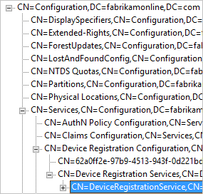

<properties 
	pageTitle="Azure AD Connect：启用设备写回 | Microsoft Azure"
	description="本文档详细说明如何使用 Azure AD Connect 启用设备写回功能" 
	services="active-directory" 
	documentationCenter="" 
	authors="billmath" 
	manager="StevenPo"
	editor="curtand"/>

<tags 
	ms.service="active-directory"  
	ms.date="01/21/2016"
	wacn.date="04/13/2016"/>

# 在 Azure AD Connect 中启用设备写回

以下文档提供有关如何在 Azure AD Connect 中启用设备写回功能的信息。设备写回用于以下方案：

对 ADFS（2012 R2 或更高版本）保护的应用程序（信赖方信任），启用基于设备的条件性访问。

这可以提供额外的安全性，确保只有受信任的设备才能访问应用程序。有关条件性访问的详细信息，请参阅[使用条件性访问管理风险](/documentation/articles/active-directory-conditional-access)和[使用 Azure Active Directory Device Registration 设置本地的条件性访问](/documentation/articles/active-directory-conditional-access-on-premises-setup/?rnd=1)。

>[AZURE.NOTE]设备写回需要 Azure AD Premium 订阅。

。

>[AZURE.IMPORTANT]设备必须位于用户所在的同一个林中。由于设备必须写回到单个林，此功能当前不支持具有多个用户林的部署。

## 第 1 部分：安装 Azure AD Connect
1. 使用自定义或快速设置安装 Azure AD Connect。建议在启用设备写回之前，首先让所有用户和组成功完成同步。

## 第2 部分：准备 Active Directory
使用以下步骤来准备使用设备写回。

1.	从已安装 Azure AD Connect 的计算机上，以权限提升模式启动 PowerShell。

2.	如果未安装 Active Directory PowerShell 模块。使用以下命令安装它：

	`Install-WindowsFeature –Name AD-DOMAIN-Services –IncludeManagementTools`

3.	使用企业管理员凭据运行以下命令，然后退出 PowerShell。

	`Import-Module 'C:\Program Files\Microsoft Azure Active Directory Connect\AdPrep\AdSyncPrep.psm1'`

	`Initialize-ADSyncDeviceWriteback {Optional:–DomainName [name] Optional:-AdConnectorAccount [account]}`

说明:

- 该命令将在 CN=Device Registration Configuration,CN=Services,CN=Configuration,[forest-dn] 下创建并配置新的容器和对象（如果不存在）。
- 该命令将在 CN=RegisteredDevices,[domain-dn] 下创建并配置新的容器和对象（如果不存在）。将在此容器中创建设备对象。
- 在 Azure AD 连接器帐户中设置必要的权限，以便管理 Active Directory 上的设备。
- 即使 Azure AD Connect 安装在多个林中，也只需要在一个林中运行。

参数：

- DomainName：将在其中创建设备对象的 Active Directory 域。注意：给定的 Active Directory 林的所有设备都在单个域中创建。
- AdConnectorAccount：Azure AD Connect 使用此 Active Directory 帐户来管理目录中的对象。这是 Azure AD Connect 同步用来连接 AD 的帐户。如果 Azure AD Connect 是使用快速设置安装的，则该帐户是带有 MSOL\_ 前缀的帐户。

## 第 3 部分：在 Azure AD Connect 中启用设备写回
使用以下过程在 Azure AD Connect 中启用设备写回。

1.	再次运行安装向导。从“其他任务”页中选择自定义同步选项，然后单击“下一步”。

2.	在“可选功能”页中，设备写回不再灰显。请注意，如果 Azure AD Connect 准备步骤未完成，“可选功能”页中的设备写回将会灰显。选中设备写回对应的框并单击“下一步”。如果该复选框仍已禁用，请参阅[疑难解答部分](#the-writeback-checkbox-is-still-disabled)。

3.	在写回页中，你会看到提供的域是默认的设备写回林。

4.	在向导中完成安装，不需要更改其他配置。如果需要，请参阅 [Azure AD Connect 的自定义安装](/documentation/articles/active-directory-aadconnect-get-started-custom)。

## 启用条件性访问
[使用 Azure Active Directory Device Registration 设置本地条件性访问](https://msdn.microsoft.com/library/azure/dn788908.aspx)中提供了有关启用此方案的详细说明。

## 验证设备是否已同步到 Active Directory
设备写回现在应在正常运行。请注意，将设备对象写回到 Active Directory 最长可能需要 3 个小时。若要验证设备是否已正确同步，请在同步规则完成之后执行以下操作：

1.	启动 Active Directory 管理中心。
2.	在要联合的域中展开 RegisteredDevices。

3.	其中将会列出当前已注册的设备。

## 故障排除

### 写回复选框仍处于禁用状态
如果未启用设备写回复选框，即使已遵循上述步骤，以下步骤还是会在启用此框之前引导你完成安装向导正在验证的程序。

首先：

- 确保至少有一个林具有 Windows Server 2012R2。设备对象类型必须存在。
- 如果安装向导已在运行，则不会检测到任何更改。在此情况下，请先完成安装向导，然后再试一次。
- 确保在初始化脚本中提供的帐户是 Active Directory 连接器实际使用的正确用户。若要验证，请执行以下步骤：
	- 从“开始”菜单打开“同步服务”。
	- 打开“连接器”选项卡。
	- 查找类型为 Active Directory 域服务的连接器并选择它。
	- 在“操作”下面，选择“属性”。
	- 转到“连接到 Active Directory 林”。检查此屏幕上指定的域和用户名是否与提供给脚本的帐户匹配。

在 Active Directory 中验证配置：
- 检查设备注册服务是否位于配置命名上下文下面的以下位置：(CN=DeviceRegistrationService,CN=Device Registration Services,CN=Device Registration Configuration,CN=Services,CN=Configuration)。

- 搜索配置命名空间以验证是否只有一个配置对象。如果存在多个对象，请删除重复项。

- 对于设备注册服务对象，请确保 msDS-DeviceLocation 属性存在且具有值。查找此位置，并确保它存在且 objectType 为 msDS-DeviceContainer。

- 验证 Active Directory 连接器使用的帐户是否具有上一步骤所找到的“注册的设备”容器的所需权限。这是此容器上所需的权限：

- 验证 Active Directory 帐户是否具有对 CN=Device Registration Configuration,CN=Services,CN=Configuration 对象的权限。

## 其他信息
- [使用条件性访问管理风险](/documentation/articles/active-directory-conditional-access)
- [使用 Azure Active Directory Device Registration 设置本地条件性访问](https://msdn.microsoft.com/library/azure/dn788908.aspx)

## 后续步骤
了解有关[将本地标识与 Azure Active Directory 集成](/documentation/articles/active-directory-aadconnect)的详细信息。

<!---HONumber=Mooncake_0405_2016-->