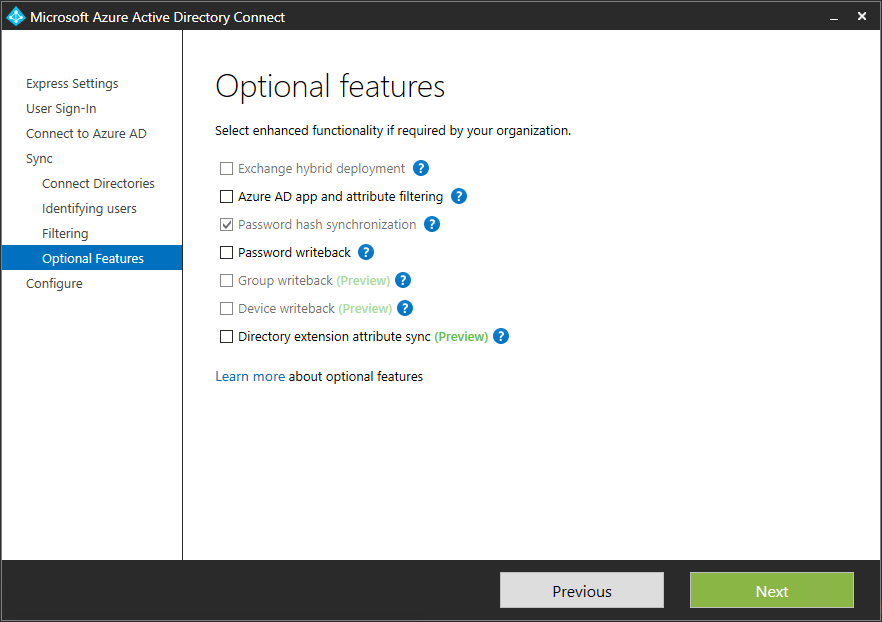
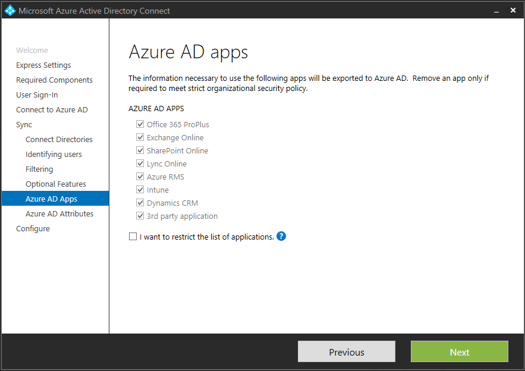
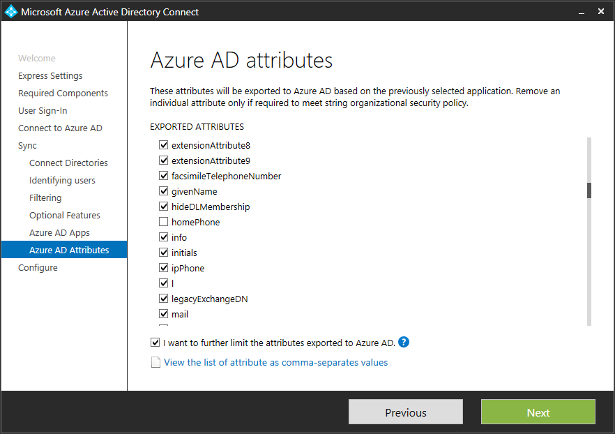

<properties 
	pageTitle="Azure AD Connect：自定义安装 | Azure"
	description="本文档详细介绍了 Azure AD Connect 的自定义安装选项。使用本文中的说明来通过 Azure AD Connect 安装 Active Directory。"
	services="active-directory"
        keywords="什么是 Azure AD Connect, 安装 Active Directory, Azure AD 所需的组件"
	documentationCenter=""
	authors="billmath"
	manager="stevenpo"
	editor="curtand"/>

<tags 
	ms.service="active-directory"
	ms.date="05/10/2016"
	wacn.date="06/14/2016"/>

# Azure AD Connect 的自定义安装

以下文档提供了有关对 Azure AD Connect 使用自定义安装选项的信息。如果你要设置其他配置选项，或需要使用快速安装中未包括的可选功能，则可以使用此选项。

## 相关文档
如果你尚未阅读有关[将本地标识与 Azure Active Directory 集成](/documentation/articles/active-directory-aadconnect/)的文档，下表提供了相关主题的链接。开始安装之前，需要完成以粗体显示的前三个主题。

| 主题 | |
| --------- | --------- |
| **下载 Azure AD Connect** | [下载 Azure AD Connect](http://go.microsoft.com/fwlink/?LinkId=615771) |
| **硬件和先决条件** | [Azure AD Connect：硬件和先决条件](/documentation/articles/active-directory-aadconnect-prerequisites/) |
| **用于安装的帐户** | [Azure AD Connect 帐户和权限](/documentation/articles/active-directory-aadconnect-accounts-permissions/) |
| 使用快速设置安装 | [Azure AD Connect 的快速安装](/documentation/articles/active-directory-aadconnect-get-started-express/) |
| 从 DirSync 升级 | [从 Azure AD 同步工具 (DirSync) 升级](/documentation/articles/active-directory-aadconnect-dirsync-upgrade-get-started/) |
| 安装后 | [验证安装并分配许可证](/documentation/articles/active-directory-aadconnect-whats-next/) |

## 安装所需的组件
在安装同步服务时，可以将可选配置部分保留未选中状态，Azure AD Connect 会自动完成所有设置。这包括设置 SQL Server 2012 Express LocalDB 实例，以及创建相应的组并为其分配权限。如果你想要更改默认设置，可以使用下表来了解可用的可选配置选项。

| 可选配置 | 说明 |
| ------------- | ------------- |
| 使用现有的 SQL Server | 用于指定 SQL Server 名称和实例名称。如果你已有一个要使用的数据库服务器，请选择此选项。如果你的 SQL Server 没有启用浏览而你必须指定端口号，请在“实例名称”框中输入实例名称后接逗号和端口号。 |
| 使用现有的服务帐户 | 默认情况下，Azure AD Connect 将为同步服务创建要使用的本地服务帐户。密码是自动生成的，而安装 Azure AD Connect 的人员并不知道该密码。如果你使用远程 SQL 服务器或使用需要身份验证的代理，则需要在域中创建一个服务帐户并知道密码。在这些情况下，请输入要使用的服务帐户。确保运行安装的用户是 SQL 中的 SA，以便可以创建服务帐户的登录名。请参阅 [Azure AD Connect 帐户和权限](/documentation/articles/active-directory-aadconnect-accounts-permissions/#custom-settings-installation) |
| 指定自定义同步组 | 默认情况下，在安装同步服务时，Azure AD Connect 将在服务器本地创建四个组。这些组是：管理员组、操作员组、浏览组和密码重置组。如果你想要指定自己的组，可在此处指定。组必须在服务器本地，并且不能位于域中。 |

## 用户登录
安装所需的组件后，系统会要求你指定用户要使用的单一登录方法。下表提供了可用选项的简短说明。有关登录方法的完整说明，请参阅[用户登录](/documentation/articles/active-directory-aadconnect-user-signin/)。

单一登录选项 | 说明 
------------- | ------------- |
密码同步 |用户可以使用登录本地网络时所用的同一密码登录 Microsoft 云服务，例如 Office 365、Dynamics CRM 和 Windows InTune。用户密码将通过密码哈希同步到 Azure，并在云中进行身份验证。有关详细信息，请参阅[密码同步](/documentation/articles/active-directory-aadconnectsync-implement-password-synchronization/)。
使用 AD FS 进行联合身份验证|用户可以使用登录本地网络时所用的同一密码登录 Microsoft 云服务，例如 Office 365、Dynamics CRM 和 Windows InTune。用户将重定向到他们的本地 AD FS 实例以进行登录，在本地完成身份验证。
不要配置| 不会安装和配置任一功能。如果你已有第三方联合服务器或部署了另一个现有解决方案，请选择此选项。

## 连接到 Azure AD
在“连接到 Azure AD”屏幕中，输入全局管理员的帐户和密码。如果在前一个页面选择了“与 AD FS 联合”，请确保不要以计划启用联合的域中的帐户登录。建议使用随附于 Azure AD 目录的默认 **onmicrosoft.com** 域中的帐户。

此帐户只会用于在 Azure AD 中创建服务帐户，在向导完成后将不会使用。  

如果全局管理员帐户已启用 MFA，则你需要在登录弹出窗口中再次提供密码，并完成 MFA 质询，例如提供验证码。  

## “同步”部分下的页面

### 连接你的目录
若要连接到你的 Active Directory 域服务，Azure AD Connect 工具需要使用具有足够权限的帐户的凭据。此帐户可以是普通的用户帐户，因为该帐户只需默认的读取权限。不过，根据你的方案，可能会需要其他权限。有关详细信息，请参阅 [Azure AD Connect 帐户和权限](/documentation/articles/active-directory-aadconnect-accounts-permissions/#create-the-ad-ds-account)

### Azure AD 登录配置
此页可让你查看本地 AD DS 中存在的 UPN 域，以及已在 Azure AD 中验证的 UPN 域。此页还可让你配置要用于 userPrincipalName 的属性。

  
查看标记为“未添加”和“未验证”的每个域。确保使用的域都已在 Azure AD 中验证。验证域后，请单击“刷新”符号。有关详细信息，请参阅[添加和验证域](active-directory-add-domain.md)

**UserPrincipalName** - 属性 userPrincipalName 是用户登录 Azure AD 和 Office 365 时使用的属性。应在同步处理用户前在 Azure AD 中对使用的域（也称为 UPN 后缀）进行验证。Microsoft 建议保留默认属性 userPrincipalName。如果此属性不可路由且无法验证，则可以选择另一个属性。例如，可以选择 email 作为保存登录 ID 的属性。使用除 userPrincipalName 以外的其他属性称为**替代 ID**。“替代 ID”属性值必须遵循 RFC822 标准。替代 ID 可以配合密码同步和联合使用。

>[AZURE.WARNING]
所有 Office 365 工作负荷都不允许使用替代 ID。有关详细信息，请参阅[配置替代登录 ID](https://technet.microsoft.com/library/dn659436.aspx)。

### 域和 OU 筛选
默认情况下将同步所有域和 OU。如果你不想将某些域或 OU 同步到 Azure AD，可以取消选择这些域和 OU。  

向导中的此页面用于配置基于域的筛选。有关详细信息，请参阅[基于域的筛选](/documentation/articles/active-directory-aadconnectsync-configure-filtering/#domain-based-filtering)。

由于防火墙限制，也可能无法连接到某些域。默认情况下未选择这些域，并且会出现警告。  
  
如果你看到此警告，请确认确实无法访问这些域，并且该警报在你的意料之中。

### 唯一标识你的用户

“跨林匹配”功能允许你定义如何在 Azure AD 中呈现你的 AD DS 林中的用户。一个用户可以在所有林中只呈现一次，也可以使用已启用和已禁用帐户的组合。

设置 | 说明 
------------- | ------------- |
[我的用户在所有林中只呈现一次](/documentation/articles/active-directory-aadconnect-topologies/#multiple-forests-separate-topologies) | 将所有用户在 Azure AD 中创建为单独的对象。  不会在 Metaverse 中联接对象。
[邮件属性](/documentation/articles/active-directory-aadconnect-topologies/#multiple-forests-full-mesh-with-optional-galsync) | 如果邮件属性在不同的林中具有相同的值，则此选项将联接用户和联系人。当已使用 GALSync 创建了联系人时，建议使用此选项。
[ObjectSID 和 msExchangeMasterAccountSID/ msRTCSIP-OriginatorSid](/documentation/articles/active-directory-aadconnect-topologies/#multiple-forests-account-resource-forest)|此选项将帐户林中的已启用用户与 Exchange 资源林中的已禁用用户进行联接。这也称为 Exchange 中的链接邮箱。如果你只使用 Lync 并且资源林中没有 Exchange，则你也可以使用此选项。
sAMAccountName 和 MailNickName|此选项根据预期可以在其中找到用户登录 ID 的属性进行联接。
特定的属性|此选项允许你选择自己的属性。**限制：**确保选择 Metaverse 中已存在的属性。如果你选择自定义属性（不在 Metaverse 中），向导将无法完成。

**源定位点** - sourceAnchor 属性是一个在用户对象的生命周期内不会改变的属性。它是链接本地用户与 Azure AD 中用户的主密钥。由于无法更改该属性，因此你必须规划好要使用的合适属性。objectGUID 就是不错的候选项。除非在林/域之间移动用户帐户，否则此属性不会更改。在要在林间移动帐户的多林环境中，必须使用另一个属性，例如具有 employeeID 的属性。要避免某人结婚时会改变的属性，或会更改分配的属性。由于不可以使用带有 @ 符号的属性，因此无法使用 email 和 userPrincipalName。属性也区分大小写，因此在林间移动对象时，请务必保留大写/小写。对二进制属性而言，值采用 Base64 编码，但对其他属性类型而言，值会保留未编码状态。在联合方案和某些 Azure AD 接口中，此属性也称为 immutableID。可以在[设计概念](/documentation/articles/active-directory-aadconnect-design-concepts/#sourceAnchor)中找到有关源定位点的详细信息。

### 根据组同步筛选
根据组筛选功能可让你只同步一小部分的对象来进行试验。若要使用此功能，请在本地 Active Directory 中针对此目的创建一个组。然后添加应该以直属成员身份与 Azure AD 同步的用户和组。稍后可以在此组中添加和删除用户，以维护应该要在 Azure AD 中显示的对象列表。要同步的所有对象必须是组的直属成员。用户、组、联系人和计算机/设备都必须是直属成员。系统不会解析嵌套组成员身份。当你添加某个组作为成员时，只会添加该组本身，而不添加其成员。

>[AZURE.WARNING]
此功能仅用于支持试验部署。请不要将其用于成熟的生产部署。

在成熟的生产部署中，往往很难维护单个要同步所有对象的组。在这种情况下，你应该使用[配置筛选](/documentation/articles/active-directory-aadconnectsync-configure-filtering/)中所述的方法之一。

### 可选功能

此屏幕可让你针对特定方案选择可选功能。以下是各项功能的简短说明。

> [AZURE.WARNING]如果你当前启用了 DirSync 或 Azure AD Sync，请勿激活 Azure AD Connect 中的任何写回功能

可选功能 | 说明 |
------------------- | ------------- |
Exchange 混合部署 | Exchange 混合部署功能使 Exchange 邮箱能够在本地和 Office 365 中共存。Azure AD Connect 将特定的[属性](/documentation/articles/active-directory-aadconnectsync-attributes-synchronized/#exchange-hybrid-writeback)集从 Azure AD 同步回到你的本地目录。 |
Azure AD 应用程序和属性筛选 | 通过启用 Azure AD 应用和属性筛选，可以定制同步的属性集。此选项将在向导中额外添加两个配置页。有关详细信息，请参阅 [Azure AD app and attribute filtering（Azure AD 应用和属性筛选）](#azure-ad-app-and-attribute-filtering)。 |
密码同步 | 如果你选择了联合作为登录解决方案，则可以启用此选项。然后，可将密码同步用作备份选项。有关更多信息，请参阅 [Password synchronization（密码同步）](/documentation/articles/active-directory-aadconnectsync-implement-password-synchronization/)。 |
密码写回 | 通过启用密码写回，源自 Azure AD 的密码更改将写回到本地目录。有关详细信息，请参阅 [Getting started with password management（密码管理入门）](/documentation/articles/active-directory-passwords-getting-started/)。 |
组写回 | 如果你使用了“Office 365 组”功能，则可以在本地 Active Directory 中呈现这些组。仅当本地 Active Directory 中存在 Exchange 时，才可以使用此选项。有关详细信息，请参阅 [Group writeback（组写回）](/documentation/articles/active-directory-aadconnect-feature-preview/#group-writeback)。 |
设备写回 | 允许你将 Azure AD 中的设备对象写回本地 Active Directory 以实现条件性访问方案。有关详细信息，请参阅 [Enabling device writeback in Azure AD Connect（在 Azure AD Connect 中启用设备写回）](/documentation/articles/active-directory-aadconnect-feature-device-writeback/)。 |
目录扩展属性同步 | 通过启用目录扩展属性同步，可将指定的属性同步到 Azure AD。有关详细信息，请参阅 [Directory extensions（目录扩展）](/documentation/articles/active-directory-aadconnectsync-feature-directory-extensions/)。 |

### Azure AD 应用程序和属性筛选
如果你希望限制要同步到 Azure AD 的属性，则一开始请选择要使用哪些服务。如果你配置此页面，则必须重新运行安装向导来明确选择任何新服务。

此页面将根据上一步选择的服务来显示要同步的所有属性。此列表是要同步的所有对象类型的组合。如果你需要禁止同步某些特定属性，可以取消选中它们。

>[AZURE.WARNING] 删除属性可能会影响功能。有关最佳实践和建议，请参阅[属性同步](/documentation/articles/active-directory-aadconnectsync-attributes-synchronized/#attributes-to-synchronize)。

### 目录扩展属性同步
可以使用组织添加的自定义属性或 Active Directory 中的其他属性，在 Azure AD 中扩展架构。若要使用这项功能，请在“可选功能”页上选择“目录扩展属性同步”。可以在此页上选择要同步的其他属性。

有关详细信息，请参阅 [Directory extensions（目录扩展）](/documentation/articles/active-directory-aadconnectsync-feature-directory-extensions/)。

## 配置与 AD FS 的联合
只需单击几下鼠标，请能使用 Azure AD Connect 配置 AD FS。以下是设置之前需要满足的要求。

- 已启用远程管理的、用作联合服务器的 Windows Server 2012 R2 服务器
- 已启用远程管理的、用作 Web 应用程序代理服务器的 Windows Server 2012 R2 服务器
- 你想要使用的联合身份验证服务名称（例如 sts.contoso.com）的 SSL 证书

### AD FS 配置先决条件
若要使用 Azure AD Connect 配置 AD FS 场，请确保已在远程服务器上启用 WinRM。此外，请满足[表 3 - Azure AD Connect 和联合服务器/WAP](/documentation/articles/active-directory-aadconnect-ports/#table-3---azure-ad-connect-and-federation-serverswap) 中列出的端口要求。

### 创建新的 AD FS 场或使用现有的 AD FS 场
你可以使用现有的 AD FS 场，或选择创建新的 AD FS 场。如果选择创建新的场，则需要提供 SSL 证书。如果 SSL 证书受密码保护，系统会提示你输入密码。

如果选择使用现有 AD FS 场，你将直接转到一个屏幕，你可以在其中配置 AD FS 与 Azure AD 之间的信任关系。

### 指定 AD FS 服务器
输入要在其中安装 AD FS 的服务器。你可以根据容量规划需求添加一个或多个服务器。执行此配置之前，请将所有服务器加入 Active Directory。Microsoft 建议安装一台用于测试和试验部署的 AD FS 服务器。然后，在完成初始配置之后通过再次运行 Azure AD Connect，根据缩放需求添加并部署更多的服务器。

>[AZURE.NOTE]
在执行此配置之前，请确保所有服务器已加入 AD 域。

### 指定 Web 应用程序代理服务器
输入要用作 Web 应用程序代理服务器的特定服务器。Web 应用程序代理服务器部署在你的外围网络中（面向 Extranet），支持来自 Extranet 的身份验证请求。你可以根据容量规划需求添加一个或多个服务器。Microsoft 建议安装一台用于测试和试验部署的 Web 应用程序代理服务器。然后，在完成初始配置之后通过再次运行 Azure AD Connect，根据缩放需求添加并部署更多的服务器。我们建议使用数量相当的代理服务器，以满足来自 Intranet 的身份验证要求。

>[AZURE.NOTE]
<li> 如果你使用的帐户不是 AD FS 服务器上的本地管理员，系统将提示你提供管理员凭据。</li>
<li> 在运行此步骤之前，请确保 Azure AD Connect 服务器与 Web 应用程序代理服务器之间已建立 HTTP/HTTPS 连接。</li>
<li> 确保 Web 应用程序服务器与 AD FS 服务器之间的 HTTP/HTTPS 连接允许通过身份验证请求。</li>

系统将提示你输入凭据，使 Web 应用程序服务器可以创建与 AD FS 服务器的安全连接。这些凭据需是 AD FS 服务器上的本地管理员。

### 指定 AD FS 服务的服务帐户
AD FS 服务需要域服务帐户来验证用户，以及在 Active Directory 中查找用户信息。它可以支持两种类型的服务帐户：

- **组托管服务帐户** - 在 Active Directory 域服务中随 Windows Server 2012 一起引入。此类型的帐户提供 AD FS 之类的服务，让你可以使用单个帐户，且不需要定期更新帐户密码。如果 AD FS 服务器将要加入的域中已有 Windows Server 2012 域控制器，请使用此选项。
- **域用户帐户** - 此类型的帐户会请求你提供密码，并在密码更改或过期时定期更新密码。仅当 AD FS 服务器所属的域中没有 Windows Server 2012 域控制器时，才使用此选项。

如果选择了组托管的服务帐户且从未在 Active Directory 中使用过此功能，则系统会提示你输入企业管理员凭据。这些凭据用于启动密钥存储，以及在 Active Directory 中启用该功能。

 

### 选择你要联合的 Azure AD 域
此配置用于设置 AD FS 与 Azure AD 之间的联合关系。它将 AD FS 配置为向 Azure AD 颁发安全令牌，并将 Azure AD 配置为信任来自此特定 AD FS 实例的令牌。此页只允许你在初始安装中配置单个域。你随时可以再次打开 Azure AD Connect 并执行此任务，以配置其他域。

 

### 验证选择用于联合的 Azure AD 域
当你选择要联合的域时，Azure AD Connect 将提供所需的信息来验证尚未验证的域。有关如何使用此信息，请参阅 [Add and verify the domain（添加和验证域）](/documentation/articles/active-directory-add-domain/)。

>[AZURE.NOTE]
AD Connect 尝试在配置阶段验证域。如果你继续进行配置但未添加所需的 DNS 记录，向导将无法完成配置。

## 配置和验证页面
在此页上进行配置。

>[AZURE.NOTE]
在继续安装之前，如果配置了联合服务器，请确保已配置[联合服务器的名称解析](/documentation/articles/active-directory-aadconnect-prerequisites/#name-resolution-for-federation-servers)。

### 过渡模式
在过渡模式下，可以同时设置新的同步服务器。系统仅支持一台同步服务器导出到云中的一个目录。但如果想要从另一台服务器（例如运行 DirSync 的服务器）移动，则可以启用过渡模式的 Azure AD Connect。启用后，同步引擎将像平时一样导入并同步数据，但不会将任何内容导出到 Azure AD。密码同步和密码写回功能将在过渡模式下禁用。

在过渡模式下，可以对同步引擎进行所需的更改，并复查要导出的内容。如果配置看起来正常，请再次运行安装向导，并禁用过渡模式。现在，已将数据从此服务器导出到 Azure AD。确保同时禁用其他服务器，以便只有一台服务器在主动导出。

有关详细信息，请参阅[过渡模式](/documentation/articles/active-directory-aadconnectsync-operations/#staging-mode)。

### 验证联合配置

当你单击“验证”按钮时，Azure AD Connect 将为你验证 DNS 设置。

此外，请执行以下验证步骤：

- 在 Intranet 上，通过已加入域的计算机上的浏览器验证是否能够登录：连接到 https://myapps.microsoft.com ，然后使用你的登录帐户验证登录。内置的 AD DS 管理员帐户未同步，因此无法用于验证。
- 验证是否可以从 Extranet 中的设备登录。在家庭计算机或移动设备上连接到 https://myapps.microsoft.com ，并提供你的凭据。
- 验证富客户端登录。连接到 https://testconnectivity.microsoft.com ，选择“Office 365”选项卡，然后选择“Office 365 单一登录测试”。

## 后续步骤
安装完成后，请注销并再次登录到 Windows，然后即可使用同步服务管理器或同步规则编辑器。

安装 Azure AD Connect 后，可以[验证安装并分配许可证](/documentation/articles/active-directory-aadconnect-whats-next/)。

了解有关[将本地标识与 Azure Active Directory 集成](/documentation/articles/active-directory-aadconnect/)的详细信息。

<!---HONumber=Mooncake_0606_2016-->