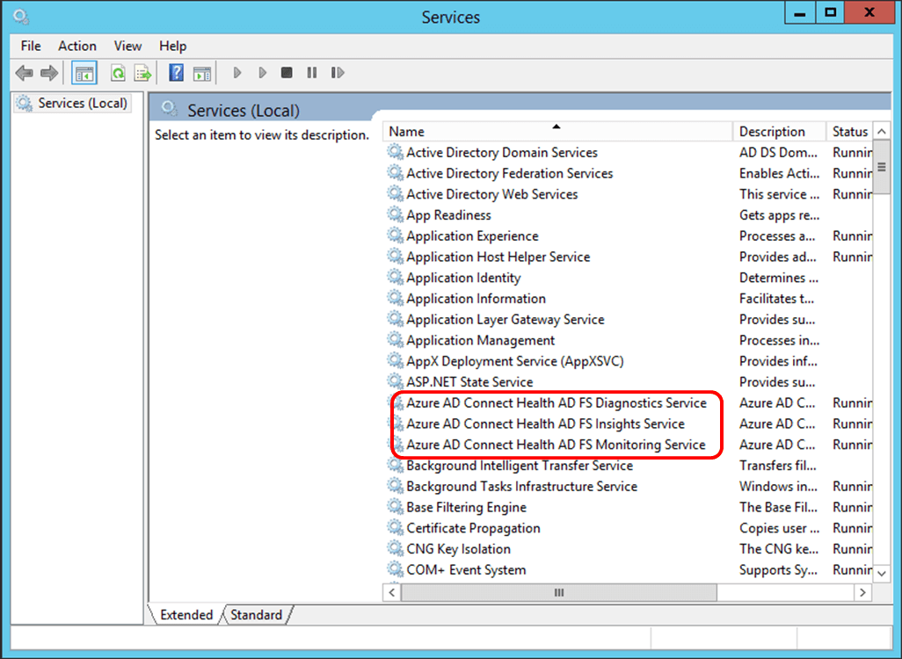
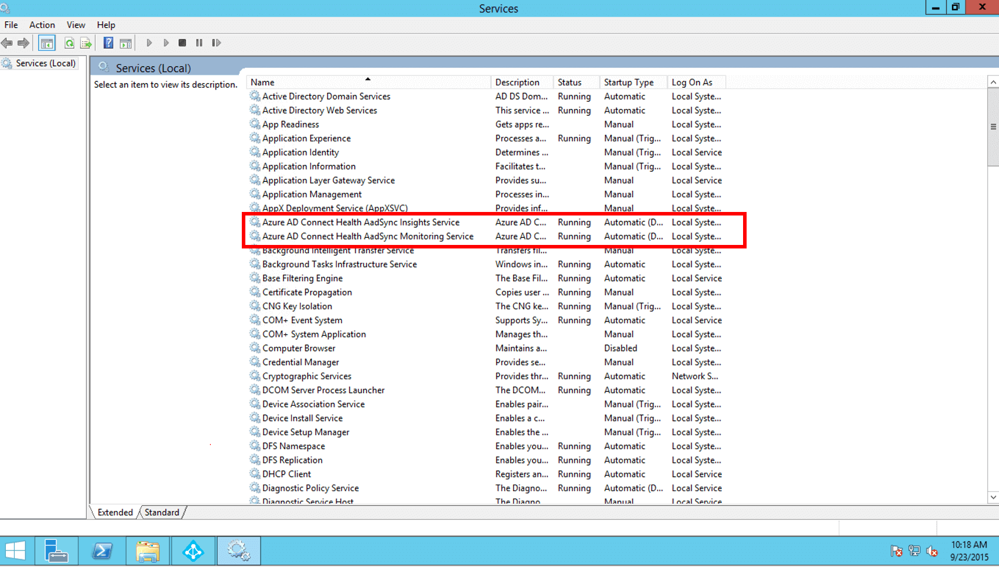

<properties
	pageTitle="Azure AD Connect Health 代理安装 | Azure"
	description="本页与 Azure AD Connect Health 相关，介绍如何安装用于 AD FS 和同步的代理。"
	services="active-directory"
	documentationCenter=""
	authors="karavar"
	manager="stevenpo"
	editor="karavar"/>

<tags
	ms.service="active-directory"
	ms.date="03/29/2016"
	wacn.date="07/04/2016"/>

# Azure AD Connect Health 代理安装 

本文档将指导你安装和配置 Azure AD Connect Health 代理。可以从[此处](/documentation/articles/active-directory-aadconnect-health/#download-and-install-azure-ad-connect-health-agent)下载代理。

## 	要求
下表是使用 Azure AD Connect Health 的要求列表。

| 要求 | 说明|
| ----------- | ---------- |
|Azure AD Premium| Azure AD Connect Health 是 Azure AD Premium 的一个功能，它需要与 Azure AD Premium 配合使用。   若要开始 30 天试用，请参阅[开始试用](https://azure.microsoft.com/trial/get-started-active-directory/)。|
|你必须是 Azure AD 的全局管理员才能开始使用 Azure AD Connect Health|默认情况下，只有全局管理员才能安装和配置运行状况代理、访问信息，以及在 Azure AD Connect Health 中执行任何操作。有关更多信息，请参阅[管理 Azure AD 目录](/documentation/articles/active-directory-administer/)。  使用基于角色的访问控制可以允许组织中的其他用户访问 Azure AD Connect Health。有关详细信息，请参阅 [Azure AD Connect Health 的基于角色的访问控制](/documentation/articles/active-directory-aadconnect-health-operations/#manage-access-with-role-based-access-control)。  **重要说明：**在安装代理时使用的帐户必须是工作帐户或学校帐户，而不能是 Microsoft 帐户。有关详细信息，请参阅[以组织身份注册 Azure](/documentation/articles/sign-up-organization/)
|Azure AD Connect Health 代理已安装在每台目标服务器上| Azure AD Connect Health 要求在目标服务器上安装代理，以提供可在门户中查看的数据。  例如，若要在 AD FS 本地基础结构上获取数据，代理必须安装在 AD FS 服务器、AD FS 代理服务器和 Web 应用程序代理服务器上。  **重要说明：**在安装代理时使用的帐户必须是工作帐户或学校帐户，而不能是 Microsoft 帐户。有关详细信息，请参阅[以组织身份注册 Azure](/documentation/articles/sign-up-organization/)|
|Azure 服务终结点的出站连接|在安装期间和运行时，代理需要连接到下面列出的 Azure AD Connect Health 服务终结点。如果你阻止了出站连接，请确保在允许列表中添加以下项：  <li>&#42;.blob.core.windows.net </li><li>&#42;.queue.core.windows.net</li><li>adhsprodwus.servicebus.windows.net - Port: 5671 </li><li>https://management.azure.com </li><li>https://s1.adhybridhealth.azure.com/</li><li>https://policykeyservice.dc.ad.msft.net/</li><li>https://login.windows.net</li><li>https://login.microsoftonline.com</li><li>https://secure.aadcdn.microsoftonline-p.com</li> |
|运行代理的服务器上的防火墙端口。| 为了使代理能够与 Azure AD Health 服务终结点通信，代理要求打开以下防火墙端口。  <li>TCP/UDP 端口 443</li><li>TCP/UDP 端口 5671</li>
|如果启用了 IE 增强安全性，请允许以下网站|如果在要安装代理的服务器上启用了 IE 增强安全性，则必须允许以下网站。  <li>https://login.microsoftonline.com</li><li>https://secure.aadcdn.microsoftonline-p.com</li><li>https://login.windows.net</li><li>Azure Active Directory 信任的组织联合服务器。例如：https://sts.contoso.com</li>

## 安装适用于 AD FS 的 Azure AD Connect Health 代理
若要启动代理安装，请双击下载的 .exe 文件。在第一个屏幕上，单击“安装”。

安装完成后，单击“立即配置”。

这将启动后跟一些将执行 Register-AzureADConnectHealthADFSAgent 的 PowerShell 的命令提示符。系统将提示你登录到 Azure。继续登录。

登录后，将继续 PowerShell。完成后你可以关闭 PowerShell，配置已完成。

此时，应自动启动服务且代理将在此时监视和收集数据。请注意如果未满足已在前面几节中所述的所有先决条件，你将在 PowerShell 窗口看到警告。请务必在安装代理之前，满足[此处](/documentation/articles/active-directory-aadconnect-health-agent-install/#requirements)所述的要求。以下屏幕截图是这些错误的一个示例。

若要验证代理是否已安装，打开服务并检查以下方面。如果你完成了配置，这些服务应运行。否则，配置完成之前它们将无法启动。

- Azure AD Connect Health AD FS Diagnostics 服务
- Azure AD Connect Health AD FS Insights 服务
- Azure AD Connect Health AD FS Monitoring 服务

### 在 Windows Server 2008 R2 服务器上的代理安装

对于 Windows Server 2008 R2 服务器执行以下操作：

1. 确保正在运行 Service Pack 1 或更高版本的服务器。
1. 关闭代理安装的 IE ESC：
1. 在安装 AD Health 代理之前，在每台服务器上安装 Windows PowerShell 4.0。若要安装 Windows PowerShell 4.0：
 - 使用以下链接下载脱机安装程序，安装 [Microsoft.NET Framework 4.5](https://www.microsoft.com/download/details.aspx?id=40779)。
 - （从 Windows 功能）安装 PowerShell ISE
 - 安装 [Windows Management Framework 4.0。](https://www.microsoft.com/download/details.aspx?id=40855)
 - 在服务器上安装 Internet Explorer 版本 10 或更高版本。这是 Health 服务通过使用你的 Azure 管理员凭据对你进行身份验证所必需的。
1. 有关在 Windows Server 2008 R2 上安装 Windows PowerShell 4.0 的其他信息，请参阅[此处](http://social.technet.microsoft.com/wiki/contents/articles/20623.step-by-step-upgrading-the-powershell-version-4-on-2008-r2.aspx)的 wiki 文章。

### 为 AD FS 启用审核

若要通过使用情况分析功能收集和分析数据，必须向 Azure AD Connect Health 代理提供 AD FS 审核日志中的信息。默认情况下未启用这些日志。这仅适用于 AD FS 联合服务器。不需在 AD FS 代理服务器或 Web 应用程序代理服务器上启用审核。请通过以下步骤启用 AD FS 审核并查找 AD FS 审核日志。

#### 启用 AD FS 2.0 审核的步骤

1. 单击“开始”，指向“程序”，然后指向“管理工具”，再单击“本地安全策略”。
2. 导航到“安全设置\\本地策略\\用户权限管理”文件夹，然后双击“生成安全审核”。
3. 在“本地安全设置”选项卡上，验证是否列出了 AD FS 2.0 服务帐户。如果该帐户不存在，请单击“添加用户或组”并将其添加到列表中，然后单击“确定”。
4. 使用提升的权限打开命令提示符，然后运行以下命令以启用审核：<code>auditpol.exe /set /subcategory:"生成的应用程序" /failure:enable /success:enable</code>
5. 关闭本地安全策略，然后打开“管理”管理单元。若要打开“管理”管理单元，请单击“开始”，指向“程序”，然后指向“管理工具”，再单击“AD FS 2.0 管理”。
6. 在“操作”窗格中，单击“编辑联合身份验证服务属性”。
7. 在“联合身份验证服务属性”对话框中，单击“事件”选项卡。
8. 选择“成功审核”和“失败审核”复选框。
9. 单击“确定”。

#### 在 Windows Server 2012 R2 上启用 AD FS 审核的步骤

1. 通过在“开始”屏幕上打开“服务器管理器”或在桌面的任务栏中打开“服务器管理器”的方式打开“本地安全策略”，然后单击“工具/本地安全策略”。
2. 导航到“安全设置\\本地策略\\用户权限分配”文件夹，然后双击“生成安全审核”。
3. 在“本地安全设置”选项卡上，验证是否列出了 AD FS 服务帐户。如果该帐户不存在，请单击“添加用户或组”并将其添加到列表中，然后单击“确定”。
4. 使用提升的权限打开命令提示符，然后运行以下命令以启用审核：<code>auditpol.exe /set /subcategory:"生成的应用程序" /failure:enable /success:enable。</code>
5. 关闭“本地安全策略”，然后打开“AD FS 管理”管理单元（在“服务器管理器”中，单击“工具”，然后选择“AD FS 管理”）。
6. 在“操作”窗格中，单击“编辑联合身份验证服务属性”。
7. 在“联合身份验证服务属性”对话框中，单击“事件”选项卡。
8. 选择“成功审核”和“失败审核”复选框，然后单击“确定”。

#### 查找 AD FS 审核日志的步骤

1. 打开“事件查看器”。
2. 转到“Windows 日志”，然后选择“安全”。
3. 在右侧单击“筛选当前日志”。
4. 在“事件源”下选择“AD FS 审核”。

> [AZURE.WARNING] 如果你的组策略正在禁用 AD FS 审核，则 Azure AD Connect Health 代理将不能收集信息。请确保没有可能正在禁用审核的组策略。

[//]: # "代理的代理配置部分开头"

## 安装用于同步的 Azure AD Connect Health 代理
安装最新版本的 Azure AD Connect 时，会自动安装用于同步的 Azure AD Connect Health 代理。若要使用 Azure AD Connect 进行同步，需要下载并安装最新版本的 Azure AD Connect。可以在[此处](http://www.microsoft.com/download/details.aspx?id=47594)下载最新版本。

若要验证代理是否已安装，打开服务并检查以下方面。如果你完成了配置，这些服务应运行。否则，配置完成之前它们将无法启动。

- Azure AD Connect Health Sync Insights 服务
- Azure AD Connect Health Sync 监视服务

>[Azure.NOTE] 请记住，Azure AD Connect Health 需要与 Azure AD Premium 配合使用。如果你没有 Azure AD Premium，则无法在 Azure 门户中完成配置。有关详细信息，请参阅[此处](/documentation/articles/active-directory-aadconnect-health-agent-install/#requirements)所述的要求。

## 手动注册用于同步的 Azure AD Connect Health
如果用于同步的 Azure AD Connect Health 代理在成功安装 Azure AD Connect 后注册失败，可以使用以下 PowerShell 命令来手动注册代理。

>[AZURE.IMPORTANT] 只有代理在安装 Azure AD Connect 之后注册失败时，才需要使用此 PowerShell 命令。

只有 Health 代理注册失败（即使在成功安装及设置 Azure AD Connect 之后）时，才需要以下 PowerShell 命令。在这种情况下，只有在代理成功注册之后，Azure AD Connect Health 服务才会启动。

可以使用以下 PowerShell 命令，手动注册用于同步的 Azure AD Connect Health 代理：

`Register-AzureADConnectHealthSyncAgent -AttributeFiltering $false -StagingMode $false`

此命令采用以下参数：

- AttributeFiltering：$true（默认值）- 如果 Azure AD Connect 未同步默认属性集，且已自定义为使用筛选的属性集。否则为 $false。
- StagingMode：$false（默认值）- 如果 Azure AD Connect 服务器不处于暂存模式。如果服务器已配置为处于暂存模式，则为 $true。

当系统提示进行身份验证时，你应该使用用于配置 Azure AD Connect 的同一全局管理员帐户（例如 admin@domain.onmicrosoft.com）。

## 将 Azure AD Connect Health 代理配置为使用 HTTP 代理
你可以将 Azure AD Connect Health 代理配置为使用 HTTP 代理。

>[AZURE.NOTE]
- 无法使用“Netsh WinHttp set ProxyServerAddress”，因为代理使用 System.Net（而不是 Microsoft Windows HTTP 服务）发出 Web 请求。
- 配置的 Http 代理地址将用于传递加密的 Https 消息。
- 不支持经过身份验证的代理（使用 HTTPBasic）。

### 更改 Health 代理的代理配置
可以使用以下选项将 Azure AD Connect Health 代理配置为使用 HTTP 代理。

>[AZURE.NOTE] 必须重新启动 Azure AD Connect Health 代理服务才能更新代理设置。运行以下命令： 
    Restart-Service AdHealth*

#### 导入现有的代理设置

##### 从 Internet Explorer 导入
可以通过在运行 Health 代理的每台服务器上执行以下 PowerShell 命令，来导入 Internet Explorer HTTP 代理设置并将这些设置用于 Azure AD Connect Health 代理。

	Set-AzureAdConnectHealthProxySettings -ImportFromInternetSettings

##### 从 WinHTTP 导入
可以通过在运行 Health 代理的每台服务器上执行以下 PowerShell 命令，来导入 WinHTTP 代理设置。

	Set-AzureAdConnectHealthProxySettings -ImportFromWinHttp

#### 手动指定代理地址
可以通过在运行 Health 代理的每台服务器上执行以下 PowerShell 命令，来手动指定代理服务器。

	Set-AzureAdConnectHealthProxySettings -HttpsProxyAddress address:port

示例：Set-AzureAdConnectHealthProxySettings -HttpsProxyAddress myproxyserver:443

- “地址”可以是 DNS 可解析的服务器名称或 IPv4 地址
- 可以省略“端口”。如果省略端口，则会选择 443 作为默认端口。

#### 清除现有的代理配置
可通过运行以下命令来清除现有的代理配置。

	Set-AzureAdConnectHealthProxySettings -NoProxy

### 读取当前的代理设置
可以使用以下命令来读取当前配置的代理设置。

	Get-AzureAdConnectHealthProxySettings

## 测试与 Azure AD Connect Health 服务的连接
问题可能会导致 Azure AD Connect Health 代理与 Azure AD Connect Health 服务连接断开。这些问题包括网络问题、权限问题或其他各种原因。

如果代理无法将数据发送给 Azure AD Connect Health 服务达 2 小时以上，你将看到指出“运行状况服务数据不是最新数据。”的警报。 如果发生这种情况，你可以从代理发生问题的计算机运行以下 PowerShell 命令，以测试 Azure AD Connect Health 代理是否能够将数据上载到 Azure AD Connect Health 服务。

    Test-AzureADConnectHealthConnectivity -Role Adfs

role 参数目前可接受以下值：

- Adfs
- 同步

可以在命令中使用 -ShowResults 标志来查看详细日志。使用以下示例：

    Test-AzureADConnectHealthConnectivity -Role Sync -ShowResult

>[AZURE.NOTE]若要使用连接工具，必须先完成代理注册。如果无法完成代理注册，请确保符合 Azure AD Connect Health 的所有[要求](/documentation/articles/active-directory-aadconnect-health-agent-instal/#requirements)。默认情况下，此连接测试将在代理注册期间执行。

## 相关链接

* [Azure AD Connect Health](/documentation/articles/active-directory-aadconnect-health/)
* [Azure AD Connect Health 操作](/documentation/articles/active-directory-aadconnect-health-operations/)
* [在 AD FS 中使用 Azure AD Connect Health](/documentation/articles/active-directory-aadconnect-health-adfs/)
* [使用用于同步的 Azure AD Connect Health](/documentation/articles/active-directory-aadconnect-health-sync/)
* [Azure AD Connect Health 常见问题](/documentation/articles/active-directory-aadconnect-health-faq/)

<!---HONumber=Mooncake_0606_2016-->