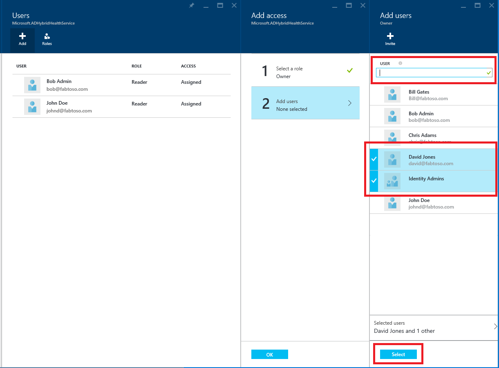

<properties 
	pageTitle="Azure AD Connect Health 操作。" 
	description="本文介绍在部署 Azure AD Connect Health 后可以执行的其他操作。"
	services="active-directory" 
	documentationCenter="" 
	authors="billmath" 
	manager="stevenpo" 
	editor="curtand"/>

<tags 
	ms.service="active-directory" 
	ms.date="10/19/2015"
	wacn.date="01/29/2016"/>

# Azure AD Connect Health 操作

以下主题描述可以通过 Azure AD Connect Health 执行的各种操作。

## 启用电子邮件通知
你可以对 Azure AD Connect Health 服务进行配置，以便在生成的警报指示标识基础结构运行不正常时发送电子邮件通知。生成警报时，以及警报被标记为已解决时，将会发生这种情况。请按以下说明配置电子邮件通知。
>[AZURE.NOTE]默认情况下已禁用电子邮件通知。

### 启用 Azure AD Connect Health 电子邮件通知的步骤

1. 打开需要接收电子邮件通知的服务的“警报”边栏选项卡。
2. 单击操作栏中的“通知设置”按钮。
3. 将“电子邮件通知”开关设置为“打开”。
4. 选中相应的复选框，将所有全局管理员配置为能够接收电子邮件通知。
5. 如果你希望通过其他电子邮件地址接收电子邮件通知，则可在“其他电子邮件收件人”框中进行指定。若要从该列表中删除电子邮件地址，可右键单击相应的条目，然后选择“删除”。
6. 若要完成所做的更改，请单击“保存”。只有在选择“保存”后，所有更改才会生效。

## 删除服务器或服务实例

### 从 Azure AD Connect Health Service 中删除服务器
在某些情况下，你可能想要从被监视的服务器中删除某个服务器。请按以下说明进行操作，从 Azure AD Connect Health Service 中删除服务器。

删除服务器时，请注意以下事项：

- 此操作会导致再也无法从该服务器收集任何数据。将从监视服务中删除此服务器。执行此操作之后，你将无法查看该服务器的新警报、监视数据或使用情况分析数据。
- 此操作不会从服务器中卸载或删除 Health 代理。如果你在执行此步骤之前未卸载 Health 代理，则可能会在与 Health 代理相关的服务器上看到错误事件。
- 此操作不会删除已从该服务器上收集的数据。那些数据将按 Microsoft Azure 数据保留策略删除。 
- 执行此操作后，如果你希望再次监视同一服务器，则需卸载该服务器上的 Health 代理，然后重新安装。 

#### 从 Azure AD Connect Health Service 中删除服务器的步骤

1. 通过选择要删除的服务器名称，从“服务器列表”边栏选项卡中打开“服务器”边栏选项卡。
2. 在“服务器”边栏选项卡中，单击操作栏中的“删除”按钮。
3. 在确认框中键入服务器名称，以便确认删除服务器的操作。
4. 单击“删除”按钮。

### 从 Azure AD Connect Health Service 中删除服务实例

在某些情况下，你可能想要删除服务实例。请按以下说明进行操作，从 Azure AD Connect Health Service 中删除服务实例。

删除服务实例时，请注意以下事项：

- 此操作将从监视服务中删除当前的服务实例。 
- 此操作不会从任何服务器中卸载或删除已作为此服务器实例的一部分进行监视的 Health 代理。如果你在执行此步骤之前未卸载 Health 代理，则可能会在与 Health 代理相关的服务器上看到错误事件。 
- 此服务实例的所有数据将按 Microsoft Azure 数据保留策略删除。 
- 执行此操作后，如果你想要开始监视此服务，请卸载需要进行监视的所有服务器上的 Health 代理，然后重新安装。执行此操作后，如果你希望再次监视同一服务器，则需卸载该服务器上的 Health 代理，然后重新安装。

#### 从 Azure AD Connect Health Service 中删除服务实例的步骤

1. 通过选择要删除的服务标识符（场名称），从“服务列表”边栏选项卡中打开“服务”边栏选项卡。
2. 在“服务器”边栏选项卡中，单击操作栏中的“删除”按钮。
3. 在确认框中键入服务名称（例如 sts.contoso.com）进行确认。 
4. 单击“删除”按钮。  

[//]: # "启动 RBAC 部分"
## 使用基于角色的访问控制来管理访问权限
### 概述
Azure AD Connect Health 的[基于角色的访问控制](/documentation/articles/role-based-access-control-configure)可为全局管理员以外的用户和/或组提供对 Azure AD Connect Health 服务的访问。这是通过将角色分配到目标用户和/或组，并提供一个机制来限制目录中的全局管理员来实现的。

#### 角色
Azure AD Connect Health 支持以下内置角色。

| 角色 | 权限 |
| ----------- | ---------- |
| 所有者 | 所有者可以在 Azure AD Connect Health 中***管理访问权限***（例如将角色分配到用户/组）、从门户***查看所有信息***（例如查看警报），以及***更改设置***（例如电子邮件通知）。 默认情况下，Azure AD 全局管理员将被分配此角色，并且无法更改此角色。 |
|参与者| 参与者可以在 Azure AD Connect Health 中从门户***查看所有信息***（例如查看警报）以及***更改设置***（例如电子邮件通知）。|
|读取器| 读取者可以在 Azure AD Connect Health 中从门户***查看所有信息***（例如查看警报）。|

其他即使可在门户体验中使用的所有角色（例如“用户访问管理员”或“DevTest 实验室用户”）对 Azure AD Connect Health 中的访问权限没有影响。

#### 访问范围

Azure AD Connect 支持两个级别的管理访问：

- ***目录***：这是针对大多数客户建议的路径，可跨所有角色类型控制 Azure AD Connect Health 监视的所有服务实例（例如 ADFS 场）的访问。

- ***服务实例***：在某些情况下，你可能需要根据角色类型或服务实例来区分访问。在此情况下，你可以在服务实例级别管理访问。

如果最终用户有权在目录或服务实例级别访问，则会被授予权限。

### 如何允许用户或组访问 Azure AD Connect Health
#### 步骤 1：选择适当的访问范围
若要允许用户访问 Azure AD Connect Health 中的*所有服务实例*级别，请在 Azure AD Connect Health 打开主边栏选项卡。 
#### 步骤 2：添加用户、组并分配角色
1. 单击“配置”部分中的“用户”部件。 

2. 选择“添加”
3. 选择“角色”，例如“所有者” 

4. 键入目标用户或组的名称或标识符。可以同时选择一个或多个用户或组。单击“选择”。

5. 选择“确定”。 

6. 完成角色分配后，用户和/或组将出现在列表中。 

执行这些步骤可以根据分配给所列用户和组的角色为其授予访问权限。
>[AZURE.NOTE]
- 全局管理员始终拥有所有操作的完全访问权限，但全局管理员帐户不会出现在上述列表中。
- “邀请用户”功能在 Azure AD Connect Health 中不受支持。

#### 步骤 3：与用户或组共享边栏选项卡位置
1. 分配权限后，用户可以转到 [http://aka.ms/aadconnecthealth](http://aka.ms/aadconnecthealth) 来访问 Azure AD Connect Health。
2. 在边栏选项卡上，用户只需单击“固定到仪表板”，即可将边栏选项卡或其他部件固定到仪表板  

>[AZURE.NOTE]分配有“读取者”角色的用户无法执行“创建”操作来从 Azure 应用商店获取 Azure AD Connect Health 扩展。但此用户仍可转到上述链接来访问边栏选项卡。为方便后续使用，用户可以将边栏选项卡固定到仪表板。

### 删除用户和/或组
可以通过单击右键并选择“删除”，来删除已添加到 Azure AD Connect Health“基于角色的访问控制”部件中的用户或组。  

[//]: # "结束 RBAC 部分"

## 相关链接

* [Azure AD Connect Health](/documentation/articles/active-directory-aadconnect-health)
* [适用于 AD FS 的 Azure AD Connect Health 代理安装](/documentation/articles/active-directory-aadconnect-health-agent-install-adfs)
* [在 AD FS 中使用 Azure AD Connect Health](/documentation/articles/active-directory-aadconnect-health-adfs)
* [使用用于同步的 Azure AD Connect Health](/documentation/articles/active-directory-aadconnect-health-sync)
* [Azure AD Connect Health 常见问题](/documentation/articles/active-directory-aadconnect-health-faq)

<!---HONumber=Mooncake_1221_2015-->