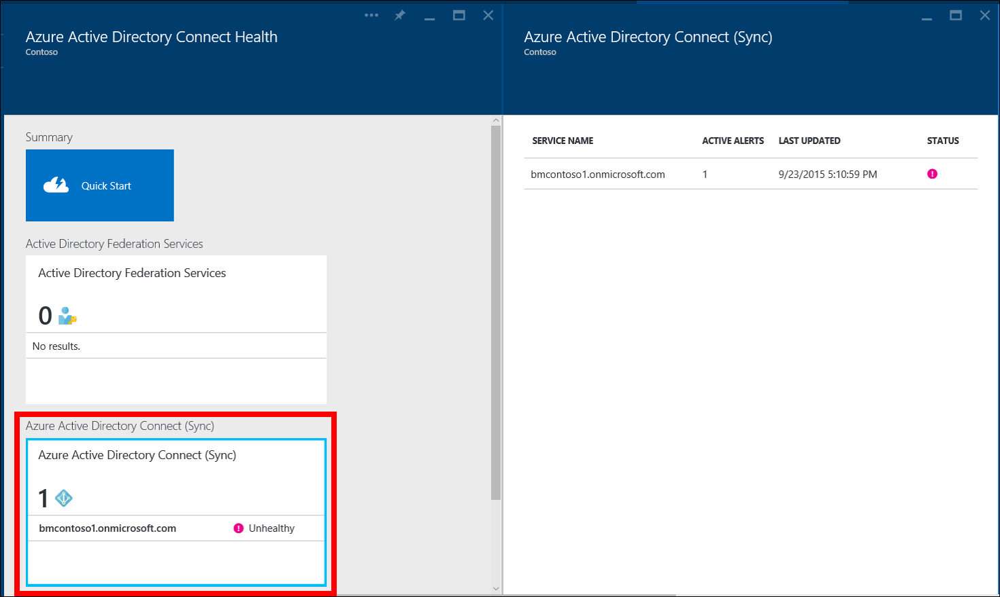
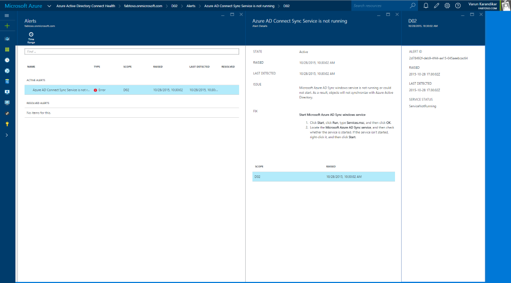
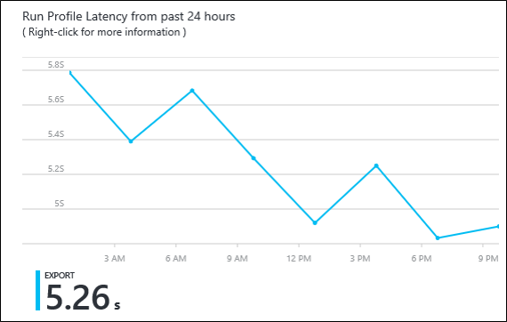
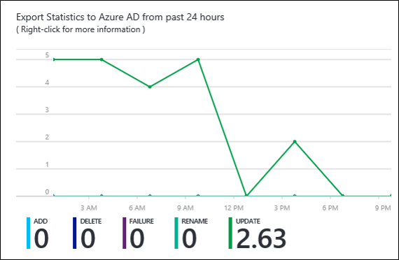

<properties 
	pageTitle="使用 Azure AD Connect Health 进行同步 | Windows Azure" 
	description="本页与 Azure AD Connect Health 相关，介绍如何监视 Azure AD Connect 同步。" 
	services="active-directory" 
	documentationCenter="" 
	authors="billmath" 
	manager="stevenpo" 
	editor="curtand"/>

<tags 
	ms.service="active-directory" 
	ms.date="12/16/2015" 
	wacn.date="1/29/2016"/>

# 使用用于同步的 Azure AD Connect Health
以下文档专门介绍如何使用 Azure AD Connect Health 来监视 Azure AD Connect 同步。有关使用 Azure AD Connect Health 监视 AD FS 的信息，请参阅[在 AD FS 中使用 Azure AD Connect Health](active-directory-aadconnect-health-adfs.md)。

## 用于同步的 Azure AD Connect Health 的警报
用于同步的 Azure AD Connect Health 警报部分将提供活动警报列表。每个警报均包含相关信息、解决方法步骤和相关文档的链接。选择活动或已解决的警报后，将看到一个新的边栏选项卡，其中将显示额外信息、可用于解决警报的方法步骤以及其他文档的链接。还可以查看过去已解决警报的相关历史数据。

选择警报后，将获取到额外信息、可用于解决警报的方法步骤以及其他文档的链接。

## 深入了解同步
用于同步的 Azure AD Connect Health 最新版本添加了以下新功能：

- 同步操作延迟
- 对象更改趋势

### 同步延迟
此功能提供连接器同步操作（导入、导出等）延迟的图形趋势。这提供了一种快速方便的方式，使你不仅可以了解操作延迟（在发生大量更改时非常有用），而且还可以检测导致延迟的、可能需要进一步调查的异常行为。

默认情况下只显示 Azure AD 连接器“导出”操作的延迟。若要查看对连接器执行的其他操作或其他连接器执行的操作，请右键单击图表并选择特定的操作和连接器。

### 同步对象更改
此功能提供正在评估并导出到 Azure AD 的更改数的图形趋势。目前，尝试从同步日志收集此信息并不容易。图表不仅可让你以更简单的方式监视环境中发生的更改数，而且可以提供正在发生的失败的可视化视图。

## 相关链接

* [Azure AD Connect Health](/documentation/articles/active-directory-aadconnect-health)
* [Azure AD Connect Health 代理安装](/documentation/articles/active-directory-aadconnect-health-agent-install)
* [Azure AD Connect Health 操作](/documentation/articles/active-directory-aadconnect-health-operations)
* [在 AD FS 中使用 Azure AD Connect Health](/documentation/articles/active-directory-aadconnect-health-adfs)
* [Azure AD Connect Health 常见问题](/documentation/articles/active-directory-aadconnect-health-faq)

<!---HONumber=Mooncake_0118_2016-->