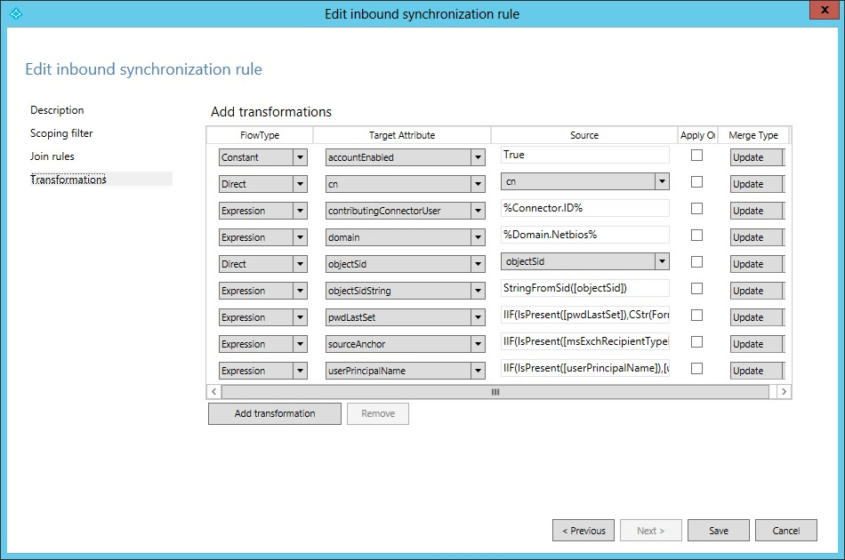

<properties 
	pageTitle="使用 Azure AD Connect 同步规则编辑器" 
	description="了解如何使用 Azure AD Connect 同步规则编辑器。" 
	services="active-directory" 
	documentationCenter="" 
	authors="billmath" 
	manager="stevenpo" 
	editor="curtand"/>

<tags 
	ms.service="active-directory"  
	ms.date="08/24/2015" 
	wacn.date="11/02/2015"/>

# Azure AD Connect 同步规则编辑器

## 使用同步规则编辑器

在 Azure AD Connect 中，你可以通过配置同步规则来配置和优化 Azure AD 与本地目录之间的对象和属性流。

满足条件时，同步规则是具有一组流动属性的配置对象。它还用于描述连接器空间中对象与 Metaverse 中对象的相关性，这种相关性称为联接或匹配。同步规则具有优先级，该优先级指示这些规则彼此的相关性。优先级数值较小的同步规则具有较高的优先级，当属性流发生冲突时，较高的优先级会赢得冲突解决方案。可以使用同步规则编辑器配置同步规则。

举例来说，我们将查看同步规则“In from AD – User AccountEnabled”。我们将在 SRE 中标记此行，并选择“编辑”。同步规则具有四个配置部分：“描述”、“范围筛选器”、“联接规则”和“转换”。

### 说明
第一部分提供名称和描述等基本信息。

 

还可以找到以下相关信息：此规则与哪个已连接系统相关、此规则适合于已连接系统中的哪种对象类型，以及 Metaverse 对象类型。无论源对象类型是用户、iNetOrgPerson 还是联系人，Metaverse 对象类型始终是人。Metaverse 对象类型应该永不更改，因此将它创建为泛型类型。可以将链接类型设置为“联接”、“StickyJoin”或“设置”。此设置将与“联接规则”部分协同工作，我们将稍后介绍此方面的内容。

### 范围筛选器

“范围筛选器”部分用于配置同步规则何时适用。由于我们正在查看的同步规则的名称指示只应对已启用的用户应用该规则，因此对范围进行了配置，使得 AD 属性 userAccountControl 不能对 2 这个位进行设置。当我们在 AD 中找到用户时，如果 userAccountControl 设置为十进制值 512（已启用的普通用户），则我们将应用此规则，但如果我们找到的用户的 userAccountControl 设置为 514（已禁用的普通用户），则此规则将不适用。

 

范围筛选器具有可以嵌套的组和子句。必须满足组内所有子句的条件，才能应用同步规则。如果定义了多个组，则要应用该规则，必须满足至少一个组的条件。也就是说，组之间按逻辑或进行计算，组内按逻辑与进行计算。可以在下面所示的出站同步规则“Out to AAD - Group Join”中找到与此相关的示例。有两个同步筛选器组，一个用于安全组（securityEnabled 等于 True），一个用于分发组（securityEnabled 等于 False）。

 

此规则用于定义哪些组应设置到 AAD。分发组必须启用邮件，才能与 AAD 同步，但对于安全组，这不是必需的。你还可以看到，很多其他属性也进行了评估。

###联接规则
第三部分用于配置连接器空间中的对象与 Metaverse 中的对象的相关性。我们前面讨论过的规则没有针对“联接规则”的任何配置，因此我们现在将讨论“In from AD - User Join”。

 

联接规则的内容将取决于在安装向导中选择的匹配选项。对于入站规则，评估从源连接器空间中的对象开始，将按顺序对联接规则中的每个组进行评估。如果根据某个联接规则，某个源对象的评估结果是与 Metaverse 中的某个对象完全匹配，则这两个对象将联接在一起。如果已对所有规则进行评估但没有匹配项，则将使用描述页上的“链接类型”。如果此设置设为“设置”，则将在目标（即 Metaverse）中创建一个新对象。将新对象设置到 Metaverse 也称为将对象投影到 Metaverse。只对联接规则评估一次。当连接器空间对象与 Metaverse 对象联接在一起时，只要仍然满足同步规则的范围，它们就保持联接。评估同步规则时，必须只有一个定义了联接规则的同步规则在范围内。如果一个对象找到多个包含联接规则的同步规则，则会引发错误。因此最佳做法是，当一个对象有多个同步规则在范围内时，只让一个同步规则有定义的联接。在 AADSync 的现成配置中，可以通过查看名称并查找在名称末尾带有单词“Join”的规则，来找到这些规则。如果另一个同步规则将对象联接在一起或在目标中设置了新对象，则未定义任何联接规则的同步规则将应用属性流。

###转换
“转换”部分定义当对象已联接且满足范围筛选器时，将应用于目标对象的所有属性流。回到“In from AD - User AccountEnabled”同步规则，我们将找到以下转换：

 

将这个放在帐户-资源林部署的上下文中考虑时，则应在帐户林中找到已启用的帐户，并在具有 Exchange 和 Lync 设置的资源林中找到已禁用的帐户。我们所讨论的同步规则包含进行登录所需的属性，我们希望这些属性从找到已启用帐户的林流动。所有这些属性流将在一个同步规则中进行组合。转换可以具有不同的类型：“常量”、“直接”和“表达式”。常量流将始终传递某个特定值，在上面的例子中，我们在名为 accountEnabled 的 Metaverse 属性中始终设置值 True。直接流会将源中的属性值传递到目标属性。第三种流类型是“表达式”，它允许进行更高级的配置。表达式语言是 VBA (Visual Basic for Applications)，因此具有 Microsoft Office 或 VBScript 经验的用户会认识该格式。属性将括在方括号内，如 [attributeName]。属性名称和函数名称是区分大小写的，但同步规则编辑器将对表达式求值并在表达式无效时提供警告。所有表达式都使用嵌套函数表示在一行上。为了显示配置语言的强大功能，下面给出了 pwdLastSet 流的示例，但插入了附加注释：

		// If-then-else
		IIF(
		// (The evaluation for IIF) Is the attribute pwdLastSet present in AD? 
		IsPresent([pwdLastSet]),
		// (The True part of IIF) If it is, then from right to left, convert the AD time format to a .Net datetime, change it to the time format used by AAD, and finally convert it to a string.
		CStr(FormatDateTime(DateFromNum([pwdLastSet]),"yyyyMMddHHmmss.0Z")),
		// (The False part of IIF) Nothing to contribute
		NULL
		)

有关转换的主题涉及面很大，它占 AADSync 的可能自定义配置的很大一部分。自定义配置将不会在本概述文档中介绍，但在本文档后面部分，我们将讨论某些附加的属性流。
 

<!---HONumber=76-->