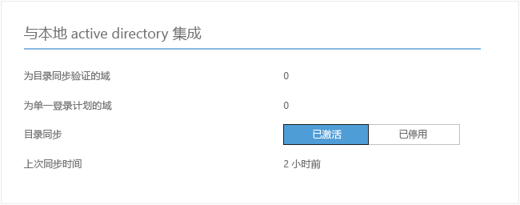
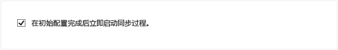
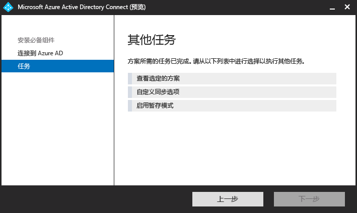

<properties 
	pageTitle="Azure AD Connect：后续步骤以及如何管理 Azure AD Connect | Azure"
	description="了解如何扩展 Azure AD Connect 的默认配置和操作任务。" 
	services="active-directory" 
	documentationCenter="" 
	authors="billmath" 
	manager="stevenpo" 
	editor="curtand"/>

<tags 
	ms.service="active-directory" 
	ms.date="03/16/2016"
	wacn.date="06/03/2016"/>

# 后续步骤以及如何管理 Azure AD Connect
以下属于高级操作主题，介绍如何根据组织的需要和要求自定义 Azure Active Directory Connect。

## 添加更多的同步管理员
默认情况下，只有执行安装的用户和本地管理员才可以管理安装的同步引擎。要使其他用户能够访问和管理同步引擎，请在本地服务器上找到名为 ADSyncAdmins 的组，并将这些用户添加到此组中。

## AD FS 服务中的可选配置
你可以自定义 AD FS 登录页的插图和徽标图像，方法是登录 AD FS，然后使用 PSH 进行这项配置。

	Set-AdfsWebTheme -TargetName default -Logo @{path="c:\Contoso\logo.png"} –Illustration @{path=”c:\Contoso\illustration.png”}

有关可能配置的完整说明，请参阅[自定义 AD FS 登录页](https://technet.microsoft.com/library/dn280950.aspx)。

## 向 Azure AD Premium 和企业移动性套件用户分配许可证

将用户同步到云后，你需要向他们分配许可证，以便他们继续使用云应用（例如 Office 365）。

### 分配 Azure AD Premium 或企业移动套件许可证
--------------------------------------------------------------------------------
1. 以管理员身份登录到 Azure 经典管理门户。
2. 在左侧选择“Active Directory”。
3. 在“Active Directory”页上，双击要分配许可证的用户所在的目录。
4. 在“目录”页的顶部，选择“许可证”。
5. 在“许可证”页上，选择“Active Directory Premium”或“企业移动套件”，然后单击“分配”。
6. 在对话框中，选择要向其分配许可证的用户，然后单击复选标记图标以保存更改。

## 验证计划的同步任务
如果想检查同步状态，可以在 Azure 经典管理门户执行此操作。

### 验证计划的同步任务
--------------------------------------------------------------------------------
1. 以管理员身份登录到 Azure 经典管理门户。
2. 在左侧选择“Active Directory”。
3. 在“Active Directory”页上，双击要启用的用户所在的目录。
4. 在“目录”页的顶部，选择“目录集成”。
5. 在与本地 Active Directory 的集成下方，注意上次同步时间。

## 启动计划的同步任务
如果需要运行同步工作，你可以通过再次运行 Azure AD Connect 向导来实现此目的。需要提供 Azure AD 凭据。在向导中，选择“自定义同步选项”任务，然后在向导中一直单击“下一步”。最后，请确保已选中“初始配置完成后立即开始同步过程”框。

## Azure AD Connect 中提供的其他任务
在完成 Azure AD Connect 的初始安装后，你随时可以从 Azure AD Connect 启动页或桌面快捷方式再次启动向导。在再次运行向导的过程中，你会发现，它会以“其他任务”的形式提供一些新选项。

下表提供了这些任务的摘要和各个任务的简要描述。

其他任务 | 说明 
------------- | ------------- |
查看选定的方案 |可让你查看当前的 Azure AD Connect 解决方案。这包括常规设置、同步的目录、同步设置，等等。
自定义同步选项 | 可让你更改当前的配置，包括在配置中添加其他 Active Directory 林，或启用同步选项，例如用户、组、设备或密码回写。
启用暂存模式 | 可让你暂存稍后将要同步的信息，但不会将任何内容导出到 Azure AD 或 Active Directory。这样，你便可以在同步之前进行预览。

## 后续步骤
了解有关[将本地标识与 Azure Active Directory 集成](/documentation/articles/active-directory-aadconnect/)的详细信息。

 

<!---HONumber=Mooncake_0509_2016-->