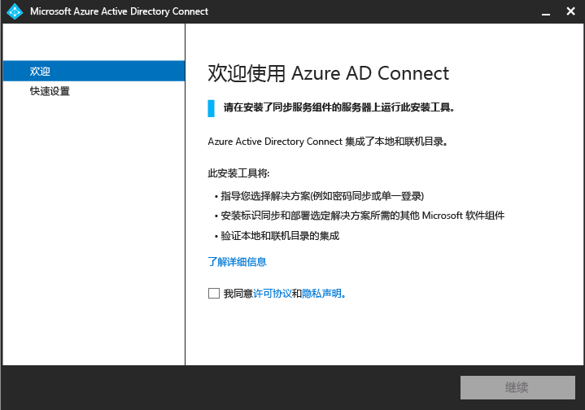
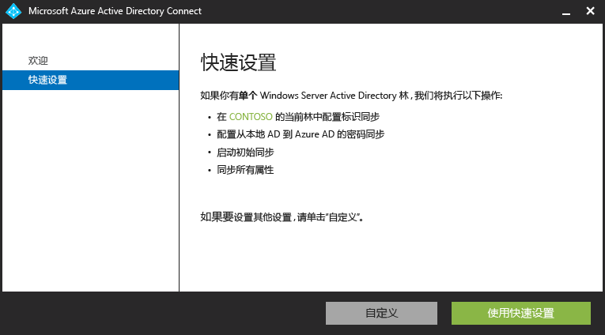
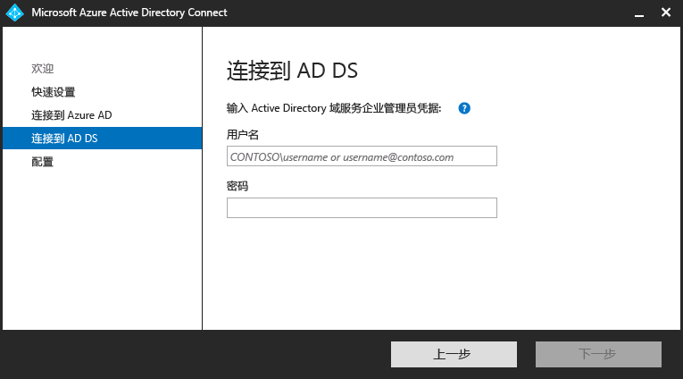
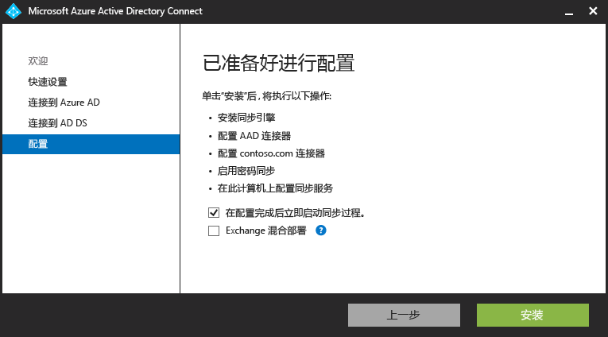

<properties 
	pageTitle="将本地标识与 Azure Active Directory 集成" 
	description="本页介绍 Azure AD Connect 是什么，以及为何要使用它。" 
	services="active-directory" 
	documentationCenter="" 
	authors="billmath" 
	manager="stevenpo" 
	editor="curtand"/>

<tags 
	ms.service="active-directory" 
	ms.date="09/09/2015" 
	wacn.date="11/02/2015"/>

# 将本地标识与 Azure Active Directory 集成

当今的用户希望在本地和云中都能访问应用程序。他们希望从任何设备，包括笔记本电脑、智能手机或平板电脑，都能进行这种访问。为了实现这个目的，你和你的组织必须设法让用户访问这些应用程序，而完全迁移到云中不一定总是可行。

随着 Azure Active Directory Connect 的推出，访问这些应用和迁移到云比以往容易得多。Azure AD Connect 提供以下优点：

- 用户在云和本地可以使用一个通用标识登录。他们不需要记住多个密码或帐户，而管理员不必担心多个帐户可能带来的额外管理开销。
- 使用这一个工具，你就可以根据引导将本地目录连接到 Azure Active Directory。安装后，向导将部署并配置建立和运行目录集成所需的所有组件，包括同步服务、密码同步或 AD FS，以及 Azure AD PowerShell 模块等必备组件。

## 为何使用 Azure AD Connect 

将本地目录与 Azure AD 集成可提供通用标识用于访问云和本地资源，从而提高用户的生产率。通过这种集成，用户和组织可以享受到以下好处：
	
* 组织可以利用 Windows Server Active Directory 并连接到 Azure Active Directory，向用户提供跨本地或云服务的通用混合标识。 
* 管理员可以根据应用程序资源、设备和用户标识、网络位置及 Multi-Factor Authentication，提供条件性访问。
* 用户可以通过 Azure AD 中的帐户，在 Office 365、Intune、SaaS 应用和第三方应用程序中利用其通用标识。  
* 开发人员可以通过将应用程序集成到 Active Directory 本地或 Azure，利用通用标识模型来构建基于云的应用程序

Azure AD Connect 可轻松实现这种集成，并可以简化本地和云标识基础结构的管理。

----------------------------------------------------------------------------------------------------------
## 下载 Azure AD Connect

若要开始使用 Azure AD Connect，可以使用以下链接下载最新版本：[下载 Azure AD Connect](http://go.microsoft.com/fwlink/?LinkId=615771)

----------------------------------------------------------------------------------------------------------

## Azure AD Connect 工作原理

Azure Active Directory Connect 由三个主要部分组成，分别是同步服务、可选的 Active Directory 联合身份验证服务功能，以及使用 [Azure AD Connect Health](https://msdn.microsoft.com/library/azure/dn906722.aspx) 实现的监视功能。

 

- 同步 - 此部分由以前包含以前作为 DirSync 和 AAD Sync 发布的组件和功能组成。此部分负责创建用户和组。它还负责确保本地环境中有关用户和组的信息与云匹配。
- AD FS - 这是 Azure AD Connect 的可选部分，可用于使用本地 AD FS 基础结构设置混合环境。组织可以使用此部分来解决复杂的部署，包括域加入 SSO、实施 AD 登录策略和智能卡或第三方 MFA 等方案。有关配置 SSO 的更多信息，请参阅[使用单一登录的 DirSync](https://msdn.microsoft.com/library/azure/dn441213.aspx)。
- 运行状况监视 - 对于使用 AD FS 的复杂部署，Azure AD Connect Health 能够可靠监视联合服务器，并在 Azure 门户中提供一个中心位置用于查看此活动。有关更多信息，请参阅 [Azure Active Directory Connect Health](https://msdn.microsoft.com/library/azure/dn906722.aspx)。

### Azure AD Connect 支持组件

下面列出了 Azure AD Connect 将在设置 Azure AD Connect 的服务器上安装的必备组件支持组件。此列表针对基本快速安装。如果你在“安装同步服务”页上选择使用其他 SQL Server，则不会安装下面列出的 SQL Server 2012 组件。

- Azure AD Connect Azure AD 连接器
- Microsoft SQL Server 2012 命令行实用工具
- Microsoft SQL Server 2012 本机客户端
- Microsoft SQL Server 2012 Express LocalDB
- 用于 Windows PowerShell 的 Azure Active Directory 模块
- 面向 IT 专业人员的 Microsoft Online Services 登录助手
- Microsoft Visual C++ 2013 Redistribution Package

## Azure AD Connect 入门

以下文档将会帮助你开始使用 Azure Active Directory Connect。本文档说明如何使用 Azure AD Connect 的快速安装。有关自定义安装的详细信息，请参阅 [Azure AD Connect 的自定义安装](active-directory-aadconnect-get-started-custom)。有关从 DirSync 升级到 Azure AD Connect 的信息，请参阅[将 DirSync 升级到 Azure Active Directory Connect](active-directory-aadconnect-dirsync-upgrade-get-started)。

### 安装 Azure AD Connect 之前
在使用“快速设置”安装 Azure AD Connect 之前，需要做好以下准备。

 
- Azure 订阅或 [Azure 试用版订阅](http://azure.microsoft.com/pricing/free-trial/) - 这只是用来访问 Azure 门户，而不是用于 Azure AD Connect。如果你正在使用 PowerShell 或 Office 365，则无需 Azure 订阅即可使用 Azure AD Connect。
- 你要集成的 Azure AD 租户的 Azure AD 全局管理员帐户
- Azure AD Connect 必须安装在 Windows Server 2008 或更高版本上。此服务器可以是域控制器或成员服务器。
- AD 架构版本与林级别必须是 Windows Server 2003 或更高版本。只要符合架构和林级别的要求，域控制器就能运行任何版本。
- 如果你正在部署 Active Directory 联合身份验证服务，则要安装 AD FS 的服务器必须是 Windows Server 2012 R2 或更高版本。
- Azure AD Connect 要求使用 SQL Server 数据库来存储标识数据。默认情况下，将会安装 SQL Server 2012 Express LocalDB（轻量版 SQL Server Express），并在本地计算机上创建服务的服务帐户。SQL Server Express 有 10 GB 的大小限制，允许你管理大约 100000 个对象。
- 如果你需要管理更多的目录对象，则需要将安装过程指向不同版本的 SQL Server。Azure AD Connect 支持从 SQL Server 2008（装有 SP4）到 SQL Server 2014 的各种 Microsoft SQL Server。
- 本地 Active Directory 的企业管理员帐户
- 如果你正在使用出站代理，则必须在 **C:\\Windows\\Microsoft.NET\\Framework64\\v4.0.30319\\Config\\machine.config** 文件中添加以下设置，以便完成安装。<code>
		
		<system.net>
    		<defaultProxy>
      		<proxy
        	usesystemdefault="true"
        	proxyaddress="http://<PROXYIP>:80"
        	bypassonlocal="true"
     		 />
    		</defaultProxy>
  		</system.net>
</code> 必须在文件底部输入此文本。在此代码中，&lt;PROXYIP&gt; 代表实际的代理 IP 地址。

- 可选：一个用于验证同步的测试用户帐户。

#### Azure AD Connect 的硬件要求
下表显示了 Azure AD Connect 计算机的最低要求。

| Active?Directory 中的对象数目 | CPU | 内存 | 硬盘驱动器大小 |
| ------------------------------------- | --- | ------ | --------------- |
| 少于 10,000 个 | 1.6 GHz | 4 GB | 70 GB |
| 10,000–50,000 | 1.6 GHz | 4 GB | 70 GB |
| 50,000–100,000 | 1.6 GHz | 16 GB | 100 GB |
| 如果对象数超过 100,000 个，则需要使用完全版本的 SQL Server| | | |
| 100,000–300,000 | 1.6 GHz | 32 GB | 300 GB |
| 300,000–600,000 | 1.6 GHz | 32 GB | 450 GB |
| 超过 600,000 个 | 1.6 GHz | 32 GB | 500 GB |

对于多个林或联合登录等“自定义选项”，请在[此处](active-directory-aadconnect-get-started-custom)了解其他要求。

### Azure AD Connect 的快速安装
“快速设置”是默认选项，也是最常用的设置方案之一。使用此选项时，Azure AD Connect 将部署使用密码哈希同步选项的同步。这适用于单一林，它允许你的用户使用本地密码登录到云。使用“快速设置”在完成安装之后自动开始同步处理（不过可以选择不打开）。使用此选项时，只需单击几下鼠标就能将本地目录扩展到云中。

#### 使用快速设置安装 Azure AD Connect
--------------------------------------------------------------------------------------------

1. 以企业管理员身份登录到要安装 Azure AD Connect 的服务器。这应该是你想要用作同步服务器的服务器。
2. 导航到 AzureADConnect.msi 并双击它
3. 在“欢迎”屏幕上，选中同意许可条款对应的框，然后单击“继续”。
4. 在“快速设置”屏幕上，单击“使用快速设置”。

6. 在“连接到 Azure AD”屏幕上，输入 Azure AD 的 Azure 全局管理员用户名和密码。单击**“下一步”**。
8. 在“连接到 AD DS”屏幕上，输入企业管理员帐户的用户名和密码。单击**“下一步”**。

9. 在“已准备好配置”屏幕上，单击“安装”。
	- 在“已准备好配置”页上，可以取消选中“配置完成后立即开始同步过程”复选框。如果你这样做，向导将配置同步，但会保持禁用任务，直到你在任务计划程序将它重新启用。启用任务后，将每隔三小时运行同步一次。
	- 此外，你也可以选择选中“Exchange 混合部署”对应的复选框，以配置同步服务。如果你不打算在云中和本地配置 Exchange 邮箱，则不需要这样做。

8. 安装完成后，单击“退出”。

<!-- 有关使用快速安装的视频，请参阅以下内容：

[AZURE.VIDEO azure-active-directory-connect-express-settings]

-->

### 验证安装

成功安装 Azure AD Connect 之后，你可以登录 Azure 门户并检查上次同步时间，以验证是否正在同步。

1.  登录到 Azure 门户。
2.  在左侧选择“Active Directory”。
3.  双击刚刚用于设置 Azure AD Connect 的目录。
4.  在顶部选择“目录集成”。请注意上次同步时间。

## 管理 Azure AD Connect 

以下主题属于高级操作主题，介绍如何根据组织的需要和要求自定义 Azure Active Directory Connect。

### 向 Azure AD Premium 或企业移动套件用户分配许可证

将用户同步到云后，你需要向他们分配许可证，以便他们可以继续使用云应用（例如 Office 365）。

#### 分配 Azure AD Premium 或企业移动套件许可证
--------------------------------------------------------------------------------
1. 以管理员身份登录到 Azure 门户。
2. 在左侧选择“Active Directory”。
3. 在“Active Directory”页上，双击包含你要启用的用户的目录。
4. 在“目录”页的顶部，选择“许可证”。
5. 在“许可证”页上，选择“Active Directory Premium”或“企业移动套件”，然后单击“分配”。
6. 在对话框中，选择要向其分配许可证的用户，然后单击复选标记图标以保存更改。

### 验证计划的同步任务
如果你想要检查同步状态，可以在 Azure 门户执行此操作。

#### 验证计划的同步任务
--------------------------------------------------------------------------------

1. 以管理员身份登录到 Azure 门户。
2. 在左侧选择“Active Directory”。
3. 在“Active Directory”页上，双击包含你要启用的用户的目录。
4. 在“目录”页的顶部，选择“目录集成”。
5. 在与本地 Active Directory 的集成下方，记下上次同步时间。

### 启动计划的同步任务
如果需要运行同步工作，你可以通过再次运行 Azure AD Connect 向导来实现此目的。需要提供 Azure AD 凭据。在向导中，选择“自定义同步选项”任务，然后在向导中一直单击“下一步”。最后，请确保已选中“初始配置完成后立即开始同步过程”框。

### Azure AD Connect 中提供的其他任务
在完成 Azure AD Connect 的初始安装后，你随时可以从 Azure AD Connect 启动页或桌面快捷方式再次启动向导。在再次运行向导的过程中，你会发现，一些新选项以“其他任务”的形式提供。

下表提供了这些任务的摘要和各个任务的简要描述。

 

其他任务 | 说明 
------------- | ------------- |
查看选定的方案 |可让你查看当前的 Azure AD Connect 解决方案。这包括常规设置、同步的目录、同步设置，等等。
自定义同步选项 | 可让你更改当前的配置，包括在配置中添加其他 Active Directory 林，或启用同步选项，例如用户、组、设备或密码回写。
启用暂存模式 | 可让你暂存稍后将要同步的信息，但不会将任何内容导出到 Azure AD 或 Active Directory。这样，你便可以在同步之前进行预览。

 
### 其他文档
有关使用 Azure AD Connect 的更多文档，请参阅：

- [Azure AD Connect Sync：自定义同步选项](/documentation/articles/active-directory-aadconnectsync-whatis) 
- [更改 Azure AD Connect 的默认配置](/documentation/articles/active-directory-aadconnect-whats-next-change-default-config)
- [使用 Azure AD Connect 同步规则编辑器](/documentation/articles/active-directory-aadconnect-whats-next-synch-rules-editor)
- [使用声明性设置](/documentation/articles/active-directory-aadconnect-whats-next-declarative-prov)

另外，为 Azure AD Sync 创建的某些文档仍有参考价值，并适用于 Azure AD Connect。尽管我们正在努力将这些文档发布到 Azure.com，但有些文档目前仍然只能在 MSDN 范围的库中提供。有关其他文档，请参阅 [MSDN 上的 Azure AD Connect](/documentation/articles/active-directory-aadconnect) 和 [MSDN 上的 Azure AD Sync](https://msdn.microsoft.com/library/azure/dn790204.aspx)。

**其他资源**

有关将本地目录扩展到云的 Ignite 2015 演示文稿。

<!-- [AZURE.VIDEO microsoft-ignite-2015-extending-on-premises-directories-to-the-cloud-made-easy-with-azure-active-directory-connect] -->

[使用单一登录的多林目录同步方案](https://msdn.microsoft.com/library/azure/dn510976.aspx) - 将多个目录与 Azure AD 集成。

[Azure AD Connect Health](/documentation/articles/active-directory-aadconnect-health) - 监视本地 AD FS 基础结构的运行状况。

[Azure AD Connect 常见问题](/documentation/articles/active-directory-aadconnect-faq) - 关于 Azure AD Connect 的常见问题解答。

 

<!---HONumber=74-->