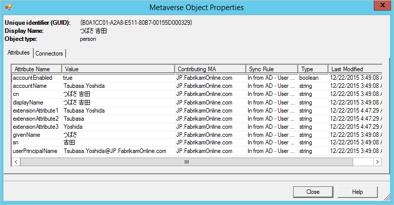
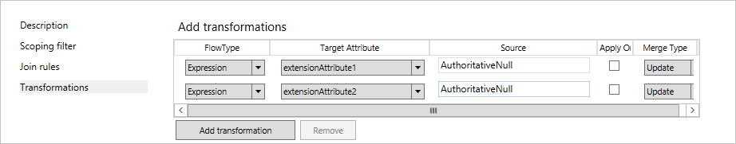
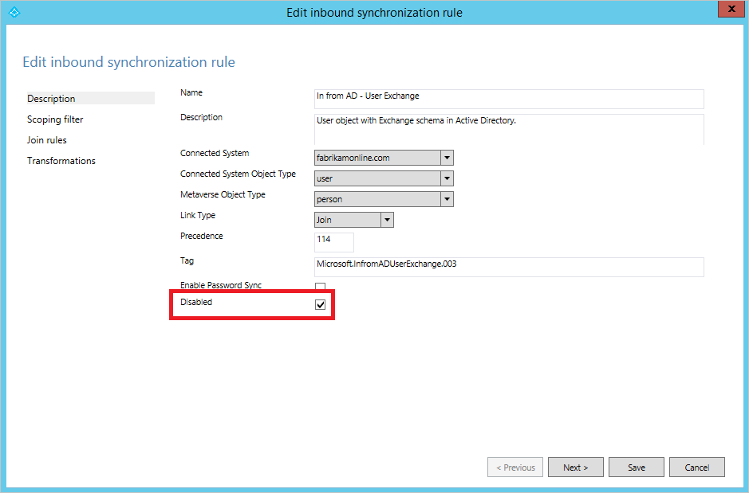
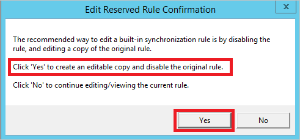
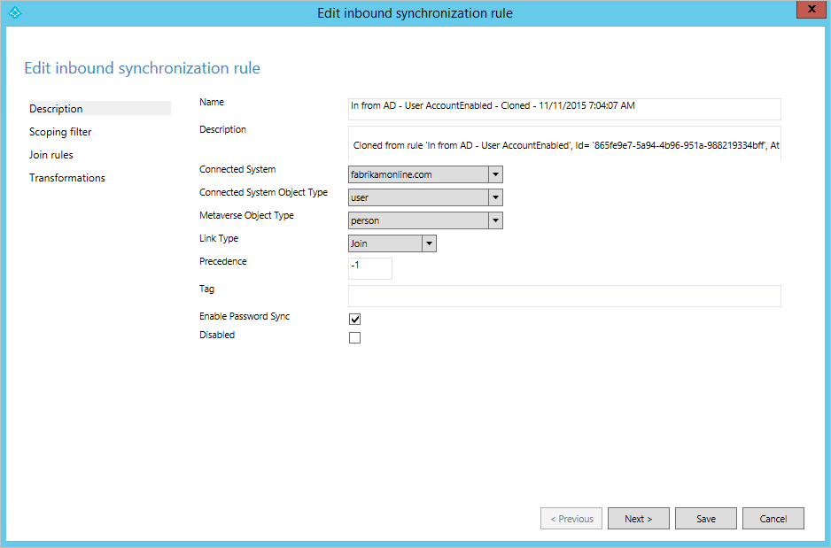

<properties
	pageTitle="Azure AD Connect 同步：有关更改默认配置的最佳实践 | Azure"
	description="提供有关更改 Azure AD Connect 同步默认配置的最佳实践。"
	services="active-directory"
	documentationCenter=""
	authors="andkjell"
	manager="stevenpo"
	editor=""/>

<tags 
	ms.service="active-directory"
	ms.date="05/10/2016"
	wacn.date="06/14/2016"/>

# Azure AD Connect 同步：有关更改默认配置的最佳实践

本主题旨在说明支持和不支持的 Azure AD Connect 同步更改。

通过 Azure AD Connect 创建的配置无需更改即可适用于同步本地 Active Directory 与 Azure AD 的大多数环境。但是，在某些情况下，有必要将某些更改应用于配置，以满足特殊需求或要求。

## 服务帐户的更改
Azure AD Connect 同步在安装向导创建的服务帐户下运行。此服务帐户保存了同步使用的数据库加密密钥。它是使用 127 个字符长的密码创建的，密码设置为永不过期。

- **不支持**更改或重置服务帐户的密码。这样做会破坏加密密钥，服务将无法访问数据库且无法启动。

## 同步规则的更改
安装向导提供的配置应该适用于最常见的方案。如果需要对配置进行更改，必须遵循这些规则，以便仍可保留支持的配置。

- 如果默认的直接属性流不适用于你的组织，你可以[更改属性流](#change-attribute-flows)。
- 如果你希望[属性不流动](#do-not-flow-an-attribute)并要删除 Azure AD 中的任何现有属性值，则需要为此创建规则。
- [禁用不需要的同步规则](#disable-an-unwanted-sync-rule)而不是删除它。升级期间将重新创建已删除的规则。
- 若要[更改现成的规则](#change-an-out-of-box-rule)，应复制原始规则并禁用现成的规则。同步规则编辑器将提示并帮助你实现此目的。
- 使用同步规则编辑器导出自定义同步规则。这会提供一个 PowerShell 脚本，你可以在灾难恢复方案中使用该脚本轻松重新创建同步规则。

>[AZURE.WARNING] 现成的同步规则具有指纹。如果更改这些规则，将不再符合指纹，以后当你尝试应用新版 Azure AD Connect 时可能会遇到问题。只能根据本文所述的方式进行更改。

### 更改属性流
在某些情况下，默认属性流并不适合组织。

应遵循以下规则：

- 使用属性流创建一个新的同步规则。为该规则分配较高的优先顺序（较小的数字值），你的规则将覆盖任何现成的属性流。
- 不要在现成的规则中添加其他流。升级时这些更改将会丢失。

Fabrikam 中有对名字、姓氏和显示名称使用本地字母的林。以拉丁字母表示的这些属性存储在扩展属性中。在 Azure AD 和 Office 365 中创建全局地址列表时，组织反而想要使用这些属性。

使用默认配置时，本地林中的对象如下所示：

若要使用其他属性流创建规则，请执行以下操作：

- 从开始菜单启动“同步规则编辑器”。
- 在左侧依然选定了“入站”的情况下，单击“添加新规则”按钮。
- 为规则指定名称和说明。选择本地 Active Directory 和相关的对象类型。在“链接类型”中选择“联接”。为优先顺序选择一个未被其他规则使用的数字。现成的规则从 100 开始，因此该示例可以使用值 50。

- 将范围留空（即，应该应用到林中的所有用户对象）。
- 将联接规则留空（即，让现成的规则处理所有联接）。
- 在“转换”中创建以下流。

- 单击“添加”保存规则。
- 转到“同步服务管理器”。在“连接器”上，选择我们已在其中添加了规则的连接器。依次选择“运行”和“完全同步”。完全同步将使用当前规则重新计算所有对象。

这是使用此自定义规则的同一对象的最终结果：

### 不要流送属性
有两种方法可防止流送属性。第一种方法可在安装向导中使用，可让你[删除选定的属性](/documentation/articles/active-directory-aadconnect-get-started-custom/#azure-ad-app-and-attribute-filtering)。如果你以前未曾同步该属性，则可以使用这个选项。但是，如果你已开始同步此属性，后来使用此功能将它删除，则同步引擎将停止管理属性，现有值将保留在 Azure AD 中。

如果想要删除某个属性的值并确保将来不会流送该属性，则需要改为创建自定义规则。

在 Fabrikam 上，我们在同步到云的属性中发现了一些不应该存在的属性。我们希望确保从 Azure AD 中删除这些属性。

- 创建新的入站同步规则并填充说明 

- 创建类型为 **Expression** 且源为 **AuthoritativeNull** 的属性流。即使优先顺序较低的同步规则尝试填充值，文本值 **AuthoritativeNull** 也会指出 MV 中的值应该为空。

- 保存同步规则。启动“同步服务”，查找连接器，然后依次选择“运行”和“完全同步”。这将重新计算所有属性流。
- 通过搜索连接器空间来验证是否即将导出所需的更改。

### 禁用不需要的同步规则
不要删除现成的同步规则；下次升级期间将重新创建此规则。

在某些情况下，安装向导生成的配置不适用于你的拓扑。例如，如果你有帐户资源林拓扑，但已在使用 Exchange 架构的帐户林中扩展该架构，则系统将针对帐户林和资源林创建适用于 Exchange 的规则。在此情况下，我们需要禁用适用于 Exchange 的同步规则。

在上图中，安装向导已在帐户林中找到旧的 Exchange 2003 架构。这是在 Fabrikam 环境中引入资源林之前添加的。若要确保不同步任何来自旧 Exchange 实现的属性，就应该按所述方式禁用同步规则。

### 更改现成的规则
如果需要对现成的规则进行更改，应该复制该现成的规则，然后禁用原始规则。然后对克隆的规则进行更改。同步规则编辑器将帮助你完成此操作。当你打开现成的规则时，将显示此对话框：

选择“是”创建规则的副本。随后会打开克隆的规则。

在这个克隆的规则中，对范围、联接和转换进行任何必要的更改。

## 后续步骤
了解有关 [Azure AD Connect 同步](/documentation/articles/active-directory-aadconnectsync-whatis/)配置的详细信息。

了解有关[将本地标识与 Azure Active Directory 集成](/documentation/articles/active-directory-aadconnect/)的详细信息。

<!---HONumber=Mooncake_0606_2016-->