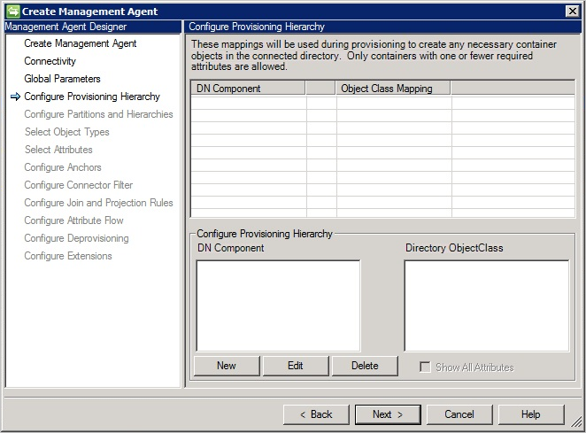
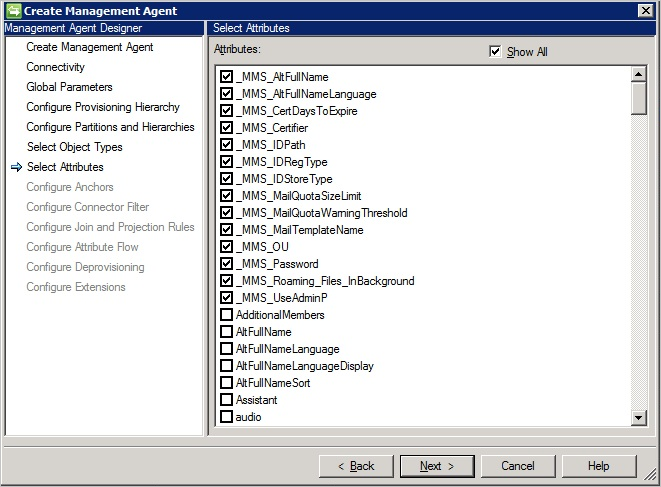

<properties
   pageTitle="Azure AD Connect 同步：Lotus Domino 连接器 | Azure"
   description="本文介绍如何配置 Microsoft 的 Lotus Domino 连接器。"
   services="active-directory"
   documentationCenter=""
   authors="AndKjell"
   manager="stevenpo"
   editor=""/>

<tags
   ms.service="active-directory"
   ms.date="04/20/2016"
   wacn.date="06/24/2016"/>

# Lotus Domino 连接器技术参考

本指南介绍 Lotus Domino 连接器。本文适用于以下产品：

- Microsoft 标识管理器 2016 (MIM2016)
- Forefront 标识管理器 2010 R2 (FIM2010R2)
    -   必须使用修补程序 4.1.3671.0 或更高版本 [KB3092178](https://support.microsoft.com/kb/3092178)。

对于 MIM2016 和 FIM2010R2，可以从 [Microsoft 下载中心](http://go.microsoft.com/fwlink/?LinkId=717495)下载此连接器。

## Lotus Domino 连接器概述

Lotus Domino 连接器可让你将同步服务与 IBM Lotus Domino 服务器集成。

从较高层面讲，当前的连接器版本支持以下功能：

| 功能 | 支持 |
| --- | --- |
| 连接的数据源 | 服务器：<li>Lotus Domino 8.5.x</li><li>Lotus Domino 9.x</li>客户端：<li>Lotus Notes 9.x</li> |
| 方案 | <li>对象生命周期管理</li><li>组管理</li><li>密码管理</li> |
| 操作 | <li>完整和增量导入</li><li>导出</li><li>设置和更改 HTTP 密码</li> |
| 架构 | <li>人员（漫游用户、联系人（没有证书的人员））</li><li>组</li><li>资源（资源、会议室、在线会议）</li><li>邮件数据库</li><li>动态发现受支持对象的属性</li> |

Lotus Domino 连接器利用 Lotus Notes 客户端来与 Lotus Domino 服务器通信。因此，同步服务器上必须安装支持的 Lotus Notes 客户端。客户端与服务器之间的通信是通过 Lotus Notes .NET Interop (Interop.domino.dll) 接口实现的。此接口可帮助在 Microsoft.NET 平台和 Lotus Notes 客户端之间进行通信，并支持 Lotus Domino 文档和视图的访问。在执行增量导入时，也可以使用 C++ 本机接口（取决于所选的增量导入方法）。

### 先决条件

在使用连接器之前，请确保除了前面提到的任何修补程序以外，同步服务器上还有以下项目：

- Microsoft .NET 4.5.2 Framework 或更高版本
- 同步服务器上必须安装 Lotus Notes 客户端
- 若要使用 Lotus Domino 连接器，Domino 目录服务器上必须有默认的 Lotus Domino LDAP 架构数据库 (schema.nsf)。你需要验证是否存在该数据库。如果不存在，可以在 Domino 服务器上执行或重新启动 LDAP 服务来进行安装。

### 连接的数据源权限

若要在 Lotus Domino 连接器上执行任何支持的任务，你必须是以下组的成员：

- 具有完全访问权限的管理员
- 管理员
- 数据库管理员

下表列出了每个操作所需的权限：

| 操作 | 访问权限 |
| --- | --- |
| 导入 | <li>读取公共文档</li><li>具有完全访问权限的管理员（如果你是完全访问权限的管理员组的成员，则自然而然就拥有有效的 ACL 访问权限）。</li> |
| 导出和重置密码 | 有效的访问权限：<li>创建文档</li><li>删除文档</li><li>读取公共文档</li><li>写入公共文档</li><li>复制文档</li>除了上述访问权限，还必须分配有以下角色才能进行导出操作：<li>CreateResource</li><li>GroupCreator</li><li>GroupModifier</li><li>UserCreator</li><li>UserModifier</li> |

### 直接操作和 AdminP

操作直接进入 Domino 目录或通过 AdminP 进程来进行。下表列出了所有支持的对象、操作以及相关的实现方法（如果适用）：

**主要通讯簿**

| 对象 | 创建 | 更新 | 删除 |
| --- | --- | --- | --- |
| 人员 | AdminP | 直接 | AdminP |
| 组 | AdminP | 直接 | AdminP |
| MailInDB | 直接 | 直接 | 直接 |
| 资源 | AdminP | 直接 | AdminP |

**辅助通讯簿**

| 对象 | 创建 | 更新 | 删除 |
| --- | --- | --- | --- |
| 人员 | 不适用 | 直接 | 直接 |
| 组 | 直接 | 直接 | 直接 |
| MailInDB | 直接 | 直接 | 直接 |
| 资源 | 不适用 | 不适用 | 不适用 |

创建资源时将创建 Notes 文档。同样，删除资源时会删除 Notes 文档。

### 端口和协议

IBM Lotus Notes 客户端和 Domino 服务器使用 Notes 远程过程调用 (NRPC) 进行通信，其中 NRPC 应使用 TCP/IP。默认端口号为 1352，但 Domino 管理员可以更改端口号。

### 不支持

当前的 Lotus Domino 连接器版本不支持以下操作：

- 在服务器之间移动信箱。

## 创建新连接器

### 客户端软件安装和配置

在服务器上安装连接器**之前**，必须先安装 Lotus Notes。

安装时，请务必执行“单用户安装”。默认的“多用户安装”将无法进行。

在功能页面上，请只安装所需的 Lotus Notes 功能和“客户端单一登录”。必须要有单一登录，连接器才能登录到 Domino 服务器。

**注意：**必须启动 Lotus Notes 一次，且启动时所使用的用户必须位于与将作为连接器服务帐户的帐户同一服务器上。

### 创建连接器

若要创建 Lotus Domino 连接器，请在“同步服务”中选择“管理代理”和“创建”。选择“Lotus Domino (Microsoft)”连接器。

如果同步服务版本提供设置“体系结构”的功能，请确保连接器设为默认值，以在“进程”中运行。

### 连接

在“连接”页面中，必须指定 Lotus Domino 服务器名称，然后输入登录凭据。

Domino 服务器属性支持两种服务器名称格式：

- ServerName
- ServerName/DirectoryName

**ServerName/DirectoryName** 格式是此属性的首选格式，因为它可在连接器联系 Domino 服务器时提供更快速的响应。

所提供的 UserID 文件存储在同步服务的配置数据库中。

对于“增量导入”，可以使用的选项如下：

- **无**。连接器不执行任何增量导入。
- **添加/更新**。连接器增量导入添加和更新操作。对于删除操作，需要执行“完整导入”操作。此操作使用 Notes 的 .Net Interop。
- **添加/更新/删除**。连接器增量导入添加、更新和删除操作。此操作使用 Notes 的本机 C++ 接口。

在“架构选项”中，可以使用以下选项：

- **默认架构**。这是默认选项，连接器将检测 Domino 服务器中的架构。
- **DSML 架构**。只在 Domino 服务器不公开架构时使用。然后，你可以使用此架构创建 DSML 文件，并导入此文件。有关 DSML 的详细信息，请参阅 [OASIS](https://www.oasis-open.org/committees/tc_home.php?wg_abbrev=dsml)。

当你单击“下一步”时，将验证 UserID 和密码配置参数。

### 全局参数

在“全局参数”页面中，可以配置时区与导入和导出操作的选项。

“Domino 服务器时区”参数定义 Domino 服务器的位置。

必须要有此配置选项才能支持**增量导入**操作，因为它可让同步服务判断最后两次导入之间的更改。

#### 导入设置和方法

“完整导入执行方法”具有以下选项：

- 搜索
- 查看（建议）

“搜索”在 Domino 中使用索引，但索引一般不实时更新，并且服务器所返回的数据不一定正确。对于具有许多更改的系统，此选项通常不会运行得很好，并且在某些情况下会造成误删。不过，“搜索”的速度比“查看”快。

“查看”是建议选项，因为其提供正确的数据状态。其速度比“搜索”略慢。

#### 创建虚拟联系人对象

“允许创建 \_Contact 对象”具有以下选项：

- 无
- 非引用值
- 引用和非引用值

在 Domino 中，引用属性可包含许多不同的格式，以引用其他对象。为了能够代表不同的变化，连接器实现了 \_Contact 对象，此对象又称为虚拟联系人 (VC)。这些对象已创建，因此可以添加到现有 MV 对象并形成新的对象，以此保留引用属性。

通过启用此设置，并且如果引用属性的内容不是 DN 格式，则创建 \_Contact 对象。例如，组的成员属性可以包含 SMTP 地址。此外，引用属性中也可以有 shortName 和其他属性。针对此方案，请选择“非引用值”。这是 Domino 实现最常使用的设置。

若 Lotus Domino 已配置为拥有不同的通讯簿，并以不同的分辨名称代表同一个对象，则也可以为通讯簿中找到的所有引用值创建 \_Contact 对象。针对此方案，请选择“引用和非引用值”选项。

如果在 Domino 的 **FullName** 属性中有多个值，那么你还需要允许创建虚拟联系人，以便可以解析引用。合并或分离之后，此属性就可以具有多个值。针对此方案，请选中“允许FullName 具有多个值”复选框。

通过加入正确的属性，\_Contact 对象将加入 MV 对象。

这些对象将 VC=\_Contact 添加到其 DN。

#### 导入设置和冲突对象

**排除冲突对象**

在大型 Domino 实现中，可能因为复制问题而让多个对象具有相同 DN。在这些情况下，连接器看到两个对象虽有不同 UniversalID，却有相同 DN。这导致连接器空间中创建了暂时性对象。连接器可以忽略 Domino 中已选择作为复制牺牲者的对象。建议保持选中此复选框。

#### 导出设置

若未选择“使用 AdminP 来更新引用”选项，则引用属性（例如成员）的导出将是直接调用，而不使用 AdminP 进程。只有在 AdminP 未配置为维护引用完整性时，才应该使用此选项。

#### 路由信息

在 Domino 中，引用属性可能具有嵌入为 DN 后缀的路由信息。例如，组中的成员属性可能包含 **CN=example/organization@ABC**。后缀 @ABC 就是路由信息。Domino 使用路由信息来传送电子邮件给正确的 Domino 系统，而此系统可能是位于不同组织的系统。在“路由信息”字段中，可以指定组织内所使用、且在连接器范围内的路由后缀。如果在引用属性中发现有任何一个值作为其后缀，便从引用中删除路由信息，以让其符合连接器空间中对象的 DN。如果引用值的路由后缀无法符合所指定的其中一个值，则创建 \_Contact 对象。在创建这些 \_Contact 对象时，将 **RO=@<RoutingSuffix>** 插入 DN 中。针对这些 \_Contact 对象，还将视需要添加以下属性以允许加入实际的对象：\_routingName、\_contactName、\_displayName 和 UniversalID。

#### 其他通讯簿

如果你没有安装提供辅助通讯簿名称的**目录助手**，可以手动输入这些通讯簿。

#### 多值转换

Lotus Domino 中有许多属性具有多个值。相对应的 Metaverse 属性则通常是单个值。通过设置导入和导出操作选项，可以启用连接器来帮助受影响的属性进行必要转换，这么做将能简化配置。

**导出**

导出操作选项支持两种模式：

- 附加项
- 替换项

**替换项** – 选择此选项时，连接器始终删除 Domino 属性的当前值，并以所提供的值替换这些值。所提供的值可以是单值或多值。

示例：
person 对象的 Assistant 属性具有以下值：

- CN=Greg Winston/OU= Contoso /O=Americas,NAB=names.nsf
- CN=John Smith/OU= Contoso /O=Americas,NAB=names.nsf

如果将名为 **David Alexander** 的新助手分配到此 person 对象，则结果是：

- CN=David Alexander/OU= Contoso /O=Americas,NAB=names.nsf

**附加项** – 选择此选项时，连接器保留 Domino 属性的现有值，并在数据列表顶部插入新值。

示例：
person 对象的 Assistant 属性具有以下值：

- CN=Greg Winston/OU= Contoso /O=Americas,NAB=names.nsf
- CN=John Smith/OU= Contoso /O=Americas,NAB=names.nsf

如果将名为 **David Alexander** 的新助手分配到此 person 对象，则结果是：

- CN=David Alexander/OU= Contoso /O=Americas,NAB=names.nsf
- CN=Greg Winston/OU= Contoso /O=Americas,NAB=names.nsf
- CN=John Smith/OU= Contoso /O=Americas,NAB=names.nsf

**导入**

导入操作选项支持两种模式：

- 默认
- 多值转换为单值

**默认** – 选择“默认”选项时，将导入所有属性的所有值。

**多值转换为单值** – 选择此选项时，多值属性将转换成单值属性。如果有多个值存在，则使用顶部的值（通常也是最新值）。

示例：

person 对象的 Assistant 属性具有以下值：

- CN=David Alexander/OU= Contoso /O=Americas,NAB=names.nsf
- CN=Greg Winston/OU= Contoso /O=Americas,NAB=names.nsf
- CN=John Smith/OU= Contoso /O=Americas,NAB=names.nsf

此属性的最近更新是 **David Alexander**。因为“导入”操作选项设置为“多值转换为单值”，连接器只将 **David Alexander** 导入到连接器空间。

将多值属性转换成单值属性的逻辑并不适用于组对象的 member 属性和 person 对象的 fullname 属性。

也可以针对每个属性配置多值属性的导入和导出转换规则，但全局规则除外。若要配置此选项，请在“导入排除属性列表”和“导出排除属性列表”文本框中输入 [objecttype].[attributename]。例如，如果输入 Person.Assistant，且全局标志设为导入所有值，则只导入第一个值作为助手。

#### 认证者

列出所有组织/组织单位。为了能够将 person 对象导出到主要通讯簿，必须有认证者及其密码。

如果所有认证者拥有相同的密码，就能使用“密码适用于所有认证者”。然后可以在此输入密码，并只指定认证者文件。

如果只要导入，则不必指定任何认证者。

### 配置预配层次结构

配置 Lotus Domino 连接器时，可以跳过此对话框页面。这是因为 Lotus Domino 连接器不支持层次结构预配。

### 配置分区和层次结构

在配置数据分区和层次结构时，必须选择名为 NAB=names.nsf 的主要通讯簿。

除了主要通讯簿，还可以选择辅助通讯簿（如果有）。

### 选择属性

配置属性时，必须选择前缀为 **\_MMS\_** 的所有属性。在对 Lotus Domino 预配新对象时，必须有这些属性。

## 对象生命周期管理

本部分概述 Domino 中的不同对象。

### Person 对象

Person 对象代表组织和组织单位中的用户。除了默认属性，Domino 管理员还可以在 Person 对象中添加自定义属性。Person 对象至少必须包含所有必需属性。有关必需属性的完整列表，请参阅 [Lotus Notes 属性](#lotus-notes-properties)。若要注册 person 对象，必须符合以下先决条件：

- 应已定义通讯簿 (names.nsf)，并且它应该是主要通讯簿。
- 你应该拥有 O/OU 认证者 ID 和密码，以在组织/组织单位中注册特定用户。
- 需要为 person 对象定义一组特定的 Lotus Notes 属性。这些属性用于预配 person 对象。有关详细信息，请参阅本文档后面的 [Lotus Notes 属性](#lotus-notes-properties)部分。
- person 的初始 HTTP 密码是一个属性，且已在预配期间设置好。
- person 对象必须是以下三种支持的类型之一：
    1. 具有邮件文件和用户 ID 文件的普通用户
    2. 漫游用户（包含所有漫游数据库文件的普通用户）
    3. 联系人（没有 ID 文件的用户）

人员（联系人除外）可以进一步分组为美国用户和国际用户，如 \_MMS\_IDRegType 属性值所定义。这些人是使用 Notes 客户端来访问 Lotus Domino 服务器和数据库、拥有 Notes Id 和 Person 文档的人员。如果这些人使用 Notes 邮件，那么他们也有邮件文件。用户必须经过注册才能生效。有关详细信息，请参阅：

- [设置 Notes 用户](http://publib.boulder.ibm.com/infocenter/domhelp/v8r0/index.jsp?topic=/com.ibm.help.domino.admin85.doc/H_SETTING_UP_NOTES_USERS.html)
- [用户注册](http://publib.boulder.ibm.com/infocenter/domhelp/v8r0/index.jsp?topic=/com.ibm.help.domino.admin85.doc/H_REGISTERING_USERS.html)
- [管理用户](http://publib.boulder.ibm.com/infocenter/domhelp/v8r0/index.jsp?topic=/com.ibm.help.domino.admin85.doc/H_MANAGING_USERS_5151.html)
- [重命名用户](http://publib.boulder.ibm.com/infocenter/domhelp/v8r0/index.jsp?topic=/com.ibm.help.domino.admin85.doc/H_RENAMING_A_USER_AUTOMATICALLY.html)

所有这些操作都在 Lotus Domino 中执行，然后导入到同步服务。

### 资源和会议室

资源是 Lotus Domino 中的另一种数据库。资源可以是配备各种设备（例如投影仪）的会议室。Lotus Domino 连接器也支持子类型资源，这种资源是基于资源类型属性定义的：

| 资源的类型 | 资源类型属性 |
| --- | --- |
| 会议室 | 1 |
| 资源（其他） | 2 |
| 在线会议 | 3 |

要使资源对象类型正常工作，必须满足以下条件：

- 连接的 Domino 服务器中应该已有资源保留数据库
- 已经为资源定义了站点

资源保留数据库包含 3 种类型的文档：

- 站点配置文件
- 资源
- 保留

有关设置资源保留数据库的详细信息，请参阅[设置资源保留数据库](https://www-01.ibm.com/support/knowledgecenter/SSKTMJ_8.0.1/com.ibm.help.domino.admin.doc/DOC/H_SETTING_UP_THE_RESOURCE_RESERVATIONS_DATABASE.html)。

**创建、更新和删除资源**

Lotus Domino 连接器在资源保留数据库中执行创建、更新和删除操作。因此，将资源创建为 Names.nsf 中的文档（也就是主要通讯簿）。有关编辑和删除资源的详细信息，请参阅[编辑和删除资源文档](http://publib.boulder.ibm.com/infocenter/domhelp/v8r0/index.jsp?topic=/com.ibm.help.domino.admin85.doc/H_EDITING_AND_DELETING_RESOURCE_DOCUMENTS.html)。

**资源的导入和导出操作**

和其他任何对象类型一样，可以在同步服务中导入和导出资源。应该在配置期间选择对象类型作为资源。为了成功执行导出操作，你应该具有资源类型、会议数据库和站点名称的详细信息。

### 邮件数据库

邮件数据库是旨在接收邮件的数据库。此数据库是未与任何特定 Lotus Domino 用户帐户相关联（也就是没有自己的 ID 文件和密码）的 Lotus Domino 邮箱（以邮件模板为基础的 Notes 数据库）。邮件数据库具有关联的唯一 UserID（“短名称”），并有自己的电子邮件地址。

每个用户只需要一个 Lotus Domino 帐户。如果需要可让不同用户共享的单个邮箱，且此邮箱拥有自己的电子邮件地址（例如：group@contoso.com)），则创建邮件数据库，而非另外创建 Notes 帐户。此邮箱通过其访问控制列表 (ACL) 来控制访问，此列表中包含允许其使用自己的 ID 文件和密码打开邮箱的 Notes 用户的名称。这些用户不需要另外的密码就能访问邮件数据库。

有关必需属性的列表，请参阅本文后面的[必需的属性](#mandatory-attributes)部分。

设计用于接收邮件的数据库时，将在 Lotus Domino 中创建邮件数据库文档。存储数据库副本的每台服务器的 Domino 目录中都必须有此文档。有关创建邮件数据库文档的详细说明，请参阅[创建邮件数据库文档](http://publib.boulder.ibm.com/infocenter/domhelp/v8r0/index.jsp?topic=/com.ibm.help.domino.admin85.doc/H_CREATING_A_MAILIN_DATABASE_DOCUMENT_FOR_A_NEW_DATABASE_OVERVIEW.html)。

在创建邮件数据库之前，Domino 服务器上应该已有此数据库（应该已由 Lotus 管理员创建）。

### 组管理

可以从以下资源获取 Lotus Domino 组管理的详细概述：

- [使用组](http://publib.boulder.ibm.com/infocenter/domhelp/v8r0/index.jsp?topic=/com.ibm.help.domino.admin85.doc/H_USING_GROUPS_OVER.html)
- [创建组](http://publib.boulder.ibm.com/infocenter/domhelp/v8r0/index.jsp?topic=/com.ibm.help.domino.admin85.doc/H_CREATING_AND_MODIFYING_GROUPS_STEPS_MIDTOPIC_55038956829238418.html)
- [创建和修改组](http://publib.boulder.ibm.com/infocenter/domhelp/v8r0/index.jsp?topic=/com.ibm.help.domino.admin85.doc/H_CREATING_AND_MODIFYING_GROUPS_STEPS.html)
- [管理组](http://publib.boulder.ibm.com/infocenter/domhelp/v8r0/index.jsp?topic=/com.ibm.help.domino.admin85.doc/H_MANAGING_GROUPS_1804.html)
- [重命名组](http://publib.boulder.ibm.com/infocenter/domhelp/v8r0/index.jsp?topic=/com.ibm.help.domino.admin85.doc/H_RENAMING_A_GROUP_STEPS.html)

### 密码管理

已注册的 Lotus Domino 用户有两种类型的密码：

1. 用户密码（存储在 User.id 文件）
2. Internet /HTTP 密码

Lotus Domino 连接器只支持使用 HTTP 密码的操作。

若要执行密码管理，应该在管理代理设计器中启用连接器的密码管理。若要启用密码管理，请在“配置扩展”对话框页面上选择“启用密码管理”。

Lotus Domino 连接器支持对 Internet 密码执行以下操作：

- 设置密码：设置密码将对 Domino 用户设置新的 HTTP/Internet 密码。默认情况下还将解锁帐户。同步引擎的 WMI 接口上将公开解锁标志。
- 更改密码：在此方案中，用户可能想要更改密码，或收到在指定时间后更改密码的提示。若要让此操作进行，必须同时拥有两者（旧密码和新密码）。更改后，将在 Lotus Domino 中更新密码。

有关详细信息，请参阅：

- [使用 Internet 锁定功能](http://www.ibm.com/developerworks/lotus/library/domino8-lockout/)
- [管理 Internet 密码](http://publib.boulder.ibm.com/infocenter/domhelp/v8r0/index.jsp?topic=/com.ibm.help.domino.admin85.doc/H_NOTES_AND_INTERNET_PASSWORD_SYNCHRONIZATION_7570_OVER.html)

## 参考信息

本部分列出 Lotus Domino 连接器的属性描述和属性要求等信息。

### Lotus Notes 属性

将 Person 对象预配到 Lotus Domino 目录时，对象必须有一组已填入特定值的特定属性。只有创建操作才需要这些值。

下表列出了这些属性及其描述。

| 属性 | 说明 |
| --- | --- |
| \_MMS\_AltFullName | 用户的备用完整名称。 |
| \_MMS\_AltFullNameLanguage | 用于指定用户备用完整名称的语言。 |
| \_MMS\_CertDaysToExpire | 从当日起算的证书到期前天数。若未指定，则默认日期是当日算起的两年后。 |
| \_MMS\_Certifier | 包含认证者组织层次结构名称的属性。例如：OU=OrganizationUnit,O=Org,C=Country。 |
| \_MMS\_IDPath | 如果属性是空的，则不在同步服务器本地上创建用户标识文件。如果属性包含文件名称，则在 madata 文件夹中创建用户 ID 文件。属性也可以包含用户 ID 文件创建所在位置的完整路径。 |
| \_MMS\_IDRegType | 人员可以分类为联系人。美国用户和国际用户。下表列出了可能值：<li>0 - 联系人</li><li>1 - 美国用户</li><li>2 - 国际用户</li> |
| \_MMS\_IDStoreType | 适用于美国和国际用户的必需属性。此属性包含整数值，可指定要将用户标识存储为 Notes 通讯簿中的附件，还是存储在人员的邮件文件中。如果用户 ID 文件是通讯簿中的附件，则可以选择性地将其创建为具有 \_MMS\_IDPath 的文件。<li>空 - 将ID文件存储在 ID 保管库中，没有标识文件（用于“联系人”）。</li><li> 1 - Notes 通讯簿中的附件。属于附件的用户ID文件必须设置 \_MMS\_Password 属性</li><li>2 - 将ID存储在人员的邮件文件中。\_MMS\_UseAdminP 必须设置为 false，以在人员注册期间创建邮件文件。必须为用户标识文件设置 \_MMS\_Password 属性。</li>
| \_MMS\_MailQuotaSizeLimit | 电子邮件文件数据库允许使用的 MB 数。 |
| \_MMS\_MailQuotaWarningThreshold | 电子邮件文件数据库允许使用的 MB 数，超过后就会发出警告。 |
| \_MMS\_MailTemplateName | 用于创建用户的电子邮件文件的电子邮件模板文件。如果有指定模板，则使用指定的模板创建邮件文件。如果未指定模板，则使用默认模板文件来创建文件。 |
| \_MMS\_OU | 可选属性，此为认证者下面的 OU 名称。联系人的此属性应该是空的。 |
| \_MMS\_Password | 用户的必需属性。该属性包含对象标识文件的密码。 |
| \_MMS\_UseAdminP | 如果应该要由 AdminP 进程在 Domino 服务器上创建邮件文件（与导出程序不同步），则此属性应设置为 true。如果此属性设置为 false，则为 Domino 用户创建邮件文件（在导出过程中同步）。 |

对于具有关联标识文件的用户，\_MMS\_Password 属性必须包含值。若通过 Lotus Notes 客户端访问电子邮件，用户的 MailServer 和 MailFile 属性必须包含值。

若要通过 Web 浏览器访问电子邮件，以下属性必须包含值：

- MailFile - 必需属性，其包含邮件文件在 Lotus Domino 服务器上存储所在的路径。
- MailServer - 必需属性，其包含 Lotus Domino 服务器的名称。这是在 Domino 服务器上创建 Lotus 邮件文件时要使用的名称。
- HTTPPassword - 可选属性，其包含对象的 Web 访问密码。

若要访问不具备邮件功能的 Domino 服务器，HTTPPassword 属性必须包含值，且 MailFile 属性和 MailServer 属性可以是空的。

若 \_MMS\_ IDStoreType = 2（将 ID 存储在邮件文件中），NotesRegistrationclass 的 MailSystem 属性将设置为 REG\_MAILSYSTEM\_INOTES (3)。

### 必需的属性

Lotus Domino 连接器在同步服务中主要支持四种类型的对象（文档类型）：

- 组
- 邮件数据库
- 人员
- 联系人（没有认证者的人员）
- 资源

本部分列出要将对象导出到 Domino 服务器时，每个支持对象类型的必需属性。

| 对象类型 | 必需的属性 |
| --- | --- |
| 组 | <li>ListName</li> |
| 邮件数据库 | <li>FullName</li><li>MailFile</li><li>MailServer</li><li>MailDomain</li> |
| 人员 | <li>LastName</li><li>MailFile</li><li>ShortName</li><li>\_MMS\_Password</li><li>\_MMS\_IDStoreType</li><li>\_MMS\_Certifier</li><li>\_MMS\_IDRegType</li><li>\_MMS\_UseAdminP</li> |
| 联系人（没有认证者的人员） | <li>\_MMS\_IDRegType</li> |
| 资源 | <li>FullName</li><li>ResourceType</li><li>ConfDB</li><li>ResourceCapacity</li><li>Site</li><li>DisplayName</li><li>MailFile</li><li>MailServer</li><li>MailDomain</li> |

## 常见问题

### 架构检测不起作用

若要检测架构，Domino 服务器上必须存在 schema.nsf 文件。服务器上安装了 LDAP 后，才出现此文件。如果检测不到架构，请确认以下事项：

- Domino 服务器的根文件夹中有 schema.nsf 文件
- 用户有权查看 schema.nsf 文件。
- 强制重新启动 LDAP 服务器。打开 Lotus Domino 控制台，并使用“Tell LDAP ReloadSchema”命令来重新加载架构。

### 无法看见所有辅助通讯簿

Domino 连接器依赖 Directory Assistance 功能来查找辅助通讯簿。如果辅助通讯簿丢失，请确认 Domino 服务器上是否已启用并配置[目录助手](http://publib.boulder.ibm.com/infocenter/domhelp/v8r0/index.jsp?topic=%2Fcom.ibm.help.domino.admin85.doc%2FH_ABOUT_DIRECTORY_ASSISTANCE.html)。

### Domino 中的自定义属性

可使用多种方法在Domino 中扩展架构，使其显示为连接器可用的自定义属性。

**方法 1：扩展 Lotus Domino 架构**

1. 按照[这些步骤](http://publib.boulder.ibm.com/infocenter/domhelp/v8r0/index.jsp?topic=%2Fcom.ibm.help.domino.admin85.doc%2FH_CREATING_A_COPY_OF_THE_DEFAULT_PUBIC_ADDRESS_BOOK_TEMPLATE.html)创建一份 Domino 目录模板副本 {PUBNAMES.NTF}（请勿自定义默认的 IBM Lotus Domino 目录模板）：
2. 在 Domino Designer 中打开刚才创建的 Domino 目录模板副本 {CONTOSO.NTF}，然后遵循以下步骤：
    - 单击“共享元素”，然后展开子窗体
    - 双击“${ObjectName}InheritableSchema”子窗体（其中 {ObjectName} 是默认结构对象类的名称，例如 Person）。
    - 为想要添加到 {MyPersonAtrribute} 架构的属性命名，然后对应地通过选择“创建”菜单并从菜单中选择“字段”来创建字段。
    - 在添加的字段中，于字段“属性”窗口上选择其类型、样式、大小、字体和其他相关参数，并设置其属性。
    - 让属性默认值和提供给该属性的名称保持相同（例如，如果属性名称是 MyPersonAttribute，请让默认值保有相同名称）。
    - 保存包含更新值的 ${ObjectName}InheritableSchema 子窗体
3. 遵循[这些步骤](http://publib.boulder.ibm.com/infocenter/domhelp/v8r0/index.jsp?topic=%2Fcom.ibm.help.domino.admin85.doc%2FH_ABOUT_RULES_FOR_CUSTOMIZING_THE_PUBLIC_ADDRESS_BOOK.html)，将 Domino 目录模板 {PUBNAMES.NTF} 替换为新的自定义模板 {CONTOSO.NTF}。
4. 关闭 Domino Admin，然后打开 Domino 控制台以重新启动 LDAP 服务，并重新加载 LDAP 架构：
    - 在 Domino 控制台中，于“Domino 命令”文本字段下插入命令以重新启动 LDAP 服务 - [重新启动任务 LDAP](http://publib.boulder.ibm.com/infocenter/domhelp/v8r0/index.jsp?topic=%2Fcom.ibm.help.domino.admin85.doc%2FH_STARTING_AND_STOPPING_THE_LDAP_SERVER_OVER.html)。
    - 若要重新加载 LDAP 架构，请使用 Tell LDAP 命令 - Tell LDAP ReloadSchema
5. 打开 Domino Admin，并选择“人员和组”选项卡以查看添加的属性是否已在 Domino 添加人员中反映
6. 从“文件”选项卡打开 Schema.nsf，并查看添加的属性是否已反映到 dominoPerson LDAP 对象类

**方法 2：使用自定义属性创建 auxClass 并与对象类关联**

1. 按照[这些步骤](http://publib.boulder.ibm.com/infocenter/domhelp/v8r0/index.jsp?topic=%2Fcom.ibm.help.domino.admin85.doc%2FH_CREATING_A_COPY_OF_THE_DEFAULT_PUBIC_ADDRESS_BOOK_TEMPLATE.html)创建一份 Domino 目录模板副本 {PUBNAMES.NTF}（切勿自定义默认的 IBM Lotus Domino 目录模板）：
2. 在 Domino Designer 中打开刚才创建的 Domino 目录模板副本 {CONTOSO.NTF}。
3. 在左窗格中，依次选择“共享代码”和“子窗体”。
4. 单击“新建子窗体”
5. 执行以下操作以指定新子窗体的属性：
    - 在新子窗体打开时，选择“设计”-“子窗体属性”
    - 在“名称”属性旁，输入辅助对象类的名称，例如 TestSubform。
    - 将“选项”属性“包含在插入子窗体...对话框”保持为选中状态
    - 取消选择“选项”属性“在 Notes 中呈现传递 HTML”。
    - 将其他属性保持不变，然后关闭“子窗体属性”框。
    - 保存并关闭新子窗体。
6. 执行以下操作来添加字段，以定义辅助对象类：
    - 打开刚才创建的子窗体。
    - 选择“创建”-“字段”。
    - 在“字段”对话框的“基本”选项卡上的“名称”旁，指定任何名称，例如：{MyPersonTestAttribute}。
    - 在添加的字段中，选择其类型、样式、大小、字体和相关属性，以设置其属性。
    - 让属性默认值和提供给该属性的名称保持相同（例如，如果属性名称是 MyPersonTestAttribute，请让默认值保有相同名称）。
    - 保存包含更新值的子窗体，然后执行以下操作：
        - 在左窗格中，依次选择“共享代码”和“子窗体”
        - 选择新的子窗体，然后选择“设计”-“设计属性”。
        - 单击左边的第三个选项卡，然后选择“传播此设计更改禁止”。
7. 打开“${ObjectName}ExtensibleSchema”子窗体（其中 {ObjectName} 是默认结构化对象类的名称，例如 Person）。
8. 插入“资源”并选择子窗体（刚才创建的，例如 TestSubform），然后保存“${ObjectName}ExtensibleSchema”子窗体。
9. 遵循[这些步骤](http://publib.boulder.ibm.com/infocenter/domhelp/v8r0/index.jsp?topic=%2Fcom.ibm.help.domino.admin85.doc%2FH_ABOUT_RULES_FOR_CUSTOMIZING_THE_PUBLIC_ADDRESS_BOOK.html)，将 Domino 目录模板 {PUBNAMES.NTF} 替换为新的自定义模板 {CONTOSO.NTF}。
10. 关闭 Domino Admin，然后打开 Domino 控制台以重新启动 LDAP 服务，并重新加载 LDAP 架构：
    - 在 Domino 控制台中，于“Domino 命令”文本字段下插入命令以重新启动 LDAP 服务 - [重新启动任务 LDAP](http://publib.boulder.ibm.com/infocenter/domhelp/v8r0/index.jsp?topic=%2Fcom.ibm.help.domino.admin85.doc%2FH_STARTING_AND_STOPPING_THE_LDAP_SERVER_OVER.html)。
    - 若要重新加载 LDAP 架构，请使用 Tell LDAP 命令 - Tell LDAP ReloadSchema
11. 打开 Domino Admin，并选择“人员和组”选项卡以查看添加的属性是否已在 Domino 添加人员中反映（在“其他”选项卡下）
12. 从“文件”选项卡打开 Schema.nsf，并查看添加的属性是否已在“TestSubform LDAP 辅助”对象类下反映。

**方法 3：将自定义属性添加到 ExtensibleObject 类**

1. 打开根目录中的 {Schema.nsf} 文件
2. 从左方菜单的“所有架构文档”下面选择“LDAP 对象类”，然后单击“添加对象类”按钮：
3. 以 {zzzExtensibleSchema} 形式提供有关想要为其扩展架构的对象的 LDAP 名称（其中 zzz 是默认结构对象类的名称，例如 Person）。例如，若要扩展 Person 对象类的架构，请提供 LDAP 名称 {PersonExtensibleSchema}。
4. 提供想要为其扩展架构的上级对象类名称。例如，若要扩展 Person 对象类的架构，请提供上级对象类名称 {dominoPerson}：
5. 指出对应于对象类的有效 OID。
6. 根据要求选择“必需属性类型”或“可选属性类型”字段下的扩展/自定义属性：
7. 将所需的属性添加到 ExtensibleObjectClass 后面，然后单击“保存并关闭”按钮。
8. 系统将为相应的默认对象类创建具有扩展属性的 ExtensibleObjectClass。

## 故障排除

-	有关如何启用记录来排查连接器问题的信息，请参阅[如何启用连接器的 ETW 跟踪](http://go.microsoft.com/fwlink/?LinkId=335731)。

<!---HONumber=Mooncake_0606_2016-->