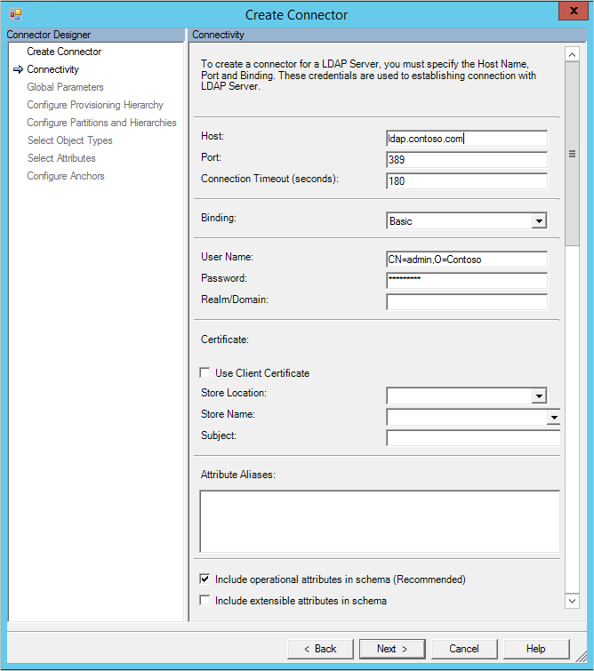
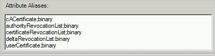
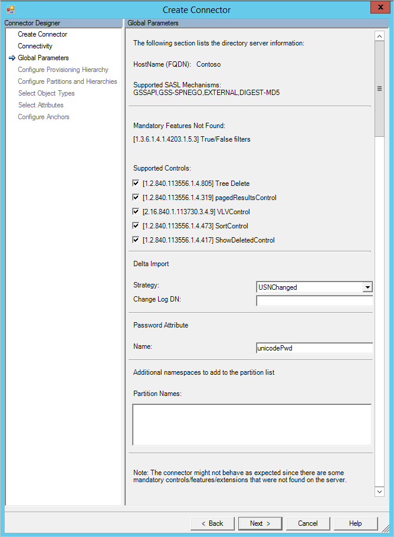

<properties
   pageTitle="Azure AD Connect 同步：泛型 LDAP 连接器 | Azure"
   description="本文介绍如何配置 Microsoft 的泛型 LDAP 连接器。"
   services="active-directory"
   documentationCenter=""
   authors="AndKjell"
   manager="stevenpo"
   editor=""/>

<tags
   ms.service="active-directory"
   ms.date="03/16/2016"
   wacn.date="06/24/2016"/>

# 泛型 LDAP 连接器技术参考

本指南介绍泛型 LDAP 连接器。本文适用于以下产品：

- Microsoft 标识管理器 2016 (MIM2016)
- Forefront 标识管理器 2010 R2 (FIM2010R2)
    -   必须使用修补程序 4.1.3671.0 或更高版本 [KB3092178](https://support.microsoft.com/kb/3092178)。

对于 MIM2016 和 FIM2010R2，可以从 [Microsoft 下载中心](http://go.microsoft.com/fwlink/?LinkId=717495)下载此连接器。

提到 IETF RFC 时，本文档使用 (RFC [RFC 编号]/[RFC 文档中的部分]) 格式，例如：(RFC 4512/4.3)。
你可以在 http://tools.ietf.org/html/rfc4500 上找到详细信息（需要以正确的 RFC 编号替换 4500）。

## 泛型 LDAP 连接器概述

泛型 LDAP 连接器可让你集成同步服务与 LDAP v3 服务器。

IETF RFC 中未指定某些操作和架构元素，例有关要执行增量导入的项目。对于这些操作，只支持显式指定的 LDAP 目录。

从较高层面讲，当前的连接器版本支持以下功能：

| 功能 | 支持 |
| --- | --- |
| 连接的数据源 | 此连接器支持所有 LDAP v3 服务器（RFC 4510 兼容）。此连接器已在以下各项产品中进行测试：<li>Microsoft Active Directory 轻量型目录服务 (AD LDS)</li><li>Microsoft Active Directory 通用类目录 (AD GC)</li><li>389 Directory Server</li><li>Apache Directory Server</li><li>IBM Tivoli DS</li><li>Isode Directory</li><li>NetIQ eDirectory</li><li>Novell eDirectory</li><li>Open DJ</li><li>Open DS</li><li>Open LDAP (openldap.org)</li><li>Oracle（以前为 Sun）Directory Server Enterprise Edition</li><li>RadiantOne Virtual Directory Server (VDS)</li><li>Sun One Directory Server</li>**不支持的著名目录：**<li>Microsoft Active Directory 域服务 (AD DS) [改用内置的 Active Directory 连接器]</li><li>Oracle Internet Directory (OID)</li> |
| 方案 | <li>对象生命周期管理</li><li>组管理</li><li>密码管理</li> |
| 操作 |所有 LDAP 目录都支持以下操作：<li>完整导入</li><li>导出</li>只有指定的目录支持以下操作：<li>增量导入</li><li>设置密码、更改密码</li> |
| 架构 | <li>在 LDAP 架构（RFC3673 和 RFC4512/4.2）中检测到架构</li><li>支持结构化类、aux 类和 extensibleObject 对象类（RFC4512/4.3）</li>

### 增量导入和密码管理支持

支持增量导入和密码管理的目录：

- Microsoft Active Directory 轻型目录服务 (AD LDS)
    - 支持所有操作进行增量导入
    - 支持设置密码
- Microsoft Active Directory 全局目录 (AD GC)
    - 支持所有操作进行增量导入
    - 支持设置密码
- 389 目录服务器
    - 支持所有操作进行增量导入
    - 支持设置密码和更改密码
- Apache Directory 服务器
    - 不支持增量导入，因为此目录没有持续性的更改日志
    - 支持设置密码
- IBM Tivoli DS
    - 支持所有操作进行增量导入
    - 支持设置密码和更改密码
- Isode Directory
    - 支持所有操作进行增量导入
    - 支持设置密码和更改密码
- Novell eDirectory 和 NetIQ eDirectory
    - 支持“添加”、“更新”和“重命名”操作进行增量导入
    - 不支持“删除”操作进行增量导入
    - 支持设置密码和更改密码
- Open DJ
    - 支持所有操作进行增量导入
    - 支持设置密码和更改密码
- Open DS
    - 支持所有操作进行增量导入
    - 支持设置密码和更改密码
- Open LDAP (openldap.org)
    - 支持所有操作进行增量导入
    - 支持设置密码
    - 不支持更改密码
- Oracle（以前为 Sun）Directory Server Enterprise Edition
    - 支持所有操作进行增量导入
    - 支持设置密码和更改密码
- RadiantOne 虚拟目录服务器 (VDS)
    - 必须使用 7.1.1 版或更高版本
    - 支持所有操作进行增量导入
    - 支持设置密码和更改密码
-  Sun One Directory 服务器
    - 支持所有操作进行增量导入
    - 支持设置密码和更改密码

### 先决条件

在使用连接器之前，请确保除了前面提到的任何修补程序以外，同步服务器上还有以下项目：

- Microsoft .NET 4.5.2 Framework 或更高版本

### 检测 LDAP 服务器

连接器依赖各种技巧来检测和识别 LDAP 服务器。连接器使用根 DSE 来查找供应商名称和版本，并且检查架构，以找出已知存在某些 LDAP 服务器中的唯一对象和属性。如果找到此数据，则用于预先填充连接器的配置选项。

### 连接的数据源权限

若要在连接的目录中的对象上执行导入及导出操作，连接器帐户必须具有足够的权限。连接器需要写入权限才能导出，需要读取权限才能导入。权限设置是在目标目录本身的管理体验内执行。

### 端口和协议

连接器使用配置中指定的端口号，默认情况下，LDAP 使用 389，LDAPS 使用 636。

对于 LDAPS，必须使用 SSL 3.0 或 TLS。不支持 SSL 2.0，并且无法激活。

### 必需的控件和功能

LDAP 服务器必须提供以下 LDAP 控件/功能，连接器才能正常运行：

- 1\.3.6.1.4.1.4203.1.5.3 True/False 筛选器

True/False 筛选器通常因为由 LDAP 目录所支持而不报告，并且可能出现在“找不到强制功能”之下的“全局页面”上。它用于在 LDAP 查询中创建 OR 筛选器，例如，当导入多个对象类型时。如果可以导入一种以上的对象类型，则 LDAP 服务器支持此筛选器。

如果使用的目录中有唯一标识符是定位点，则也必须提供以下项目（有关详细信息，请参阅本文后面的[配置定位点](#configure-anchors)部分）：

- 1\.3.6.1.4.1.4203.1.5.1 所有操作属性

如果目录中的对象数目超过在一次调用目录时可容纳的数目，则建议使用分页。需使用以下其中一个选项，分页才能进行：

**选项 1：**

- 1\.2.840.113556.1.4.319 pagedResultsControl

**方法 2：**

- 2\.16.840.1.113730.3.4.9 VLVControl
- 1\.2.840.113556.1.4.473 SortControl

如果连接器设置中已启用这两个选项，将使用 pagedResultsControl。

- 1\.2.840.113556.1.4.417 ShowDeletedControl

只有在 ShowDeletedControl 配合 USNChanged 增量导入方法使用时，才能够查看已删除的对象。

连接器尝试检测选项是否出现在服务器上。如果检测不到选项，则连接器属性的“全局”页面上出现警告。并非所有 LDAP 服务器都显示其支持的所有控件/功能，即使出现此警告，连接器也可能正常运行。

### 增量导入

只有在检测到支持目录时，才可使用增量导入。当前使用以下方法：

- LDAP Accesslog。请参阅 [http://www.openldap.org/doc/admin24/overlays.html#Access Logging](http://www.openldap.org/doc/admin24/overlays.html#Access Logging)
- LDAP Changelog。请参阅 [http://tools.ietf.org/html/draft-good-ldap-changelog-04](http://tools.ietf.org/html/draft-good-ldap-changelog-04)
- TimeStamp。对于 Novell/NetIQ eDirectory，连接器使用最后的日期/时间来获取已创建和更新的对象。Novell/NetIQ eDirectory 不提供等效方法来检索已删除的对象。如果 LDAP 服务器上没有其他作用中的增量导入方法，也可以使用此选项。此选项无法导入已删除的对象。
- USNChanged。请参阅：[https://msdn.microsoft.com/library/ms677627.aspx](https://msdn.microsoft.com/library/ms677627.aspx)

### 不支持

不支持以下 LDAP 功能：

- 服务器之间的 LDAP 路由 (RFC 4511/4.1.10)

## 创建新连接器

若要创建泛型 LDAP 连接器，请在“同步服务”中选择“管理代理”和“创建”。选择“泛型 LDAP (Microsoft)”连接器。

### 连接

在“连接”页面上，必须指定“主机”、“端口”和“绑定”信息。根据选择的“绑定”，以下部分可能提供其他信息。

- “连接超时”设置仅适用于检测架构时的第一次服务器连接。
- 如果“绑定”为“匿名”，则不使用用户名/密码或证书。
- 对于其他绑定，请在用户名/密码中输入信息或选择证书。
- 如果使用 Kerberos 进行身份验证，则还要提供用户的“领域/域”。

“属性别名”文本框用于以 RFC4522 语法在架构中定义的属性。在架构检测期间无法检测这些别名，而连接器需要帮助才能进行识别。例如，需要在“属性别名”框中输入以下项目，才能正确地将 userCertificate 属性识别为二进制属性：

`userCertificate;binary`

以下是此框的显示示例：

选中“在架构中包含操作属性”复选框，以便同时包含服务器创建的属性。其中包含对象的创建时间和上次更新时间等属性。

若已使用可扩展对象 (RFC4512/4.3)，则选择“在架构中包含可扩展属性”，并且启用此选项可让你每个属性使用于所有对象上。选择此选项让架构变得非常大，所以除非连接的目录使用此功能，否则建议不要选择此选项。

### 全局参数

在“全局参数”页面上配置差异更改日志的 DN 和其他 LDAP 功能。此页面将预先填充以 LDAP 服务器所提供的信息。

上半部分显示服务器本身所提供的信息，例如服务器名称。连接器还会验证根 DSE 中是否存在必需的控件。如果未列出这些项目，则显示一条警告。某些 LDAP 目录不列出根 DSE 中的所有功能，而即使出现警告，连接器也可能正常运行。

“支持的控件”复选框可控制特定操作的行为：

- 选择树删除后，将通过一个 LDAP 调用于删除层次结构。若未选择树状目录删除，则连接器视需要进行递归删除。
- 选择分页结果后，连接器以执行步骤上指定的大小进行分页导入。
- VLVControl 和 SortControl 是 pagedResultsControl 的替代项，可从 LDAP 目录读取数据。
- 如果三个选项（pagedResultsControl、VLVControl 和 SortControl）均未选择，则连接器在一个操作中导入所有对象，而如果是大型目录，有可能失败。
- 只有在增量导入方法是 USNChanged 时，才使用 ShowDeletedControl。

更改日志 DN 是差异更改日志所使用的命名内容，例如 **cn=changelog**。必须指定此值，才能够进行增量导入。

以下是默认更改日志 DN 列表：

| Directory | 增量更改日志 |
| --- | --- |
| Microsoft AD LDS 和 AD GC | 自动检测。USNChanged。 |
| Apache Directory 服务器 | 不可用。 |
| Directory 389 | 更改日志。要使用的默认值：**cn=changelog** |
| IBM Tivoli DS | 更改日志。要使用的默认值：**cn=changelog** |
| Isode Directory | 更改日志。要使用的默认值：**cn=changelog**
| Novell/NetIQ eDirectory | 不可用。TimeStamp。连接器使用上次更新日期/时间来获取已添加和更新的记录。 |
| Open DJ/DS | 更改日志。要使用的默认值：**cn=changelog** |
| Open LDAP | 访问日志。要使用的默认值：**cn=accesslog** |
| Oracle DSEE | 更改日志。要使用的默认值：**cn=changelog** |
| RadiantOne VDS | 虚拟目录。取决于连接到 VDS 的目录。 |
| Sun One Directory 服务器 | 更改日志。要使用的默认值：**cn=changelog** |

密码属性是连接器在密码更改和密码设置操作中应用于设置密码的属性名称。
默认设置为 **userPassword**，但特定 LDAP 系统可以视需要进行更改。

在其他分区列表中，可以添加其他未自动检测到的命名空间。例如，如果有几台应同时全部导入的服务器组成一个逻辑群集，则可使用此列表。就如同 Active Directory 可以在一个林中有多个域，而所有域都共享一个架构，在此框中输入其他命名空间就可以模拟此状况。每个命名空间都可以从不同的服务器导入，并可在“配置分区和层次结构”页面上进一步设置。使用 Ctrl+Enter 来换行。

### 配置预配层次结构

此页面用于将 DN 组件（例如 OU）对应到应该预配的对象类型（例如 organizationalUnit）。

通过配置预配层次结构，可以配置连接器在必需时自动创建结构。例如，如果有命名空间 dc=contoso,dc=com 并已预配一个新对象（cn=Joe、ou=Seattle、c=US、dc=contoso、dc=com），则连接器可以创建国家类型为美国而 organizationalUnit 为西雅图的新对象（如果目录中尚未出现这些项目）。

### 配置分区和层次结构

在分区和层次结构页面上，选择具有你打算导入和导出的对象的所有命名空间。

对于每个命名空间，还可以配置连接设置，以重写“连接”屏幕上指定的值。如果这些值保留为其默认的空白值，则使用“连接”屏幕中的信息。

此外，也可以选择连接器应导入和导出的容器与 OU。

### 配置定位点

此页面始终有一个预配置值，并且无法更改。如果已识别出服务器供应商和版本，则可能填充不可变的属性，例如对象的 GUID。如果尚未检测到或已知没有不可变的属性，则连接器使用 dn（辨别名称）作为定位点。

以下是 LDAP 服务器列表和使用的定位点：

| Directory | 定位点属性 |
| --- | --- |
| Microsoft AD LDS 和 AD GC | objectGUID |
| 389 目录服务器 | dn |
| Apache Directory | dn |
| IBM Tivoli DS | dn |
| Isode Directory | dn |
| Novell/NetIQ eDirectory | GUID |
| Open DJ/DS | dn |
| Open LDAP | dn |
| Oracle ODSEE | dn |
| RadiantOne VDS | dn |
| Sun One Directory 服务器 | dn |

## 其他说明

本部分提供此连接器特用层面的信息，或因为其他原因而需要知道的重要信息。

### 增量导入

Open LDAP 中的增量水印是 UTC 日期/时间。出于此原因，FIM 同步服务与 Open LDAP 之间的时钟必须同步。如果没有同步，则可能省略增量更改日志中的某些项目。

对于 Novell eDirectory，增量导入不检测任何对象删除。出于此原因，必须定期执行完整导入才可找到所有删除的对象。

对于包含基于日期/时间的增量更改日志的目录，强烈建议定期执行完整导入，以找出 LDAP 服务器与连接器空间中当前内容之间的差异。

## 故障排除

-	有关如何启用记录来排查连接器问题的信息，请参阅[如何启用连接器的 ETW 跟踪](http://go.microsoft.com/fwlink/?LinkId=335731)。

<!---HONumber=Mooncake_0606_2016-->