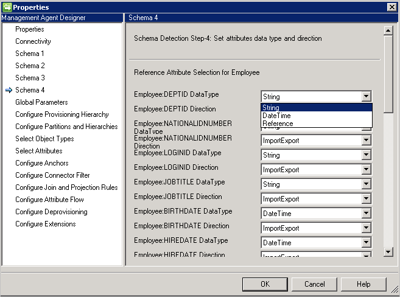
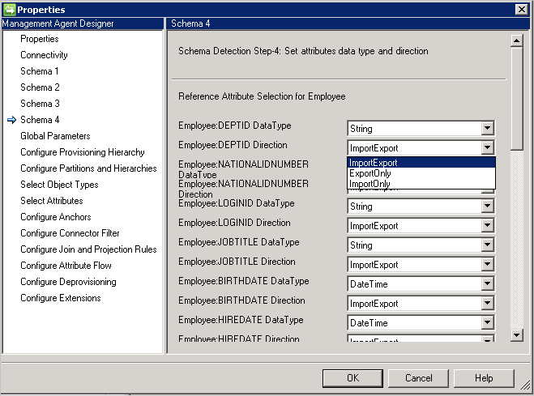
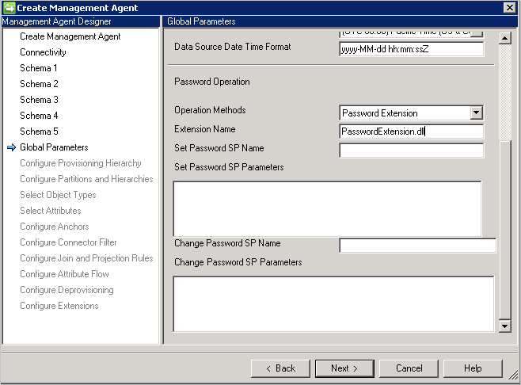
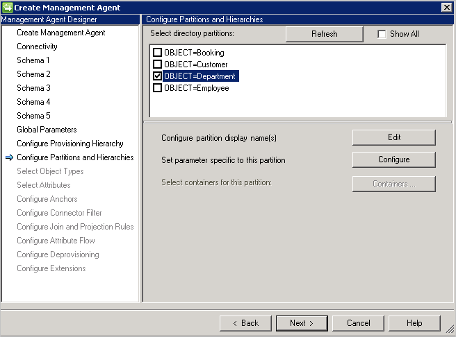
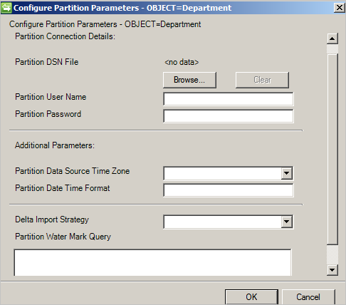
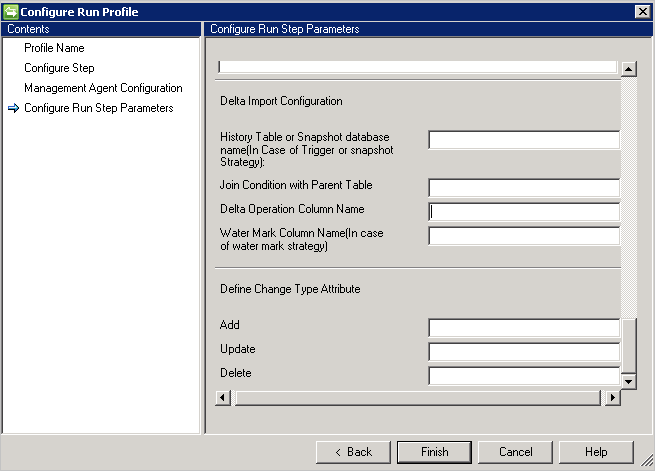

<properties
   pageTitle="Azure AD Connect 同步：泛型 SQL 连接器 | Azure"
   description="本文介绍如何配置 Microsoft 的泛型 SQL 连接器。"
   services="active-directory"
   documentationCenter=""
   authors="AndKjell"
   manager="stevenpo"
   editor=""/>

<tags
   ms.service="active-directory"
   ms.date="03/16/2016"
   wacn.date="06/24/2016"/>

# 泛型 SQL 连接器技术参考

本指南介绍泛型 SQL 连接器。本文适用于以下产品：

- Microsoft 标识管理器 2016 (MIM2016)
- Forefront 标识管理器 2010 R2 (FIM2010R2)
    -   必须使用修补程序 4.1.3671.0 或更高版本 [KB3092178](https://support.microsoft.com/kb/3092178)。

对于 MIM2016 和 FIM2010R2，可以从 [Microsoft 下载中心](http://go.microsoft.com/fwlink/?LinkId=717495)下载此连接器。

## 泛型 SQL 连接器概述

泛型 SQL 连接器可让你集成同步服务与提供 ODBC 连接的数据库系统。

从较高层面讲，当前的连接器版本支持以下功能：

| 功能 | 支持 |
| --- | --- |
| 连接的数据源 | 此连接器支持所有 64 位 ODBC 驱动程序。此连接器已进行以下各项的测试：<li>Microsoft SQL Server 和 SQL Azure</li><li>IBM DB2 10.x</li><li>IBM DB2 9.x</li><li>Oracle 10 和 11g</li><li>MySQL 5.x</li>
| 方案 | <li>对象生命周期管理</li><li>密码管理</li> |
| 操作 | <li>完整导入和增量导入、导出</li><li>对于导出：添加、更新、删除和替换</li><li>设置密码、更改密码</li>
| 架构 | <li>动态发现对象和属性</li>

### 先决条件

在使用连接器之前，请确保除了前面提到的任何修补程序以外，同步服务器上还有以下项目：

- Microsoft .NET 4.5.2 Framework 或更高版本
- 64 位 ODBC 客户端驱动程序

### 连接的数据源权限

若要在泛型 SQL 连接器中创建或执行任何支持的任务，你必须具备：

- db\_datareader
- db\_datawriter

### 端口和协议

有关运行 ODBC 驱动程序所需的端口，请参阅数据库供应商的文档。

## 创建新连接器

若要创建泛型 SQL 连接器，请在“同步服务”中选择“管理代理”和“创建”。选择“泛型 SQL (Microsoft)”连接器。

### 连接

连接器使用 ODBC DSN 文件进行连接。使用开始菜单中“管理工具”下的“ODBC 数据源”来创建 DSN 文件。在管理工具中创建“文件 DSN”，以便提供给连接器。

当你创建新的泛型 SQL 连接器时，“连接”是第一个屏幕。首先需要提供以下信息：

- DSN 文件路径
- 身份验证
    - 用户名
    - 密码

数据库应该支持下列身份验证方法之一。

- **Windows 身份验证**：身份验证数据库将使用 Windows 凭据来验证用户。指定的用户名/密码将用于向数据库进行身份验证。此帐户需要数据库的权限。
- **SQL 身份验证**：身份验证数据库使用“连接”屏幕上定义的用户名/密码连接到数据库。如果在 DSN 文件中存储用户名/密码，则优先使用在“连接”屏幕上提供的凭据。
- **Azure SQL 数据库身份验证**：有关详细信息，请参阅[使用 Azure Active Directory 身份验证连接到 SQL 数据库](/documentation/articles/sql-database-aad-authentication/)。

**DN 是定位点**：如果选择此选项，DN 也用作定位点属性。它可用于简单实现，但也有以下限制：

-	连接器只支持 1 个对象类型。因此，所有引用属性只能引用相同的对象类型。

**导出类型: 对象替换**：在导出期间，只有一些属性已更改时，包含所有属性的整个对象将导出并将替换现有的对象。

### 架构 1（检测对象类型）

此页面上，将配置连接器要如何在数据库中查找不同的对象类型。

每个对象类型显示为一个分区，并且在“配置分区和层次结构”上进一步设置。

**对象类型检测方法**：连接器支持以下对象类型检测方法。

- **固定值**：以逗号分隔列表来提供对象类型列表。例如User,Group,Department。  

- **表/视图/存储过程**：提供表/视图/存储过程的名称，然后提供列名称以提供对象类型的列表。如果使用存储过程，则还需要使用以下格式提供其参数：[名称]:[方向]:[值]。独行提供每个参数（使用 Ctrl+Enter 来换行）。  

- **SQL 查询**：此选项可让提供 SQL 查询，以返回包含对象类型的单个列，例如 `SELECT [Column Name] FROM TABLENAME`。返回的列必须是字符串类型 (varchar)。

### 架构 2（检测属性类型）

在此页面上，你将配置如何检测属性名称和类型。系统针对在前一页检测到的每个对象类型，列出配置选项。

**属性类型检测方法**：连接器以“架构 1”屏幕中每个检测到的对象类型，支持以下属性类型检测方法。

- **表/视图/存储过程**：提供表/视图/存储过程的名称，以便用于查找属性名称。如果使用存储过程，则还需要使用以下格式提供其参数：**[名称]:[方向]:[值]**。独行提供每个参数（使用 Ctrl+Enter 来换行）。若要检测多值属性中的属性名称，请提供以逗号分隔的表或视图列表。如果父表和子表具有相同的列名称，则不支持多值方案。
- **SQL 查询**：此选项可让提供 SQL 查询，以返回包含属性名称的单个列，例如 `SELECT [Column Name] FROM TABLENAME`。返回的列必须是字符串类型 (varchar)。

### 架构 3（定义定位点和 DN）

此页面可让你为每个检测到的对象类型配置定位点和 DN 属性。你可以选择多个属性，让定位点变成唯一。

- 不列出多值属性和布尔属性。
- DN 和定位点不能使用相同的属性，除非已在“连接”页面上选择“DN 是定位点”。
- 如果已在“连接”页面上选择“DN 是定位点”，此页面只需要 DN 属性。此属性也用作定位点属性。

### 架构 4（定义属性类型、引用和方向）

此页面可让你配置每个属性的属性类型，如整数、引用、字符串、二进制或布尔值和方向。“架构 2”页面中的所有属性都列出，包括多值属性。

- **DataType**：用于将属性类型映射到同步引擎所知的属性类型。默认使用在 SQL 架构中检测到的相同类型，但 DateTime 和 Reference 不容易检测。因此，需要指定 **DateTime** 或 **Reference**。
- **方向**：可以设置 Import、Export 或 ImportExport 的属性方向。ImportExport 是默认值。

说明：

- 如果连接器无法检测属性类型，则使用字符串数据类型。
- 可将**嵌套表**视为包含一个列的数据库表。Oracle 不以任何特定顺序存储嵌套表的行。但是，当你将嵌套表检索到 PL/SQL 变量时，行便有从 1 开始的连续下标。这可让你获取单个行的类似于数组的访问。
- 连接器不支持 **VARRYS**。

### 架构 5（定义引用属性的分区）

在此页面上，你将为所有引用属性配置属性所引用的分区（即对象类型）。

如果使用“DN 是定位点”，则必须使用相同的对象类型作为引用的源对象类型。不能引用其他对象类型。

### 全局参数

“全局参数”页面用于设置增量导入、日期/时间格式，以及密码方法。

泛型 SQL 连接器支持使用以下增量导入方法：

- **触发器**：请参阅[使用触发器生成差异视图](https://technet.microsoft.com/library/cc708665.aspx)。
- **水印**：这是一般方法，可用于任何数据库。水印查询根据数据库供应商预先填充。水印列必须出现在所用的每个表/视图上。必须跟踪表的插入和更新及其依赖（多值或子级）表。同步服务与数据库服务器之间的时钟必须同步。如果没有同步，则可能会省略增量导入中的某些项目。限制：
    - 水印策略不支持已删除的对象。
- **快照**（仅适用于 Microsoft SQL Server）[使用快照生成差异视图](https://technet.microsoft.com/library/cc720640.aspx)
- **更改跟踪**（仅适用于 Microsoft SQL Server）[关于更改跟踪](https://msdn.microsoft.com/library/bb933875.aspx)限制：
    - 定位点和 DN 属性必须属于表中所选对象的主键。
    - 在使用更改跟踪的导入和导出期间，不支持 SQL 查询。

**其他参数**：指定“数据库服务器时区”，以指出数据库服务器所在的位置。此值用于支持各种格式的日期和时间属性。

连接器始终以 UTC 格式存储日期和日期时间。若要能够正确地转换日期和时间，必须指定数据库服务器的时区以及所用的格式。格式应以 .Net 格式表示。

在导出期间，必须以 UTC 时间格式将每个日期时间属性提供给连接器。

**密码配置**：连接器提供密码同步功能并支持设置和更改密码。

连接器提供两种方法来支持密码同步：

- **存储过程**：此方法需要两个存储过程，以支持设置和更改密码。按照以下示例，分别在“设置密码 SP 参数”和“更改密码 SP 参数”中键入添加和更改密码操作的所有参数。

- **密码扩展**：此方法需要密码扩展 DLL（必须提供实现 [IMAExtensible2Password](https://msdn.microsoft.com/library/microsoft.metadirectoryservices.imaextensible2password.aspx) 接口的扩展 DLL 名称）。密码扩展组件必须放在扩展文件夹中，连接器才可以在运行时加载 DLL。

你还必须在“配置扩展”页面上启用密码管理。

### 配置分区和层次结构

在分区和层次结构页面上，选择所有对象类型。每个对象类型都在自身的分区中。

你还可以重写在“连接”或“全局参数”页面上定义的值。

### 配置定位点

此页面是只读页面，因为已经定义定位点。选择的定位点属性始终附加对象类型，以确保它在所有对象类型中保持唯一。

## 配置运行步骤参数

对连接器的运行配置文件配置这些步骤。这些配置将进行导入和导出数据的实际工作。

### 完整和增量导入

泛型 SQL 连接器支持使用以下方法的完整和增量导入：

- 表
- 查看
- 存储过程
- SQL 查询

**表/视图**

若要导入对象的多值属性，必须在“多值表/视图名称”中提供逗号分隔的表/视图名称，以及在父表的“联接条件”中提供各自的联接条件。

示例：你想要导入员工对象与其所有的多值属性。有两个表：“员工”（主表）和“部门”（多值）表。请执行以下操作：

- 在“表/视图/SP”中键入“员工”。
- 在“多值表/视图名称”中键入“部门”。
- 在“联接条件”中键入“员工”与“部门”之间的联接条件，例如 `Employee.DEPTID=Department.DepartmentID`。

**存储过程**

- 如果你有大量数据，建议实现存储过程的分页。
- 若要让存储过程支持分页，需要提供起始索引和结束索引。请参阅：[有效进行大量数据的分页](https://msdn.microsoft.com/library/bb445504.aspx)。
- 在执行时，将以在“配置步骤”页面上设置的各自页面大小值替换 @StartIndex 和 @EndIndex。示例：如果连接器撷取第一页且页面大小设置为 500，在这种情况下 @StartIndex 是 1 而 @EndIndex 被视为 500，这些值随着连接器撷取后续页面而增加并更改 @StartIndex 和 @EndIndex 值。
- 若要执行参数化存储过程，请以 `[Name]:[Direction]:[Value]` 格式提供参数。独行输入每个参数（使用 Ctrl+Enter 来换行）。
- 泛型 SQL 连接器还支持从分布式环境的导入操作，例如 Microsoft SQL Server 中链接的服务器。如果要从链接的服务器中的表检索信息，则以 `[ServerName].[Database].[Schema].[TableName]` 格式提供表。
    - 在分布式环境中，连接器仅支持 Microsoft 链接的服务器。
- 泛型 SQL 连接器仅支持在执行步骤信息和架构检测之间具有类似结构（包括别名和数据类型）的对象。如果架构中选择的对象与在执行步骤提供的信息不同，则 SQL 连接器将无法支持这类方案。

**SQL 查询**

- 不支持多个结果集查询。
- SQL 查询支持分页并提供起始索引和结束索引作为变量，以支持分页。

### 增量导入

增量导入配置需要一些详细的配置，以及其他支持的方法（如完整导入）。

- 如果用户选择“触发器”或“快照”方法来跟踪增量更改，用户可以在“历史记录表或快照数据库名称”框中提供历史记录表或快照数据库。
- 用户还需要提供历史记录表与父表之间的联接条件。示例：`Employee.ID=History.EmployeeID`
- 从历史记录表跟踪父表上的事务，用户必须提供包含添加/更新/删除等操作信息的列名称。
- 如果用户选择“水印”来跟踪增量更改，则用户必须在“水印列名称”中提供包含操作信息的列名称。因此，连接器可以在执行增量导入时考虑此列。
- 更改类型需要“更改型别属性”列。此列将主表或多值表中发生的更改映射到差异视图中的更改类型。此列可以包含适用于属性级更改的 Modify\_Attribute 更改类型，或适用于对象级更改的“添加”、“修改”或“删除”更改类型。如果除了默认值“添加”、“修改”或“删除”以外，用户可以使用此选项来定义这些值。

### 导出

泛型 SQL 连接器支持使用以下四种方法的导出：

- 表
- 查看
- 存储过程
- SQL 查询

**表/视图**

如果用户选择“表/视图”选项，则连接器生成各自的查询并执行导出。

**存储过程**

如果用户选择“存储过程”选项，则导出需要 3 个不同的存储过程来执行各种插入/更新/删除操作。

- **添加 SP 名称**：如有任何对象来到连接器以便在各自的表中插入，则执行此 SP。
- **更新 SP 名称**：如有任何对象来到连接器以便在各自的表中更新，则执行此 SP。
- **删除 SP 名称**：如有任何对象来到连接器以便在各自的表中删除，则执行此 SP。
- 从架构选择的属性作为存储过程的参数值。示例：EmployeeName: INPUT: @EmployeeName（EmployeeName 已在连接器架构中选择，而连接器在执行导出时替换各自的值）
- 执行参数化存储过程时，请以 `[Name]:[Direction]:[Value]` 格式键入所有参数。独行输入每个参数（使用 Ctrl+Enter 来换行）。

**SQL 查询**

如果用户选择“SQL 查询”选项，则导出需要 3 个不同的查询来执行各种插入/更新/删除操作。

- **插入查询**：如有任何对象来到连接器以便在各自的表中插入，则执行此查询。
- **更新查询**：如有任何对象来到连接器以便在各自的表中更新，则执行此查询。
- **删除查询**：如有任何对象来到连接器以便在各自的表中删除，则执行此查询。
- 从架构选择的属性作为查询的参数值。示例：`Insert into Employee (ID, Name) Values (@ID, @EmployeeName)`

## 故障排除

-	有关如何启用记录来排查连接器问题的信息，请参阅[如何启用连接器的 ETW 跟踪](http://go.microsoft.com/fwlink/?LinkId=335731)。

<!---HONumber=Mooncake_0606_2016-->