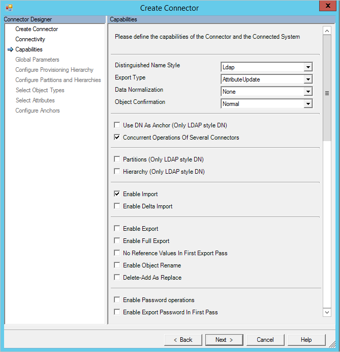

<properties
   pageTitle="Azure AD Connect 同步：PowerShell 连接器 | Azure"
   description="本文介绍如何配置 Microsoft 的 Windows PowerShell 连接器。"
   services="active-directory"
   documentationCenter=""
   authors="AndKjell"
   manager="stevenpo"
   editor=""/>

<tags
   ms.service="active-directory"
   ms.date="03/16/2016"
   wacn.date="06/24/2016"/>

# Windows PowerShell 连接器技术参考

本文介绍 Windows PowerShell 连接器。本文适用于以下产品：

- Microsoft 标识管理器 2016 (MIM2016)
- Forefront 标识管理器 2010 R2 (FIM2010R2)
    -   必须使用修补程序 4.1.3671.0 或更高版本 [KB3092178](https://support.microsoft.com/kb/3092178)。

对于 MIM2016 和 FIM2010R2，可以从 [Microsoft 下载中心](http://go.microsoft.com/fwlink/?LinkId=717495)下载此连接器。

## PowerShell 连接器概述

PowerShell 连接器可让你将同步服务与可提供基于 Windows PowerShell 的应用程序编程接口 (API) 的外部系统相集成。该连接器在基于调用的可扩展连接管理代理 2 (ECMA2) 框架与 Windows PowerShell 的功能之间提供桥梁。有关 ECMA 框架的详细信息，请参阅 [Extensible Connectivity 2.2 Management Agent Reference（可扩展连接管理代理 2.2 参考）](https://msdn.microsoft.com/library/windows/desktop/hh859557.aspx)。

### 先决条件

在使用连接器之前，请确保除了前面提到的任何修补程序以外，同步服务器上还有以下项目：

- Microsoft .NET 4.5.2 Framework 或更高版本
- Windows PowerShell 2.0、3.0 或 4.0

同步服务服务器上的执行策略必须配置为允许连接器运行 Windows PowerShell 脚本。除非连接器将要运行的脚本已经过数字签名，否则请运行以下命令来配置执行策略：

`Set-ExecutionPolicy -ExecutionPolicy RemoteSigned`

## 创建新连接器

若要在同步服务中创建 Windows PowerShell 连接器，必须提供一系列 Windows PowerShell 脚本用于执行同步服务请求的步骤。根据所要连接到的数据源和所需的功能，必须实现的脚本将有所不同。本部分概述可以实现的每个脚本以及何时需要用到它们。

Windows PowerShell 连接器用于存储同步服务数据库中的每个脚本。虽然可以运行存储在文件系统中的脚本，但将每个脚本的主体直接插入连接器配置更为方便

若要创建 PowerShell 连接器，请在“同步服务”中选择“管理代理”和“创建”。选择“PowerShell (Microsoft)”连接器。

### 连接

接下来，可以提供用于连接到远程系统的配置参数。这些参数由同步服务安全保存，并在连接器运行时提供给 Windows PowerShell 脚本。

可以配置以下连接参数：

**连接**

| 参数 | 默认值 | 目的 |
| --- | --- | --- |
| 服务器 | <Blank> | 连接器应连接到的服务器名称。 |
| 域 | <Blank> | 要存储的以便在连接器运行时使用的凭据域。 |
| 用户 | <Blank> | 要存储的以便在连接器运行时使用的凭据用户名。 |
| 密码 | <Blank> | 要存储的以便在连接器运行时使用的凭据密码。 |
| 模拟连接器帐户 | False | 如果为 true，同步服务将在上面提供的凭据上下文中执行 Windows PowerShell 脚本。如果可能，建议使用传递给每个脚本的 $Credentials 参数来代替模拟。有关使用此参数时必须具有的其他权限的详细信息，请参阅“模拟的其他配置”。 |
| 模拟时加载用户配置文件 | False | 指示 Windows 在模拟期间加载连接器凭据的用户配置文件。如果要模拟的用户具有漫游配置文件，连接器不会加载漫游配置文件。有关使用此参数时必须具有的其他权限的详细信息，请参阅“模拟的其他配置”。 |
| 模拟时的登录类型 | 无 | 模拟期间的登录类型。有关详细信息，请参阅 [dwLogonType][dw] 文档。 |
| 仅限已签名的脚本 | False | 如果为 true，Windows PowerShell 连接器将验证每个脚本是否具有有效的数字签名。如果为 false，请确保同步服务服务器的 Windows PowerShell 执行策略是 RemoteSigned 或 Unrestricted。 |

**通用模块**

连接器可让管理员在配置中存储共享的 Windows PowerShell 模块。连接器在执行脚本时，会将 Windows PowerShell 模块提取到文件系统，使其可供每个脚本导入。

对于导入、导出和密码同步脚本，会将通用模块提取到连接器的 MAData 文件夹。对于架构、验证、层次结构和分区发现脚本，则将通用模块提取到 %TEMP% 文件夹。在这两种情况下，所提取的通用模块脚本根据通用模块脚本名称设置进行命名。

若要从 MAData 文件夹加载名为 FIMPowerShellConnectorModule.psm1 的模块，请使用以下语句：
`Import-Module (Join-Path -Path [Microsoft.MetadirectoryServices.MAUtils]::MAFolder -ChildPath "FIMPowerShellConnectorModule.psm1")`

若要从 %TEMP% 文件夹加载名为 FIMPowerShellConnectorModule.psm1 的模块，请使用以下语句：
`Import-Module (Join-Path -Path $env:TEMP -ChildPath "FIMPowerShellConnectorModule.psm1")`

**参数验证**

验证脚本是可选的 Windows PowerShell 脚本，可用于确保管理员提供的连接器配置参数有效。验证服务器和连接凭据以及连接参数是验证脚本的常见用途。如果修改以下选项卡和对话框，将会调用验证脚本：

- 连接
- 全局参数
- 分区配置

验证脚本将从连接器接收以下参数：

| Name | 数据类型 | 说明 |
| --- | --- | --- |
| ConfigParameterPage | [ConfigParameterPage][cpp] | 触发验证请求的配置选项卡或对话框。 |
| ConfigParameters | [KeyedCollection][keyk] [string, [ConfigParameter][cp]] | 连接器的配置参数表。 |
| 凭据 | [PSCredential][pscred] | 包含管理员在“连接”选项卡上输入的任何凭据。 |

验证脚本应将单个 ParameterValidationResult 对象返回到管道。

**架构发现**

架构发现脚本是必需的。此脚本返回对象类型和属性，以及同步服务在配置属性流规则时使用的属性约束。架构发现脚本在连接器创建期间执行，并在 Synchronization Service Manager 中填充连接器的架构和后续的刷新架构函数。

架构发现脚本将从连接器接收以下参数：

| Name | 数据类型 | 说明 |
| --- | --- | --- |
| ConfigParameters | [KeyedCollection][keyk] [string, [ConfigParameter][cp]] | 连接器的配置参数表。 |
| 凭据 | [PSCredential][pscred] | 包含管理员在“连接”选项卡上输入的任何凭据。 |

脚本必须将单个[架构][schema]对象返回到管道中。架构对象由代表对象类型（例如用户、组等）的 [SchemaType][schemaT] 对象组成。SchemaType 对象保存代表该类型属性（例如名字、姓氏、邮政地址等）的 [SchemaAttribute][schemaA] 对象的集合。

**其他参数**

除了到目前为止所述的标准配置设置外，你还可以定义连接器实例特定的其他自定义配置设置。可以在连接器、分区或运行步骤级别指定这些参数，并从相关的 Windows PowerShell 脚本进行访问。自定义配置设置可以纯文本格式存储在同步服务数据库中，或对其进行加密。同步服务在必要时会自动加密和解密安全的配置设置。

若要指定自定义配置设置，请使用逗号 ( , ) 分隔每个参数的名称。

若要从脚本中访问自定义配置设置，必须在名称后面添加下划线 ( \_ ) 和参数范围（Global、Partition 或 RunStep）。例如，若要访问全局 FileName 参数，请使用此代码段：`$ConfigurationParameters["FileName_Global"].Value`

### 功能

管理代理设计器的功能选项卡定义连接器的行为和功能。在创建连接器后，无法修改在此选项卡上所做的选择。下表列出了每项功能设置。

| 功能 | 说明 |
| --- | --- |
| [可分辨名称样式][dnstyle] | 指示连接器是否支持可分辨名称，如果支持，其样式为何。 |
| [导出类型][exportT] | 确定要对导出脚本显示的对象类型。<li>AttributeReplace – 包含属性更改时的一组完整多值属性值。</li><li>AttributeUpdate – 只包含属性更改时的多值属性差异。</li><li>MultivaluedReferenceAttributeUpdate - 包含一组完整的非参考多值属性值，并仅包含多值参考属性的差异。</li><li>ObjectReplace – 包含任何属性更改时的所有对象属性</li> |
| [数据规范化][DataNorm] | 指示同步服务先将定位点属性规范化，再提供给脚本。 |
| [对象确认][oconf] | 在同步服务中配置挂起导入行为。<li>Normal – 预期所有导出的更改通过导入来确认的默认行为</li><li>NoDeleteConfirmation – 删除对象时，不生成任何挂起导入。</li><li>NoAddAndDeleteConfirmation – 创建或删除对象时，不生成任何挂起导入。</li>
| 使用 DN 作为定位点 | 如果“可分辨名称样式”设置为 LDAP，则连接器空间的定位点属性也是可分辨名称。 |
| 多个连接器的并发操作 | 选中时，可以同时运行多个 Windows PowerShell 连接器。 |
| 分区 | 选中时，连接器可支持多个分区和分区发现。 |
| 层次结构 | 选中时，连接器可支持 LDAP 样式的层次结构。 |
| 启用导入 | 选中时，连接器将通过导入脚本导入数据。 |
| 启用增量导入 | 选中时，连接器可以从导入脚本请求增量。 |
| 启用导出 | 选中时，连接器将通过导出脚本导出数据。 |
| 启用完整导出 | 选中时，导出脚本可支持导出整个连接器空间。若要使用此选项，还必须选中“启用导出”。|
| 第一个导出阶段没有引用值 | 选中时，将在第二个导出阶段导出引用属性。 |
| 启用对象重命名 | 选中时，可以修改可分辨名称。 |
| 删除-添加用作替换 | 选中时，将删除-添加操作导出为单个替换。 |
| 启用密码操作 | 选中时，可支持密码同步脚本。 |
| 在第一个阶段启用导出密码 | 选中时，将在创建对象时导出预配期间设置的密码。 |

### 全局参数

管理代理设计器中的“全局参数”选项卡可让管理员配置连接器将执行的每个 Windows PowerShell 脚本，以及“连接”选项卡上定义的自定义配置设置的全局值。

**分区发现**

分区是一个共享架构内的独立命名空间。例如在 Active Directory 中，每个域就是一个林内的分区。分区是导入和导出操作的逻辑组。导入和导出将分区用作上下文，所有操作都必须在此上下文中发生。分区应该代表 LDAP 中的层次结构。导入操作使用分区的可分辨名称来验证所有返回的对象是否都在分区的范围内。在从 Metaverse 预配到连接器空间的期间，也使用分区可分辨名称来确定对象应该在导出期间与哪个分区关联。

分区发现脚本将从连接器接收以下参数：

| Name | 数据类型 | 说明 |
| --- | --- | --- |
| ConfigParameters | [KeyedCollection][keyk][string, [ConfigParameter][cp]] | 连接器的配置参数表。
| 凭据 | [PSCredential][pscred] | 包含管理员在“连接”选项卡上输入的任何凭据。 |

脚本必须将单个[分区][part]对象或分区对象的 List[T] 返回到管道中。

**层次结构发现**

仅当可分辨名称样式功能是 LDAP 时，才使用层次结构发现脚本。管理员可使用该脚本来浏览和选择一组被视为在导入和导出操作范围之内或之外的容器。此脚本只应提供节点列表，这些节点是提供给脚本的根节点的直接子级。

层次结构发现脚本将从连接器接收以下参数：

| Name | 数据类型 | 说明 |
| --- | --- | --- |
| ConfigParameters | [KeyedCollection][keyk][string, [ConfigParameter][cp]] | 连接器的配置参数表。 |
| 凭据 | [PSCredential][pscred] | 包含管理员在“连接”选项卡上输入的任何凭据。 |
| ParentNode | [HierarchyNode][hn] | 脚本应将直接子级返回到的层次结构的根节点。 |

脚本必须将单个 HierarchyNode 子对象或 HierarchyNode 子对象 List[T] 返回到管道中。

#### 导入

支持导入操作的连接器必须实现三个脚本。

**开始导入**

开始导入脚本在导入运行步骤开始时运行。在此步骤中，你可以连接到源系统并进行任何预备步骤，然后从连接的系统导入数据。

开始导入脚本将从连接器接收以下参数：

| 名称 | 数据类型 | 说明 |
| --- | --- | --- |
| ConfigParameters | [KeyedCollection][keyk][string, [ConfigParameter][cp]] | 连接器的配置参数表。 |
| 凭据 | [PSCredential][pscred] | 包含管理员在“连接”选项卡上输入的任何凭据。 |
| OpenImportConnectionRunStep | [OpenImportConnectionRunStep][oicrs] | 告知脚本导入运行的类型（增量或完整）、分区、层次结构、水印和预期的页面大小。
| 类型 | [架构][schema] | 将要导入的连接器空间的架构。 |

脚本必须将单个 [OpenImportConnectionResults][oicres] 对象返回到管道中。以下示例代码演示如何将 OpenImportConnectionResults 对象返回到管道：

`Write-Output (New-Object Microsoft.MetadirectoryServices.OpenImportConnectionResults)`

**导入数据**

连接器调用导入数据脚本，直到脚本指示已没有数据要导入，并且同步服务不需要在增量导入期间请求任何完整的对象导入。Windows PowerShell 连接器的页面大小为 9,999 个对象。如果脚本在导入时返回超过 9,999 个对象，则必须支持分页。连接器公开自定义数据属性用于存储水印，以便在每次调用导入数据脚本时，脚本继续从中断处开始导入对象。

导入数据脚本将从连接器接收以下参数：

| Name | 数据类型 | 说明 |
| --- | --- | --- |
| ConfigParameters | [KeyedCollection][keyk][string, [ConfigParameter][cp]] | 连接器的配置参数表。 |
| 凭据 | [PSCredential][pscred] | 包含管理员在“连接”选项卡上输入的任何凭据。 |
| GetImportEntriesRunStep | [ImportRunStep][irs] | 保留可在分页导入与增量导入期间使用的水印 (CustomData)。 |
| OpenImportConnectionRunStep | [OpenImportConnectionRunStep][oicrs] | 告知脚本导入运行的类型（增量或完整）、分区、层次结构、水印和预期的页面大小。 |
| 类型 | [架构][schema] | 将要导入的连接器空间的架构。 |

导入数据脚本必须将 List[[CSEntryChange][csec]] 对象写入管道中。此集合由代表每个所导入对象的 CSEntryChange 属性组成。在运行完整导入时，此集合应有一组完整的 CSEntryChange 对象，而这些对象拥有每个对象的所有属性。在增量导入期间，CSEntryChange 对象应该包含要导入的每个对象的属性级差异，或已更改的对象的完整表示形式（替换模式）。

**结束导入**

在导入运行结束时，将运行结束导入脚本。此脚本应该执行任何必要的清理任务（例如断开系统连接、对失败做出响应，等等）。

结束导入脚本将从连接器接收以下参数：

| Name | 数据类型 | 说明 |
| --- | --- | --- |
| ConfigParameters | [KeyedCollection][keyk][string, [ConfigParameter][cp]] | 连接器的配置参数表。 |
| 凭据 | [PSCredential][pscred] | 包含管理员在“连接”选项卡上输入的任何凭据。 |
| OpenImportConnectionRunStep | [OpenImportConnectionRunStep][oicrs] | 告知脚本导入运行的类型（增量或完整）、分区、层次结构、水印和预期的页面大小。 |
| CloseImportConnectionRunStep | [CloseImportConnectionRunStep][cecrs] | 告知脚本导入结束的原因。 |

脚本必须将单个 [CloseImportConnectionResults][cicres] 对象返回到管道中。以下示例代码演示如何将 CloseImportConnectionResults 对象返回到管道：
`Write-Output (New-Object Microsoft.MetadirectoryServices.CloseImportConnectionResults)`

#### 导出

与连接器的导入体系结构一样，支持导出的连接器必须实现三个脚本。

**开始导出**

开始导出脚本在导出运行步骤开始时运行。在此步骤中，你可以连接到源系统并进行任何预备步骤，然后从连接的系统导出数据。

开始导出脚本将从连接器接收以下参数：

| Name | 数据类型 | 说明 |
| --- | --- | --- |
| ConfigParameters | [KeyedCollection][keyk][string, [ConfigParameter][cp]] | 连接器的配置参数表。 |
| 凭据 | [PSCredential][pscred] | 包含管理员在“连接”选项卡上输入的任何凭据。 |
| OpenExportConnectionRunStep | [OpenExportConnectionRunStep][oecrs] | 告知脚本导出运行的类型（增量或完整）、分区、层次结构和预期的页面大小。 |
| 类型 | [架构][schema] | 将导出的连接器空间的架构。 |

脚本不应将任何输出返回到管道中。

**导出数据**

同步服务将一直调用导出数据脚本，直到处理完所有挂起的导出为止。根据连接器空间中挂起导出的大小是否大于连接器页面大小、是否有引用属性或密码，可能会调用导出数据脚本多次，并可能针对同一对象调用多次。

导出数据脚本将从连接器接收以下参数：

| 名称 | 数据类型 | 说明 |
| --- | --- | --- |
| ConfigParameters | [KeyedCollection][keyk][string, [ConfigParameter][cp]] | 连接器的配置参数表。|
| 凭据 | [PSCredential][pscred] | 包含管理员在“连接”选项卡上输入的任何凭据。|
| CSEntries | IList[CSEntryChange][csec] | 具有要在此阶段期间处理的挂起导出的所有连接器空间对象列表。 |
| OpenExportConnectionRunStep | [OpenExportConnectionRunStep][oecrs] | 告知脚本导出运行的类型（增量或完整）、分区、层次结构和预期的页面大小。 |
| 类型 | [架构][schema] | 将导出的连接器空间的架构。 |

导出数据脚本必须将 [PutExportEntriesResults][peeres] 对象返回到管道中。此对象不需要包含每个导出连接器的结果信息，除非发生定位点属性错误或更改。

以下示例代码演示如何将 PutExportEntriesResults 对象返回到管道：
`Write-Output (New-Object Microsoft.MetadirectoryServices.PutExportEntriesResults)`

**结束导出**

在导出运行结束时，将运行结束导出脚本。此脚本应该执行任何必要的清理任务（例如断开系统连接、对失败做出响应，等等）。

结束导出脚本将从连接器接收以下参数：

| Name | 数据类型 | 说明 |
| --- | --- | --- |
| ConfigParameters | [KeyedCollection][keyk][string, [ConfigParameter][cp]] | 连接器的配置参数表。 |
| 凭据 | [PSCredential][pscred] | 包含管理员在“连接”选项卡上输入的任何凭据。 |
| OpenExportConnectionRunStep | [OpenExportConnectionRunStep][oecrs] | 告知脚本导出运行的类型（增量或完整）、分区、层次结构和预期的页面大小。 |
| CloseExportConnectionRunStep | [CloseExportConnectionRunStep][cecrs] | 告知脚本导出结束的原因。 |

脚本不应将任何输出返回到管道中。

#### 密码同步

Windows PowerShell 连接器可以用作密码更改/重置的目标。

密码脚本将从连接器接收以下参数：

| Name | 数据类型 | 说明 |
| --- | --- | --- |
| ConfigParameters | [KeyedCollection][keyk][string, [ConfigParameter][cp]] | 连接器的配置参数表。 |
| 凭据 | [PSCredential][pscred] | 包含管理员在“连接”选项卡上输入的任何凭据。 |
| Partition | [Partition][part] | CSEntry 所在的目录分区。 |
| CSEntry | [CSEntry][cse] | 接收密码更改或重置的对象的连接器空间项。 |
| OperationType | String | 指示操作是重置 (**SetPassword**) 还是更改 (**ChangePassword**)。 |
| PasswordOptions | [PasswordOptions][pwdopt] | 指定所需密码重置行为的标志。仅当 OperationType 是 **SetPassword** 时才可以使用此参数。 |
| OldPassword | String | 填充对象的旧密码以进行密码更改。仅当 OperationType 是 **ChangePassword** 时才可以使用此参数。 |
| NewPassword | String | 填充脚本应该设置的对象新密码。 |

密码脚本预期不会将任何结果返回到 Windows PowerShell 管道。如果密码脚本中发生错误，脚本应引发以下异常之一，以告知同步服务此问题：

- [PasswordPolicyViolationException][pwdex1] – 当密码不符合所连接系统中的密码策略时引发。
- [PasswordIllFormedException][pwdex2] – 当连接的系统不接受密码时引发。
- [PasswordExtension][pwdex3] – 当密码脚本中发生其他所有错误时引发。

## 示例连接器

有关可用示例连接器的完整概述，请参阅 [Windows PowerShell Connector Sample Connector Collection（Windows PowerShell 连接器示例连接器集合）][samp]。

## 其他说明

### 其他模拟配置

对要模拟的用户授予同步服务服务器上的以下权限：

对以下注册表项的读取权限：

- HKEY\_USERS\\[SynchronizationServiceServiceAccountSID]\\Software\\Microsoft\\PowerShell
- HKEY\_USERS\\[SynchronizationServiceServiceAccountSID]\\Environment

若要确定同步服务服务帐户的安全标识符 (SID)，请运行以下 PowerShell 命令：

		$account = New-Object System.Security.Principal.NTAccount "<domain><username>"
		$account.Translate([System.Security.Principal.SecurityIdentifier]).Value

对以下文件系统文件夹的读取权限：

- %ProgramFiles%\\Microsoft Forefront Identity Manager\\2010\\Synchronization Service\\Extensions
- %ProgramFiles%\\Microsoft Forefront Identity Manager\\2010\\Synchronization Service\\ExtensionsCache
- %ProgramFiles%\\Microsoft Forefront Identity Manager\\2010\\Synchronization Service\\MaData<ConnectorName>

将 <ConnectorName> 占位符替换为 Windows PowerShell 连接器的名称。

## 故障排除

-	有关如何启用记录来排查连接器问题的信息，请参阅 [How to Enable ETW Tracing for Connectors（如何启用连接器的 ETW 跟踪）](http://go.microsoft.com/fwlink/?LinkId=335731)。

<!--Reference style links - using these makes the source content way more readable than using inline links-->
[cpp]: https://msdn.microsoft.com/library/windows/desktop/microsoft.metadirectoryservices.configparameterpage.aspx
[keyk]: https://msdn.microsoft.com/library/ms132438.aspx
[cp]: https://msdn.microsoft.com/library/windows/desktop/microsoft.metadirectoryservices.configparameter.aspx
[pscred]: https://msdn.microsoft.com/library/system.management.automation.pscredential.aspx
[schema]: https://msdn.microsoft.com/library/windows/desktop/microsoft.metadirectoryservices.schema.aspx
[schemaT]: https://msdn.microsoft.com/library/windows/desktop/microsoft.metadirectoryservices.schematype.aspx
[schemaA]: https://msdn.microsoft.com/library/windows/desktop/microsoft.metadirectoryservices.schemaattribute.aspx
[dnstyle]: https://msdn.microsoft.com/library/windows/desktop/microsoft.metadirectoryservices.madistinguishednamestyle.aspx
[exportT]: https://msdn.microsoft.com/library/windows/desktop/microsoft.metadirectoryservices.maexporttype.aspx
[DataNorm]: https://msdn.microsoft.com/library/windows/desktop/microsoft.metadirectoryservices.manormalizations.aspx
[oconf]: https://msdn.microsoft.com/library/windows/desktop/microsoft.metadirectoryservices.maobjectconfirmation.aspx
[dw]: https://msdn.microsoft.com/library/windows/desktop/aa378184.aspx
[part]: https://msdn.microsoft.com/library/windows/desktop/microsoft.metadirectoryservices.partition.aspx
[hn]: https://msdn.microsoft.com/library/windows/desktop/microsoft.metadirectoryservices.hierarchynode.aspx
[oicrs]: https://msdn.microsoft.com/library/windows/desktop/microsoft.metadirectoryservices.openimportconnectionrunstep.aspx
[cecrs]: https://msdn.microsoft.com/library/windows/desktop/microsoft.metadirectoryservices.closeexportconnectionrunstep.aspx
[oicres]: https://msdn.microsoft.com/library/windows/desktop/microsoft.metadirectoryservices.openimportconnectionresults.aspx
[cecrs]: https://msdn.microsoft.com/library/windows/desktop/microsoft.metadirectoryservices.closeexportconnectionrunstep.aspx
[cicres]: https://msdn.microsoft.com/library/windows/desktop/microsoft.metadirectoryservices.closeimportconnectionresults.aspx
[oecrs]: https://msdn.microsoft.com/library/windows/desktop/microsoft.metadirectoryservices.openexportconnectionrunstep.aspx
[irs]: https://msdn.microsoft.com/library/windows/desktop/microsoft.metadirectoryservices.importrunstep.aspx
[cse]: https://msdn.microsoft.com/library/windows/desktop/microsoft.metadirectoryservices.csentry.aspx
[csec]: https://msdn.microsoft.com/library/windows/desktop/microsoft.metadirectoryservices.csentrychange.aspx
[peeres]: https://msdn.microsoft.com/library/windows/desktop/microsoft.metadirectoryservices.putexportentriesresults.aspx
[pwdopt]: https://msdn.microsoft.com/library/windows/desktop/microsoft.metadirectoryservices.passwordoptions.aspx
[pwdex1]: https://msdn.microsoft.com/library/windows/desktop/microsoft.metadirectoryservices.passwordpolicyviolationexception.aspx
[pwdex2]: https://msdn.microsoft.com/library/windows/desktop/microsoft.metadirectoryservices.passwordillformedexception.aspx
[pwdex3]: https://msdn.microsoft.com/library/windows/desktop/microsoft.metadirectoryservices.passwordextensionexception.aspx
[samp]: http://go.microsoft.com/fwlink/?LinkId=394291

<!---HONumber=Mooncake_0606_2016-->