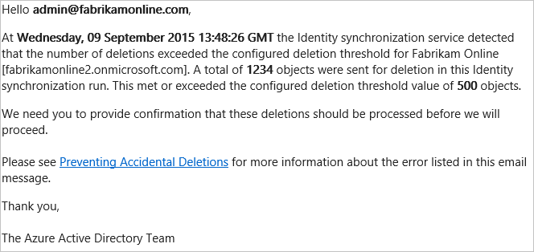

<properties
   pageTitle="Azure AD Connect 同步：防止意外删除 | Windows Azure"
   description="本主题说明 Azure AD Connect 中的防止意外删除功能。"
   services="active-directory"
   documentationCenter=""
   authors="AndKjell"
   manager="msStevenPo"
   editor=""/>

<tags
   ms.service="active-directory"

   ms.date="09/09/2015"
   ms.author="01/29/2016"/>

# 防止意外删除
本主题说明 Azure AD Connect 中的防止意外删除功能。

安装 Azure AD Connect 时，会按默认启用防止意外删除功能，并将其配置为不允许超过 500 个删除项目的导出。此功能旨在防止配置及本地目录发生意外更改，因为这会影响大量的用户。

可以使用 PowerShell 的 `Enable-ADSyncExportDeletionThreshold` 进行更改的默认值是 500 个对象。应将此值配置为符合组织的大小。由于同步计划程序每隔 3 小时运行一次，因此该值是 3 个小时内看到的删除数目。

启用此功能后，如果暂存了太多的要导出到 Azure AD 的删除项目，就不会继续导出，并且你会收到一封内容如下所示的电子邮件：

如果这是意外情况，请进行调查，并采取纠正措施。若要查看哪些对象即将被删除，请执行以下操作：

1. 从“开始”菜单启动“同步服务”。
2. 转到“连接器”。
3. 选择 **Azure Active Directory** 类型的连接器。
4. 在右侧的“操作”下，选择“搜索连接器空间”。
5. 在“范围”下的弹出框中选择“连接断开起始时间”，并选择过去的一个时间。单击“搜索”。此时将提供所有即将被删除的对象视图。单击每个项可以获取有关该对象的更多信息。你也可以单击“列设置”，以添加要在网格中显示的其他属性。

如果想要查看所有删除项，请执行以下操作：

1. 若要暂时禁用此保护并允许删除这些项，请运行 PowerShell cmdlet：`Disable-ADSyncExportDeletionThreshold`
2. 如果 Azure Active Directory 连接器仍被选中，请选择“运行”操作，再选择“导出”。
3. 若要重新启用保护，请运行 PowerShell cmdlet：`Enable-ADSyncExportDeletionThreshold`

## 后续步骤

若要深入了解 Azure AD Connect 同步的配置，请参阅[ Azure AD Connect 同步](/documentation/articles/active-directory-aadconnectsync-whatis)。

<!---HONumber=74-->