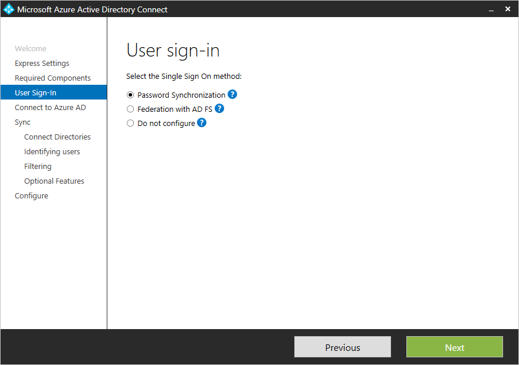
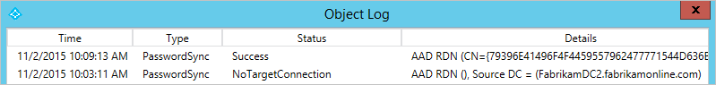

<properties
	pageTitle="Azure AD Connect 同步 - 实现密码同步 | Microsoft Azure"
	description="为你提供需要了解密码同步的工作原理以及如何在你的环境中启用它的信息。"
	services="active-directory"
	documentationCenter=""
	authors="markusvi"
	manager="stevenpo"
	editor=""/>

<tags
	ms.service="active-directory"
	ms.date="11/16/2015"
	wacn.date="02/25/2016"/>


# Azure AD Connect 同步：实现密码同步

在实现密码同步的情况下，你能够使你的用户使用他们用于登录到你的本地 Active Directory 的相同密码登录到 Azure Active Directory。

本主题旨在为你提供需要了解密码同步的工作原理以及如何在你的环境中启用它的信息。

## 什么是密码同步

密码同步是 Azure Active Directory Connect Synchronization Services (Azure AD Connect Sync) 的一项功能，使用此功能可以将本地 Active Directory 的用户密码同步到 Azure Active Directory (Azure AD)。利用此功能，你的用户通过使用他们用于登录到你的本地网络的相同密码，能够登录到他们的 Azure Active Directory 服务（如 Office 365、Microsoft Intune 和 CRM Online）。

> [AZURE.NOTE] 有关为 FIPS 和密码同步配置的 Active Directory 域服务的更多详细信息，请参阅[密码同步和 FIPS](#password-synchronization-and-fips)。

### 密码同步的可用性

Azure Active Directory 的任何客户都有资格运行密码同步。有关密码同步和其他功能（例如联合身份验证）的兼容性的信息，请参阅以下内容。

### 密码同步的工作原理

密码同步是由 Azure AD Connect Sync 实现的目录同步功能的扩展。因此，此功能要求你在本地和 Azure Active Directory 之间配置目录同步。

Active Directory 域服务以实际用户密码的哈希值表示形式存储密码。密码哈希不能用于登录到你的本地网络。还对其进行了设计，以便不能为了获得用户的纯文本密码访问权限而将其撤销。若要同步密码，Azure AD connect Sync 则提取本地 Active Directory 中的用户密码哈希。同步到 Azure Active Directory 身份验证服务之前，已对密码哈希应用其他安全处理。密码同步过程的实际数据流等同于用户数据（例如 DisplayName 或电子邮件地址）的同步。

密码的同步频率高于其他属性的标准目录同步窗口。密码基于每个用户进行同步，并且通常按时间顺序同步。当用户的密码从本地 AD 同步到云时，则会覆盖现有的云密码。

当首次启用密码同步功能时，它会将范围内的所有用户的密码从本地 Active Directory 初始同步到 Azure Active Directory。不能显式定义将其密码同步到云的一组用户。随后，当本地用户已更改密码时，大多数情况下在几分钟内，密码同步功能会检测并同步已更改的密码。密码同步功能会自动重试失败的用户密码同步。如果尝试同步密码期间出现错误，该错误会被记录在事件查看器中。

同步密码对当前登录的用户没有任何影响。如果登录到云服务的用户也更改本地密码，云服务会话则会不间断的继续。但是，只要该云服务需要用户重新进行身份验证，就需要提供新密码。此时，要求用户提供新密码，即最近已从本地 Active Directory 同步到云的密码。

> [AZURE.NOTE] 只有 Active Directory 的对象类型用户才支持密码同步。不支持 iNetOrgPerson 对象类型。

### 密码同步在 Azure AD 域服务中的工作原理

如果在 Azure AD 中启用此服务，则需要使用密码同步选项才能获取单一登录体验。启用此服务后，密码同步的行为将发生更改，而密码哈希将按原样从本地 Active Directory 同步到 Azure AD 域服务。此功能类似于 ADMT（Active Directory 迁移工具），可让 Azure AD 域服务使用本地 AD 中提供的所有方法对用户进行身份验证。

### 安全注意事项

同步密码时，用户的纯文本版本的密码既不能向密码同步功能公开，也不能向 Azure AD 或任何相关联的服务公开。

此外，对于本地 Active Directory 以可撤消的加密格式存储密码没有任何要求。Active Directory 密码哈希摘要用于本地 AD 和 Azure Active Directory 之间的传输。密码哈希摘要不能用于访问客户的本地环境中的资源。

### 密码策略注意事项

有两种类型的密码策略受启用密码同步的影响：

1. 密码复杂性策略
2. 密码过期策略

### 密码复杂性策略

当启用密码同步时，本地 Active Directory 中配置的密码复杂性策略会覆盖云中可能为同步的用户定义的任何复杂性策略。这意味着客户的本地 Active Directory 环境中的任何有效密码都可用于访问 Azure AD 服务。

> [AZURE.NOTE] 直接在云中创建的用户的密码仍受到云中定义的密码策略的约束。

**密码过期策略**

如果用户属于密码同步的范围，云帐户密码则设置为“永不过期”。这意味着用户的密码可能在本地环境中过期，但他们可以使用这个过期的密码继续登录到云服务。

云密码将在下次用户在本地环境中更改密码时更新。

### 覆盖已同步的密码

管理员可以使用 Azure Active Directory PowerShell 手动重置用户的密码。

在这种情况下，新密码会覆盖用户的已同步密码，并且在云中定义的所有密码策略都会应用于新的密码。

如果用户再次更改本地密码，新密码则会同步到云，并会手动覆盖更新的密码。


## 准备密码同步


### <a name="trigger-a-full-sync-of-all-passwords"></a>启用密码同步

如果在安装 Azure AD Connect 时使用了快速设置，则已按默认启用密码同步。

如果在安装 Azure AD Connect 时使用了自定义设置，则必须在用户登录页上启用密码同步。


如果选择使用“使用 AD FS 进行联合身份验证”，则可以选择性地启用密码同步作为在 AD FS 基础结构发生故障时的备用身份验证方式。如果你打算使用 Azure AD 域服务，也可以启用密码同步。

### <a name="password-synchronization-and-fips"></a>密码同步和 FIPS

如果已经根据 FIPS（美国联邦信息处理标准）锁定服务器，则已禁用 MD5。若要为密码同步启用 FIPS，请在 C:\\Program Files\\Azure AD Sync\\Bin 中的 miiserver.exe.config 内添加 enforceFIPSPolicy 键。

```
<configuration>
    <runtime>
        <enforceFIPSPolicy enabled="false"/>
    </runtime>
</configuration>
```

可以在该配置文件的末尾找到配置/运行时节点。

有关安全性与 FIPS 的信息，请参阅 [AAD 密码同步、加密和 FIPS 合规性](http://blogs.technet.com/b/ad/archive/2014/06/28/aad-password-sync-encryption-and-and-fips-compliance.aspx)

## 管理密码同步

### 排查密码同步问题

启动“同步服务管理器”，打开“连接器”，选择用户所在的 Active Directory 连接器，选择“搜索连接器空间”，然后找到你要查找的用户。


在“用户”上，选择“沿袭”选项卡，并确保至少有一个同步规则的“密码同步”显示为 **True**。使用默认配置时，这是名为 **In from AD - User AccountEnabled** 的同步规则。

若要查看对象的密码同步详细信息，请单击此页面底部的“日志...”按钮。这会在此页面中显示过去一周用户的密码同步状态的历史视图。



状态列可能包含以下值，其中也会指出问题以及为何未同步密码。

| 状态 | 说明 |
| ---- | ----- |
| 成功 | 已成功同步密码。 |
| FilteredByTarget | 密码设置为“用户在下次登录时必须更改密码”。未同步密码。 |
| NoTargetConnection | Metaverse 或 Azure AD 连接器空间中没有任何对象。 |
| SourceConnectorNotPresent | 在本地 Active Directory 连接器空间中找不到任何对象。 |
| TargetNotExportedToDirectory | 尚未导出 Azure AD 连接器空间中的对象。 |
| MigratedCheckDetailsForMoreInfo | 日志条目创建于版本 1.0.9125.0 之前，并且以其旧状态显示。 |


### <a name="trigger-a-full-sync-of-all-passwords"></a>触发所有密码的完全同步
不应要求强制运行所有密码的完全同步，但如果出于某种原因需要这样做，可以使用以下 PowerShell 命令。

    $adConnector = "<CASE SENSITIVE AD CONNECTOR NAME>"
    $aadConnector = "<CASE SENSITIVE AAD CONNECTOR NAME>"
    Import-Module adsync
    $c = Get-ADSyncConnector -Name $adConnector
    $p = New-Object Microsoft.IdentityManagement.PowerShell.ObjectModel.ConfigurationParameter “Microsoft.Synchronize.ForceFullPasswordSync”, String, ConnectorGlobal, $null, $null, $null
    $p.Value = 1
    $c.GlobalParameters.Remove($p.Name)
    $c.GlobalParameters.Add($p)
    $c = Add-ADSyncConnector -Connector $c
    Set-ADSyncAADPasswordSyncConfiguration -SourceConnector $adConnector -TargetConnector $aadConnector -Enable $false
    Set-ADSyncAADPasswordSyncConfiguration -SourceConnector $adConnector -TargetConnector $aadConnector -Enable $true


## 其他资源

* [Azure AD Connect Sync：自定义同步选项](/documentation/articles/active-directory-aadconnectsync-whatis)
* [将本地标识与 Azure Active Directory 集成](/documentation/articles/active-directory-aadconnect)

<!---HONumber=Mooncake_0215_2016-->