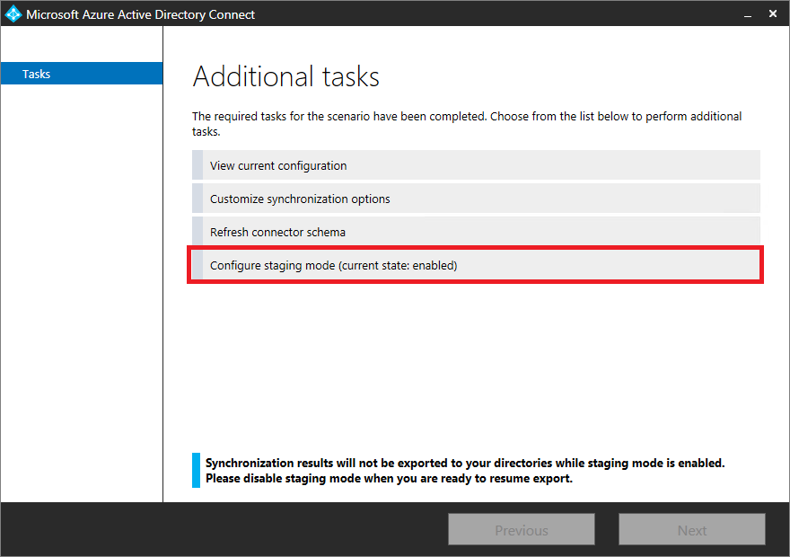

<properties
   pageTitle="Azure AD Connect 同步：操作任务和注意事项 | Azure"
   description="本主题介绍 Azure AD Connect 同步的操作任务，以及如何准备运行此组件。"
   services="active-directory"
   documentationCenter=""
   authors="AndKjell"
   manager="StevenPo"
   editor=""/>

<tags
   ms.service="active-directory"
   ms.date="04/14/2016"
   wacn.date="05/18/2016"/>

# Azure AD Connect 同步：操作任务和注意事项
本主题旨在介绍 Azure AD Connect 同步的操作任务。

## 过渡模式
暂存模式可以用于许多方案，包括：

-	高可用性。
-	测试和部署新的配置更改。
-	引入新的服务器并解除旧服务器。

使用处于暂存模式的服务器，可以在激活服务器之前更改配置和预览更改。它还可让你运行完全导入和完全同步，以便在生产环境中应用更改之前验证所有更改是否符合预期。

可以在安装过程中选择将服务器置于**暂存模式**。这样，便可以激活服务器以便导入和同步，但不会执行任何导出。处于暂存模式的服务器无法运行密码同步或启用密码写回，即使你选择了这些功能。如果你禁用暂存模式，服务器将开始导出并启用密码同步和密码写回（如果已启用）。

处于暂存模式的服务器将继续接收来自 Active Directory 和 Azure AD 的更改。因此你始终都有最新更改的副本，并且可以非常快速地接管另一服务器的责任。如果对主要服务器进行配置更改，则你需要负责对处于暂存模式的服务器进行相同的更改。

对于熟悉旧式同步技术的人员而言，暂存模式是不同的，因为服务器有自身的 SQL 数据库。这样，便可以将暂存模式服务器放置在不同的数据中心。

### 验证服务器的配置
若要应用此方法，请遵循以下步骤：

1. 准备
2. 导入和同步
3. 验证
4. 切换活动服务器

**准备**

1. 安装 Azure AD Connect，选择“暂存模式”，然后取消选择安装向导中最后一页上的“启动同步”。这样便可以手动运行同步引擎。

2. 注销/登录并从“开始”菜单选择“同步服务”。

**导入和同步**

1. 选择“连接器”，并选择第一个 **Active Directory 域服务**类型的连接器。单击“运行”，然后依次选择“完全导入”和“确定”。对这种类型的所有连接器执行此操作。
2. 选择 **Azure Active Directory (Microsoft)** 类型的连接器。单击“运行”，然后依次选择“完全导入”和“确定”。
4. 确保仍然选择“连接器”，并针对每个 **Active Directory 域服务**类型的连接器单击“运行”，然后选择“差异同步”和“确定”。
5. 选择 **Azure Active Directory (Microsoft)** 类型的连接器。单击“运行”，选择“差异同步”，然后选择“确定”。

现在，已将导出更改暂存到 Azure AD 和本地 AD（如果你正在使用 Exchange 混合部署）。接下来的步骤可让你在实际开始导出到目录之前，检查将要更改的内容。

**验证**

1. 启动 cmd 提示符并转到 `%Program Files%\Microsoft Azure AD Sync\bin`
2. 运行：`csexport "Name of Connector" %temp%\export.xml /f:x`  连接器名称可以在同步服务中找到。它的名称类似于“contoso.com – AAD”（表示 Azure AD）。
3. 运行：`CSExportAnalyzer %temp%\export.xml > %temp%\export.csv`
4. 现在在 %temp% 中已经有名称为 export.csv 的文件，可在 Microsoft Excel 中检查。此文件包含将要导出的所有更改。
5. 对数据或配置进行必要的更改并再次运行这些步骤（导入和同步和身份验证），直到要导出的更改都按预期进行。

**了解 export.csv 文件**

大部分的文件都简单易懂。请理解内容中的的一些缩写：

- OMODT – 对象修改类型。指示对象级别的操作是添加、更新还是删除。
- AMODT – 属性修改类型。指示属性级别的操作是添加、更新还是删除。

如果属性值是多值的，则不会显示每项更改。只显示添加和删除值的数目。

**切换活动服务器**

1. 在当前处于活动状态的服务器上，关闭服务器 (DirSync/FIM/Azure AD Sync)，使它不会导出到 Azure AD，或将它设为暂存模式 (Azure AD Connect)。
2. 在处于“暂存模式”的服务器上运行安装向导，然后禁用“暂存模式”。

## 灾难恢复
实现设计的一部分是规划在灾难中失去同步服务器时如何应对。有不同的模型可用，要使用哪一种模型取决于许多因素，包括：

-	停机期间无法对 Azure AD 中的对象进行更改的容限度如何？
-	如果使用密码同步，用户是否接受他们在本地更改时必须在 Azure AD 中使用旧密码？
-	是否对实时操作具有依赖性，例如密码写回？

根据这些问题的回答和组织的策略，实施下列其中一个策略：

-	根据需要重建。
-	具有备用的待机服务器（称为**暂存模式**）。
-	使用虚拟机

由于 Azure AD Connect 同步对 SQL 数据库有依赖性，如果不使用包含在 Azure AD Connect 中的 SQL Express，则还应该查看“SQL 高可用性”部分。

### 根据需要重建
必要时规划服务器重建为可行的策略。在许多情况下，安装同步引擎并运行初始导入，同步可以在几个小时内完成。如果没有可用的备用服务器，则可以暂时使用域控制器托管同步引擎。

同步引擎服务器不存储有关对象的任何状态，因此可以从 Active Directory 与 Azure AD 中的数据重建数据库。**sourceAnchor** 属性可用于联接来自本地和云的对象。如果重建包含本地与云中现有对象的服务器，同步引擎的重新安装符合这些项目。需要记录和保存的内容是对服务器进行的配置更改，例如筛选和同步规则。这些内容必须在开始同步之前重新应用。

### 具有备用的待机服务器 - 暂存模式
如果你的环境更复杂，我们建议你使用一个或多个待机服务器。可以在安装过程中启用服务器的**暂存模式**。

有关详细信息，请参阅[暂存模式](#staging-mode)。

### 使用虚拟机
常用的受支持方法是在虚拟机中运行同步引擎。如果主机有问题，可将包含同步引擎服务器的映像迁移到另一个服务器。

### SQL 高可用性
如果未使用 Azure AD Connect 随附的 SQL Server Express，你还应考虑 SQL Server 的高可用性。唯一受支持的高可用性解决方案是 SQL 群集。不支持的解决方案包括镜像和 Always On。

## 后续步骤
了解有关 [Azure AD Connect 同步](/documentation/articles/active-directory-aadconnectsync-whatis/)配置的详细信息。

了解有关[将本地标识与 Azure Active Directory 集成](/documentation/articles/active-directory-aadconnect/)的详细信息。

<!---HONumber=Mooncake_0606_2016-->