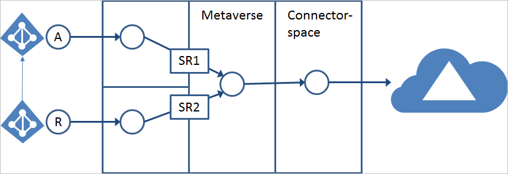
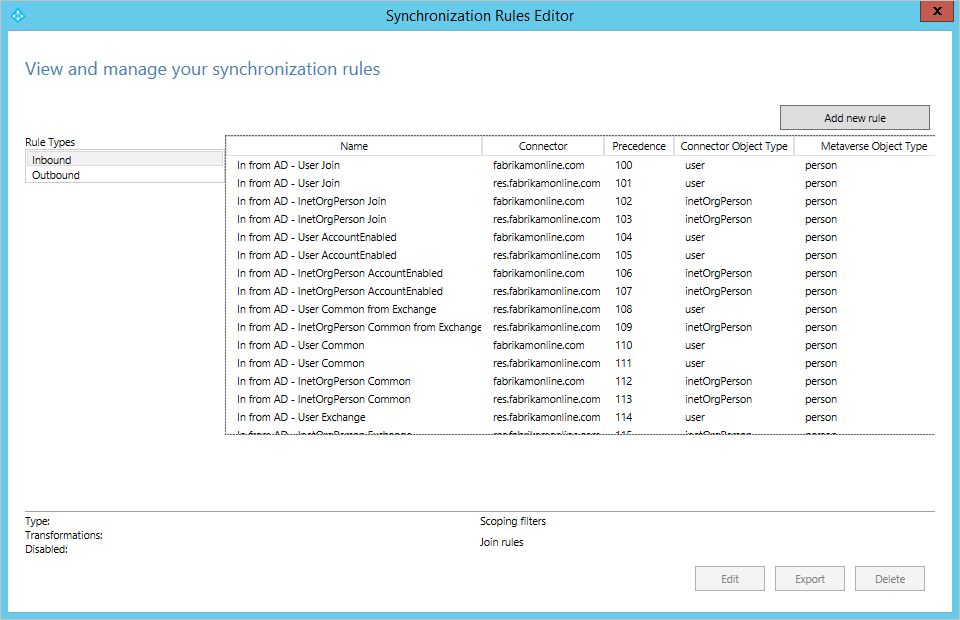
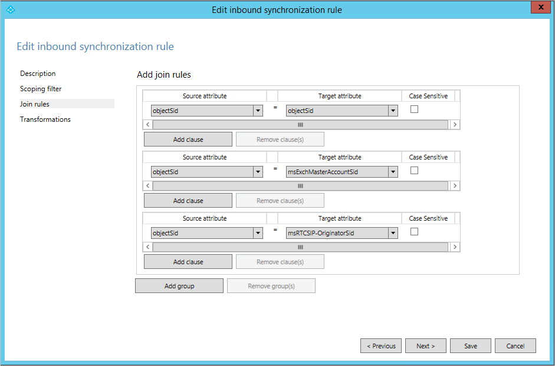
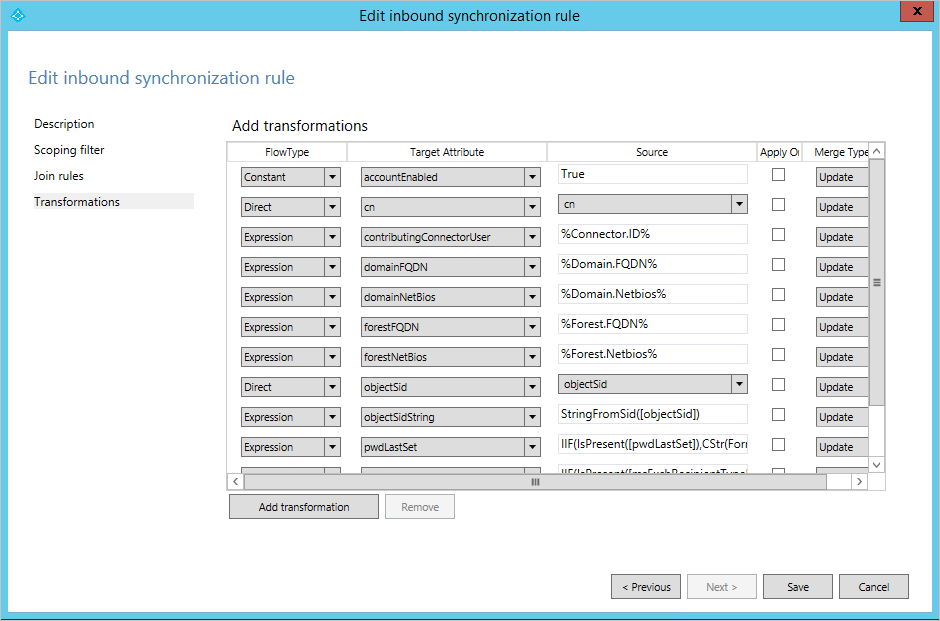

<properties
    pageTitle="Azure AD Connect 同步：了解默认配置 | Azure"
    description="本文介绍 Azure AD Connect 同步中的默认配置。"
    services="active-directory"
    documentationCenter=""
    authors="andkjell"
    manager="stevenpo"
    editor=""/>

<tags
   ms.service="active-directory"
   ms.date="04/25/2016"
   wacn.date="06/24/2016"/>

# Azure AD Connect 同步：了解默认配置

本文介绍现成的配置规则。其中将会说明这些规则及其对配置将有何影响。此外还将引导你完成 Azure AD Connect 同步的默认配置。其目的是让读者了解配置模型（名为声明性预配）在实际示例中的运行情形。本文假设你已使用安装向导安装并配置了 Azure AD Connect 同步。

## 从本地到 Azure AD 的现成规则

现成的配置中包含以下表达式。

规则同时表示为必须满足的规则以及应筛选的对象（如果满足规则，则**不会**同步）。

### 用户的现成规则

这些规则也适用于 iNetOrgPerson 对象类型。

用户对象必须满足以下条件才进行同步：

- 必须具有 sourceAnchor。
- 在 Azure AD 中创建对象之后，无法更改 sourceAnchor。如果值在本地更改，对象将停止同步，直到 sourceAnchor 重新改回到原先的值。
- 必须填充 accountEnabled (userAccountControl) 属性。在本地 Active Directory 中始终有此属性存在，并且进行填充。

以下用户对象**不会**同步到 Azure AD：

- `IsPresent([isCriticalSystemObject])`。确保不会同步 Active Directory 中的多个现成对象（例如内置的管理员帐户）。
- `IsPresent([sAMAccountName]) = False`。确定不会同步没有 sAMAccountName 属性的用户对象。这实际上只发生在从 NT4 升级的域中。
- `Left([sAMAccountName], 4) = "AAD_"`, `Left([sAMAccountName], 5) = "MSOL_"`。不同步 Azure AD Connect Sync 和早期版本使用的服务帐户。
- 不同步不在 Exchange Online 中运行的 Exchange 帐户。
    - `[sAMAccountName] = "SUPPORT_388945a0"`
    - `Left([mailNickname], 14) = "SystemMailbox{"`
    - `(Left([mailNickname], 4) = "CAS_" && (InStr([mailNickname], "}") > 0))`
    - `(Left([sAMAccountName], 4) = "CAS_" && (InStr([sAMAccountName], "}")> 0))`
- 不同步不在 Exchange Online 中运行的对象。`CBool(IIF(IsPresent([msExchRecipientTypeDetails]),BitAnd([msExchRecipientTypeDetails],&H21C07000) > 0,NULL))` 此位掩码 (&H21C07000) 将筛选掉以下对象：
    - 支持邮件的公共文件夹
    - 系统助理邮箱
    - 邮箱数据库邮箱（系统邮箱）
    - 通用安全组（不适用于用户，但由于历史原因而存在）
    - 非通用组（不适用于用户，但由于历史原因而存在）
    - 邮箱计划
    - 发现邮箱
- `CBool(InStr(DNComponent(CRef([dn]),1),"\\0ACNF:")>0)`。不同步任何复制牺牲者对象。

适用的属性规则如下：

- `sourceAnchor <- IIF([msExchRecipientTypeDetails]=2,NULL,..)`。sourceAnchor 属性不会从链接的邮箱提供。根据假设，如果已找到链接的邮箱，实际的帐户将在稍后添加。
- 仅当属性 **mailNickName** 有值时，才同步 Exchange 的相关属性。
- 如果有多个林，将按以下顺序使用属性：
    - 登录的相关属性（例如 userPrincipalName）将从具有已启用帐户的林提供。
    - 可以在 Exchange GAL（全局地址列表）中找到的属性，将从具有 Exchange 邮箱的林提供。
    - 如果找不到邮箱，这些属性可来自于任何林。
    - Exchange 的相关属性从 `mailNickname ISNOTNULL` 的林提供。
    - 如果有多个林匹配其中一个规则，将使用连接器（林）的创建顺序（日期/时间）来确定属性将由哪个林提供。

### 联系人的现成规则

联系人对象必须满足以下条件才进行同步：

- 联系人必须已启用邮件。这可以使用以下规则来验证：
    - `IsPresent([proxyAddresses]) = True)`。必须填充 proxyAddresses 属性。
    - 可在 proxyAddresses 属性或 mail 属性中找到主要电子邮件地址。前置的 @ 可用于验证内容是否为电子邮件地址。以下两项之一必须求值为 True。
        - `(Contains([proxyAddresses], "SMTP:") > 0) && (InStr(Item([proxyAddresses], Contains([proxyAddresses], "SMTP:")), "@") > 0))`。是否有包含 "SMTP:" 的项目，如果有，是否可在字符串中找到 @？
        - `(IsPresent([mail]) = True && (InStr([mail], "@") > 0)`。是否已填充邮件属性，如果是，是否可在字符串中找到 @？

以下联系人对象**不会**同步到 Azure AD：

- `IsPresent([isCriticalSystemObject])`。确保不会同步标记为关系的联系人对象。不应是任何使用默认配置的项。
- `((InStr([displayName], "(MSOL)") > 0) && (CBool([msExchHideFromAddressLists])))`。
- `(Left([mailNickname], 4) = "CAS_" && (InStr([mailNickname], "}") > 0))`。这些项无法在 Exchange Online 中运行。
- `CBool(InStr(DNComponent(CRef([dn]),1),"\\0ACNF:")>0)`。不同步任何复制牺牲者对象。

### 组的现成规则

组对象必须满足以下条件才进行同步：

- 成员必须少于 50,000 个。这将统计为本地组中的成员数目。
    - 如果组在首次同步启动之前包含更多的成员，该组将不同步。
    - 如果成员数目在组最初创建之后有所增加，在达到 50,000 个成员时，组将停止同步，直到成员资格计数再次低于 50,000。
    - 注意：Azure AD 也强制实施 50,000 个成员身份计数。你将无法同步包含更多成员的组，即使修改或删除此规则，也是如此。
- 如果组是**通讯组**，则也必须启用邮件。请参阅[联系人的现成规则](#contact-out-of-box-rules)，以了解强制实施此规则的情况。

以下组对象**不会**同步到 Azure AD：

- `IsPresent([isCriticalSystemObject])`。确保不会同步 Active Directory 中的多个现成对象（例如内置的管理员组）。
- `[sAMAccountName] = "MSOL_AD_Sync_RichCoexistence"`。DirSync 使用的传统组。
- `BitAnd([msExchRecipientTypeDetails],&amp;H40000000)`。角色组。
- `CBool(InStr(DNComponent(CRef([dn]),1),"\\0ACNF:")>0)`。不同步任何复制牺牲者对象。

### ForeignSecurityPrincipal 现成规则

FSP 联接到 Metaverse 中的“任何”（*）对象。这实际上只发生在用户和安全组上。这可确保解析并在 Azure AD 中正确显示跨林成员身份。

### 计算机现成规则

计算机对象必须满足以下条件才进行同步：

- `userCertificate ISNOTNULL`。只有 Windows 10 计算机对象填充此属性。所有具有此属性值的计算机对象都进行同步。

## 了解现成的规则方案

在本示例中，我们将使用具有一个帐户林(A) 、一个资源林 (R) 和一个 Azure AD 目录的部署。

在此配置中，我们假设在帐户林中找到已启用的帐户，并在具有链接邮箱的资源林中找到已禁用的帐户。

我们使用默认配置的目的是：

- 登录的相关属性信息将从林与已启用的帐户同步。
- 可以在 GAL（全局地址列表）中找到的属性从林与邮箱同步。如果找不到邮箱，将使用任何其他林。
- 如果找到链接的邮箱，则要导出到 Azure AD 的对象必须有已链接并启用的帐户。

### 同步规则编辑器

可以使用同步规则编辑器 (SRE) 工具来查看和更改配置，你可以在开始菜单中找到其快捷方式。

SRE 是一个资源套件工具，将随 Azure AD Connect 同步一起安装。你必须是 ADSyncAdmins 组的成员才能启动它。该工具启动时将显示以下屏幕：

在此窗格中，你将看到所有为配置创建的同步规则。表中的每一行代表一个同步规则。“规则类型”的左下侧列出了两种不同的类型：“入站”和“出站”。入站和出站来自 Metaverse 视图。在本概述中我们将主要介绍入站规则。同步规则的实际列表将取决于在 AD 中检测到的架构。在上图中，帐户林 (fabrikamonline.com) 没有任何服务（如 Exchange 和 Lync），并且未为这些服务创建任何同步规则。但在资源林 (res.fabrikamonline.com) 中，我们将找到这些服务的同步规则。规则的内容将因检测到的版本而异。例如，在使用 Exchange 2013 的部署中，我们将配置多于 Exchange 2010 和 Exchange 2007 部署的属性流。

### 同步规则

满足条件时，同步规则是具有一组流动属性的配置对象。它还用于描述连接器空间中对象与 Metaverse 中对象的相关性，这种相关性称为**联接**或**匹配**。同步规则具有优先级值，该优先级指示这些规则彼此的相关性。优先级数值较小的同步规则具有较高的优先级，当属性流发生冲突时，较高的优先级会赢得冲突解决方案。

举例来说，我们将查看同步规则“In from AD – User AccountEnabled”。我们将在 SRE 中标记此行，并选择“编辑”。

由于这是一条现成的规则，因此在打开该规则时将看到警告。你不应该[对现成规则进行任何更改](/documentation/articles/active-directory-aadconnectsync-best-practices-changing-default-configuration/)，因此系统会询问你的意图为何。在本例中，你只想要查看规则，因此请选择“否”。

同步规则具有四个配置部分：“描述”、“范围筛选器”、“联接规则”和“转换”。

#### 说明

第一部分提供名称和描述等基本信息。

还可以找到以下相关信息：此规则与哪个已连接系统相关、此规则适合于已连接系统中的哪种对象类型，以及 Metaverse 对象类型。无论源对象类型是用户、iNetOrgPerson 还是联系人，Metaverse 对象类型始终是人。Metaverse 对象类型应该永不更改，因此将它创建为泛型类型。可以将链接类型设置为“联接”、“StickyJoin”或“设置”。此设置将与“联接规则”部分协同工作，我们将稍后介绍此方面的内容。

你还可以看到此同步规则用于密码同步。如果用户在此同步规则的范围内，密码将从本地同步到云（假设已启用密码同步功能）。

#### 范围筛选器

“范围筛选器”部分用于配置同步规则何时适用。由于我们正在查看的同步规则的名称指示只应对已启用的用户应用该规则，因此对范围进行了配置，使得 AD 属性 **userAccountControl** 不能对 2 这个位进行设置。当我们在 AD 中找到用户时，如果 **userAccountControl** 设置为十进制值 512（已启用的普通用户），则我们将应用此同步规则，但如果我们找到的用户的 **userAccountControl** 设置为 514（已禁用的普通用户），则此规则将不适用。

范围筛选器具有可以嵌套的组和子句。必须满足组内所有子句的条件，才能应用同步规则。如果定义了多个组，则要应用该规则，必须满足至少一个组的条件。也就是说，组之间按逻辑或进行计算，组内按逻辑与进行计算。可以在下面所示的出站同步规则“Out to AAD - Group Join”中找到与此相关的示例。有多个同步筛选器组，例如，一个用于安全组（securityEnabled 等于 True），一个用于分发组（securityEnabled 等于 False）。

此规则用于定义哪些组应设置到 AAD。分发组必须启用邮件，才能与 AAD 同步，但对于安全组，这不是必需的。你还可以看到，很多其他属性也进行了评估。

#### 联接规则

第三部分用于配置连接器空间中的对象与 Metaverse 中的对象的相关性。我们前面讨论过的规则没有针对“联接规则”的任何配置，因此我们现在将讨论“In from AD - User Join”。

联接规则的内容将取决于在安装向导中选择的匹配选项。对于入站规则，评估从源连接器空间中的对象开始，将按顺序对联接规则中的每个组进行评估。如果根据某个联接规则，某个源对象的评估结果是与 Metaverse 中的某个对象完全匹配，则这两个对象将联接在一起。如果已对所有规则进行评估但没有匹配项，则将使用描述页上的“链接类型”。如果此设置设为“设置”，则将在目标（即 Metaverse）中创建一个新对象。将新对象设置到 Metaverse 也称为将对象投影到 Metaverse。

只对联接规则评估一次。当连接器空间对象与 Metaverse 对象联接在一起时，只要仍然满足同步规则的范围，它们就保持联接。

评估同步规则时，必须只有一个定义了联接规则的同步规则在范围内。如果一个对象找到多个包含联接规则的同步规则，则会引发错误。因此最佳做法是，当一个对象有多个同步规则在范围内时，只让一个同步规则有定义的联接。在 Azure Active Directory Sync 的现成配置中，可以通过查看名称并查找在名称末尾带有单词“Join”的规则，来找到这些规则。如果另一个同步规则将对象联接在一起或在目标中设置了新对象，则未定义任何联接规则的同步规则将应用属性流。

查看上图，你可以看到规则尝试将 **objectSID** 与 **msExchMasterAccountSid** (Exchange) 和 **msRTCSIP-OriginatorSid** (Lync) 相联接，而这正是我们在帐户资源林拓扑中所预期的。我们发现所有林具有相同的规则，也就是说，我们可以假设每个林可能是帐户或资源林。如果有帐户存在于单个林中，且不需要联接，这项假设也将适用。

#### 转换

“转换”部分定义当对象已联接且满足范围筛选器时，将应用于目标对象的所有属性流。回到“In from AD - User AccountEnabled”同步规则，我们将找到以下转换：

将这个放在帐户-资源林部署的上下文中考虑时，则应在帐户林中找到已启用的帐户，并在具有 Exchange 和 Lync 设置的资源林中找到已禁用的帐户。我们所讨论的同步规则包含进行登录所需的属性，我们希望这些属性从找到已启用帐户的林流动。所有这些属性流将在一个同步规则中进行组合。

转换可以具有不同的类型：“常量”、“直接”和“表达式”。

- 常量流将始终传递某个特定值，在上面的例子中，我们在名为 accountEnabled 的 Metaverse 属性中始终设置值 True。
- 直接流会将源中的属性值传递到目标属性。
- 第三种流类型是“表达式”，它允许进行更高级的配置。

表达式语言是 VBA (Visual Basic for Applications)，因此具有 Microsoft Office 或 VBScript 经验的用户会认识该格式。属性将括在方括号内，如 [attributeName]。属性名称和函数名称是区分大小写的，但同步规则编辑器将对表达式求值并在表达式无效时提供警告。所有表达式都使用嵌套函数表示在一行上。为了显示配置语言的强大功能，下面给出了 pwdLastSet 流的示例，但插入了附加注释：

		
		// If-then-else
		IIF(
		// (The evaluation for IIF) Is the attribute pwdLastSet present in AD?
		IsPresent([pwdLastSet]),
		// (The True part of IIF) If it is, then from right to left, convert the AD time format to a .Net datetime, change it to the time format used by AAD, and finally convert it to a string.
		CStr(FormatDateTime(DateFromNum([pwdLastSet]),"yyyyMMddHHmmss.0Z")),
		// (The False part of IIF) Nothing to contribute
		NULL
		)

有关转换的主题涉及面很大，它占 Azure AD Connect 同步的可能自定义配置的很大一部分。可以在 Azure AD Connect 同步的其他文档中找到详细信息。

### 优先级

我们已探讨一些个别的同步规则，但这些规则在配置中配合运行。在某些情况下，属性值由相同目标属性的多个同步规则提供。在此情况下，即可使用属性优先级来确定哪个属性将胜出。例如，让我们看看属性 sourceAnchor。此属性是能否登录 Azure AD 的重要属性。我们可以在两个不同的同步规则中看到此属性的属性流：“In from AD – User AccountEnabled”和“In from AD – User Common”。由于有同步规则优先级，如果有多个对象联接到 Metaverse 对象，sourceAnchor 属性将先由具有已启用帐户的林提供。如果没有已启用的帐户，我们将使用全部提取同步规则“In from AD – User Common”。这可确保即使对于已禁用的帐户，我们仍可提供 sourceAnchor。

同步规则的优先级由安装向导设置在组中。组中的规则具有相同的名称，但连接到不同的连接目录。安装向导将最高优先级提供给规则“In from AD – User Join”，并迭代所有连接的 AD 目录。接下来，它以预定义的顺序继续处理后续规则组。在组中，将以在向导中添加连接器的顺序来添加规则。如果通过向导添加其他连接器，同步规则将重新排序，新的连接器规则将插到每个组中的末尾。

### 汇总

我们现在对同步规则已有足够的认识，能够了解配置如何在不同的同步规则下运行。如果我们观察某个用户和提供给 Metaverse 的属性，会发现规则将按以下顺序应用：

| 名称 | 注释 |
| :------------- | :------------- |
| In from AD – User Join | 联接连接器空间对象与 Metaverse 的规则。 |
| In from AD – UserAccount Enabled | 登录 Azure AD 和 Office 365 所需的属性。我们可以从已启用的帐户获取这些属性。 |
| In from AD – User Common from Exchange | 在全局地址列表中找到的属性。我们假设用户邮箱所在的林中具有最佳的数据质量。 |
| In from AD – User Common | 在全局地址列表中找到的属性。如果找不到邮箱，可由任何其他联接对象提供属性值。 |
| In from AD – User Exchange | 仅当检测到 Exchange 时才存在。将流送所有基础结构 Exchange 属性。 |
| In from AD – User Lync | 仅当检测到 Lync 时才存在。将流送所有基础结构 Lync 属性。 |

## 其他资源

* [Azure AD Connect Sync：自定义同步选项](/documentation/articles/active-directory-aadconnectsync-whatis/)
* [将本地标识与 Azure Active Directory 集成](/documentation/articles/active-directory-aadconnect/)

<!---HONumber=Mooncake_0606_2016-->