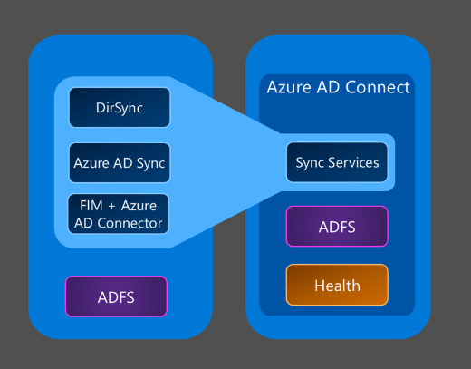

<properties
	pageTitle="Azure AD Connect Sync 方案概述"
	description="说明 Azure AD Connect Sync 中的用户和联系人。"
	services="active-directory"
	documentationCenter=""
	authors="markusvi"
	manager="swadhwa"
	editor=""/>

<tags 
	ms.service="active-directory"
	ms.date="07/27/2015"
	wacn.date="01/29/2016"/>

# Azure AD Connect Sync：自定义同步选项

Azure Active Directory Connect Synchronization Services (Azure AD Connect Sync) 是 Azure AD Connect 的一个主要组件，负责与本地环境和云中 Azure AD 之间同步标识数据相关的所有操作。从同步角度来看，Azure AD Connect Sync 是 DirSync、Azure AD Sync 和 Forefront Identity Manager 的后继版本，同时配置了 Active Directory 连接器。

 

本主题的目标是为你提供与 Auzre AD Connect Sync 相关的主题的链接。

接下来要做什么？：

- 有关技术概念的概述，请参阅[技术概念](/documentation/articles/active-directory-aadconnectsync-technical-concepts)。
- 有关 Azure AD Connect 同步支持的拓扑和方案概述，请参阅 [Azure AD Connect 的拓扑](/documentation/articles/active-directory-aadconnect-topologies)。
- 如果你想要了解如何实现筛选，请参阅[配置筛选](/documentation/articles/active-directory-aadconnectsync-configure-filtering)。
- 如果你想要了解有关密码同步的详细信息，请参阅[实现密码同步](/documentation/articles/active-directory-aadconnectsync-implement-password-synchronization)。
- 如果想要了解 Azure AD Connect 同步中的默认配置，请参阅[了解默认配置](/documentation/articles/active-directory-aadconnectsync-understanding-default-configuration)。
- 如果你想要了解有关 Azure AD Connect Sync 中的用户和联系人的详细信息，请参阅[了解用户和联系人](/documentation/articles/active-directory-aadconnectsync-understanding-users-and-contacts)。
- 如果想要更改默认配置，请参阅[更改默认配置的最佳实践](/documentation/articles/active-directory-aadconnectsync-best-practices-changing-default-configuration)
- 如果想要了解有关如何操作同步服务器的详细信息，请参阅[操作任务和注意事项](/documentation/articles/active-directory-aadconnectsync-operations)
- 如果想要了解同步到 Azure AD 的属性，请参阅[同步到 Azure Active Directory 的属性](/documentation/articles/active-directory-aadconnectsync-attributes-synchronized)
- 如果你想要了解有关声明性设置的详细信息，请参阅[了解声明性设置表达式](/documentation/articles/active-directory-aadconnectsync-understanding-declarative-provisioning-expressions)
- 若要探索声明性设置函数，请参阅[函数引用](/documentation/articles/active-directory-aadconnectsync-functions-reference)

## 其他资源

* [将本地标识与 Azure Active Directory 集成](/documentation/articles/active-directory-aadconnect)

<!---HONumber=Mooncake_0215_2016-->