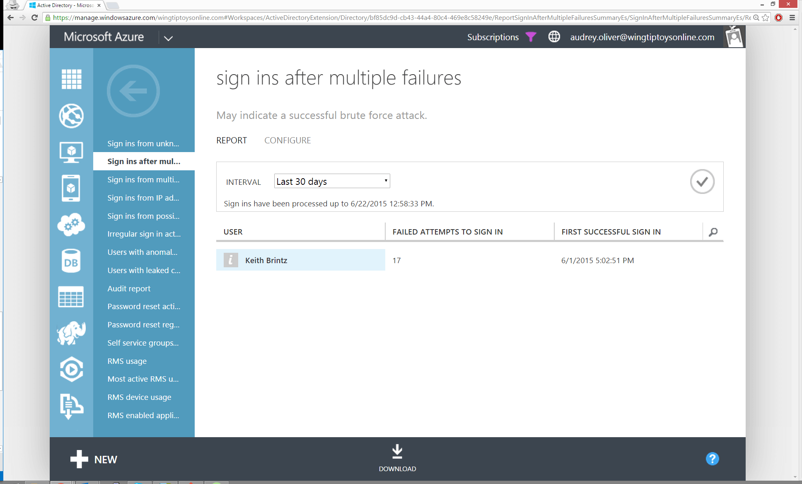

<properties
	pageTitle="多次失败后的登录"
	description="指示在多次连续登录尝试失败后成功登录的用户的报表。"
	services="active-directory"
	documentationCenter=""
	authors="kenhoff"
	manager="ilanas"
	editor=""/>

<tags
	ms.service="active-directory"
	ms.date="07/01/2015"
	wacn.date="08/29/2015"/>

# 多次失败后的登录

| 说明 | 报告位置 |
| :-------------     | :-------        |
| 此报告指示在多次连续登录尝试失败后成功登录的用户。可能的原因包括：<ul><li>用户忘记密码</li><li>用户是成功密码猜测暴力攻击的受害者</li></ul>
来自此报表的结果将显示在成功登录前连续失败的登录次数和与第一次成功登录关联的时间戳。

<b>报表设置</b>：你可以配置在报表中显示连续登录尝试失败次数之前必须至少发生的连续登录尝试失败次数。对此设置进行更改时，必须注意这些更改不会应用于当前报告中显示的任何现有失败登录。但是，这些更改将应用于所有将来的登录。对此报告的更改只能由经过许可的管理员进行。 | “目录”>“报告”选项卡 |

<!---HONumber=67-->