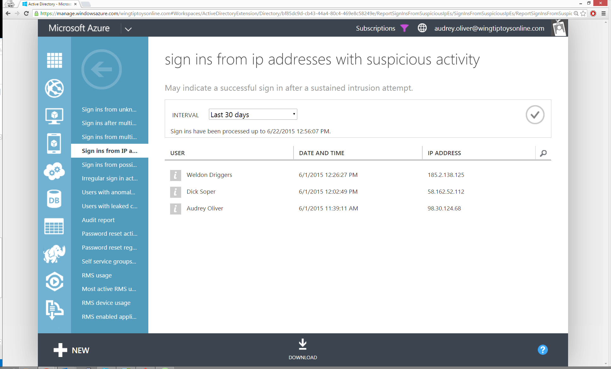

<properties
	pageTitle="从具有可疑活动的 IP 地址登录"
	description="包括从已记录可疑活动的 IP 地址执行的登录尝试的报表。"
	services="active-directory"
	documentationCenter=""
	authors="kenhoff"
	manager="ilanas"
	editor=""/>

<tags
	ms.service="active-directory"
	ms.date="07/01/2015"
	wacn.date="08/29/2015"/>

# 从具有可疑活动的 IP 地址登录

| 说明 | 报告位置 |
| :-------------     | :-------        |
| 
此报表包含从已记录可疑活动的 IP 地址执行的登录尝试。可疑活动包括短时间内来自相同 IP 地址的多次失败的登录尝试，以及其他视为可疑的活动。这可能指示黑客已尝试从此 IP 地址进行登录。

来自此报表的结果将显示来自已记录可疑活动的 IP 地址的登录，以及与登录相关的时间戳。
 | “目录”>“报告”选项卡 |

<!---HONumber=67-->