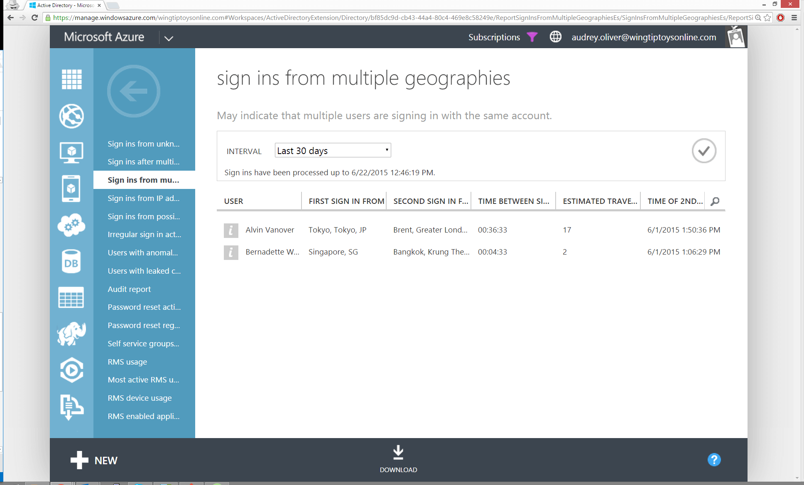

<properties 
	pageTitle="从多个地理位置登录" 
	description="一份报告，其中指出了这样的用户：这些用户有两次登录看起来源自不同区域，并且两次登录之间的时间较短，用户不可能在这段时间内在这两个区域之间移动。" 
	services="active-directory" 
	documentationCenter="" 
	authors="kenhoff" 
	manager="ilanas" 
	editor=""/>

<tags
	ms.service="active-directory"
	ms.date="07/01/2015"
	wacn.date="08/29/2015"/>

# 来自多个地理区域的登录

| 说明 | 报告位置 |
| :-------------     | :-------        |
| 
此报表包括某个用户的成功登录活动，其中两次登录显示为来自不同区域且这两次登录间隔的时间不足以让用户从其中一个区域来到另一个区域。可能的原因包括：
<ul><li>用户正在共享密码</li><li>用户使用远程桌面启动 Web 浏览器进行登录</li><li>黑客已从不同国家/地区登录到该用户帐户。</li></ul>
来自此报表的结果将为你显示成功的登录活动以及两次登录间隔的时间、这些登录似乎源自的区域以及在这两个区域之间往返所需的估计时间。

显示的往返时间仅是估计值，可能不同于在这两个地点之间往返所需的实际时间。而且，不为两个邻近区域之间的登录生成事件。
 | “目录”>“报告”选项卡 |

<!---HONumber=67-->