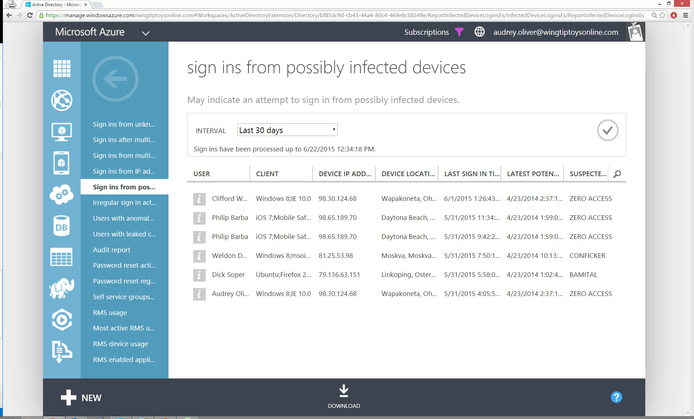

<properties
	pageTitle="从可能受感染的设备登录"
	description="包括已从某些恶意软件（恶意软件）的设备执行登录的报表。"
	services="active-directory"
	documentationCenter=""
	authors="kenhoff"
	manager="ilanas"
	editor=""/>

<tags
	ms.service="active-directory"
	ms.date="07/13/2015"
	wacn.date="08/29/2015"/>

# 从可能受感染的设备登录

| 说明 | 报告位置 |
| :-------------     | :-------        |
| 
当你想从可能运行某些恶意软件（恶意软件）的设备查看登录时，使用此报表。我们将登录 IP 地址与尝试联系恶意软件服务器的 IP 地址相关联。

建议：由于此报表假定 IP 地址在这两种情况均与同一设备相关联，我们建议你联系用户并扫描用户的设备进行确认。

有关如何解决恶意软件感染的详细信息，请参阅[恶意软件防护中心](http://go.microsoft.com/fwlink/?linkid=335773)。
 | “目录”>“报告”选项卡 |

<!---HONumber=67-->