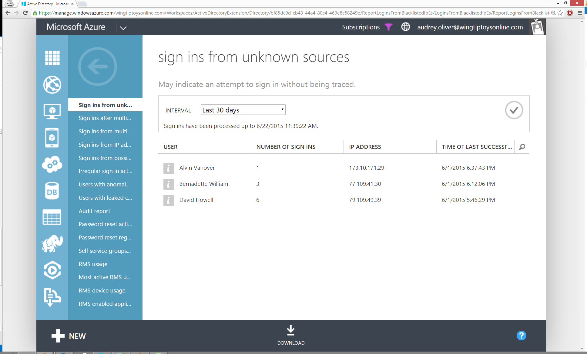

<properties
	pageTitle="来自未知源的登录"
	description="一个指示已成功从匿名代理 IP 地址登录到你的目录的用户的报表。"
	services="active-directory"
	documentationCenter=""
	authors="kenhoff"
	manager="ilanas"
	editor=""/>

<tags
	ms.service="active-directory"
	ms.date="07/01/2015"
	wacn.date="08/29/2015"/>

# 来自未知源的登录

| 说明 | 报告位置 |
| :-------------     | :-------        |
| 
此报表指示已分配 Microsoft 已识别为匿名代理 IP 地址的客户端 IP 地址时，已成功登录到你的目录的用户。这些代理通常由隐藏了自己计算机的 IP 地址的用户使用，可能用于恶意目的 – 有时黑客使用这些代理。

 来自此报表的结果将显示用户从该地址和代理的 IP 地址成功登录到你的目录的次数。
 | “目录”>“报告”选项卡 |

<!---HONumber=67-->