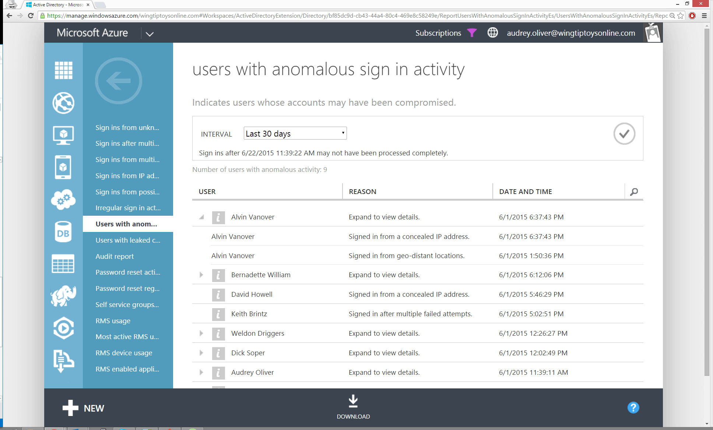

<properties
	pageTitle="具有异常登录活动的用户"
	description="指示标识为异常登录活动的所有用户帐户的报表。"
	services="active-directory"
	documentationCenter=""
	authors="kenhoff"
	manager="ilanas"
	editor=""/>

<tags
	ms.service="active-directory"
	ms.date="07/13/2015"
	wacn.date="08/29/2015"/>

# 具有异常登录活动的用户

| 说明 | 报告位置 |
| :-------------     | :-------        |
| 
当你想查看已标识为异常登录活动的所有用户帐户时，使用此报表。此报表包含来自所有其他异常活动报表的数据。来自此报表的结果将显示有关用户、登录事件被标识为异常的原因、日期和时间的详细信息，以及事件的其他相关信息。
 | “目录”>“报告”选项卡 |

<!---HONumber=67-->