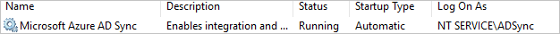
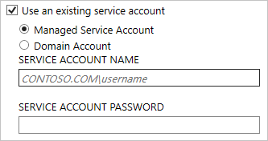
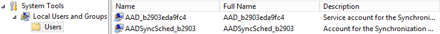
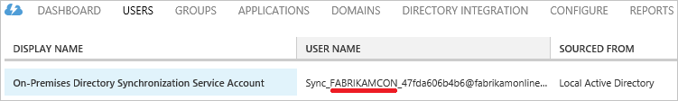
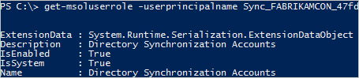

<properties
    pageTitle="Azure AD Connect：帐户和权限 | Azure"
    description="本主题介绍使用和创建的帐户以及所需的权限。"
    services="active-directory"
    documentationcenter=""
    author="billmath"
    manager="femila"
    editor=""
    translationtype="Human Translation" />
<tags
    ms.assetid="b93e595b-354a-479d-85ec-a95553dd9cc2"
    ms.service="active-directory"
    ms.workload="identity"
    ms.tgt_pltfrm="na"
    ms.devlang="na"
    ms.topic="article"
    ms.date="04/04/2017"
    wacn.date="05/02/2017"
    ms.author="billmath"
    ms.sourcegitcommit="78da854d58905bc82228bcbff1de0fcfbc12d5ac"
    ms.openlocfilehash="3752849b27d5952c127534ddbe4d6927257975d4"
    ms.lasthandoff="04/22/2017" />

# Azure AD Connect：帐户和权限
Azure AD Connect 安装向导提供提供两种不同的路径：

- 在“快速设置”中，向导需要更多权限，以便轻松设置配置，而无需创建用户或单独配置权限。
- 在“自定义设置”中，向导提供更多选项；但在某些情况下，需要确保自己拥有正确的权限。

## 相关文档
如果尚未阅读文档了解如何[将本地标识与 Azure Active Directory 集成](/documentation/articles/active-directory-aadconnect/)，请查看下表获取相关主题的链接。

|主题 |链接|
| --- | --- |
|下载 Azure AD Connect | [下载 Azure AD Connect](http://go.microsoft.com/fwlink/?LinkId=615771)|
|使用快速设置安装 | [Azure AD Connect 的快速安装](/documentation/articles/active-directory-aadconnect-get-started-express/)|
|使用自定义设置安装 | [Azure AD Connect 的自定义安装](/documentation/articles/active-directory-aadconnect-get-started-custom/)|
|从 DirSync 升级 | [从 Azure AD 同步工具 (DirSync) 升级](/documentation/articles/active-directory-aadconnect-dirsync-upgrade-get-started/)|
|安装后 | [验证安装并分配许可证 ](/documentation/articles/active-directory-aadconnect-whats-next/)|

## 快速设置安装
在快速设置中，安装向导要求提供 AD DS 企业管理员凭据，以便配置本地 Active Directory，使其具有 Azure AD Connect 所需的权限。 如果从 DirSync 升级，AD DS 企业管理员凭据可用于重置 DirSync 所用帐户的密码。 此外，还需要 Azure AD 全局管理员凭据。

| 向导页 | 收集的凭据 | 所需的权限 | 用途 |
| --- | --- | --- | --- |
| 不适用 |运行安装向导的用户 |本地服务器的管理员 |<li>创建用作 [同步引擎服务帐户](#azure-ad-connect-sync-service-account)的本地帐户。 |
| 连接到 Azure AD |Azure AD 目录凭据 |Azure AD 中的全局管理员角色 |<li>在 Azure AD 目录中启用同步。</li>  <li>创建在 Azure AD 中用于持续同步操作的 [Azure AD 帐户](#azure-ad-service-account)。</li> |
| 连接到 AD DS |本地 Active Directory 凭据 |Active Directory 中企业管理员 (EA) 组的成员 |<li>在 Active Directory 中创建[帐户](#active-directory-account)并向其授予权限。 同步期间，所创建的该帐户将用于读取和写入目录信息。</li> |

### 企业管理员凭据
这些凭据只能在安装期间使用，而不能在安装完成后使用。 由企业管理员而不是域管理员确保可以在所有域中设置 Active Directory 中的权限。

### 全局管理员凭据
这些凭据只能在安装期间使用，而不能在安装完成后使用。 它用于创建 [Azure AD 帐户](#azure-ad-service-account) ，以便将更改同步到 Azure AD。 该帐户还会在 Azure AD 中启用同步作为功能。

### 使用快速设置创建的 AD DS 帐户的权限
如果使用快速设置创建用于在 AD DS 中读取和写入数据的 [帐户](#active-directory-account) ，该帐户将拥有以下权限：

| 权限 | 用途 |
| --- | --- |
| <li>复制目录更改</li><li>复制所有目录更改 |密码同步 |
| 读取/写入所有用户属性 |导入和执行 Exchange 混合部署 |
| 读取/写入所有 iNetOrgPerson 属性 |导入和执行 Exchange 混合部署 |
| 读取/写入所有组属性 |导入和执行 Exchange 混合部署 |
| 读取/写入所有联系人属性 |导入和执行 Exchange 混合部署 |
| 重置密码 |准备启用密码写回 |

## 自定义设置安装
使用自定义设置时，必须在安装之前创建用于连接 Active Directory 的帐户。 授予此帐户的权限可在 [创建 AD DS 帐户](#create-the-ad-ds-account)中找到。

| 向导页 | 收集的凭据 | 所需的权限 | 用途 |
| --- | --- | --- | --- |
| 不适用 |运行安装向导的用户 |<li>本地服务器的管理员</li><li>只有 SQL 中的系统管理员 (SA) 才可使用 SQL Server 完整版。</li> |默认情况下，将创建充当[同步引擎服务帐户](#azure-ad-connect-sync-service-account)的本地帐户。 只有在管理员未指定特定帐户时才创建该帐户。 |
| 安装同步服务，服务帐户选项 |AD 或本地用户帐户凭据 |用户，权限将由安装向导授予 |如果管理员指定了帐户，则此帐户将用作同步服务的服务帐户。 |
| 连接到 Azure AD |Azure AD 目录凭据 |Azure AD 中的全局管理员角色 |<li>在 Azure AD 目录中启用同步。</li>  <li>创建在 Azure AD 中用于持续同步操作的 [Azure AD 帐户](#azure-ad-service-account)。</li> |
| 连接你的目录 |要连接到 Azure AD 的每个林的本地 Active Directory 凭据 |权限将取决于启用的功能，可在 [Create the AD DS account](#create-the-ad-ds-account) |在同步期间，将使用此帐户读取和写入目录信息。 |
| AD FS 服务器 |对于列表中的每个服务器，如果运行向导的用户的登录凭据权限不足，因而无法连接，则向导将会收集凭据 |域管理员 |安装和配置 AD FS 服务器角色。 |
| Web 应用程序代理服务器 |对于列表中的每个服务器，如果运行向导的用户的登录凭据权限不足，因而无法连接，则向导将会收集凭据 |目标计算机上的本地管理员 |安装和配置 WAP 服务器角色。 |
| 代理信任凭据 |联合身份验证服务信任凭据（代理用来注册 FS 信任证书的凭据） |作为 AD FS 服务器本地管理员的域帐户 |初始注册 FS-WAP 信任证书。 |
| “AD FS 服务帐户”页上的“使用域用户帐户选项” |AD 用户帐户凭据 |域用户 |提供了其凭据的 AD 用户帐户将用作 AD FS 服务的登录帐户。 |

### 创建 AD DS 帐户
安装 Azure AD Connect 时，“连接目录”页上指定的帐户必须位于 Active Directory 中且已获得所需权限。 安装向导不会验证权限，任何问题只能在同步期间发现。

需要哪些权限取决于你启用的可选功能。 如果你有多个域，则必须对林中的所有域授予权限。 如果未启用任何一项功能，默认的 **域用户** 权限就已足够。

| 功能 | 权限 |
| --- | --- |
| 密码同步 |<li>复制目录更改</li>  <li>复制所有目录更改 |
| Exchange 混合部署 |针对用户、组和联系人的属性的写入权限，详见[Exchange 混合写回](/documentation/articles/active-directory-aadconnectsync-attributes-synchronized/#exchange-hybrid-writeback/)。 |

## 升级
从 Azure AD Connect 的一个版本升级到新版本时，需要拥有以下权限：

| 主体 | 所需的权限 | 用途 |
| --- | --- | --- |
| 运行安装向导的用户 |本地服务器的管理员 |更新二进制文件 |
| 运行安装向导的用户 |ADSyncAdmins 的成员 |对同步规则和其他配置进行更改。 |
| 运行安装向导的用户 |如果使用完整 SQL 服务器：需有同步引擎数据库的 DBO 权限（或类似权限） |进行数据库级别的更改，例如使用新列更新表。 |

## 有关所创建帐户的详细信息
### Active Directory 帐户
如果使用快速设置，将在 Active Directory 中创建用于同步的帐户。 创建的帐户位于用户容器的林根域中，其名称前缀为 **MSOL_**。 该帐户带有永不过期的长复杂密码。 如果域中有密码策略，请确保允许此帐户使用长密码和复杂密码。

如果你使用自定义设置，则需要负责在开始安装之前创建帐户。

### Azure AD Connect 同步服务帐户
同步服务可在不同的帐户下运行。 它可以在**虚拟服务帐户** (VSA)、**组托管服务帐户** (gMSA/sMSA) 或普通用户帐户下运行。 执行全新安装时，你会发现支持的选项已随着 2017 年 4 月版 Connect 的发布而发生变化。 如果从早期版本的 Azure AD Connect 升级，这些附加选项将不可用。

| 帐户的类型 | 安装选项 | 说明 |
| --- | --- | --- |
| [虚拟服务帐户](#virtual-service-account) | 2017 年 4 月版和更高版本中的快速和自定义安装 | 此选项用于所有快速安装，但域控制器上的安装除外。 对于自定义安装，除非使用了其他选项，否则此选项是默认选项。 |
| [组托管服务帐户](#group-managed-service-account) | 2017 年 4 月版和更高版本中的自定义安装 | 如果你使用远程 SQL 服务器，则我们建议使用组托管服务帐户。 |
| [用户帐户](#user-account) | 2017 年 4 月版和更高版本中的快速和自定义安装 | 仅当在 Windows Server 2008 和域控制器上安装时，才会在安装期间创建带有 AAD_ 前缀的用户帐户。 |
| [用户帐户](#user-account) | 2017 年 3 月版和更低版本中的快速和自定义安装 | 安装期间将创建带有 AAD_ 前缀的本地帐户。 使用自定义安装时，可以指定另一个帐户。 |

如果配合 2017 年 3 月版或更低版本使用 Connect，则不应重置服务帐户中的密码，否则出于安全原因，Windows 会销毁加密密钥。 在不重新安装 Azure AD Connect 的情况下，无法将帐户更改为其他任何帐户。 如果从 2017 年 4 月版或更高版本升级到某个版本，则支持更改服务帐户的密码，但你无法更改使用的帐户。

> [AZURE.IMPORTANT]
> 只能在首次安装时设置服务帐户。 安装完成后，不支持更改服务帐户。

下面是同步服务帐户的默认、建议和支持的选项表格。

图例：

- **粗体**表示默认选项，在大多数情况下也是建议的选项。
- *斜体*指示建议的选项（如果不是默认的选项。
- 2008 - 在 Windows Server 2008 上安装时的默认选项
- 非粗体 - 支持的选项
- 本地帐户 - 服务器上的本地用户帐户
- 域帐户 - 域用户帐户
- sMSA - [独立的托管服务帐户](https://technet.microsoft.com/zh-cn/library/dd548356.aspx)
- gMSA - [组托管服务帐户](https://technet.microsoft.com/zh-cn/library/hh831782.aspx)

| | LocalDB Express | LocalDB/LocalSQL “自定义” | 远程 SQL “自定义” |
| --- | --- | --- | --- |
| **独立/工作组计算机** | 不支持 | **VSA** 本地帐户 (2008) 本地帐户 |  不支持 |
| **已加入域的计算机** | **VSA** 本地帐户 (2008) | **VSA** 本地帐户 (2008) 本地帐户 域帐户 sMSA,gMSA | **gMSA** 域帐户 |
| **域控制器** | **域帐户** | *gMSA* **域帐户** sMSA| *gMSA* **域帐户**|

#### 虚拟服务帐户
虚拟服务帐户是一种特殊类型的帐户，它不带有密码，由 Windows 管理。

VSA 适用于同步引擎与 SQL 位于同一台服务器上的场合。 如果你使用远程 SQL，则我们建议改用[组托管服务帐户](#managed-service-account)。

此功能需要 Windows Server 2008 R2 或更高版本。 如果你在 Windows Server 2008 上安装 Azure AD Connect，则安装将会重新使用[用户帐户](#user-account)。

#### 组托管服务帐户
如果你使用远程 SQL 服务器，则我们建议使用**组托管服务帐户**。 有关如何为组托管服务帐户准备 Active Directory 的详细信息，请参阅[组托管服务帐户概述](https://technet.microsoft.com/zh-cn/library/hh831782.aspx)。

若要使用此选项，请“[安装所需的组件](/documentation/articles/active-directory-aadconnect-get-started-custom/#install-required-components/)”页上选择“使用现有的服务帐户”，然后选择“托管服务帐户”。  
  
也支持使用[独立的托管服务帐户](https://technet.microsoft.com/zh-cn/library/dd548356.aspx)。 但是，由于只能在本地计算机上使用这些帐户，因此，与使用默认的虚拟服务帐户相比，使用此类帐户并没有实际的优势。

此功能需要 Windows Server 2012 或更高版本。 如果需要使用早期的操作系统并使用远程 SQL，则必须使用[用户帐户](#user-account)。

#### 用户帐户
本地服务帐户将由安装向导创建（除非你在自定义设置指定了要使用的帐户）。 该帐户具有 **AAD_** 前缀，可用作实际同步服务的运行帐户。 如果你在域控制器上安装 Azure AD Connect，则会在该域中创建帐户。 域中必须具有 **AAD_** 服务帐户，才能使用运行 SQL Server 的远程服务器和需要身份验证的代理。

该帐户带有永不过期的长复杂密码。

此帐户用于以安全方式存储其他帐户的密码。 其他这些帐户密码将以加密形式存储在数据库中。 通过使用 Windows 数据保护 API (DPAPI) 的密钥加密服务来保护加密密钥的私钥。

如果使用完整的 SQL Server，服务帐户将是为同步引擎创建的数据库的 DBO。 如果使用其他权限，服务将无法按预期工作。 此外会创建 SQL 登录名。

该帐户也会获取对文件、注册表项和与同步引擎相关的其他对象的权限。

### Azure AD 服务帐户
将在 Azure AD 中创建帐户供同步服务使用。 可以根据显示名称来识别此帐户。

使用该帐户的服务器名称可以根据用户名的第二个部分来识别。 在上图中，服务器名称为 FABRIKAMCON。 如果部署了暂存服务器，每个服务器都有自身的帐户。 Azure AD 将同步服务帐户数目限制为 10 个。

服务帐户带有永不过期的长复杂密码。 系统为其授予了特殊角色“目录同步帐户”，该角色仅可执行目录同步任务。 只可在 Azure AD Connect 向导中授予该特殊的内置角色，并且 Azure 门户预览会显示此帐户具有“用户”角色。

## 后续步骤
了解有关 [将本地标识与 Azure Active Directory 集成](/documentation/articles/active-directory-aadconnect/)的详细信息。

<!--Update_Description: wording properties -->