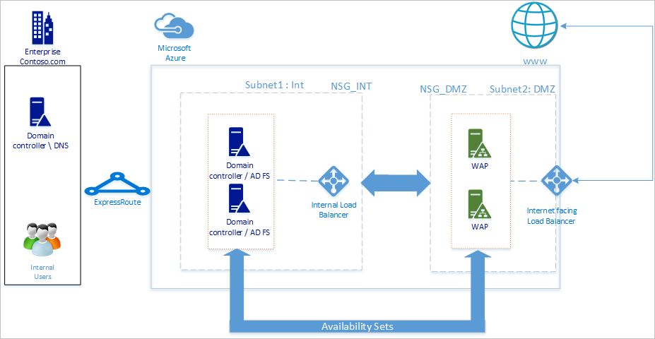
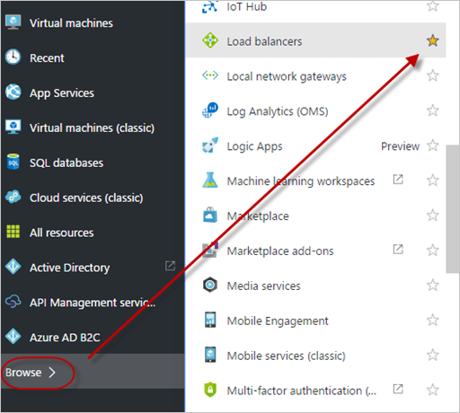
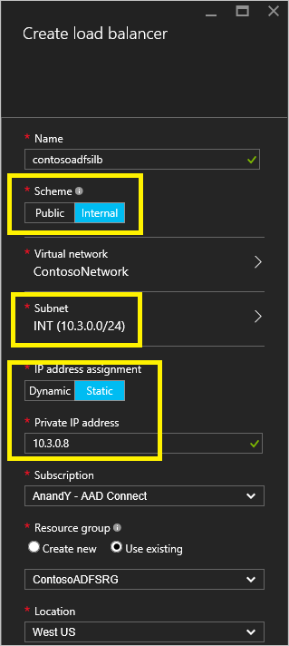
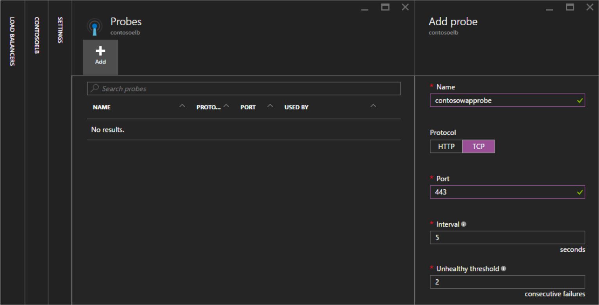

<properties
	pageTitle="Azure 中的 Active Directory 联合身份验证服务 | Azure"
	description="在本文档中，你将学习如何在 Azure 中部署 AD FS 以实现高可用性。"
    keywords="AD FS 简介, Azure, Azure AD Connect 概述, Azure 中的 AD FS, iaas, ADFS"
	services="active-directory"
	documentationCenter=""
	authors="anandyadavmsft"
	manager="femila"
	editor=""/>

<tags
	ms.service="active-directory"
	ms.workload="identity"
	ms.tgt_pltfrm="na"
	ms.devlang="na"
	ms.topic="get-started-article"
	ms.date="07/13/2016"
	wacn.date="08/01/2016"
	ms.author="anandy;billmath"/>

# Azure 中的 AD FS 部署 

AD FS 提供简化、安全的标识联合与 Web 单一登录 (SSO) 功能。与 Azure AD 或 O365 联合可让用户使用本地凭据进行身份验证，并访问云中的所有资源。这样，就必须建立高可用性的 AD FS 基础结构来确保能够访问本地和云中的资源。在 Azure 中部署 AD FS 有助于以最少量的工作实现所需的高可用性。
在 Azure 中部署 AD FS 可带来几项优势，下面列出了其中几项：

* **高可用性** – 借助 Azure 可用性集的强大功能可以确保建立高可用性的基础结构。
* **易于缩放** – 需要更高的性能？ 只需在 Azure 中按几下鼠标就能轻松迁移到更强大的计算机
* **异地冗余** – 使用 Azure 异地冗余可以确保基础结构在全球各地均具有高可用性
* **易于管理** – 通过 Azure 门户中高度简化的管理选项可以轻松省心地管理你的基础结构

## 设计原理

上图显示了用于在 Azure 中部署 AD FS 基础结构的建议基本拓扑。下面列出了该拓扑的各个组件幕后的原理：

* **DC/ADFS 服务器**：如果你的用户数目少于 1,000，则可以直接在域控制器上安装 AD FS 角色。如果不希望影响域控制器的性能，或者用户数目超过 1,000，请在不同的服务器上部署 AD FS。
* **WAP 服务器**：必须部署 Web 应用程序代理服务器，以便不在公司网络中的用户可以连接到 AD FS。
* **外围网络**：Web 应用程序代理服务器将位于外围网络，外围网络与内部子网之间只允许进行 TCP/443 访问。
* **负载均衡器**：为了确保 AD FS 和 Web 应用程序代理伺服器具有高可用性，建议针对 AD FS 服务器使用内部负载均衡器，并针对 Web 应用程序代理服务器使用 Azure Load Balancer。
* **可用性集**：为了对 AD FS 部署提供冗余，建议将类似工作负荷的两个或更多个虚拟机分组到一个可用性集中。这种配置可以确保在发生计划内或计划外维护事件时，至少有一个虚拟机可用。
* **存储帐户**：建议创建两个存储帐户。只创建一个存储帐户可能会产生单一故障点，并且如果存储帐户失效（尽管不太可能发生），部署将不可用。创建两个存储帐户有助于确保每条故障路线有一个关联的存储帐户。
* **网络隔离**：将 Web 应用程序代理服务器部署在不同的外围网络。可以将一个虚拟网络分割成两个子网，然后在隔离的子网中部署 Web 应用程序代理服务器。只需为每个子网配置网络安全组设置，并只允许在两个子网之间进行所需的通信。下面提供了每种部署方案的更多详细信息

##在 Azure 中部署 AD FS 的步骤

本部分所述的步骤概述了在 Azure 中部署如下所示的 AD FS 基础结构的指南。

### 1\.部署网络

如上所述，可以在单个虚拟网络中创建两个子网，或者创建两个完全不同的虚拟网络 (VNet)。本文着重介绍如何部署单个虚拟网络，并将它分割成两个子网。目前，这种方法更简单，因为如果创建两个不同的 VNet，就需要建立 VNet 到 VNet 网关才能进行通信。

**1.1 创建虚拟网络**

	
在 Azure 门户中选择虚拟网络，然后，只需单击一下鼠标就能立即部署虚拟网络和一个子网。此外，INT 子网已定义，随时可供要添加的 VM 使用。
下一步是在网络中添加另一个子网，即外围网络子网。若要创建外围网络子网，只需执行以下操作

* 选择新建的网络
* 在属性中选择子网
* 在子网面板中，单击“添加”按钮
* 提供子网名称和地址空间信息以创建子网

**1.2.创建网络安全组**

网络安全组 (NSG) 包含一系列访问控制列表 (ACL) 规则，这些规则可以允许或拒绝虚拟网络中流向 VM 实例的网络流量。NSG 可以与子网或该子网中的各个 VM 实例相关联。当 NSG 与某个子网相关联时，ACL 规则将应用到该子网中的所有 VM 实例。
在本指南中，我们将创建两个 NSG：一个应用于内部网络，另一个应用于外围网络。其标签分别为 NSG\_INT 和 NSG\_DMZ。

创建 NSG 后，将有 0 个入站规则和 0 个出站规则。相应服务器上的角色已安装并正常运行后，你可以根据所需的安全级别创建入站和出站规则。

创建所有 NSG 之后，请将 NSG\_INT 与 INT 子网相关联，并将 NSG\_DMZ 与外围网络子网相关联。下面提供了示例屏幕截图：

* 单击“子网”打开子网面板
* 选择要与 NSG 关联的子网

完成配置后，“子网”面板应如下所示：

**1.3.与本地创建连接**

需要连接到本地才能在 Azure 中部署域控制器 (DC)。Azure 提供多种连接选项用于将本地基础结构连接到 Azure 基础结构。

* 点到站点
* 虚拟网络站点到站点
* ExpressRoute

建议使用 ExpressRoute。使用 ExpressRoute，可在 Azure 数据中心与你的本地环境或并置环境中的基础结构之间创建专用连接。ExpressRoute 连接不通过公共 Internet 。它们能够提供可靠性、速度、延迟和安全性这几个方面均比基于 Internet 的典型连接更胜一筹的专用连接。
尽管建议使用 ExpressRoute，但你也可以选择最适合你组织的任何连接方法。有关详细了解 ExpressRoute 以及如何使用 ExpressRoute 的各种连接选项，请阅读 [ExpressRoute technical overview（ExpressRoute 技术概述）](https://aka.ms/Azure/ExpressRoute)。

### 2\.创建存储帐户

为了保持高可用性并避免依赖单个存储帐户，你可以创建两个存储帐户。将每个可用性集中的计算机划分为两组，然后为每个组分配不同的存储帐户。请记住，你只需支付实际使用的存储费用。

### 3\.创建可用性集

针对每个角色（DC/AD FS 和 WAP）创建可用性集，使每个可用性集至少包含 2 个计算机。这有助于使每个角色实现更高的可用性。 
在创建可用性集时，必须针对以下项目做出决定：
* **容错域**：同一容错域中的虚拟机共享同一个电源和物体网络交换机。建议至少创建 2 个容错域。默认值为 3，在进行本文所述的部署时，可以保留此默认值。
* **更新域**：在更新期间，属于同一更新域的计算机将一起重新启动。至少需要 2 个更新域。默认值为 5，在进行本文所述的部署时，可以保留此默认值。

创建以下可用性集

| 可用性集 | 角色 | 容错域 | 更新域 |
|:----------------:|:----:|:-----------:|:-----------|
| contosodcset | DC/ADFS | 3 | 5 |
| contosowapset | WAP | 3 | 5 |

### 4\.部署虚拟机
下一步是部署虚拟机，用于在基础结构中托管不同角色。建议每个可用性集中至少有两个计算机。为基本部署创建六个虚拟机。

| 计算机 | 角色 | 子网 | 可用性集 | 存储帐户 | IP 地址 |
|:-----:|:-----:|:-----:|:-----:|:-----:|:-----:|
|contosodc1|DC/ADFS|INT|contosodcset|contososac1|静态|
|contosodc2|DC/ADFS|INT|contosodcset|contososac2|静态|
|contosowap1|WAP|外围网络|contosowapset|contososac1|静态|
|contosowap2|WAP|外围网络|contosowapset|contososac2|静态|

你可能已注意到尚未指定 NSG。这是因为 Azure 允许你在子网级别使用 NSG。然后，你可以使用与子网或 NIC 对象关联的单个 NSG 来控制计算机的网络流量。有关详细信息，请阅读 [What is a Network Security Group (NSG)（什么是网络安全组 (NSG)）](https://aka.ms/Azure/NSG)。
如果你要管理 DNS，建议你使用静态 IP 地址。你可以使用 Azure DNS，并改为在域的 DNS 记录中按计算机的 Azure FQDN 引用新计算机。
完成部署后，虚拟机窗格应如下所示：

### 5\.配置域控制器/AD FS 服务器
 为了对传入的请求进行身份验证，AD FS 需要联系域控制器。在身份验证时，为了避免从 Azure 到本地 DC 的较高往返开销，建议在 Azure 中部署域控制器的副本。为了实现高可用性，建议创建至少包含 2 个域控制器的可用性集。

|域控制器|角色|存储帐户|
|:-----:|:-----:|:-----:|
|contosodc1|副本|contososac1|
|contosodc2|副本|contososac2|

* 将两个服务器提升为使用 DNS 的副本域控制器
* 使用服务器管理器安装 AD FS 角色，以配置 AD FS 服务器。

###6\.部署内部负载均衡器 (ILB)

**6.1.创建 ILB**

若要部署 ILB，请在 Azure 门户选择“负载均衡器”，然后单击“添加”(+)。
>[AZURE.NOTE] 如果菜单中未显示“负载均衡器”，请单击门户左下角的“浏览”并向下滚动，直到看到“负载均衡器”。然后，单击黄色星号将它添加到菜单中。现在，请选择新负载均衡器的图标打开面板，并开始配置负载均衡器。

* **名称**：为负载均衡器指定适当的名称
* **方案**：由于此负载均衡器将放在 AD FS 服务器的前面以便只用于内部网络连接，因此请选择“内部”
* **虚拟网络**：选择要在其中部署 AD FS 的虚拟网络
* **子网**：在此处选择内部子网
* **IP 地址分配**：动态

 
单击“创建”并部署 ILB 之后，它应会显示在负载均衡器列表中：

 
下一步是配置后端池和后端探测。

**6.2.配置 ILB 后端池**

在“负载均衡器”面板中选择新建的 ILB。此时将打开设置面板。  
1.	从设置面板中选择后端池  
2.	在“添加后端池”面板中，单击“添加虚拟机”  
3.	此时会显示一个面板，你可以在其中选择可用性集  
4.	选择 AD FS 可用性集  

 
**6.3.配置探测**

在 ILB 设置面板中选择“探测”。  
1.	单击“添加”  
2.	提供探测详细信息    
  a.**名称**：探测名称  
  b.**协议**：TCP  
  c.**端口**：443 (HTTPS)  
  d.**间隔**：5（默认值）– 这是 ILB 在后端池中探测计算机的间隔  
  e.**不正常阈值限制**：2（默认值）– 这是连续探测失败阈值，达到此阈值后，ILB 会将后端池中的计算机声明为无响应，并停止向它发送流量。  
 

 
**6.4.创建负载均衡规则**

为了有效地平衡流量，应该为 ILB 设置负载均衡规则。若要创建负载均衡规则，请执行以下操作：  
1.	在 ILB 的设置面板中选择“负载均衡规则”  
2.	在“负载均衡规则”面板中单击“添加”  
3.	在“添加负载均衡规则”面板中，指定以下值：  
  a. **名称**：提供规则的名称  
  b.**协议**：选择“TCP”  
  c.**端口**：443  
  d.**后端端口**：443  
  e.**后端池**：选择前面为 AD FS 群集创建的池   
  f.**探测**：选择前面为 AD FS 服务器创建的探测  

**6.5.更新 ILB 的 DNS**

转到你的 DNS 服务器，并为 ILB 创建 CNAME。该 CNAME 应适用于 IP 地址指向 ILB 的 IP 地址的联合身份验证服务。例如，如果 ILB DIP 地址是 10.3.0.8，而安装的联合身份验证服务是 fs.contoso.com，请为指向 10.3.0.8 的 fs.contoso.com 创建 CNAME。
这可确保所有与 fs.contoso.com 相关的通信都在 ILB 上结束，并且会得到适当的路由。

###7\.配置 Web 应用程序代理服务器

**7.1.配置 Web 应用程序代理服务器以访问 AD FS 服务器**

为了确保 Web 应用程序代理服务器能够访问 ILB 后面的 AD FS 服务器，请在 %systemroot%\\system32\\drivers\\etc\\hosts 中为 ILB 创建一条记录。请注意，可分辨名称 (DN) 应是联合身份验证服务的名称，例如 fs.contoso.com。IP 条目应是 ILB 的 IP 地址条目（如示例中的 10.3.0.8）。

**7.2.安装 Web 应用程序代理角色**

在确保 Web 应用程序代理服务器能够访问 ILB 后面的 AD FS 服务器之后，接下来可以安装 Web 应用程序代理服务器。 
不要将 Web 应用程序代理服务器加入域。通过选择“远程访问”角色，将 Web 应用程序代理角色安装在两个 Web 应用程序代理服务器上。服务器管理器将引导你完成 WAP 安装。
有关如何部署 WAP 的详细信息，请阅读 [Install and Configure the Web Application Proxy Server（安装和配置 Web 应用程序代理服务器）](https://technet.microsoft.com/library/dn383662.aspx)。

###8\.部署面向 Internet 的（公共）负载均衡器

**8.1.创建面向 Internet 的（公共）负载均衡器**
 
在 Azure 门户中选择“负载均衡器”，然后单击“添加”。在“创建负载均衡器”面板中输入以下信息  
1. **名称**：负载均衡器的名称  
2. **方案**：公共 – 此选项告知 Azure，此负载均衡器需要公共地址。  
3. **IP 地址**：创建新 IP 地址（动态）  

部署后，负载均衡器将出现在“负载均衡器”列表中。

 
**8.2.向公共 IP 分配 DNS 标签**

在“负载均衡器”面板中单击新建的负载均衡器条目，以显示配置面板。遵循以下步骤来配置公共 IP 的 DNS 标签：  
1.	单击该公共 IP 地址。此时将打开公共 IP 及其设置的面板  
2.	单击“配置”  
3.	提供 DNS 标签。此标签将成为可从任意位置访问的公共 DNS 标签，例如 contosofs.westus.chinacloudapi.azure.com。可以在外部 DNS 中添加用于联合身份验证服务的条目（例如 fs.contoso.com），该条目将解析为外部负载均衡器的 DNS 标签 (contosofs.westus.chinacloudapi.azure.com)。  

**8.3.为面向 Internet 的（公共）负载均衡器配置后端池**

遵循创建内部负载均衡器所用的相同步骤，将面向 Internet 的（公共）负载均衡器的后端池配置为 WAP 服务器的可用性集。例如，contosowapset。

 
**8.4.配置探测**

遵循配置内部负载均衡器所用的相同步骤来配置 WAP 服务器后端池的探测。

 
**8.5.创建负载均衡规则**

遵循在 ILB 中所用的相同步骤来配置 TCP 443 的负载均衡规则。

 
###9\.保护网络

**9.1.保护内部子网**

总体而言，需要创建以下规则来有效保护内部子网（按如下所列的顺序）

|规则|说明|流向|
|:----|:----|:------:|
|AllowHTTPSFromDMZ|	允许与外围网络进行 HTTPS 通信 | 入站 |
|DenyAllFromDMZ| 此规则将阻止所有从外围网络到内部子网的流量。规则 AllowHTTPSFromDMZ 将负责确保 HTTPS 通信完成，并阻止其他任何流量 | 入站 |
|DenyInternetOutbound| 不允许访问 Internet | 出站 |

[comment]: <> ()
[comment]: <> ()
 
**9.2.保护外围网络子网**

|规则|说明|流向|
|:----|:----|:------:|
|AllowHttpsFromVirtualNetwork| 允许来自虚拟网络的 HTTPS 流量 | 入站 |
|AllowHTTPSInternet| 允许从 Internet 到外围网络的 HTTPS 流量 | 入站|
|DenyingressexceptHTTPS| 阻止来自 Internet 的所有非 HTTPS 流量 | 入站 |
|DenyOutToInternet|	阻止流向 Internet 的所有非 HTTPS 流量 | 出站 |

[comment]: <> ()
[comment]: <> ()

>[AZURE.NOTE] 如果需要使用客户端用户证书身份验证（使用 X509 用户证书进行 clientTLS 身份验证），则 AD FS 要求为入站访问启用 TCP 端口 49443。

###10\.测试 AD FS 登录

测试 AD FS 的最简单方法是使用 IdpInitiatedSignon.aspx 页。若要执行此操作，必须在 AD FS 属性中启用 IdpInitiatedSignOn。请遵循以下步骤来验证你的 AD FS 设置  

1.	使用 PowerShell 在 AD FS 服务器上运行以下 cmdlet，以将它设置为启用。  

		Set-AdfsProperties -EnableIdPInitiatedSignonPage $true

2.	从任一外部计算机访问 https://adfs.thecloudadvocate.com/adfs/ls/IdpInitiatedSignon.aspx  

3.	你应会看到如下所示的 AD FS 页：  

成功登录后，该页将提供如下所示的成功消息：  

## 其他资源
* [可用性集](https://aka.ms/Azure/Availability)
* [Azure 负载均衡器](https://aka.ms/Azure/ILB)
* [Internal Load Balancer（内部负载均衡器）](https://aka.ms/Azure/ILB/Internal)
* [Internet Facing Load Balancer（面向 Internet 的负载均衡器）](https://aka.ms/Azure/ILB/Internet)
* [存储帐户](https://aka.ms/Azure/Storage)
* [Azure 虚拟网络](https://aka.ms/Azure/VNet)
* [AD FS and Web Application Proxy Links（AD FS 和 Web 应用程序代理链接）](http://aka.ms/ADFSLinks)

## 后续步骤

* [将本地标识与 Azure Active Directory 集成](/documentation/articles/active-directory-aadconnect/)
* [Configuring and managing your AD FS using Azure AD Connect（使用 Azure AD Connect 配置和管理 AD FS）](/documentation/articles/active-directory-aadconnectfed-whatis/)

<!---HONumber=Mooncake_0725_2016-->