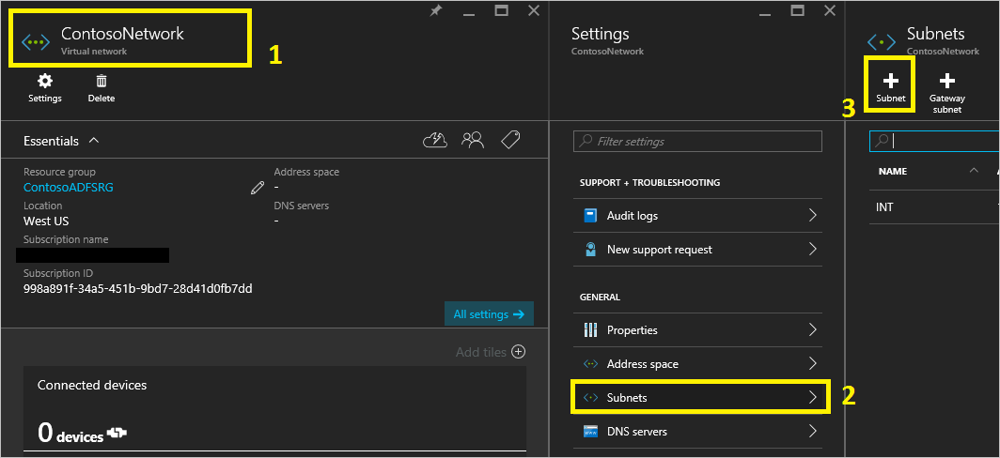
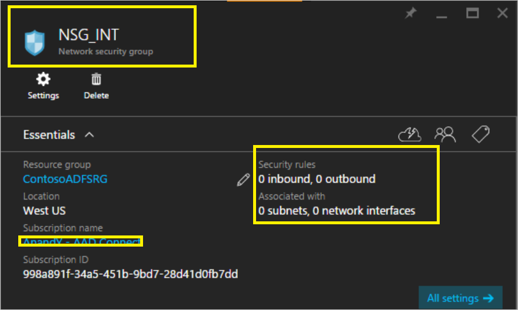
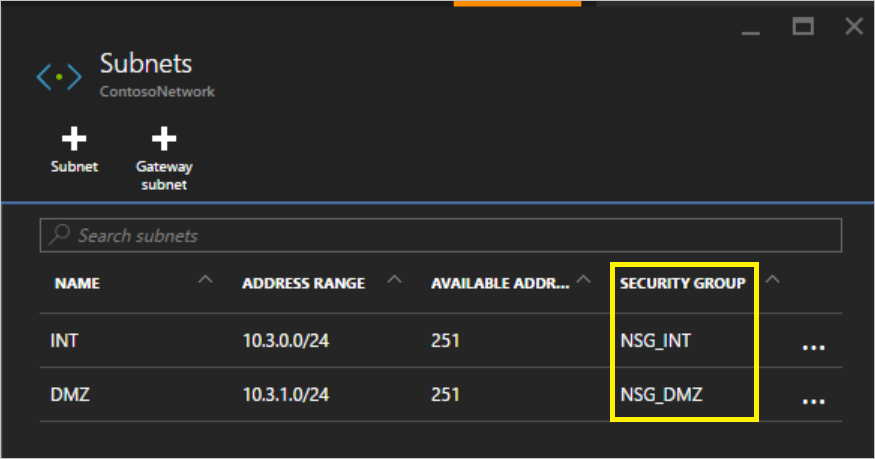
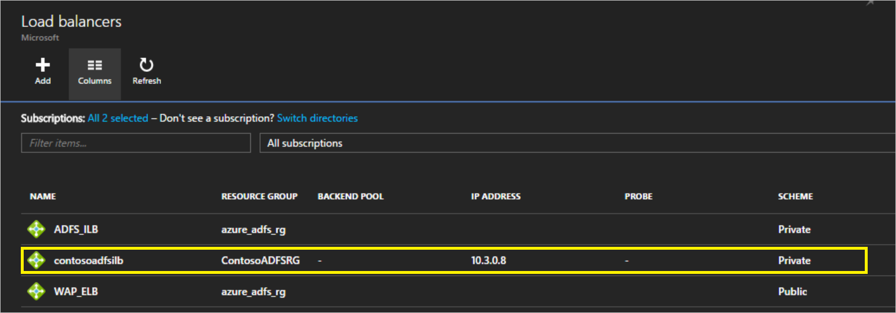
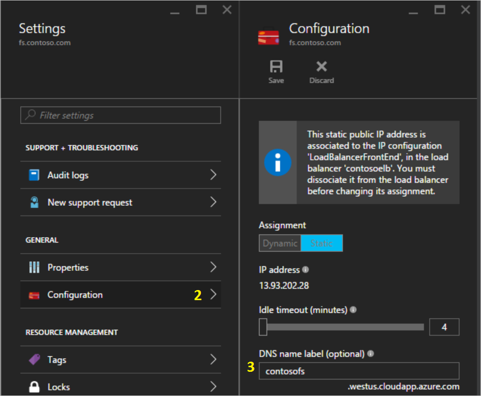
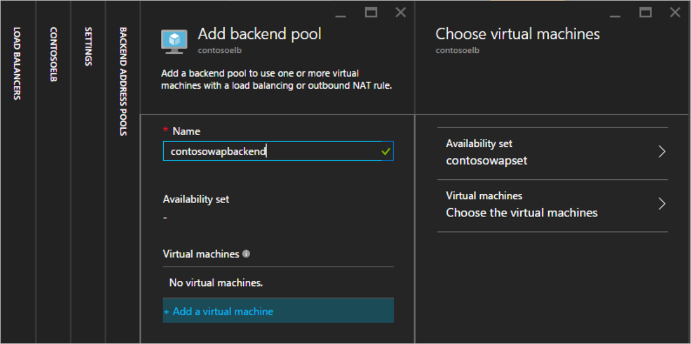
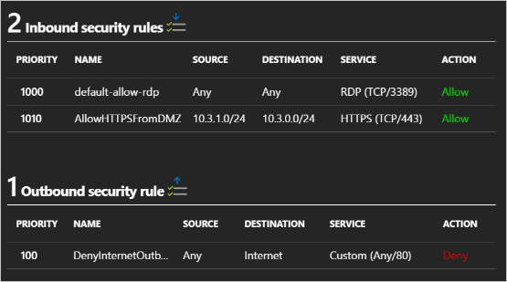
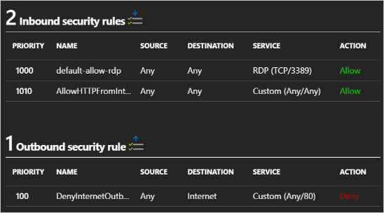
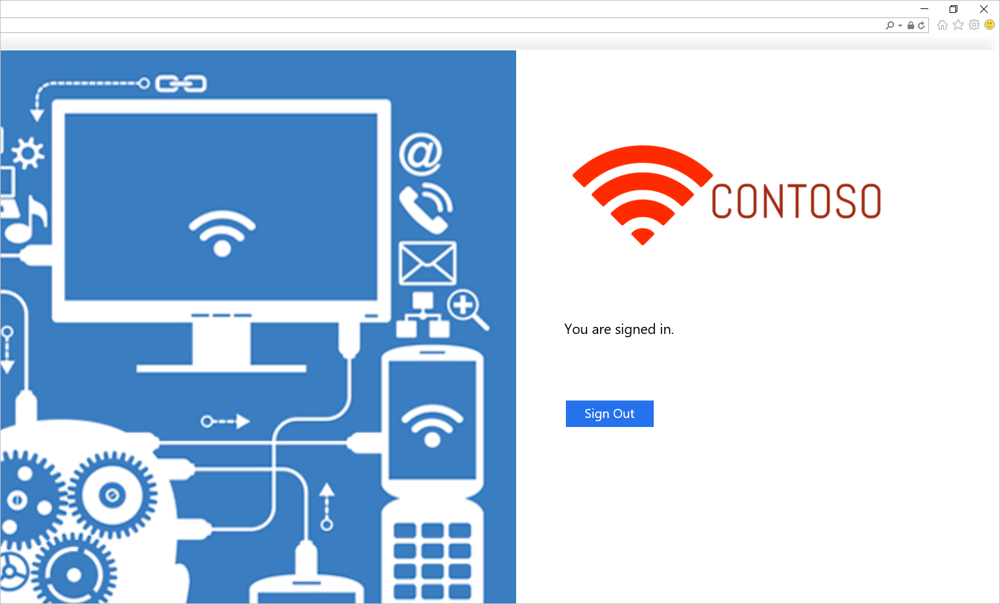

<properties
    pageTitle="Azure 中的 Active Directory 联合身份验证服务 | Azure"
    description="在本文档中，你将学习如何在 Azure 中部署 AD FS 以实现高可用性。"
    keywords="在 azure 中部署 AD FS, 部署 azure adfs, azure adfs, azure ad fs,部署 adfs, 部署 ad fs, azure 中的 adfs, 在 azure 中部署 adfs, 在 azure 中部署 AD FS, adfs azure, AD FS 简介, Azure, Azure 中的 AD FS, iaas, ADFS, 将 adfs 移到 azure"
    services="active-directory"
    documentationcenter=""
    author="anandyadavmsft"
    manager="femila"
    editor="" />
<tags
    ms.assetid="692a188c-badc-44aa-ba86-71c0e8074510"
    ms.service="active-directory"
    ms.workload="identity"
    ms.tgt_pltfrm="na"
    ms.devlang="na"
    ms.topic="get-started-article"
    ms.date="02/27/2017"
    wacn.date="04/05/2017"
    ms.author="anandy;billmath"
    ms.custom="H1Hack27Feb2017" />  

# 在 Azure 中部署 Active Directory 联合身份验证服务
AD FS 提供简化、安全的联合身份验证与 Web 单一登录 (SSO) 功能。与 Azure AD 或 O365 联合可让用户使用本地凭据进行身份验证，并访问云中的所有资源。这样，就务必建立高度可用的 AD FS 基础结构来确保能够访问本地和云中的资源。在 Azure 中部署 AD FS 有助于以最少量的工作实现所需的高可用性。在 Azure 中部署 AD FS 可带来几项优势，下面列出了其中几项：

- **高可用性** - 借助 Azure 可用性集的强大功能，可确保建立高度可用的基础结构。
- **易于缩放** - 需要更高的性能？ 只需在 Azure 中按几下鼠标就能轻松迁移到更强大的计算机
- **异地冗余** - 使用 Azure 异地冗余可以确保基础结构在全球各地均具有高可用性
- **易于管理** - 借助 Azure 门户预览中高度简化的管理选项，可以轻松省心地管理基础结构

## 设计原理

上图显示了在 Azure 中开始部署 AD FS 基础结构时建议采用的基本拓扑。下面列出了该拓扑的各个组件所基于的原理：

- **DC/ADFS 服务器**：如果用户数量少于 1,000，则可以直接在域控制器上安装 AD FS 角色。如果不希望对域控制器造成任何性能影响，或者用户数量超过 1,000，请在不同的服务器上部署 AD FS。
- **WAP 服务器**：必须部署 Web 应用程序代理服务器，以便用户在公司网络以外也可访问 AD FS。
- **外围网络**：Web 应用程序代理服务器将位于外围网络中，外围网络与内部子网之间只允许进行 TCP/443 访问。
- **负载均衡器**：为了确保 AD FS 和 Web 应用程序代理服务器具有高可用性，建议针对 AD FS 服务器使用内部负载均衡器，并针对 Web 应用程序代理服务器使用 Azure 负载均衡器。
- **可用性集**：为了对 AD FS 部署提供冗余，建议将类似工作负荷的两个或更多个虚拟机分组到一个可用性集中。这种配置可以确保在发生计划内或计划外维护事件时，至少有一个虚拟机可用。
- **存储帐户**：建议创建两个存储帐户。只创建一个存储帐户可能会产生单一故障点，并且在存储帐户失效（尽管不太可能发生）的情况下，部署将不可用。创建两个存储帐户有助于确保每条故障路线有一个关联的存储帐户。
- **网络隔离**：应将 Web 应用程序代理服务器部署在不同的外围网络。可以将一个虚拟网络分割成两个子网，然后在隔离的子网中部署 Web 应用程序代理服务器。只需为每个子网配置网络安全组设置，并只允许在两个子网之间进行所需的通信。下面提供了每种部署方案的更多详细信息

## 在 Azure 中部署 AD FS 的步骤
本部分所述的步骤概述了在 Azure 中部署如下所示的 AD FS 基础结构的指南。

### 1\.部署网络
如上所述，可以在单个虚拟网络中创建两个子网，或者创建两个完全不同的虚拟网络 (VNet)。本文着重介绍如何部署单个虚拟网络，并将它分割成两个子网。目前，这种方法更简单，因为如果创建两个不同的 VNet，就需要建立 VNet 到 VNet 网关才能进行通信。

**1.1 创建虚拟网络**

在 Azure 门户预览中选择虚拟网络，然后，只需单击一下鼠标就能立即部署虚拟网络和一个子网。此外，INT 子网已定义，随时可供要添加的 VM 使用。下一步是在网络中添加另一个子网，即外围网络子网。若要创建外围网络子网，只需执行以下操作

- 选择新建的网络
- 在属性中选择子网
- 在子网面板中，单击“添加”按钮
- 提供子网名称和地址空间信息以创建子网

**1.2.创建网络安全组**

网络安全组 (NSG) 包含一系列访问控制列表 (ACL) 规则，这些规则可以允许或拒绝虚拟网络中流向 VM 实例的网络流量。NSG 可以与子网或该子网中的各个 VM 实例相关联。当 NSG 与某个子网相关联时，ACL 规则将应用到该子网中的所有 VM 实例。在本指南中，我们将创建两个 NSG：一个应用于内部网络，另一个应用于外围网络。其标签分别为 NSG\_INT 和 NSG\_DMZ。

创建 NSG 后，入站规则和出站规则的数量将均显示为 0。各个服务器上的角色安装完成并正常运行后，可以根据所需的安全级别创建入站和出站规则。

创建所有 NSG 后，将 NSG\_INT 与 INT 子网相关联，并将 NSG\_DMZ 与外围网络子网相关联。下面提供了示例屏幕截图：

- 单击“子网”打开子网面板
- 选择要与 NSG 关联的子网

完成配置后，“子网”面板应如下所示：

**1.3.与本地创建连接**

需要连接到本地才能在 Azure 中部署域控制器 (DC)。Azure 提供多种连接选项用于将本地基础结构连接到 Azure 基础结构。

- 点到站点
- 虚拟网络站点到站点
- ExpressRoute

建议使用 ExpressRoute。借助 ExpressRoute，可在 Azure 数据中心与本地环境或并置环境中的基础结构之间创建专用连接。ExpressRoute 连接不通过公共 Internet 。它们能够提供可靠性、速度、延迟和安全性这几个方面均比基于 Internet 的典型连接更胜一筹的专用连接。尽管建议使用 ExpressRoute，但你也可以选择最适合你组织的任何连接方法。若要详细了解 ExpressRoute 以及有关使用 ExpressRoute 的各种连接选项，请阅读 [ExpressRoute 技术概述](/documentation/articles/expressroute-introduction/)。

### 2\.创建存储帐户
为了保持高可用性并避免依赖单个存储帐户，可以创建两个存储帐户。将每个可用性集中的计算机划分为两组，然后为每个组分配不同的存储帐户。

  

### 3\.创建可用性集
针对每个角色（DC/AD FS 和 WAP）创建可用性集，使每个可用性集至少包含 2 个计算机。这有助于使每个角色实现更高的可用性。创建可用性集时，必须针对以下项做出决策：

- **容错域**：同一容错域中的虚拟机共享同一个电源和物理网络交换机。建议至少创建 2 个容错域。默认值为 3，在进行本文所述的部署时，可以保留此默认值
- **更新域**：在更新期间，属于同一更新域的计算机将一起重新启动。至少需要 2 个更新域。默认值为 5，在进行本文所述的部署时，可以保留此默认值

创建以下可用性集

| 可用性集 | 角色 | 容错域 | 更新域 |
|:---:|:---:|:---:|:--- |
| contosodcset |DC/ADFS |3 |5 |
| contosowapset |WAP |3 |5 |

### 4\.部署虚拟机
下一步是部署虚拟机，用于在基础结构中托管不同角色。建议每个可用性集中至少有两个计算机。为基本部署创建六个虚拟机。

| 计算机 | 角色 | 子网 | 可用性集 | 存储帐户 | IP 地址 |
|:---:|:---:|:---:|:---:|:---:|:---:|
| contosodc1 |DC/ADFS |INT |contosodcset |contososac1 |静态 |
| contosodc2 |DC/ADFS |INT |contosodcset |contososac2 |静态 |
| contosowap1 |WAP |外围网络 |contosowapset |contososac1 |静态 |
| contosowap2 |WAP |外围网络 |contosowapset |contososac2 |静态 |

你可能已注意到尚未指定 NSG。这是因为 Azure 允许你在子网级别使用 NSG。然后，你可以使用与子网或 NIC 对象关联的单个 NSG 来控制计算机的网络流量。有关详细信息，请阅读[什么是网络安全组 (NSG)](/documentation/articles/virtual-networks-nsg/)。如果你要管理 DNS，建议使用静态 IP 地址。你可以使用 Azure DNS，并改为在域的 DNS 记录中按计算机的 Azure FQDN 引用新计算机。完成部署后，虚拟机窗格应如下所示：

### 5\.配置域控制器/AD FS 服务器
 为了对传入的请求进行身份验证，AD FS 需要与域控制器通信。在身份验证时，为了避免从 Azure 到本地 DC 的较高往返开销，建议在 Azure 中部署域控制器的副本。为了实现高可用性，建议创建至少包含 2 个域控制器的可用性集。

| 域控制器 | 角色 | 存储帐户 |
|:---:|:---:|:---:|
| contosodc1 |副本 |contososac1 |
| contosodc2 |副本 |contososac2 |

- 将两个服务器提升为使用 DNS 的副本域控制器
- 使用服务器管理器安装 AD FS 角色，以配置 AD FS 服务器。

### 6\.部署内部负载均衡器 (ILB)
**6.1.创建 ILB**

若要部署 ILB，请在 Azure 门户预览选择“负载均衡器”，然后单击“添加”(+)。

> [AZURE.NOTE]
如果菜单中未显示“负载均衡器”，请单击门户左下角的“浏览”并向下滚动，直到看到“负载均衡器”。然后，单击黄色星号将它添加到菜单中。现在，请选择新负载均衡器的图标以打开面板，并开始配置负载均衡器。
> 
> 

- **名称**：为负载均衡器指定适当的名称
- **方案**：由于此负载均衡器将放在 AD FS 服务器的前面并且仅用于内部网络连接，因此请选择“内部”
- **虚拟网络**：选择要在其中部署 AD FS 的虚拟网络
- **子网**：在此处选择内部子网
- **IP 地址分配**：动态

单击“创建”并部署 ILB 之后，它应会显示在负载均衡器列表中：

下一步是配置后端池和后端探测。

**6.2.配置 ILB 后端池**

在“负载均衡器”面板中选择新建的 ILB。此时将打开设置面板。

1. 从设置面板中选择后端池
2. 在“添加后端池”面板中，单击“添加虚拟机”
3. 此时会显示一个面板，你可以在其中选择可用性集
4. 选择 AD FS 可用性集

**6.3.配置探测**

在 ILB 设置面板中选择“探测”。

1. 单击“添加”
2. 提供探测详细信息：
a.**名称**：探测名称；
b.**协议**：TCP；
c.**端口**：443 (HTTPS)；
d.**间隔**：5（默认值）- 这是 ILB 在后端池中探测计算机的间隔；
e.**不正常阈值限制**：2（默认值）- 这是连续探测失败阈值，达到此阈值后，ILB 会将后端池中的计算机声明为无响应，并停止向它发送流量。

  

**6.4.创建负载均衡规则**

为了有效地平衡流量，应该为 ILB 设置负载均衡规则。若要创建负载均衡规则，请执行以下操作：

1. 在 ILB 的设置面板中选择“负载均衡规则”
2. 在“负载均衡规则”面板中单击“添加”
3. 在“添加负载均衡规则”面板中，指定以下值：
a. **名称**：提供规则的名称；
b.**协议**：选择“TCP”；
c.**端口**：443；
d.**后端端口**：443；
e.**后端池**：选择前面为 AD FS 群集创建的池；
f.**探测**：选择前面为 AD FS 服务器创建的探测

**6.5.更新 ILB 的 DNS**

转到你的 DNS 服务器，并为 ILB 创建 CNAME。该 CNAME 应适用于 IP 地址指向 ILB 的 IP 地址的联合身份验证服务。例如，如果 ILB DIP 地址是 10.3.0.8，而安装的联合身份验证服务是 fs.contoso.com，请为指向 10.3.0.8 的 fs.contoso.com 创建 CNAME。这可确保所有与 fs.contoso.com 相关的通信都在 ILB 上结束，并且会得到适当的路由。

### 7\.配置 Web 应用程序代理服务器
**7.1.配置 Web 应用程序代理服务器以访问 AD FS 服务器**

为了确保 Web 应用程序代理服务器能够访问 ILB 后面的 AD FS 服务器，请在 %systemroot%\\system32\\drivers\\etc\\hosts 中为 ILB 创建一条记录。请注意，可分辨名称 (DN) 应是联合身份验证服务的名称，例如 fs.contoso.com。IP 条目应是 ILB 的 IP 地址条目（如示例中的 10.3.0.8）。

**7.2.安装 Web 应用程序代理角色**

在确保 Web 应用程序代理服务器能够访问 ILB 后面的 AD FS 服务器之后，接下来可以安装 Web 应用程序代理服务器。不要将 Web 应用程序代理服务器加入域。通过选择“远程访问”角色，将 Web 应用程序代理角色安装在两个 Web 应用程序代理服务器上。服务器管理器将引导你完成 WAP 安装。有关如何部署 WAP 的详细信息，请阅读[安装和配置 Web 应用程序代理服务器](https://technet.microsoft.com/zh-cn/library/dn383662.aspx)。

### 8\.部署面向 Internet 的（公共）负载均衡器
**8.1.创建面向 Internet 的（公共）负载均衡器**

在 Azure 门户预览中选择“负载均衡器”，然后单击“添加”。在“创建负载均衡器”面板中输入以下信息

1. **名称**：负载均衡器的名称
2. **方案**：公共 - 此选项告知 Azure，此负载均衡器需要公共地址。
3. **IP 地址**：创建新 IP 地址（动态）

部署后，负载均衡器将出现在“负载均衡器”列表中。

**8.2.向公共 IP 分配 DNS 标签**

在“负载均衡器”面板中单击新建的负载均衡器条目，以显示配置面板。遵循以下步骤来配置公共 IP 的 DNS 标签：

1. 单击该公共 IP 地址。此时将打开公共 IP 及其设置的面板
2. 单击“配置”
3. 提供 DNS 标签。此标签将成为可从任意位置访问的公共 DNS 标签，例如 contosofs.chinanorth.cloudapp.azure.com。可以在外部 DNS 中添加用于联合身份验证服务的条目（例如 fs.contoso.com），该条目将解析为外部负载均衡器的 DNS 标签 (contosofs.chinanorth.cloudapp.azure.com)。

  

**8.3.为面向 Internet 的（公共）负载均衡器配置后端池**

遵循创建内部负载均衡器所用的相同步骤，将面向 Internet 的（公共）负载均衡器的后端池配置为 WAP 服务器的可用性集。例如，contosowapset。

**8.4.配置探测**

遵循配置内部负载均衡器所用的相同步骤来配置 WAP 服务器后端池的探测。

**8.5.创建负载均衡规则**

遵循在 ILB 中所用的相同步骤来配置 TCP 443 的负载均衡规则。

### 9\.保护网络
**9.1.保护内部子网**

总体而言，需要创建以下规则来有效保护内部子网（按如下所列的顺序）

| 规则 | 说明 | 流向 |
|:--- |:--- |:---:|
| AllowHTTPSFromDMZ |允许从外围网络进行 HTTPS 通信 |入站 |
| DenyInternetOutbound |不允许访问 Internet |出站 |

  

**9.2.保护外围网络子网**

| 规则 | 说明 | 流向 |
|:--- |:--- |:---:|
| AllowHTTPSFromInternet |允许从 Internet 到外围网络的 HTTPS 流量 |入站 |
| DenyInternetOutbound |阻止流向 Internet 的所有非 HTTPS 流量 |出站 |

  

> [AZURE.NOTE]
如果需要使用客户端用户证书身份验证（使用 X509 用户证书进行 clientTLS 身份验证），则 AD FS 要求为入站访问启用 TCP 端口 49443。
> 
> 

### 10\.测试 AD FS 登录
测试 AD FS 的最简单方法是使用 IdpInitiatedSignon.aspx 页。若要执行此操作，必须在 AD FS 属性中启用 IdpInitiatedSignOn。请遵循以下步骤来验证你的 AD FS 设置

1. 使用 PowerShell 在 AD FS 服务器上运行以下 cmdlet，以将它设置为启用。Set-AdfsProperties -EnableIdPInitiatedSignonPage $true
2. 从任一外部计算机访问 https://adfs.thecloudadvocate.com/adfs/ls/IdpInitiatedSignon.aspx
3. 你应会看到如下所示的 AD FS 页：

  

成功登录后，该页将提供如下所示的成功消息：

  

## 用于在 Azure 中部署 AD FS 的模板
该模板将部署包含 6 台计算机的设置，为域控制器、AD FS 和 WAP 各部署 2 台。

[Azure 部署模板中的 AD FS](https://github.com/paulomarquesc/adfs-6vms-regular-template-based)

部署此模板时，可以使用现有的虚拟网络或者新建一个 VNET。下面列出了可用于自定义部署的各种参数，以及部署过程中的参数用法说明。

| 参数 | 说明 |
|:--- |:--- |
| 位置 |要将资源部署到的区域，例如“中国东部”。 |
| StorageAccountType |创建的存储帐户的类型 |
| VirtualNetworkUsage |指示是要新建虚拟网络，还是使用现有的虚拟网络 |
| VirtualNetworkName |要创建的虚拟网络的名称，不管是使用现有虚拟网络还是新建虚拟网络，都必须指定此参数 |
| VirtualNetworkResourceGroupName |指定现有虚拟网络所在的资源组的名称。使用现有的虚拟网络时，必须指定此参数，以便部署可以找到现有虚拟网络的 ID |
| VirtualNetworkAddressRange |新 VNET 的地址范围，新建虚拟网络时必须指定此参数 |
| InternalSubnetName |内部子网的名称，不管选择哪种虚拟网络用法（新建或使用现有），都必须指定此参数 |
| InternalSubnetAddressRange |包含域控制器和 ADFS 服务器的内部子网的地址范围，新建虚拟网络时必须指定此参数。 |
| DMZSubnetAddressRange |包含 Windows 应用程序代理服务器的外围网络子网的地址范围，新建虚拟网络时必须指定此参数。 |
| DMZSubnetName |内部子网的名称，不管选择哪种虚拟网络用法（新建或使用现有），都必须指定此参数。 |
| ADDC01NICIPAddress |第一个域控制器的内部 IP 地址，此 IP 地址静态分配给 DC，必须是内部子网中的有效 IP 地址 |
| ADDC02NICIPAddress |第二个域控制器的内部 IP 地址，此 IP 地址静态分配给 DC，必须是内部子网中的有效 IP 地址 |
| ADFS01NICIPAddress |第一个 ADFS 服务器的内部 IP 地址，此 IP 地址静态分配给 ADFS 服务器，必须是内部子网中的有效 IP 地址 |
| ADFS02NICIPAddress |第二个 ADFS 服务器的内部 IP 地址，此 IP 地址静态分配给 ADFS 服务器，必须是内部子网中的有效 IP 地址 |
| WAP01NICIPAddress |第一个 WAP 服务器的内部 IP 地址，此 IP 地址静态分配给 WAP 服务器，必须是外围网络子网中的有效 IP 地址 |
| WAP02NICIPAddress |第二个 WAP 服务器的内部 IP 地址，此 IP 地址静态分配给 WAP 服务器，必须是外围网络子网中的有效 IP 地址 |
| ADFSLoadBalancerPrivateIPAddress |ADFS 负载均衡器的内部 IP 地址，此 IP 地址静态分配给负载均衡器，必须是内部子网中的有效 IP 地址 |
| ADDCVMNamePrefix |域控制器的虚拟机名称前缀 |
| ADFSVMNamePrefix |ADFS 服务器的虚拟机名称前缀 |
| WAPVMNamePrefix |WAP 服务器的虚拟机名称前缀 |
| ADDCVMSize |域控制器的 VM 大小 |
| ADFSVMSize |ADFS 服务器的 VM 大小 |
| WAPVMSize |WAP 服务器的 VM 大小 |
| AdminUserName |虚拟机的本地管理员名称 |
| AdminPassword |虚拟机的本地管理员帐户密码 |

## 其他资源
- [可用性集](https://aka.ms/Azure/Availability)
- [Azure 负载均衡器](https://aka.ms/Azure/ILB)
- [Internal 负载均衡器（内部负载均衡器）](https://aka.ms/Azure/ILB/Internal)
- [Internet Facing 负载均衡器（面向 Internet 的负载均衡器）](https://aka.ms/Azure/ILB/Internet)
- [存储帐户](https://aka.ms/Azure/Storage)
- [Azure 虚拟网络](https://aka.ms/Azure/VNet)
- [AD FS and Web Application Proxy Links（AD FS 和 Web 应用程序代理链接）](http://aka.ms/ADFSLinks)

## 后续步骤
- [将本地标识与 Azure Active Directory 集成](/documentation/articles/active-directory-aadconnect/)
- [Configuring and managing your AD FS using Azure AD Connect（使用 Azure AD Connect 配置和管理 AD FS）](/documentation/articles/active-directory-aadconnectfed-whatis/)
- [使用 Azure 流量管理器在 Azure 中部署高可用性跨地域 AD FS](/documentation/articles/active-directory-adfs-in-azure-with-azure-traffic-manager/)

<!---HONumber=Mooncake_0327_2017-->
<!---Update_Description: wording update -->