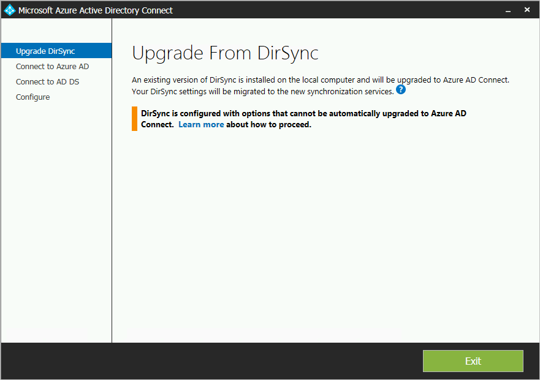
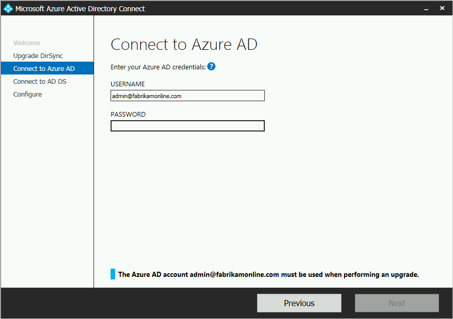

<properties
    pageTitle="Azure AD Connect：从 DirSync 升级 | Azure"
    description="了解如何从 DirSync 升级到 Azure AD Connect。本文介绍从 DirSync 升级到 Azure AD Connect 的步骤。"
    services="active-directory"
    documentationcenter=""
    author="andkjell"
    manager="femila"
    editor="" />
<tags
    ms.assetid="baf52da7-76a8-44c9-8e72-33245790001c"
    ms.service="active-directory"
    ms.workload="identity"
    ms.tgt_pltfrm="na"
    ms.devlang="na"
    ms.topic="get-started-article"
    ms.date="02/07/2017"
    wacn.date="03/07/2017"
    ms.author="billmath" />  

# Azure AD Connect：从 DirSync 升级
Azure AD Connect 是 DirSync 的后继产品。你将在本主题中了解可从 DirSync 升级的方式。这些步骤不适用于从另一个版本的 Azure AD Connect 或从 Azure AD Sync 升级。

开始安装 Azure AD Connect 之前，确保[下载 Azure AD Connect](http://go.microsoft.com/fwlink/?LinkId=615771)，完成 [Azure AD Connect：硬件和先决条件](/documentation/articles/active-directory-aadconnect-prerequisites/)中的预先准备步骤。具体而言，需要阅读以下内容，因为这些内容与 DirSync 不同：

- .Net 和 PowerShell 的要求版本。服务器上的版本应高于 DirSync 要求的版本。
- 代理服务器配置。如果使用代理服务器连接 Internet，则必须在升级之前配置该设置。DirSync 始终使用安装时为用户配置的代理服务器，但是 Azure AD Connect 使用计算机设置。
- 代理服务器中需要打开的 URL。就基本方案来说，DirSync 也支持这些方案，要求相同。如果要使用 Azure AD Connect 的一些新功能，则必须打开一些新 URL。

> [AZURE.NOTE]
启用新的 Azure AD Connect 服务器并开始将更改同步到 Azure AD 以后，不得通过回退来使用 DirSync 或 Azure AD Sync。不支持从 Azure AD Connect 降级到旧版客户端（包括 DirSync 和 Azure AD Sync），降级会导致 Azure AD 中的数据丢失等问题。

如果不从 DirSync 升级，请参阅[相关文档](#related-documentation)，了解其他情况。

## 从 DirSync 升级
根据当前的 DirSync 部署，可以使用不同的升级选项。如果升级时间预计少于 3 小时，建议进行就地升级。如果升级时间预计超过 3 小时，建议在另一台服务器上进行并行部署。如果对象数超过 50,000 个，预计需要 3 个多小时才能完成升级。

| 方案 |
| --- | --- |
| [就地升级](#in-place-upgrade) |
| [并行部署](#parallel-deployment) |

> [AZURE.NOTE]
当你规划从 DirSync 升级到 Azure AD Connect 时，在升级之前请勿自行卸载 DirSync。Azure AD Connect 将读取和迁移 DirSync 的配置，并在检查服务器之后卸载 DirSync。

**就地升级**
向导会显示完成升级预计所需的时间。这个估算时间基于 3 小时完成包含 50,000 个对象（用户、联系人和组）的数据库升级的假设得出。如果数据库中的对象数少于 50,000 个，Azure AD Connect 会建议进行就地升级。如果确定继续，升级期间会自动应用当前设置，服务器也会自动恢复活动的同步。

若要进行配置迁移和并行部署，可以忽略就地升级建议。例如，你可以借机刷新硬件和操作系统。有关详细信息，请参阅[并行部署](#parallel-deployment)部分。

**并行部署**
如果对象数超过 50,000 个，建议进行并行部署。该部署使用户不会遇到操作延迟。Azure AD Connect 安装程序将尝试预估升级时的停机时间，但是，如果你曾升级过 DirSync，那么，你自己的经验可能会提供最佳指导。

### 要升级的受支持 DirSync 配置
升级的 DirSync 支持以下配置更改：

- 域和 OU 筛选
- 备用 ID (UPN)
- 密码同步与 Exchange 混合设置
- 林/域与 Azure AD 设置
- 基于用户属性进行筛选

以下更改无法升级。如果进行了此项配置更改，将会阻止升级：

- 不支持的 DirSync 更改有：已删除的属性以及使用自定义的扩展 DLL

  

在这种情况下，建议在[过渡模式](/documentation/articles/active-directory-aadconnectsync-operations/#staging-mode/)下安装新的 Azure AD Connect 服务器，验证旧的 DirSync 和新的 Azure AD Connect 配置。使用自定义配置重新应用所有更改，如 [Azure AD Connect 同步自定义配置](/documentation/articles/active-directory-aadconnectsync-whatis/)中所述。

无法检索且不会迁移 DirSync 用于服务帐户的密码。这些密码会在升级期间重置。

### 从 DirSync 升级到 Azure AD Connect 的高级步骤
1. 欢迎使用 Azure AD Connect
2. 当前 DirSync 配置的分析
3. 收集 Azure AD 全局管理员密码
4. 收集企业管理员帐户的凭据（仅在 Azure AD Connect 安装期间使用）
5. 安装 Azure AD Connect
   - 卸载（或暂时禁用）DirSync
   - 安装 Azure AD Connect
   - （可选）开始同步

发生以下情况时，需要执行其他步骤：

- 你当前正在使用完全版 SQL Server - 本地或远程
- 要同步的对象超过 50,000 个

## 就地升级  
1. 启动 Azure AD Connect 安装程序 (MSI)。
2. 查看并同意许可条款和隐私声明。

3. 单击“下一步”开始分析现有的 DirSync 安装。

4. 完成分析后，可以看到操作建议。
   - 如果使用 SQL Server Express 并且对象数少于 50,000 个，则会显示以下屏幕：
   
   - 如果将整个 SQL Server 用于 DirSync，可以看到此页面：
    系统会显示 DirSync 所使用现有 SQL Server 数据库服务器的相关信息。如果需要，请做相应的调整。单击“下一步”继续安装。
   - 如果对象数超过 50,000 个，可以看到此屏幕：
    若要继续进行就地升级，请单击选中如下消息旁的复选框：“继续在此计算机上升级 DirSync”。 若要改为进行[并行部署](#parallel-deployment)，请导出 DirSync 配置设置，将该配置迁移到新的服务器。
5. 提供当前用于连接 Azure AD 的帐户的密码。这必须是 DirSync 当前使用的帐户。
 如果收到错误消息并且出现连接问题，请参阅[排查连接问题](/documentation/articles/active-directory-aadconnect-troubleshoot-connectivity/)。
6. 提供 Active Directory 的企业管理员帐户。

7. 你现在可以开始配置。单击“升级”后，会卸载 DirSync 并配置 Azure AD Connect，然后开始同步。

8. 安装完成后，请注销并再次登录到 Windows，然后即可使用同步服务管理器或同步规则编辑器，或者尝试进行其他任何配置更改。

## 并行部署   
### 导出 DirSync 配置
**对象数超过 50,000 时执行并行部署**

如果对象数超过 50,000 个，Azure AD Connect 安装程序会建议执行并行部署。

将显示如下屏幕：

若要继续进行并行部署，需要执行以下步骤：

- 单击“导出设置”按钮。在单独的服务器上安装 Azure AD Connect 时，会将当前 DirSync 中的这些设置迁移到新的 Azure AD Connect 安装位置。

成功导出设置后，可以退出 DirSync 服务器上的 Azure AD Connect 向导。继续执行下一步，以[在不同的服务器上安装 Azure AD Connect](#installation-of-azure-ad-connect-on-separate-server)

**对象数少于 50,000 时执行并行部署**

如果你的对象数少于 50,000 个，但仍然想要执行并行部署，请执行以下操作：

1. 运行 Azure AD Connect 安装程序 (MSI)。
2. 看到“欢迎使用 Azure AD Connect”屏幕时，请单击窗口右上角的“X”退出安装向导。
3. 打开命令提示符。
4. 在 Azure AD Connect 的安装位置下执行以下命令（默认安装位置为 C:\\Program Files\\Azure Active Directory Connect）：`AzureADConnect.exe /ForceExport`。
5. 单击“导出设置”按钮。在单独的服务器上安装 Azure AD Connect 时，会将当前 DirSync 中的这些设置迁移到新的 Azure AD Connect 安装位置。

  

成功导出设置后，可以退出 DirSync 服务器上的 Azure AD Connect 向导。继续执行下一步，以[在不同的服务器上安装 Azure AD Connect](#installation-of-azure-ad-connect-on-separate-server)。

### 在不同的服务器上安装 Azure AD Connect 
在新的服务器上安装 Azure AD Connect 时，假设用户想要运行 Azure AD Connect 的全新安装。由于要使用 DirSync 配置，因此还需要执行一些额外的步骤：

1. 运行 Azure AD Connect 安装程序 (MSI)。
2. 看到“欢迎使用 Azure AD Connect”屏幕时，请单击窗口右上角的“X”退出安装向导。
3. 打开命令提示符。
4. 在 Azure AD Connect 的安装位置下执行以下命令（默认安装位置为 C:\\Program Files\\Azure Active Directory Connect）：`AzureADConnect.exe /migrate`。Azure AD Connect 安装向导将会启动并显示以下屏幕：

5. 选择从 DirSync 安装中导出的设置文件。
6. 配置任何高级选项，包括：
   - Azure AD Connect 的自定义安装位置。
   - 现有 SQL Server 实例（默认值：Azure AD Connect 将安装 SQL Server 2012 Express）。请不要使用与 DirSync 服务器相同的数据库实例。
   - 用于连接 SQL Server 的服务帐户（如果你的 SQL Server 数据库位于远程，则此帐户必须是域服务帐户）。可以在此屏幕上看到以下选项：
   
7. 单击“下一步”。
8. 在“已准备好配置”页上，保留选中“配置完成后立即开始同步过程”。服务器当前为[过渡模式](/documentation/articles/active-directory-aadconnectsync-operations/#staging-mode/)，更改不会导出到 Azure AD。
9. 单击“安装”。
10. 安装完成后，请注销并再次登录到 Windows，然后即可使用同步服务管理器或同步规则编辑器，或者尝试进行其他任何配置更改。

> [AZURE.NOTE]
将会开始同步 Windows Server Active Directory 和 Azure Active Directory，但不会将更改导出到 Azure AD。每次只能有一个同步工具在主动导出更改。这种状态称为[过渡模式](/documentation/articles/active-directory-aadconnectsync-operations/#staging-mode/)。

### 验证 Azure AD Connect 是否已准备好开始同步
若要验证 Azure AD Connect 是否已准备好接管 DirSync，需要从“开始”菜单的“Azure AD Connect”组中，打开“同步服务管理器”。

在应用程序中，转到“操作”选项卡。在此选项卡上，确认以下操作已完成：

- 在 AD 连接器上导入
- 在 Azure AD 连接器上导入
- 在 AD 连接器上执行完全同步
- 在 Azure AD 连接器上执行完全同步

  

检查这些操作的结果，并确保没有任何错误。

若要查看并检查即将导出到 Azure AD 的更改，请阅读“如何在[过渡模式](/documentation/articles/active-directory-aadconnectsync-operations/#staging-mode/)下验证配置”的主题。进行所需的配置更改，直到没有任何意外的错误。

完成上述步骤并获得满意的结果后，即可从 DirSync 切换到 Azure AD。

### 卸载 DirSync（旧服务器）
- 在“程序和功能”中，找到“Azure Active Directory 同步工具”
- 卸载“Azure Active Directory 同步工具”
- 最长可能需要 15 分钟才能完成卸载。

如果希望以后卸载 DirSync，还可以暂时关闭服务器或禁用该服务。采用这种方法，万一出现问题，还可以重新启用服务。不过，下一步一般不会失败，因此不一定要执行这一步。

卸载或禁用 DirSync 后，不会将活动的服务器导出到 Azure AD。必须先完成下一步，启用 Azure AD Connect，然后才能继续将本地 Active Directory 中的更改同步到 Azure AD。

### 启用 Azure AD Connect（新服务器）
安装后，重新打开 Azure AD Connect 时可以进行其他配置更改。从“开始”菜单或桌面快捷方式启动 **Azure AD Connect**。请确保不要尝试重新运行安装 MSI。

将显示以下内容：

- 选择“配置过渡模式”。
- 取消选中“已启用过渡模式”复选框可以关闭过渡。

  

- 单击“下一步”按钮。
- 在确认页面上，单击“安装”按钮。

Azure AD Connect 现在是活动服务器，用户不得切换回去使用现有的 DirSync 服务器。

## 后续步骤
安装 Azure AD Connect 后，可以[验证安装并分配许可证](/documentation/articles/active-directory-aadconnect-whats-next/)。

若要了解在安装过程中启用的这些新功能，请参阅[自动升级](/documentation/articles/active-directory-aadconnect-feature-automatic-upgrade/)和[防止意外删除](/documentation/articles/active-directory-aadconnectsync-feature-prevent-accidental-deletes/)。

若要了解这些常见主题，请参阅[计划程序以及如何触发同步](/documentation/articles/active-directory-aadconnectsync-feature-scheduler/)。

了解有关[将本地标识与 Azure Active Directory 集成](/documentation/articles/active-directory-aadconnect/)的详细信息。

<!---HONumber=Mooncake_0227_2017-->
<!---Update_Description: wording update -->