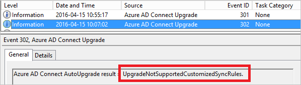

<properties
   pageTitle="Azure AD Connect：自动升级 | Azure"
   description="本主题介绍 Azure AD Connect sync 中的内置自动升级功能。"
   services="active-directory"
   documentationCenter=""
   authors="AndKjell"
   manager="StevenPo"
   editor=""/>

<tags
   ms.service="active-directory"
   ms.devlang="na"
   ms.topic="article"
   ms.tgt_pltfrm="na"
   ms.workload="identity"
   ms.date="08/24/2016"
   ms.author="andkjell"
   wacn.date="10/11/2016"/>

# Azure AD Connect：自动升级
此功能是随内部版本 1.1.105.0（于 2016 年 2 月发布）一起推出的。

## 概述
使用**自动升级**功能是确保 Azure AD Connect 安装始终保持最新状态的最简单方法。系统默认启用此功能，以便进行快速安装和 DirSync 升级。发布新版本时，你的安装会自动升级。

默认情况下，将针对以下方案启用自动升级：

- 快速设置安装和 DirSync 升级。
- 使用 SQL Express LocalDB，这是快速设置始终使用的选项。使用 SQL Express 的 DirSync 也将使用 LocalDB。
- AD 帐户是快速设置和 DirSync 创建的默认 MSOL\_ 帐户。
- Metaverse 中的对象少于 100,000 个。

可以使用 PowerShell cmdlet `Get-ADSyncAutoUpgrade` 来查看当前的自动升级状态。状态包括：

状态 | 注释
---- | ----
Enabled | 自动升级已启用。
已挂起 | 只能由系统设置。系统不再能够接收自动升级。
已禁用 | 自动升级已禁用。

可以使用 `Set-ADSyncAutoUpgrade` 在"已启用"与"已禁用"之间切换。应该只有系统才能设置"暂停"状态。

自动升级使用 Azure AD Connect Health 作为升级基础结构。为使自动升级正常工作，请确保根据 [Office 365 URL 和 IP 地址范围](https://support.office.com/article/Office-365-URLs-and-IP-address-ranges-8548a211-3fe7-47cb-abb1-355ea5aa88a2)中所述，在代理服务器中打开 **Azure AD Connect Health** 的 URL。

如果服务器上正在运行**同步服务管理器** UI，则会暂停升级，直到 UI 关闭为止。

## 故障排除
如果 Connect 安装未按预期自动升级，请遵循以下步骤来找出可能的错误。

首先，不建议在新版本发行的第一天就自动升级。由于升级前有刻意设计的随机性，因此你不用担心安装没有立即升级。

如果你认为有问题，请先运行 `Get-ADSyncAutoUpgrade` 确保已启用自动升级。

确认与 Azure AD 建立了连接后，可以深入了解事件日志。启动事件查看器，并查看**应用程序**事件日志。针对源 **Azure AD Connect 升级**的事件日志以及事件 ID 范围 **300-399** 添加筛选器。  
  

此时可以看到与自动升级状态关联的事件日志。  

结果代码前面会有包含状态概述的前缀。

结果代码前缀 | 说明
--- | ---
成功 | 安装已成功升级。
UpgradeAborted | 某种临时状态停止了升级。升级将会重试，预期稍后会成功。
UpgradeNotSupported | 系统中的某个配置阻止系统自动升级。升级将会重试，以查看状态是否已变化，但预期只能手动升级系统。

下面是最常见的消息列表。该列表并不完整，但结果消息应会明确说明问题所在。

结果消息 | 说明
--- | ---
**UpgradeAborted** |
UpgradeAbortedCouldNotSetUpgradeMarker | 无法写入注册表。
UpgradeAbortedInsufficientDatabasePermissions | 内置管理员组对数据库没有相应权限。请手动升级到最新版的 Azure AD Connect 以解决此问题。
UpgradeAbortedInsufficientDiskSpace | 没有足够的磁盘空间用于支持升级。
UpgradeAbortedSecurityGroupsNotPresent | 找不到且无法解析同步引擎使用的所有安全组。
UpgradeAbortedServiceCanNotBeStarted | NT 服务 **Azure AD Sync** 未能启动。
UpgradeAbortedServiceCanNotBeStopped | NT 服务 **Azure AD Sync** 未能停止。
UpgradeAbortedServiceIsNotRunning | NT 服务 **Azure AD Sync** 未运行。
UpgradeAbortedSyncCycleDisabled | [计划程序](/documentation/articles/active-directory-aadconnectsync-feature-scheduler/)中的 SyncCycle 选项已禁用。
UpgradeAbortedSyncExeInUse | 服务器上打开了 [Synchronization Service Manager UI](/documentation/articles/active-directory-aadconnectsync-service-manager-ui/)。
UpgradeAbortedSyncOrConfigurationInProgress | 安装向导正在运行，或者在计划程序外部计划了同步。
**UpgradeNotSupported** |
UpgradeNotSupportedCustomizedSyncRules | 你已将自己的自定义规则添加到配置中。
UpgradeNotSupportedDeviceWritebackEnabled | 你已启用[设备写回](/documentation/articles/active-directory-aadconnect-feature-device-writeback/)功能。
UpgradeNotSupportedGroupWritebackEnabled | 你已启用[组写回](/documentation/articles/active-directory-aadconnect-feature-preview/#group-writeback/)功能。
UpgradeNotSupportedInvalidPersistedState | 安装不是快速设置或 DirSync 升级。
UpgradeNotSupportedMetaverseSizeExceeeded | Metaverse 中的对象超过 100,000 个。
UpgradeNotSupportedMultiForestSetup | 你正在连接到多个林。快速安装只会连接到一个林。
UpgradeNotSupportedNonLocalDbInstall | 你使用的不是 SQL Server Express LocalDB 数据库。
UpgradeNotSupportedNonMsolAccount | [AD 连接器帐户](/documentation/articles/active-directory-aadconnect-accounts-permissions/#active-directory-account/)不再是默认的 MSOL\_ 帐户。
UpgradeNotSupportedStagingModeEnabled | 服务器已设置为[过渡模式](/documentation/articles/active-directory-aadconnectsync-operations/#staging-mode/)。
UpgradeNotSupportedUserWritebackEnabled | 你已启用[用户写回](/documentation/articles/active-directory-aadconnect-feature-preview/#user-writeback/)功能。

## 后续步骤
了解有关[将本地标识与 Azure Active Directory 集成](/documentation/articles/active-directory-aadconnect/)的详细信息。

<!---HONumber=Mooncake_0926_2016-->
