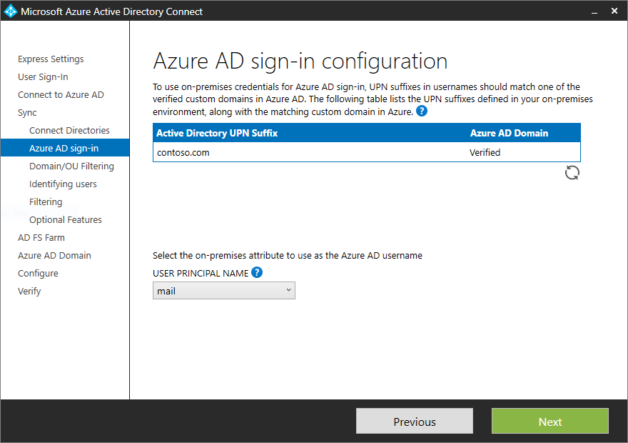
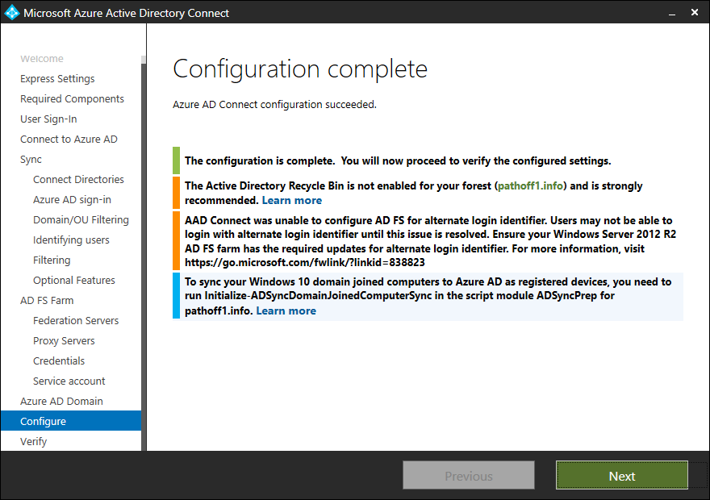

<properties
    pageTitle="使用 Azure AD Connect 进行 Active Directory 联合身份验证服务的管理和自定义 | Azure"
    description="使用 Azure AD Connect 管理 AD FS 并使用 Azure AD Connect 和 PowerShell 自定义用户的 AD FS 登录体验。"
    keywords="AD FS, ADFS, AD FS 管理, AAD Connect, Connect, 登录, AD FS 自定义, 修复信任, O365, 联合, 信赖方"
    services="active-directory"
    documentationcenter=""
    author="anandyadavmsft"
    manager="femila"
    editor="" />
<tags
    ms.assetid="2593b6c6-dc3f-46ef-8e02-a8e2dc4e9fb9"
    ms.service="active-directory"
    ms.workload="identity"
    ms.tgt_pltfrm="na"
    ms.devlang="na"
    ms.topic="article"
    ms.date="4/4/2016"
    wacn.date="05/22/2017"
    ms.author="anandy"
    ms.translationtype="Human Translation"
    ms.sourcegitcommit="8fd60f0e1095add1bff99de28a0b65a8662ce661"
    ms.openlocfilehash="0e55b5f8ca4618dac99a9da682693aed8664bab7"
    ms.contentlocale="zh-cn"
    ms.lasthandoff="05/12/2017" />

# 使用 Azure AD Connect 管理和自定义 Active Directory 联合身份验证服务
本文介绍如何使用 Azure Active Directory (Azure AD) Connect 管理和自定义 Active Directory 联合身份验证服务 (AD FS)。 另外，还介绍了可能需要针对完整的 AD FS 场配置执行的其他常见 AD FS 任务。

| 主题 | 内容 |
|:--- |:--- |
| **管理 AD FS** | |
| [修复信任](#repairthetrust) |如何修复与 Office 365 的联合信任。 |
| [使用备用登录 ID 与 Azure AD 联合](#alternateid) | 使用备用登录 ID 配置联合  |
| [添加 AD FS 服务器](#addadfsserver) |如何使用附加的 AD FS 服务器扩展 AD FS 场。 |
| [添加 AD FS Web 应用程序代理服务器](#addwapserver) |如何使用附加的 Web 应用程序代理 (WAP) 服务器扩展 AD FS 场。 |
| [添加联合域](#addfeddomain) |如何添加联合域。 |
| [更新 SSL 证书](/documentation/articles/active-directory-aadconnectfed-ssl-update/)| 如何更新 AD FS 场的 SSL 证书。 |
| **自定义 AD FS** | |
| [添加自定义公司徽标或插图](#customlogo) |如何使用公司徽标和插图自定义 AD FS 登录页。 |
| [添加登录说明](#addsignindescription) |如何添加登录页说明。 |
| [修改 AD FS 声明规则](#modclaims) |如何修改各种联合方案的 AD FS 声明。 |

## 管理 AD FS
使用 Azure AD Connect 向导，可以在最少的用户干预的 Azure AD Connect 中执行各种 AD FS 相关任务。 在通过运行向导来完成安装 Azure AD Connect 后，可以再次运行向导，以执行其他任务。

## 修复信任 
可以使用 Azure AD Connect 检查 AD FS 和 Azure AD 信任的当前运行状况并采取适当措施来修复信任。 请按照以下步骤修复 Azure AD 和 AD FS 信任。

1. 从其他任务列表中选择“修复 AAD 和 ADFS 信任”。
   

2. 在“连接到 Azure AD”页上，提供 Azure AD 的全局管理员凭据，然后单击“下一步”。
   

3. 在“远程访问凭据”页上，输入域管理员的凭据。

    

    单击“下一步”后，Azure AD Connect 将检查证书运行状况，并显示任何问题。

    

    “已准备好配置”页将显示为修复信任而将要执行的操作列表。

    

4. 单击“安装”修复信任。

> [AZURE.NOTE]
> Azure AD Connect 只能对自签名的证书进行修复或采取措施。 Azure AD Connect 无法修复第三方证书。

## 使用 AlternateID 与 Azure AD 进行联合
建议使本地用户主体名称 (UPN) 和云用户主体名称保持相同。 如果本地 UPN 使用不可路由的域（例如 Contoso.local），或由于本地应用程序依赖关系而无法更改，建议设置备用登录 ID。 备用登录 ID 允许配置登录体验，用户可以使用其 UPN 以外的属性（如邮件）登录。 用于 Azure AD Connect 中用户主体名称的属性默认为 Active Directory 中的 userPrincipalName 属性。 如果为用户主体名称选择任何其他属性，并使用 AD FS 进行联合，则 Azure AD Connect 将为备用登录 ID 配置 AD FS。 以下是为用户主体名称选择其他属性的一个示例：

为 AD FS 配置备用登录 ID 包括两个主要步骤：
1. **配置正确的颁发声明集**：已将 Azure AD 信赖方信任中的颁发声明规则修改为使用所选的 UserPrincipalName 属性作为用户的备用 ID。
2. **在 AD FS 配置中启用备用登录 ID**：已更新 AD FS 配置，以便 AD FS 可以使用备用 ID 查找相应林中的用户。 此配置支持 Windows Server 2012 R2（带 KB2919355）或更高版本上的 AD FS。 如果 AD FS 服务器为 2012 R2，则 Azure AD Connect 会检查是否存在所需的知识库 (KB)。 如果未检测到知识库 (KB)，则在配置完成后将显示一条警告，如下所示：

若要纠正缺少知识库 (KB) 情况下的配置，请安装所需的 [KB2919355](http://go.microsoft.com/fwlink/?LinkID=396590)，然后借助[修复 AAD 和 AD FS 信任](#repairthetrust)修复信任。

> [AZURE.NOTE]
> 有关 AlternateID 和手动配置步骤的详细信息，请阅读[配置备用登录 ID](https://technet.microsoft.com/windows-server-docs/identity/ad-fs/operations/configuring-alternate-login-id)

## 添加 AD FS 服务器 

> [AZURE.NOTE]
> 若要添加 AD FS 服务器，Azure AD Connect 需要 PFX 证书。 因此，只有使用 Azure AD Connect 配置了 AD FS 场，才能执行此操作。

1. 选择“部署其他联合服务器”，然后单击“下一步”。

    

2. 在“连接到 Azure AD”页上，输入 Azure AD 的全局管理员凭据，然后单击“下一步”。

    

3. 提供域管理员凭据。

    

4. Azure AD Connect 将要求你提供在使用 Azure AD Connect 配置新的 AD FS 场时提供的 PFX 文件的密码。 单击“输入密码”提供 PFX 文件的密码。

    

    

5. 在“AD FS 服务器”页上，输入要添加到 AD FS 场的服务器名称或 IP 地址。

    

6. 单击“下一步”并完成最终“配置”页。 Azure AD Connect 完成将服务器添加到 AD FS 场后，将提供验证连接性的选项。

    

    

## 添加 AD FS WAP 服务器 

> [AZURE.NOTE]
> 若要添加 WAP 服务器，Azure AD Connect 需要 PFX 证书。 因此，只有使用 Azure AD Connect 配置了 AD FS 场，才能执行此操作。

1. 从可用任务列表中选择“部署 Web 应用程序代理”。

    

2. 提供 Azure 全局管理员凭据。

    

3. 在“指定 SSL 证书”页上，为你在使用 Azure AD Connect 配置 AD FS 场时提供的 PFX 文件提供密码。
    

    

4. 添加要用作 WAP 服务器的服务器。 由于 WAP 服务器可能未加入域，因此向导将要求为要添加的服务器提供管理凭据。

    

5. 在“代理信任凭据”页上，提供管理凭据用于配置代理信任和访问 AD FS 场中的主服务器。

    

6. 在“已准备好配置”页上，向导显示将要执行的操作列表。

    

7. 单击“安装”完成配置。 完成配置后，向导将提供验证到服务器的连接性的选项。 单击“验证”检查连接性。

    

## 添加联合域 

使用 Azure AD Connect 可以轻松添加要与 Azure AD 联合的域。Azure AD Connect 将添加域用于联合身份验证，并修改声明规则，以便在你有多个域与 Azure AD 联合时，正确反映发布者。

1. 若要添加联合域，请选择任务“添加其他 Azure AD 域”。

    

2. 在向导的下一页上，提供 Azure AD 的全局管理员凭据。

    

3. 在“远程访问凭据”页上，提供域管理员凭据。

    

4. 在下一页上，向导将提供可与本地目录联合的 Azure AD 域的列表。 从列表中选择域。

    

    选择域后，向导将提供有关向导将采取的进一步操作以及配置产生的影响的适当信息。 在某些情况下，如果选择的域尚未在 Azure AD 中进行验证，则向导将提供帮助验证域的信息。 有关更多详细信息，请参阅[将自定义域名添加到 Azure Active Directory](/documentation/articles/active-directory-add-domain/)。

5. 单机“下一步” “已准备好配置”页将显示 Azure AD Connect 将要执行的操作列表。 单击“安装”完成配置。

    

## AD FS 自定义
以下部分提供有关自定义 AD FS 登录页时可能必须执行的一些常见任务的详细信息。

## 添加自定义公司徽标或插图 
若要更改“登录”页上显示的公司徽标，请使用以下 Windows PowerShell cmdlet 和语法。

> [AZURE.NOTE]
> 建议徽标维度为 260 x 35 @ 96 dpi，且文件大小不应超过 10 KB。

    Set-AdfsWebTheme -TargetName default -Logo @{path="c:\Contoso\logo.PNG"}

> [AZURE.NOTE]
> *TargetName* 参数是必填参数。 随 AD FS 一起发布的默认主题名为“默认”。

## 添加登录说明 
若要将登录页说明添加到“登录”页，请使用以下 Windows PowerShell cmdlet 和语法。

    Set-AdfsGlobalWebContent -SignInPageDescriptionText "
Sign-in to Contoso requires device registration. Click <A href='http://fs1.contoso.com/deviceregistration/'>here</A> for more information.
"

## 修改 AD FS 声明规则 
AD FS 支持丰富的声明语言，让你用来创建自定义声明规则。 有关详细信息，请参阅[声明规则语言的作用](https://technet.microsoft.com/zh-cn/library/dd807118.aspx)。

以下部分详细介绍了如何针对与 Azure AD 和 AD FS 联合身份验证有关的某些情况编写自定义规则。

### 属性中存在的值上的不可变 ID 条件
当对象将同步到 Azure AD 时，通过 Azure AD Connect，你可以指定一个属性以用作源锚点。 如果自定义属性中的值非空，你可能需要发出不可变的 ID 声明。

例如，可以选择“ms-ds-consistencyguid”作为源锚点的属性，并且需要发出 **ImmutableID** 作为 **ms-ds-consistencyguid** 以防属性具有反对自身的值。 如果没有反对属性的值，则发出 **objectGuid** 作为不可变 ID。 可以按以下部分中所述构造自定义声明规则集。

**规则 1：查询属性**

    c:[Type == "http://schemas.microsoft.com/ws/2008/06/identity/claims/windowsaccountname"]
    => add(store = "Active Directory", types = ("http://contoso.com/ws/2016/02/identity/claims/objectguid", "http://contoso.com/ws/2016/02/identity/claims/msdsconsistencyguid"), query = "; objectGuid,ms-ds-consistencyguid;{0}", param = c.Value);

在此规则中，将从 Active Directory 为用户查询 **ms-ds-consistencyguid** 和 **objectGuid** 的值。 请将应用商店名称更改为 AD FS 部署中可用的适当应用商店名称。 此外，根据对 **objectGuid** 和 **ms-ds-consistencyguid** 的定义，将声明类型更改为联合的正确声明类型。

此外，通过使用 **add** 而不使用 **issue**，避免为实体添加向外发出，并且可以使用这些值作为中间值。 确定了要用作不可变 ID 的值后，就可以在稍后的规则中发出声明。

**规则 2：检查用户是否存在 ms-ds-consistencyguid**

    NOT EXISTS([Type == "http://contoso.com/ws/2016/02/identity/claims/msdsconsistencyguid"])
    => add(Type = "urn:anandmsft:tmp/idflag", Value = "useguid");

此规则定义名为 **idflag** 的临时标志，当没有为用户填充的 **ms-ds-consistencyguid** 时，该标志设置为 **useguid**。 这背后的逻辑在于 AD FS 不允许空的声明。 因此，在规则 1 中添加声明 http://contoso.com/ws/2016/02/identity/claims/objectguid 和 http://contoso.com/ws/2016/02/identity/claims/msdsconsistencyguid 时，仅当为用户填充该值时会最终得到 **msdsconsistencyguid** 声明。 如果未填充该值，在 AD FS 中它就会作为空值出现，然后立即删除。 所有对象都具有 **objectGuid**，因此在执行规则 1 后声明将始终存在。

**规则 3：如果存在，将 ms-ds-consistencyguid 作为不可变 ID 发出**

    c:[Type == "http://contoso.com/ws/2016/02/identity/claims/msdsconsistencyguid"]
    => issue(Type = "http://schemas.xmlsoap.org/ws/2005/05/identity/claims/nameidentifier", Value = c.Value);

这是隐式的 **Exist** 检查。 如果声明的值存在，则将其作为不可变 ID 发布。 之前的示例使用 **nameidentifier** 声明。 需要将其更改为环境中不可变 ID 的适当声明类型。

**规则 4：如果 ms-ds-consistencyGuid 不存在，则将 objectGuid 作为不可变 ID 发出**

    c1:[Type == "urn:anandmsft:tmp/idflag", Value =~ "useguid"]
    && c2:[Type == "http://contoso.com/ws/2016/02/identity/claims/objectguid"]
    => issue(Type = "http://schemas.xmlsoap.org/ws/2005/05/identity/claims/nameidentifier", Value = c2.Value);

在此规则中，只检查临时标志 **idflag**。 根据该标志的值决定是否发出声明。

> [AZURE.NOTE]
> 这些规则的顺序非常重要。

### 具有子域 UPN 的 SSO
可以使用 Azure AD Connect 添加要联合的多个域（如[添加新联合域](/documentation/articles/active-directory-aadconnect-federation-management/#addfeddomain/)中所述）。 必须修改用户主体名称 (UPN) 声明，以便颁发者 ID 对应于根域而非子域，因为联合根域也涵盖子级。

默认情况下，发布者 ID 的声明规则设置为：

    c:[Type
    == “http://schemas.xmlsoap.org/claims/UPN“]

    => issue(Type = “http://schemas.microsoft.com/ws/2008/06/identity/claims/issuerid“, Value = regexreplace(c.Value, “.+@(?<domain>.+)“, “http://${domain}/adfs/services/trust/“));

默认规则只需使用 UPN 后缀，并将其用于颁发者 ID 声明中。 例如，John 是 sub.contoso.com 中的用户，而 contoso.com 与 Azure AD 联合。 John 在登录到 Azure AD 时输入 john@sub.contoso.com 作为用户名。 AD FS 中的默认颁发者 ID 声明规则按以下方式处理该名称：

    c:[Type == “http://schemas.xmlsoap.org/claims/UPN“]

    => issue(Type = “http://schemas.microsoft.com/ws/2008/06/identity/claims/issuerid“, Value = regexreplace(john@sub.contoso.com, “.+@(?<domain>.+)“, “http://${domain}/adfs/services/trust/“));

**声明值：** http://sub.contoso.com/adfs/services/trust/

若要只在颁发者声明值中包含根域，请更改声明规则，使其与以下内容相符：

    c:[Type == “http://schemas.xmlsoap.org/claims/UPN“]

    => issue(Type = “http://schemas.microsoft.com/ws/2008/06/identity/claims/issuerid“, Value = regexreplace(c.Value, “^((.*)([.|@]))?(?<domain>[^.]*[.].*)$”, “http://${domain}/adfs/services/trust/“));

## 后续步骤
了解有关[用户登录选项](/documentation/articles/active-directory-aadconnect-user-signin/)的详细信息。

<!---Update_Description: wording update -->