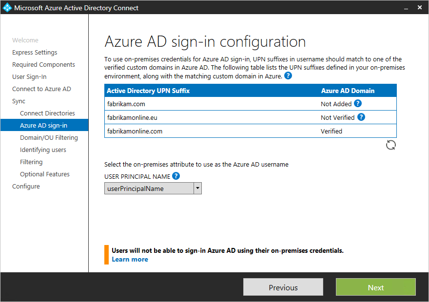

<properties
    pageTitle="Azure AD Connect 的自定义安装 | Azure"
    description="本文档详细介绍了 Azure AD Connect 的自定义安装选项。使用本文中的说明来通过 Azure AD Connect 安装 Active Directory。"
    services="active-directory"
    keywords="什么是 Azure AD Connect, 安装 Active Directory, Azure AD 所需的组件"
    documentationcenter=""
    author="billmath"
    manager="femila"/>
    
<tags
    ms.assetid="6d42fb79-d9cf-48da-8445-f482c4c536af"
    ms.service="active-directory"
    ms.workload="identity"
    ms.tgt_pltfrm="na"
    ms.devlang="na"
    ms.topic="get-started-article"
    ms.date="02/07/2017"
    ms.author="billmath"    
    wacn.date="03/07/2017"/>  

# Azure AD Connect 的自定义安装
当你希望更多的安装选项时，可以使用 Azure AD Connect“自定义设置”。如果拥有多个林或希望配置未覆盖在快速安装中的可选功能，可以使用它。它适用于[**快速安装**](/documentation/articles/active-directory-aadconnect-get-started-express/)不能满足部署或拓扑的所有情况。

开始安装 Azure AD Connect 之前，确保[下载 Azure AD Connect](http://go.microsoft.com/fwlink/?LinkId=615771)，完成 [Azure AD Connect：硬件和先决条件](/documentation/articles/active-directory-aadconnect-prerequisites/)中的预先准备步骤。此外，确保拥有 [Azure AD Connect 帐户和权限](/documentation/articles/active-directory-aadconnect-accounts-permissions/)中所述的必需帐户。

如果自定义的设置不匹配拓扑，例如，升级 DirSync，请参阅相关文档，了解其他情况。

## Azure AD Connect 的自定义设置安装
### 快速设置
在此页面上，单击“自定义”，开始自定义的设置安装。

### 安装所需的组件 
安装同步服务时，可以将可选配置部分保留未选中状态，Azure AD Connect 会自动完成所有设置。这会设置 SQL Server 2012 Express LocalDB 实例、创建相应的组并分配权限。如果想要更改默认设置，可以使用下表来了解可用的可选配置选项。

| 可选配置 | 说明 |
| --- | --- |
| 使用现有的 SQL Server |允许指定 SQL Server 名称和实例名称。如果已有一个要使用的数据库服务器，请选择此选项。如果 SQL Server 没有启用浏览，请在“实例名称”中输入实例名称，后接逗号和端口号。 |
| 使用现有的服务帐户 |默认情况下，Azure AD Connect 将为同步服务创建要使用的本地服务帐户。密码是自动生成的，而安装 Azure AD Connect 的人员并不知道该密码。如果使用远程 SQL 服务器或使用需要身份验证的代理，则需要在域中创建一个服务帐户并知道密码。在这些情况下，请输入要使用的服务帐户。确保运行安装的用户是 SQL 中的 SA，以便可以创建服务帐户的登录名。请参阅 [Azure AD Connect 帐户和权限](/documentation/articles/active-directory-aadconnect-accounts-permissions/#custom-settings-installation/) |
| 指定自定义同步组 |默认情况下，在安装同步服务时，Azure AD Connect 将在服务器本地创建四个组。这些组是：管理员组、操作员组、浏览组和密码重置组。在此可以指定自己的组。组必须在服务器本地，并且不能位于域中。 |

### 用户登录
在安装所需的组件后，需要选择用户单一登录方法。下表提供了可用选项的简短说明。若要全面了解登录方法，请参阅[用户登录](/documentation/articles/active-directory-aadconnect-user-signin/)。

  

| 单一登录选项 | 说明 |
| --- | --- |
| 密码同步 |用户能够用在其本地网络中使用的相同密码登录到 Microsoft 云服务，例如 Office 365。用户密码将作为密码哈希同步到 Azure AD，并在云中进行身份验证。有关详细信息，请参阅[密码同步](/documentation/articles/active-directory-aadconnectsync-implement-password-synchronization/)。 |
|直通身份验证（预览）|用户能够用在其本地网络中使用的相同密码登录到 Microsoft 云服务，例如 Office 365。将用户密码传递到本地 Active Directory 控制器进行验证。
| 使用 AD FS 进行联合身份验证 |用户能够用在其本地网络中使用的相同密码登录到 Microsoft 云服务，例如 Office 365。用户被重定向到他们的本地 AD FS 实例以进行登录，并在本地完成身份验证。 |
| 不配置 |不安装和配置任一功能。如果已有第三方联合服务器或部署了另一个现有解决方案，请选择此选项。 |
|启用单一登录|此选项可用于密码同步和直通身份验证，并为公司网络中的桌面用户提供单一登录体验。有关详细信息，请参阅[单一登录](/documentation/articles/active-directory-aadconnect-sso/)。 请注意，对于 AD FS 客户此选项不可用，因为 AD FS 已提供相同级别的单一登录。 （如果未同时释放 PTA）
|登录选项|此选项可用于密码同步客户，并为公司网络中的桌面用户提供单一登录体验。 有关详细信息，请参阅[单一登录](/documentation/articles/active-directory-aadconnect-sso/)。 请注意，对于 AD FS 客户此选项不可用，因为 AD FS 已提供相同级别的单一登录。

### 连接到 Azure AD
在“连接到 Azure AD”屏幕中，输入全局管理员的帐户和密码。如果在前一个页面选择了“与 AD FS 联合”，不要以计划启用联合的域中的帐户登录。建议使用默认“partner.onmschina.cn”域中的帐户，Azure AD 目录随附该域。

此帐户只用于在 Azure AD 中创建服务帐户，向导完成后将不会使用。

如果全局管理员帐户已启用 MFA，则需要在登录弹出窗口中再次提供密码，并完成 MFA 质询。该质询可能是提供验证码或打电话。

如果收到错误消息并且出现连接问题，请参阅[排查连接问题](/documentation/articles/active-directory-aadconnect-troubleshoot-connectivity/)。

## “同步”部分下的页面

### 连接你的目录 
若要连接到你的 Active Directory 域服务，Azure AD Connect 工具需要使用具有足够权限的帐户的凭据。可以采用 NetBios 或 FQDN 格式输入域部分，即 FABRIKAM\\syncuser 或 fabrikam.com\\syncuser。此帐户可以是普通的用户帐户，因为该帐户只需默认的读取权限。不过，根据你的情况，可能会需要更多权限。若要了解详细信息，请参阅 [Azure AD Connect 帐户和权限](/documentation/articles/active-directory-aadconnect-accounts-permissions/#create-the-ad-ds-account/)

### Azure AD 登录配置
在此页中，可以查看本地 AD DS 中存在的 UPN 域，以及已在 Azure AD 中验证的 UPN 域。还可以在此页中配置要用于 userPrincipalName 的属性。

查看标记为“未添加”和“未验证”的每个域。确保使用的域已在 Azure AD 中验证。验证域后，单击“刷新”符号。若要了解详细信息，请参阅[添加和验证域](/documentation/articles/active-directory-add-domain/)

**UserPrincipalName** - 属性 userPrincipalName 是用户登录 Azure AD 和 Office 365 时使用的属性。应在同步处理用户前在 Azure AD 中对使用的域（也称为 UPN 后缀）进行验证。Microsoft 建议保留默认属性 userPrincipalName。如果此属性不可路由且无法验证，可以选择另一个属性。例如，可以选择 email 作为保存登录 ID 的属性。使用除 userPrincipalName 以外的其他属性被称为“替代 ID”。“替代 ID”属性值必须遵循 RFC822 标准。替代 ID 可以配合密码同步和联合使用。

>[AZURE.NOTE]
启用直通身份验证时必须具有至少一个已验证的域，以便继续完成此向导。

> [AZURE.WARNING]
所有 Office 365 工作负荷都不允许使用替代 ID。若要了解详细信息，请参阅[配置备用登录 ID](https://technet.microsoft.com/zh-cn/library/dn659436.aspx)。
>
>

### 域和 OU 筛选 
默认情况下将同步所有域和 OU。如果不想将某些域或 OU 同步到 Azure AD，可以取消选择这些域和 OU。

向导中的此页面用于配置基于域和基于 OU 的筛选。如果计划进行更改，则请在进行相应更改之前，参阅[基于域的筛选](/documentation/articles/active-directory-aadconnectsync-configure-filtering/#domain-based-filtering/)和[基于 OU 的筛选](/documentation/articles/active-directory-aadconnectsync-configure-filtering/#organizational-unitbased-filtering/)。某些 OU 对于功能很重要，不应将其取消选中。

如果使用基于 OU 的筛选，以后添加的新 OU 默认会同步。如果希望行为是不同步新 OU，可在向导完成后，使用[基于 OU 的筛选](/documentation/articles/active-directory-aadconnectsync-configure-filtering/#organizational-unitbased-filtering/)来配置此行为。

如果打算使用[基于组的筛选](#sync-filtering-based-on-groups)，请确保包含该组所在的 OU，而未使用 OU 筛选将该 OU 筛选掉。OU 筛选将在基于组的筛选之前评估。

由于防火墙限制，也可能无法连接到某些域。默认情况下未选择这些域，并且会出现警告。

如果你看到此警告，请确认确实无法访问这些域，并且该警报在你的意料之中。

### 唯一标识你的用户
“跨林匹配”功能允许定义如何在 Azure AD 中呈现 AD DS 林中的用户。一个用户可以在所有林中只呈现一次，也可以使用已启用和已禁用帐户的组合。在某些林中，用户还可以被呈现为联系人。

  

| 设置 | 说明 |
| --- | --- |
| [用户在所有林中只呈现一次](/documentation/articles/active-directory-aadconnect-topologies/#multiple-forests-single-azure-ad-tenant/) |将所有用户在 Azure AD 中创建为单独的对象。不会在 Metaverse 中联接对象。 |
| [邮件属性](/documentation/articles/active-directory-aadconnect-topologies/#multiple-forests-single-azure-ad-tenant/) |如果邮件属性在不同的林中具有相同的值，此选项将联接用户和联系人。当已使用 GALSync 创建了联系人时，请使用此选项。 |
| [ObjectSID 和 msExchangeMasterAccountSID/ msRTCSIP-OriginatorSid](/documentation/articles/active-directory-aadconnect-topologies/#multiple-forests-single-azure-ad-tenant/) |此选项将帐户林中的已启用用户与资源林中的已禁用用户进行联接。在 Exchange 中，此配置称为链接邮箱。如果只使用 Lync 并且资源林中没有 Exchange，也可以使用此选项。 |
| sAMAccountName 和 MailNickName |此选项根据预期可以在其中找到用户登录 ID 的属性进行联接。 |
| 特定的属性 |此选项允许选择自己的属性。**限制：**确保选择已可在 Metaverse 中找到的属性。如果选择自定义属性（不在 Metaverse 中），向导将无法完成。 |

**源定位点** - sourceAnchor 属性是一个在用户对象的生命周期内不会改变的属性。它是链接本地用户与 Azure AD 中用户的主密钥。由于无法更改该属性，因此必须规划好要使用的合适属性。objectGUID 就是不错的候选项。除非在林/域之间移动用户帐户，否则此属性不会更改。在要在林间移动帐户的多林环境中，必须使用另一个属性，例如具有 employeeID 的属性。避免某人结婚时会改变的属性，或避免会更改分配的属性。由于不可以使用带有 @ 符号的属性，因此无法使用 email 和 userPrincipalName。属性也区分大小写，因此在林间移动对象时，请务必保留大小写。二进制属性采用 base64 编码，但其他属性类型会保留未编码状态。在联合方案和某些 Azure AD 接口中，此属性也称为 immutableID。可以在[设计概念](/documentation/articles/active-directory-aadconnect-design-concepts/#sourceanchor/)中找到有关源定位点的详细信息。

### 根据组同步筛选 
按组筛选功能可让你只同步一小部分的对象来进行试验。若要使用此功能，请在本地 Active Directory 中针对此目的创建一个组。然后添加应该以直属成员身份与 Azure AD 同步的用户和组。稍后可以在此组中添加和删除用户，以维护应该要在 Azure AD 中显示的对象列表。要同步的所有对象必须是组的直属成员。用户、组、联系人和计算机/设备都必须是直属成员。系统不会解析嵌套组成员身份。添加某个组作为成员时，只会添加该组本身，而不添加其成员。

> [AZURE.WARNING]
此功能仅用于支持试验部署。请不要将其用于成熟的生产部署。
>
>

在成熟的生产部署中，往往很难维护包含要同步的所有对象的单个组。在这种情况下，你应该使用[配置筛选](/documentation/articles/active-directory-aadconnectsync-configure-filtering/)中所述的方法之一。

### 可选功能 
此屏幕可让你针对特定方案选择可选功能。

> [AZURE.WARNING]
如果当前启用了 DirSync 或 Azure AD Sync，请勿激活 Azure AD Connect 中的任何写回功能。
>
>

| 可选功能 | 说明 |
| --- | --- |
| Exchange 混合部署 |Exchange 混合部署功能使 Exchange 邮箱能够在本地和 Office 365 中共存。Azure AD Connect 将特定的[属性](/documentation/articles/active-directory-aadconnectsync-attributes-synchronized/#exchange-hybrid-writeback/)集从 Azure AD 同步回本地目录。 |
| Azure AD 应用程序和属性筛选 |通过启用 Azure AD 应用和属性筛选，可以定制同步的属性集。此选项将在向导中额外添加两个配置页。有关详细信息，请参阅 [Azure AD 应用程序和属性筛选](#azure-ad-app-and-attribute-filtering)。 |
| 密码同步 |如果选择了联合作为登录解决方案，则可以启用此选项。然后，可将密码同步用作备份选项。若要了解其他信息，请参阅[密码同步](/documentation/articles/active-directory-aadconnectsync-implement-password-synchronization/)。  如果选择了直通身份验证，则默认情况下启用此选项，以确保支持旧客户端，并将其作为备用选项。若要了解其他信息，请参阅[密码同步](/documentation/articles/active-directory-aadconnectsync-implement-password-synchronization/)。|
| 组写回 |如果你使用了“Office 365 组”功能，则可以在本地 Active Directory 中呈现这些组。仅当本地 Active Directory 中存在 Exchange 时，才可以使用此选项。若要了解详细信息，请参阅[组写回](/documentation/articles/active-directory-aadconnect-feature-preview/#group-writeback/)。 |
| 目录扩展属性同步 |通过启用目录扩展属性同步，可将指定的属性同步到 Azure AD。若要了解详细信息，请参阅[目录扩展](/documentation/articles/active-directory-aadconnectsync-feature-directory-extensions/)。 |

### Azure AD 应用程序和属性筛选 
如果想要限制同步到 Azure AD 的属性，请通过选择正在使用的服务来启动。如果在此页面上进行配置更改，必须通过重新运行安装向导来明确选择新的服务。

此页面将根据上一步选择的服务来显示要同步的所有属性。此列表是要同步的所有对象类型的组合。如果需要禁止同步某些特定属性，可以取消选中这些属性。

  

> [AZURE.WARNING]
删除属性可能会影响功能。若要了解最佳做法和建议，请参阅[同步的属性](/documentation/articles/active-directory-aadconnectsync-attributes-synchronized/#attributes-to-synchronize/)。
>
>

### 目录扩展属性同步
可以使用组织添加的自定义属性或 Active Directory 中的其他属性，在 Azure AD 中扩展架构。若要使用这项功能，请在“可选功能”页上选择“目录扩展属性同步”。可以在此页上选择要同步的其他属性。

若要了解详细信息，请参阅[目录扩展](/documentation/articles/active-directory-aadconnectsync-feature-directory-extensions/)。

### 启用单一登录 (SSO)
配置单一登录以将其用于密码同步或直通身份验证是一个简单的过程，只需为要同步到 Azure AD 的每个林完成一次即可。配置过程包括以下两个步骤：

1.	在本地 Active Directory 中创建所需的计算机帐户。
2.	配置客户端计算机的 Intranet 区域来支持单一登录。

#### 在 Active Directory 中创建计算机帐户
对于在 Azure AD Connect 中添加的每个林，需要提供域管理员凭据，以便在每个林中创建计算机帐户。凭据仅用于创建帐户，而不会存储，也不会用于其他任何操作。只需在 Azure AD Connect 向导的“启用单一登录”页上添加凭据，如下所示：

  

>[AZURE.NOTE]
如果不想要对某个特定的林使用单一登录，可以跳过该林。

#### 配置客户端计算机的 Intranet 区域
为了确保客户端在 Intranet 区域中自动登录，需确保两个 URL 是 Intranet 区域的一部分。这样就可以确保已加入域的计算机在连接到企业网络后，向 Azure AD 自动发送 Kerberos 票证。在安装了组策略管理工具的计算机上执行以下操作。

1.	打开组策略管理工具
2.	编辑将应用于所有用户的组策略。例如，默认域策略。
3.	导航到“用户配置\\管理模板\\Windows 组件\\Internet Explorer\\Internet 控制面板\\安全性”页，然后选择“区域分配列表的站点”，如下图所示。
4.	启用策略，并在对话框中输入以下两项。

		Value: `https://autologon.microsoftazuread-sso.com`  
		Data: 1  
		Value: `https://aadg.chinacloudapi.cn.nsatc.net`  
		Data: 1

5.	结果如下图所示：

	

6.	单击“确定”两次。

## 配置与 AD FS 的联合 
只需单击几下鼠标，请能使用 Azure AD Connect 配置 AD FS。配置之前需要做好以下准备。

- 已启用远程管理的、用作联合服务器的 Windows Server 2012 R2 服务器
- 已启用远程管理的、用作 Web 应用程序代理服务器的 Windows Server 2012 R2 服务器
- 要使用的联合身份验证服务名称（例如 sts.contoso.com）的 SSL 证书

### AD FS 配置先决条件 
若要使用 Azure AD Connect 配置 AD FS 场，请确保已在远程服务器上启用 WinRM。此外，请仔细查看[表 3 - Azure AD Connect 和联合服务器/WAP](/documentation/articles/active-directory-aadconnect-ports/#table-3---azure-ad-connect-and-ad-fs-federation-serverswap/) 中列出的端口要求。

### 创建新的 AD FS 场或使用现有的 AD FS 场
可以使用现有的 AD FS 场，或选择创建新的 AD FS 场。如果选择创建新的场，则需要提供 SSL 证书。如果 SSL 证书受密码保护，系统会提示你输入密码。

如果选择使用现有 AD FS 场，将直接转到一个屏幕，你可以在其中配置 AD FS 与 Azure AD 之间的信任关系。

### 指定 AD FS 服务器
输入要在其中安装 AD FS 的服务器。可以根据容量规划需求添加一个或多个服务器。执行此配置之前，请将所有服务器加入 Active Directory。Microsoft 建议安装一台 AD FS 服务器用于测试和试验部署。然后，在完成初始配置之后通过再次运行 Azure AD Connect，根据缩放需求添加和部署更多的服务器。

> [AZURE.NOTE]
在执行此配置之前，请确保所有服务器已加入 AD 域。
>
>

### 指定 Web 应用程序代理服务器
输入要用作 Web 应用程序代理服务器的服务器。Web 应用程序代理服务器部署在外围网络中（面向 Extranet），支持来自 Extranet 的身份验证请求。可以根据容量规划需求添加一个或多个服务器。Microsoft 建议安装一台 Web 应用程序代理服务器用于测试和试验部署。然后，在完成初始配置之后通过再次运行 Azure AD Connect，根据缩放需求添加和部署更多的服务器。我们建议使用数量相当的代理服务器，以满足来自 Intranet 的身份验证要求。

> [AZURE.NOTE]
> <li> 如果使用的帐户不是 AD FS 服务器上的本地管理员，系统将提示提供管理员凭据。</li>
> <li> 在运行此步骤之前，请确保 Azure AD Connect 服务器与 Web 应用程序代理服务器之间已建立 HTTP/HTTPS 连接。</li>
> <li> 确保 Web 应用程序服务器与 AD FS 服务器之间的 HTTP/HTTPS 连接允许通过身份验证请求。</li>
>
>

系统将提示输入凭据，使 Web 应用程序服务器可以创建与 AD FS 服务器的安全连接。这些凭据需是 AD FS 服务器上的本地管理员。

### 指定 AD FS 服务的服务帐户
AD FS 服务需要域服务帐户来验证用户，以及在 Active Directory 中查找用户信息。它可以支持两种类型的服务帐户：

- **组托管服务帐户** - Active Directory 域服务中随 Windows Server 2012 一起引入。此类型的帐户提供 AD FS 之类的服务，让你可以使用单个帐户，且不需要定期更新帐户密码。如果 AD FS 服务器所属的域中已有 Windows Server 2012 域控制器，请使用此选项。
- **域用户帐户** - 此类型的帐户会请求你提供密码，并在密码更改或过期时定期更新密码。仅当 AD FS 服务器所属的域中没有 Windows Server 2012 域控制器时，才使用此选项。

如果选择了组托管的服务帐户且从未在 Active Directory 中使用过此功能，则系统会提示输入企业管理员凭据。这些凭据用于启动密钥存储，以及在 Active Directory 中启用该功能。

### 选择要联合的 Azure AD 域
此配置用于设置 AD FS 与 Azure AD 之间的联合关系。它将 AD FS 配置为向 Azure AD 颁发安全令牌，并将 Azure AD 配置为信任来自此特定 AD FS 实例的令牌。此页只允许在初始安装中配置单个域。以后可以通过再次运行 Azure AD Connect 来配置其他域。

### 验证选择用于联合的 Azure AD 域 
选择要联合的域时，Azure AD Connect 将提供所需的信息来验证尚未验证的域。请参阅[添加和验证域](/documentation/articles/active-directory-add-domain/)，了解如何使用此信息。

> [AZURE.NOTE]
AD Connect 尝试在配置阶段验证域。如果继续进行配置但未添加所需的 DNS 记录，向导将无法完成配置。
>
>

## 配置和验证页面
在此页上进行配置。

> [AZURE.NOTE]
继续安装之前，如果配置了联合服务器，请确保已配置[联合服务器的名称解析](/documentation/articles/active-directory-aadconnect-prerequisites/#name-resolution-for-federation-servers/)。
>
>

### 过渡模式
在过渡模式下，可以同时设置新的同步服务器。系统仅支持将一台同步服务器导出到云中的一个目录。但如果想要从另一台服务器（例如运行 DirSync 的服务器）迁移，则可以启用过渡模式的 Azure AD Connect。启用后，同步引擎将像平时一样导入并同步数据，但不会将任何内容导出到 Azure AD。密码同步和密码写回功能将在过渡模式下禁用。

在过渡模式下，可以对同步引擎进行所需的更改，并复查要导出的内容。如果配置看起来正常，请再次运行安装向导，并禁用过渡模式。现在，已将数据从此服务器导出到 Azure AD。确保同时禁用其他服务器，以便只有一台服务器在主动导出。

若要了解详细信息，请参阅[过渡模式](/documentation/articles/active-directory-aadconnectsync-operations/#staging-mode/)。

### 验证联合配置
单击“验证”按钮后，Azure AD Connect 会验证 DNS 设置。

  

此外，请执行以下验证步骤：

- 在 Intranet 上，通过已加入域的计算机上的浏览器验证是否能够登录：连接到 https://login.partner.microsoftonline.cn，然后使用你的登录帐户验证登录。内置的 AD DS 管理员帐户未同步，因此无法用于验证。
- 验证是否能够从 Extranet 中的设备登录。在家庭计算机或移动设备上连接到 https://login.partner.microsoftonline.cn，并提供你的凭据。
- 验证富客户端登录。连接到 https://testconnectivity.microsoft.com，选择“Office 365”选项卡，然后选择“Office 365 单一登录测试”。

## 后续步骤
安装完成后，请注销并再次登录到 Windows，然后即可使用同步服务管理器或同步规则编辑器。

安装 Azure AD Connect 后，可以[验证安装并分配许可证](/documentation/articles/active-directory-aadconnect-whats-next/)。

若要了解在安装过程中启用的这些功能，请参阅[防止意外删除](/documentation/articles/active-directory-aadconnectsync-feature-prevent-accidental-deletes/)。

若要了解这些常见主题，请参阅[计划程序以及如何触发同步](/documentation/articles/active-directory-aadconnectsync-feature-scheduler/)。

了解有关[将本地标识与 Azure Active Directory 集成](/documentation/articles/active-directory-aadconnect/)的详细信息。

<!---HONumber=Mooncake_0227_2017-->
<!--Update_Description: wording update-->