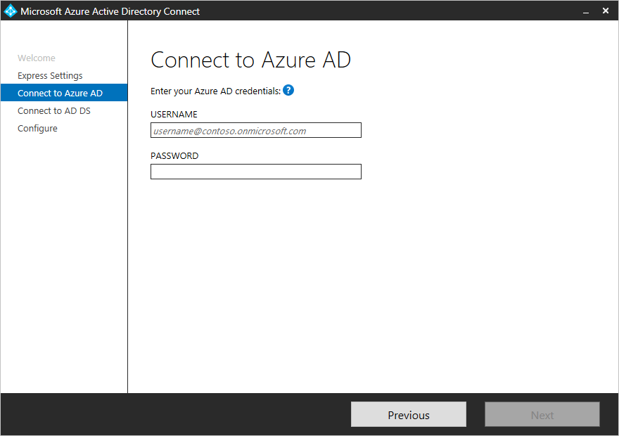
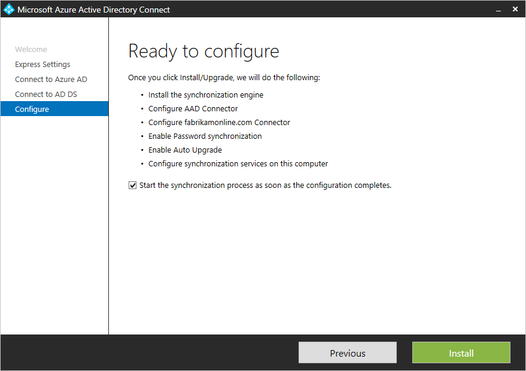

<properties
	pageTitle="Azure AD Connect：开始使用快速设置 | Azure"
	description="了解如何下载、安装和运行 Azure AD Connect 的设置向导。"
	services="active-directory"
	documentationCenter=""
	authors="andkjell"
	manager="femila"
	editor="curtand"/>  

<tags
	ms.service="active-directory"
	ms.workload="identity"
	ms.tgt_pltfrm="na"
	ms.devlang="na"
	ms.topic="get-started-article"
	ms.date="09/13/2016"
	ms.author="billmath;andkjell"
	wacn.date="10/11/2016"/>  

# 通过快速设置开始使用 Azure AD Connect
拥有单林拓扑并使用[密码同步](/documentation/articles/active-directory-aadconnectsync-implement-password-synchronization/)进行身份验证时，可以使用 Azure AD Connect **快速设置**。**快速设置**是默认选项，用于最常见的部署方案。只需按几下鼠标即可将本地目录扩展到云中。

开始安装 Azure AD Connect 之前，确保[下载 Azure AD Connect](http://go.microsoft.com/fwlink/?LinkId=615771)，完成 [Azure AD Connect：硬件和先决条件](/documentation/articles/active-directory-aadconnect-prerequisites/)中的预先准备步骤。

如果快速设置与拓扑不匹配，请参阅相关文档中的其他方案。

## Azure AD Connect 的快速安装

1. 以本地管理员身份登录到要安装 Azure AD Connect 的服务器。应该在要用作同步服务器的服务器上执行此操作。
2. 浏览到"AzureADConnect.msi"并双击。
3. 在"欢迎"屏幕上，选中对应的框，同意许可条款，然后单击"继续"。
4. 在"快速设置"屏幕上，单击"使用快速设置"。  

5. 在"连接到 Azure AD"屏幕上，输入 Azure AD 的全局管理员用户名和密码。单击"下一步"。  
 
如果收到错误消息并且出现连接问题，请参阅[排查连接问题](/documentation/articles/active-directory-aadconnect-troubleshoot-connectivity/)。
6. 在"连接到 AD DS"屏幕上，输入企业管理员帐户的用户名和密码。可以采用 NetBios 或 FQDN 格式输入域部分，即 FABRIKAM\\administrator 或 fabrikam.com\\administrator。单击"下一步"。  

7. 只有在未完成[预先准备步骤](/documentation/articles/active-directory-aadconnect-prerequisites/)中的[验证域](/documentation/articles/active-directory-add-domain/)步骤时，才会显示[**Azure AD 登录配置**](/documentation/articles/active-directory-aadconnect-user-signin/)页面。  
  
如果你看到此页，请查看标记为"未添加"和"未验证"的每个域。确保使用的域已在 Azure AD 中验证。验证域后，单击"刷新"符号。
8. 在"准备好配置"屏幕上，单击"安装"。
	- 在"准备好配置"页上，可以取消选中"配置完成后立即开始同步过程"复选框。若要进行其他配置（例如[筛选](/documentation/articles/active-directory-aadconnectsync-configure-filtering/)），应取消选中此复选框。如果取消选择此选项，向导将配置同步，但会保持禁用计划程序。通过[重新运行安装向导](/documentation/articles/active-directory-aadconnectsync-installation-wizard/)手动启用计划程序之前，计划程序不会运行。
	- 如果本地 Active Directory 中有 Exchange，也可以选择启用 [**Exchange 混合部署**](https://technet.microsoft.com/zh-cn/library/jj200581.aspx)。如果打算同时在云中和本地设置 Exchange 邮箱，请启用此选项。  

9. 安装完成后，单击"退出"。
10. 安装完成后，请注销并再次登录，然后即可使用同步服务管理器或同步规则编辑器。

## 后续步骤
安装 Azure AD Connect 后，可以[验证安装并分配许可证](/documentation/articles/active-directory-aadconnect-whats-next/)。

若要了解在安装过程中启用的这些功能，请参阅[自动升级](/documentation/articles/active-directory-aadconnect-feature-automatic-upgrade/)和[防止意外删除](/documentation/articles/active-directory-aadconnectsync-feature-prevent-accidental-deletes/)。

若要了解这些常见主题，请参阅[计划程序以及如何触发同步](/documentation/articles/active-directory-aadconnectsync-feature-scheduler/)。

了解有关[将本地标识与 Azure Active Directory 集成](/documentation/articles/active-directory-aadconnect/)的详细信息。

## 相关文档

主题 |  
--------- | ---------
Azure AD Connect 概述 | [将本地标识与 Azure Active Directory 集成](/documentation/articles/active-directory-aadconnect/)
使用自定义设置安装 | [Azure AD Connect 的自定义安装](/documentation/articles/active-directory-aadconnect-get-started-custom/)
从 DirSync 升级 | [从 Azure AD 同步工具 (DirSync) 升级](/documentation/articles/active-directory-aadconnect-dirsync-upgrade-get-started/)
用于安装的帐户 | [有关 Azure AD Connect 帐户和权限的详细信息](/documentation/articles/active-directory-aadconnect-accounts-permissions/)

<!---HONumber=Mooncake_0926_2016-->
