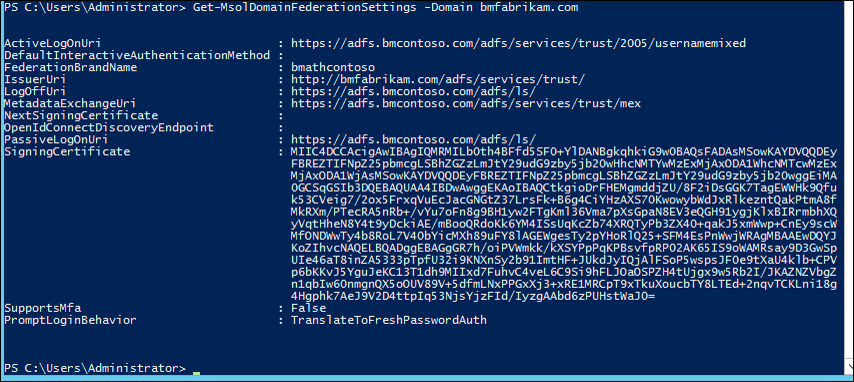
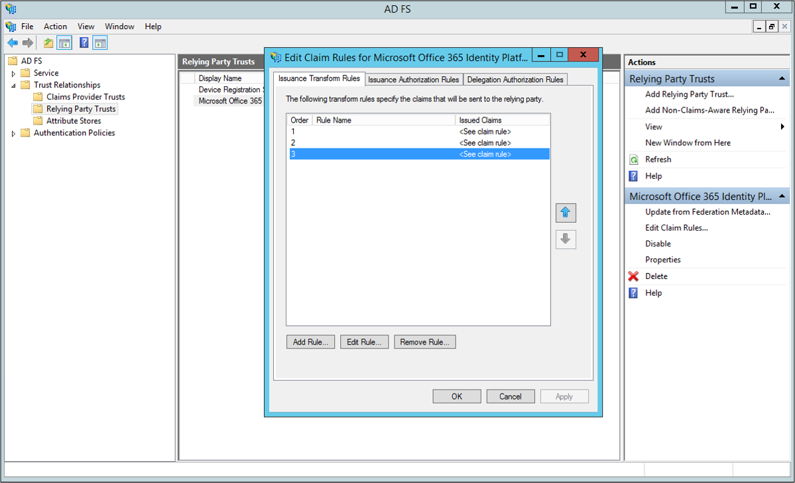

<properties
    pageTitle="Azure AD Connect 中的多个域"
    description="本文档介绍如何使用 O365 与 Azure AD 来设置和配置多个顶级域。"
    services="active-directory"
    documentationcenter=""
    author="billmath"
    manager="femila"
    editor="curtand" />
<tags
    ms.assetid="5595fb2f-2131-4304-8a31-c52559128ea4"
    ms.service="active-directory"
    ms.workload="identity"
    ms.tgt_pltfrm="na"
    ms.devlang="na"
    ms.topic="article"
    ms.date="02/07/2017"
    wacn.date="03/07/2017"
    ms.author="billmath" />

# 与 Azure AD 联合的多域支持
以下文档提供有关与 Office 365 或 Azure AD 域联合时如何使用多个顶级域和子域的指导。

## 多个顶级域支持
若要让多个顶级域与 Azure AD 联合，需要一些让单个顶级域联合时不需要的额外配置。

当域与 Azure AD 联合时，系统在 Azure 中的域上设置几个属性。其中一个重要属性是 IssuerUri。这是 Azure AD 用于标识与令牌关联的域的 URI。该 URI 不需要解析为任何内容，但是它必须是有效的 URI。默认情况下，Azure AD 在本地 AD FS 配置中将其设置为联合身份验证服务标识符的值。

> [AZURE.NOTE]
联合身份验证服务标识符是可唯一标识联合身份验证服务的 URI。联合身份验证服务是可充当安全令牌服务的 AD FS 实例。
> 
> 

可以使用 PowerShell 命令 `Get-MsolDomainFederationSettings -DomainName <your domain>` 查看 IssuerUri。

当我们想要添加多个顶级域时，问题便油然而生。例如，假设你已设置 Azure AD 和本地环境之间的联合。在本文中我使用 bmcontoso.com。现在我已添加第二个顶级域 bmfabrikam.com。

当我们尝试将 bmfabrikam.com 域转换为联合时，会收到错误。此错误的原因在于，Azure AD 有一项限制，此限制不允许多个域的 IssuerUri 属性拥有相同的值。

### SupportMultipleDomain 参数
若要解决此问题，我们需要使用 `-SupportMultipleDomain` 参数来添加不同的 IssuerUri。此参数可配合以下 cmdlet 使用：

- `New-MsolFederatedDomain`
- `Convert-MsolDomaintoFederated`
- `Update-MsolFederatedDomain`

此参数可让 Azure AD 根据域名称设置 IssuerUri。它将成为 Azure AD 中所有目录的唯一项目。使用参数可让 PowerShell 命令成功完成。

从新 bmfabrikam.com 域的设置中，可以发现以下内容：

请注意，`-SupportMultipleDomain` 不更改依然设置为指向 adfs.bmcontoso.com 上的联合身份验证服务的其他终结点。

`-SupportMultipleDomain` 的另一个功用是确保 AD FS 系统在颁发给 Azure AD 的令牌中包含正确的颁发者值。它通过使用用户 UPN 的域部分并将其设置为 IssuerUri 中的域，例如 https://{upn，来实现此目的。

因此，在 Azure AD 或 Office 365 上进行身份验证期间，将使用用户令牌中的 IssuerUri 元素来查找 Azure AD 中的域。如果找不到匹配项，身份验证将会失败。

例如，如果用户的 UPN 是 bsimon@bmcontoso.com，AD FS 颁发的令牌中的 IssuerUri 元素将设置为 http://bmcontoso.com/adfs/services/trust。这将与 Azure AD 配置匹配，并且身份验证会成功。

以下是实现此逻辑的自定义声明规则：

    c:[Type == "http://schemas.xmlsoap.org/claims/UPN"] => issue(Type = "http://schemas.microsoft.com/ws/2008/06/identity/claims/issuerid", Value = regexreplace(c.Value, ".+@(?<domain>.+)", "http://${domain}/adfs/services/trust/"));

> [AZURE.IMPORTANT]
若要在尝试添加新域或转换已添加的域时使用 -SupportMultipleDomain 开关，需要先设置联合信任才能以本机方式支持。
> 
> 

## 如何更新 AD FS 与 Azure AD 之间的信任
如果未设置 AD FS 与 Azure AD 实例之间的联合信任，可能需要重新创建此信任。这是因为当我们最初未使用 `-SupportMultipleDomain` 参数进行设置时，系统将 IssuerUri 设置为默认值。在以下屏幕截图中，可以看到 IssuerUri 的设置为 https://adfs.bmcontoso.com/adfs/services/trust。

回过头来，如果我们已成功地在 Azure AD 门户中添加新域，然后再尝试使用 `Convert-MsolDomaintoFederated -DomainName <your domain>` 转换，我们会收到以下错误。

如果尝试添加 `-SupportMultipleDomain` 开关，我们将收到以下错误：

只是尝试针对原始域运行 `Update-MsolFederatedDomain -DomainName <your domain> -SupportMultipleDomain` 也会导致错误。

使用以下步骤来添加其他顶级域。如果已添加域且未使用 `-SupportMultipleDomain` 参数，请从删除及更新原始域的步骤开始。如果尚未添加顶级域，可以从使用 Azure AD Connect 的 PowerShell 来添加域开始。

请使用以下步骤来删除 Microsoft Online 信任，然后更新原始域。

1. 在 AD FS 联合服务器上，打开“AD FS 管理”。
2. 展开左侧的“信任关系”和“信赖方信任”
3. 删除右侧的“Microsoft Office 365 标识平台”项。

4. 在已安装[适用于 Windows PowerShell 的 Azure Active Directory 模块](https://msdn.microsoft.com/zh-cn/library/azure/jj151815.aspx)的计算机上运行以下命令：`$cred=Get-Credential`。
5. 输入要联合的 Azure AD 域的全局管理员用户名和密码
6. 在 PowerShell 中输入 `Connect-MsolService -Credential $cred`
7. 在 PowerShell 中输入 `Update-MSOLFederatedDomain -DomainName <Federated Domain Name> -SupportMultipleDomain`。这是针对原始域输入的。因此，使用上述域后，命令将是：`Update-MsolFederatedDomain -DomainName bmcontoso.com -SupportMultipleDomain`

使用以下步骤通过 PowerShell 添加新的顶级域

1. 在已安装[适用于 Windows PowerShell 的 Azure Active Directory 模块](https://msdn.microsoft.com/zh-cn/library/azure/jj151815.aspx)的计算机上运行以下命令：`$cred=Get-Credential`。
2. 输入要联合的 Azure AD 域的全局管理员用户名和密码
3. 在 PowerShell 中输入 `Connect-MsolService -Credential $cred`
4. 在 PowerShell 中输入 `New-MsolFederatedDomain -SupportMultipleDomain -DomainName`

使用以下步骤通过 Azure AD Connect 添加新的顶级域

1. 从桌面或开始菜单启动 Azure AD Connect
2. 选择“添加其他 Azure AD 域”

3. 输入你的 Azure AD 和 Active Directory 凭据
4. 选择要配置联合的第二个域。

5. 单击“安装”

### 验证新的顶级域
使用 PowerShell 命令 `Get-MsolDomainFederationSettings -DomainName <your domain>` 可以查看更新的 IssuerUri。以下屏幕截图显示原始域上的联合设置已更新 http://bmcontoso.com/adfs/services/trust

新域上的 IssuerUri 已设置为 https://bmfabrikam.com/adfs/services/trust

## 子域的支持
添加子域时，因为 Azure AD 处理域的方式，导致子域继承父项的设置。这表示 IssuerUri 需要与父项匹配。

假设我有 bmcontoso.com，后来再添加 corp.bmcontoso.com。这表示来自 corp.bmcontoso.com 的用户的 IssuerUri 需是 **http://bmcontoso.com/adfs/services/trust.**。但是，根据前述针对 Azure AD 实现的标准规则，生成的令牌的颁发者是 **http://corp.bmcontoso.com/adfs/services/trust.**。由于它与域的所需值不匹配，因此身份验证将会失败。

### 如何启用子域的支持
若要解决此问题，需要更新 Microsoft Online 的 AD FS 信赖方信任。为此，你必须配置自定义声明规则，使其在构造自定义 Issuer 值时能够从用户的 UPN 后缀中删除任何子域。

以下声明将执行此操作：

    c:[Type == "http://schemas.xmlsoap.org/claims/UPN"] => issue(Type = "http://schemas.microsoft.com/ws/2008/06/identity/claims/issuerid", Value = regexreplace(c.Value, "^.*@([^.]+\.)*?(?<domain>([^.]+\.?){2})$", "http://${domain}/adfs/services/trust/"));

[AZURE.NOTE]
正则表达式中的最后一个数字设置根域中存在的父域数。我这里是 bmcontoso.com，因此两个父域是必需的。若要保留三个父域（即 corp.bmcontoso.com），则该数字为三。最终可以指示一个范围，并且始终会以匹配方式来匹配最大域数。“{2,3}”将匹配两到三个域（即 bmfabrikam.com 和 corp.bmcontoso.com）。

请使用以下步骤添加自定义声明，以支持子域。

1. 打开“AD FS 管理”
2. 右键单击 Microsoft Online RP 信任，然后选择“编辑声明规则”
3. 选择第三个声明规则并替换 

4. 将当前的声明：
   
        c:[Type == "http://schemas.xmlsoap.org/claims/UPN"] => issue(Type = "http://schemas.microsoft.com/ws/2008/06/identity/claims/issuerid", Value = regexreplace(c.Value, ".+@(?<domain>.+)","http://${domain}/adfs/services/trust/"));
   
       替换为
   
        c:[Type == "http://schemas.xmlsoap.org/claims/UPN"] => issue(Type = "http://schemas.microsoft.com/ws/2008/06/identity/claims/issuerid", Value = regexreplace(c.Value, "^.*@([^.]+\.)*?(?<domain>([^.]+\.?){2})$", "http://${domain}/adfs/services/trust/"));

      

5. 单击“确定”。单击“应用”。单击“确定”。关闭“AD FS 管理”。

<!---HONumber=Mooncake_0227_2017-->
