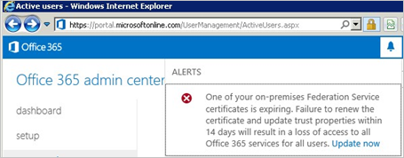

<properties
	pageTitle="Office 365 和 Azure AD 用户证书续订指南。| Azure"
	description="本文向 Office 365 用户说明了如何解决向其发送证书续订通知的电子邮件的问题。"
	services="active-directory"
	documentationCenter=""
	authors="billmath"
	manager="stevenpo"
	editor="curtand"/>

<tags
	ms.service="active-directory"
	ms.workload="identity"
	ms.tgt_pltfrm="na"
	ms.devlang="na"
	ms.topic="article"
	ms.date="08/08/2016"
	wacn.date="09/26/2016"
	ms.author="billmath"/>

# 续订 Office 365 和 Azure AD 的联合身份验证证书

##概述

为使 Azure Active Directory (Azure AD) 与 Active Directory 联合身份验证服务 (AD FS) 之间能够成功联合，AD FS 用来为 Azure AD 签名安全令牌的证书应该匹配 Azure AD 中所配置的证书。任何不匹配情况都可能导致信任破坏。Azure AD 可确保此信息在部署 AD FS 和 Web 应用程序代理（用于 Extranet 访问）时保持同步。

本文提供一些附加信息，帮助你在以下情况下管理令牌签名证书，并使证书能够与 Azure AD 保持同步：

* 未部署 Web 应用程序代理，因此无法在 Extranet 中获取联合元数据。
* 未对令牌签名证书使用默认的 AD FS 配置。
* 你正在使用第三方标识提供者。

## 令牌签名证书的默认 AD FS 配置

令牌签名证书和令牌解密证书通常是自签名证书，有效期为一年。默认情况下，AD FS 包含名为 **AutoCertificateRollover** 的自动续订进程。如果你使用的是 AD FS 2.0 或更高版本，Office 365 和 Azure AD 会在你的证书过期之前自动对其进行更新。

### 从 Office 365 门户或电子邮件续订通知

>[AZURE.NOTE] 如果你收到电子邮件或门户通知，要求你续订 Office 证书，请参阅[管理对令牌签名证书的更改](#managecerts)，检查是否需要采取任何操作。Microsoft 已知可能有问题会导致发送证书续订通知，即使并不需要用户采取任何操作。

Azure AD 将尝试监视联合元数据，并按照此元数据的指示更新令牌签名证书。在令牌签名证书过期前 30 天，Azure AD 会通过轮询联合元数据，检查是否已有新的证书。

* 如果它能成功轮询联合元数据并检索到新证书，则不会向用户发送电子邮件通知，或者在 Office 365 门户中显示警告。
* 如果由于无法访问联合元数据或者未启用自动证书滚动更新而无法检索新的令牌签名证书，Azure AD 将发出电子邮件通知，并在 Office 365 门户中显示警告。

  

>[AZURE.IMPORTANT] 如果使用 AD FS，为确保业务连续性，请确认服务器具有以下更新，以免因已知问题而导致身份验证失败。这可以减少在此续订期间和未来续订期间出现已知的 AD FS 代理服务器问题：
>
>Server 2012 R2 — [Windows Server 2014 年 5 月汇总](http://support.microsoft.com/kb/2955164)
>
>Server 2008 R2 和 2012 — [在 Windows Server 2012 或 Windows 2008 R2 SP1 中通过代理进行身份验证失败](http://support.microsoft.com/kb/3094446)

## 检查是否需要更新证书 

### 步骤 1：检查 AutoCertificateRollover 状态

在 AD FS 服务器上打开 Microsoft Powershell。确保 AutoCertRollover 值设置为 TRUE

	Get-Adfsproperties

[AZURE.NOTE] 如果你使用的是 AD FS 2.0，请先运行 Add-Pssnapin Microsoft.Adfs.Powershell。

### 步骤 2：确认 AD FS 和 Azure AD 已同步

在 AD FS 服务器上打开 Azure AD PowerShell 提示符，并连接到 Azure AD。

>[AZURE.NOTE] 可在[此处](https://technet.microsoft.com/library/jj151815.aspx)下载 Azure AD PowerShell。

	Connect-MsolService

检查 AD FS 和 Azure AD 信任属性中针对指定域配置的证书。

	Get-MsolFederationProperty -DomainName <domain.name> | FL Source, TokenSigningCertificate

如果这两个输出中的指纹匹配，则表示你的证书已与 Azure AD 同步。

### 步骤 3：检查证书是否即将到期

在 Get-MsolFederationProperty 或 Get-AdfsCertificate 输出中的“Not After”下面检查日期。 如果日期相隔不到 30 天，则应该采取操作。

### 后续步骤

| AutoCertificateRollover | 证书与 Azure AD 同步 | 可公开访问联盟元数据 | 有效期 | 操作 |
|:-----------------------:|:-----------------------:|:-----------------------:|:-----------------------:|:-----------------------:|
| 是 | 是 | 是 | - | 无需操作。请参阅[自动续订令牌签名证书](#autorenew)。| 
| 是 | 否 | - | 不到 15 天 | 立即续订。请参阅[手动续订令牌签名证书](#manualrenew)。| 
| 否 | - | - | 不到 30 天 | 立即续订。请参阅[手动续订令牌签名证书](#manualrenew)。|

[-] 无关紧要

##  自动续订令牌签名证书（建议）
如果同时满足以下两个条件，则不需要执行任何手动步骤：
- 你已部署 Web 应用程序代理，能够从 Extranet 访问联合元数据。
- 你使用的是 AD FS 默认配置（已启用 AutoCertificateRollover）。

检查以下事项以确认能够自动更新证书。

**1.AD FS 属性 AutoCertificateRollover 必须设置为 True。** 这表示 AD FS 会在旧证书到期之前，自动生成新的令牌签名证书和令牌解密证书。

从公共 Internet（企业网络之外）上的计算机导航到以下 URL，查看你的联合身份验证元数据是否可以公开访问：

https://(your_FS_name)/federationmetadata/2007-06/federationmetadata.xml

其中，`(your_FS_name)` 将替换为你组织使用的联合身份验证服务主机名，例如 fs.contoso.com。如果你能够成功验证这两项设置，则无需执行任何其他操作。

示例：https://fs.contoso.com/federationmetadata/2007-06/federationmetadata.xml

## 手动续订令牌签名证书 

你可以选择手动续订令牌签名证书。例如，在以下情况下，可能更合适手动续订：
* 令牌签名证书不是自签名证书。这种情况最常见的原因是，你的组织通过组织证书颁发机构来管理注册的 AD FS 证书。
* 网络安全性不允许公开联合元数据。

在这些案例中，每当更新令牌签名证书时，还必须使用 PowerShell 命令 Update-MsolFederatedDomain 更新 Office 365 域。

### 步骤 1：确保 AD FS 具有新的令牌签名证书

**非默认配置**

如果你使用 AD FS 的非默认配置，即，**AutoCertificateRollover** 设置为 **False**，则很有可能你使用的是自定义证书（非自签名）。有关如何续订 AD FS 令牌签名证书的详细信息，请阅读 [Guidance for customers not using AD FS self-signed certificates](https://msdn.microsoft.com/library/azure/JJ933264.aspx#BKMK_NotADFSCert)（针对未使用 AD FS 自签名证书的客户的指南）。

**无法公开获取联盟元数据**

另一方面，如果 **AutoCertificateRollover** 设置为 **True**，但无法公开访问联合元数据，请先确保 AD FS 已生成新的令牌签名证书。执行以下步骤，确认你有新的令牌签名证书：

1. 确认是否已登录到主 AD FS 服务器。
2. 通过打开 PowerShell 命令窗口并运行以下命令，检查 AD FS 中的当前签名证书：

	PS C:\>Get-ADFSCertificate –CertificateType token-signing

	>[AZURE.NOTE] 如果你使用的是 AD FS 2.0，应该先运行 Add-Pssnapin Microsoft.Adfs.Powershell。

3. 查看命令输出中是否存在任何已列出的证书。如果 AD FS 已生成新证书，你应该会在输出中看到两个证书：一个证书的 **IsPrimary** 值为 **True**，**NotAfter** 日期为 5 天内；另一个证书的 **IsPrimary** 为 **False**，**NotAfter** 大约为未来的 1 年。

4. 如果你只看到一个证书，且 **NotAfter** 日期在 5 天内，则需要生成新的证书。

5. 若要生成新的证书，请在 PowerShell 命令提示符下执行以下命令：`PS C:\>Update-ADFSCertificate –CertificateType token-signing`。

6. 通过再次运行以下命令来验证更新：PS C:\>Get-ADFSCertificate –CertificateType token-signing

此时会列出两个证书，其中一个的 **NotAfter** 日期大约为未来的 1 年，其 **IsPrimary** 值为 **False**。

### 步骤 2：更新 Office 365 信任的新令牌签名证书

使用要用于信任的新令牌签名证书更新 Office 365。

1.	打开用于 Windows PowerShell 的 Microsoft Azure Active Directory 模块。
2.	运行 $cred=Get-Credential。当此 cmdlet 提示你输入凭据时，键入你的云服务管理员帐户凭据。
3.	运行 Connect-MsolService –Credential $cred。此 cmdlet 会将你连接到云服务。通过工具运行任何其他已安装的 cmdlet 之前，必须创建将你连接到云服务的上下文。
4.	如果你在并非用作 AD FS 主联合服务器的计算机上运行这些命令，请运行 Set-MSOLAdfscontext -Computer <AD FS primary server>，其中 <AD FS primary server> 是主 AD FS 服务器的内部 FQDN 名称。此 cmdlet 生成将你连接到 AD FS 的上下文。
5.	运行 Update-MSOLFederatedDomain –DomainName <domain>。此 cmdlet 会将 AD FS 中的设置更新到云服务中，并配置两者之间的信任关系。

>[AZURE.NOTE] 如果你需要支持多个顶级域（例如 contoso.com 和 fabrikam.com），则必须将 SupportMultipleDomain 开关用于任何 cmdlet。

## 使用 Azure AD Connect 修复 Azure AD 信任 

如果你已使用 Azure AD Connect 配置了 AD FS 场和 Azure AD 信任，则可以使用 Azure AD Connect 来检测是否需要对令牌签名证书采取任何操作。如果需要续订证书，可以使用 Azure AD Connect 来执行此操作。

有关详细信息，请阅读[修复信任](/documentation/articles/active-directory-aadconnect-federation-management/#repairing-the-trust)

<!---HONumber=Mooncake_0822_2016-->