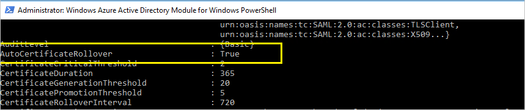

<properties
	pageTitle="Office 365 和 Azure AD 用户证书续订指南。| Azure"
	description="本文向 Office 365 用户说明了如何解决向其发送证书续订通知的电子邮件的问题。"
	services="active-directory"
	documentationCenter=""
	authors="billmath"
	manager="stevenpo"
	editor="curtand"/>

<tags 
	ms.service="active-directory" 
	ms.date="06/16/2016"
	wacn.date="07/28/2016"/>

# 续订 Office 365 和 Azure AD 的联合身份验证证书

##概述

为了让 Azure AD 与 AD FS 能够成功联盟，AD FS 用于向 Azure AD 签名安全令牌的证书应与 Azure AD 中配置的证书匹配。若有任何证书不匹配，可能会导致 AD FS 和 AAD 之间的信任破裂。Azure AD 可确保此信息在部署 AD FS 和 Web 应用程序代理（用于 Extranet 访问）时保持同步。

本文提供一些附加信息，帮助你在以下情况下管理令牌签名证书，并让证书与 Azure AD 保持同步：

* 不部署 Web 应用程序代理，因此无法在 Extranet 中获取联盟元数据
* 不对令牌签名证书使用默认的 AD FS 配置
* 使用第三方标识提供者

## 令牌签名证书的默认 AD FS 配置

令牌签名证书和令牌解密证书通常是自签名证书，有效期为一年。就令牌签名证书和令牌解密证书而言，默认的 AD FS 配置包括称为 **AutoCertificateRollover** 的自动续订过程。如果你使用的是 AD FS 2.0 或更高版本，Office 365 和 Azure AD 会在你的证书过期之前自动对其进行更新。

### 续订通知 — O365 门户和电子邮件通知

>[AZURE.NOTE] 如果你收到电子邮件或门户通知，要求你续订 Office 证书，则可以按照下文所述的[管理对令牌签名证书的更改](#managecerts)中的步骤，检查是否需要采取任何操作。Microsoft 已知可能有问题会导致用户收到证书续订通知，即使并不需要他们采取任何操作。

Azure AD 会尝试监视联盟元数据，并按照联盟元数据的指示更新令牌签名证书。在令牌签名证书到期前 30 天，Azure AD 会通过轮询联盟元数据，检查是否已有新的证书。

* 如果它能成功轮询联盟元数据并检索到新证书，用户就不会收到电子邮件通知或 O365 门户警告
* 如果由于无法获取联盟元数据或者未启用自动证书滚动更新，Azure AD 检索不到新的令牌签名证书，它会发出电子邮件通知，而且 O365 门户中会显示警告

>[AZURE.IMPORTANT] 如果使用 AD FS，为确保业务连续性，请确认服务器具有以下补丁，以免因已知问题而无法通过身份验证。这将减少此续订期间和未来续订期间的已知 AD FS 代理服务器问题：
>
>Server 2012 R2 — [Windows Server 2014 年 5 月汇总](http://support.microsoft.com/kb/2955164)
>
>Server 2008 R2 和 2012 — [在 Windows Server 2012 或 Windows 2008 R2 SP1 中通过代理进行身份验证失败](http://support.microsoft.com/kb/3094446)

## 检查是否需要更新证书 

### 步骤 1：检查 AutoCertificateRollover 状态

在 AD FS 服务器上打开 Microsoft Powershell。确保 AutoCertRollover 值设置为 TRUE

	Get-Adfsproperties

[AZURE.NOTE] 如果你使用的是 AD FS 2.0，则需先运行 Add-Pssnapin Microsoft.Adfs.Powershell。

### 步骤 2：确认 AD FS 和 Azure AD 已同步

在 AD FS 服务器上打开 Azure AD Powershell 提示符，并连接到 Azure AD。

>[AZURE.NOTE] 如果尚未安装 Azure AD Powershell，则可以从[此处](https://technet.microsoft.com/library/jj151815.aspx)下载。

	Connect-MsolService

检查 AD FS 和 Azure AD 信任属性中针对指定域配置的证书。

	Get-MsolFederationProperty -DomainName <domain.name> | FL Source, TokenSigningCertificate

如果这两个输出中的指纹匹配，即可确认证书已与 Azure AD 同步。

### 步骤 3：检查证书是否即将到期

在 Get-MsolFederationProperty 或 Get-AdfsCertificate 的输出中，根据“不晚于”字段检查日期。如果日期相隔不到 30 天，你便需要采取操作。

### 后续步骤

| AutoCertificateRollover | 证书与 Azure AD 同步 | 可公开访问联盟元数据 | 有效期 | 操作 |
|:-----------------------:|:-----------------------:|:-----------------------:|:-----------------------:|:-----------------------:|
| 是 | 是 | 是 | - | 无需采取操作。请参阅[自动续订令牌签名证书](#autorenew) |
| 是 | 否 | - | 不到 15 天 | 立即续订。请参阅[手动续订令牌签名证书](#manualrenew) |
| 否 | - | - | 不到 30 天 | 立即续订。请参阅[手动续订令牌签名证书](#manualrenew) |

[-] 无关紧要

## 自动续订令牌签名证书（建议）

如果你已部署 Web 应用程序代理，能够从 Extranet 访问联盟元数据，而且你使用的是 AD FS 默认配置，也就是已启用 AutoCertificateRollover，则**不需要执行任何手动步骤**。 检查下列事项以确认能够自动更新证书：

**#1 AD FS 属性 AutoCertificateRollover 必须设置为 True**

这表示 AD FS 会在旧证书到期之前，自动生成新的令牌签名证书和令牌解密证书。

**#2 可公开访问 AD FS 联盟元数据**

从公共 Internet（企业网络之外）上的计算机导航到以下 URL，查看你的联合身份验证元数据是否可以公开访问：

https://(your_FS_name)/federationmetadata/2007-06/federationmetadata.xml

其中，`(your_FS_name)` 将替换为你组织使用的联合身份验证服务主机名，例如 fs.contoso.com。如果你能够成功验证这两项设置，则无需执行任何其他操作。

示例：https://fs.contoso.com/federationmetadata/2007-06/federationmetadata.xml

## 手动续订令牌签名证书 

你可以选择手动续订令牌签名证书。你会想要手动更新令牌签名证书的部分常见案例包括：
* 令牌签名证书不是自签名证书。这种情况最常见的原因是，你的组织通过组织证书颁发机构来管理注册的 AD FS 证书。
* 网络安全性不允许公开获取联盟元数据。

在这些案例中，每当更新令牌签名证书时，还必须使用 PowerShell 命令 Update-MsolFederatedDomain 更新 Office 365 域。

### 续订令牌签名证书并更新 O365 联盟信任的步骤

**步骤 1：确保 AD FS 具有新的令牌签名证书**

### 非默认配置
如果你处于 AD FS 的非默认配置，即，**AutoCertificateRollover** 设置为 **False**，则很有可能你使用的是自定义证书（非自签名）。有关如何续订 AD FS 令牌签名证书的完整指南，请阅读[针对未使用 AD FS 自签名证书的客户的指南](https://msdn.microsoft.com/library/azure/JJ933264.aspx#BKMK_NotADFSCert)。

### 无法公开获取联盟元数据
另一方面，如果 **AutoCertificateRollover** 设置为 **True**，但无法公开访问联盟元数据，请先确保 AD FS 已生成新的令牌签名证书。请遵循以下步骤来确认你有新的令牌签名证书

1. 确保你已登录主 AD FS 服务器。
2. 通过打开 PowerShell 命令窗口并运行以下命令，检查 AD FS 中的当前签名证书：

	PS C:\>Get-ADFSCertificate –CertificateType token-signing

	>[AZURE.NOTE] 如果你使用的是 AD FS 2.0，则需先运行 Add-Pssnapin Microsoft.Adfs.Powershell。

3. 查看命令输出中是否存在任何已列出的证书。如果 AD FS 已生成新证书，你应该会在输出中看到两个证书：一个证书的 IsPrimary 值为 True，NotAfter 日期为 5 天内；另一个证书的 IsPrimary 为 False，NotAfter 大约为未来的 1 年。

4. 如果你只看到一个证书，且 NotAfter 日期在 5 天内，则需执行以下步骤以生成新的证书。

5. 若要生成新的证书，请在 PowerShell 命令提示符下执行以下命令：`PS C:\>Update-ADFSCertificate –CertificateType token-signing`。

6. 通过再次运行以下命令来验证更新：PS C:\>Get-ADFSCertificate –CertificateType token-signing

此时会列出两个证书，其中一个的 NotAfter 日期大约为未来的 1 年，其 IsPrimary 值为 False。

**步骤 2：更新 O365 信任的新令牌签名证书**

按照以下步骤，使用要用于信任的新令牌签名证书更新 O365。

1.	打开用于 Windows PowerShell 的 Microsoft Azure Active Directory 模块。
2.	运行 $cred=Get-Credential。当此 cmdlet 提示你输入凭据时，键入你的云服务管理员帐户凭据。
3.	运行 Connect-MsolService –Credential $cred。此 cmdlet 会将你连接到云服务。通过工具运行任何其他已安装的 cmdlet 之前，必须创建将你连接到云服务的上下文。
4.	如果你在并非用作 AD FS 主联合服务器的计算机上运行这些命令，请运行 Set-MSOLAdfscontext -Computer <AD FS primary server>，其中 <AD FS primary server> 是主 AD FS 服务器的内部 FQDN 名称。此 cmdlet 生成将你连接到 AD FS 的上下文。
5.	运行 Update-MSOLFederatedDomain –DomainName <domain>。此 cmdlet 会将 AD FS 中的设置更新到云服务中，并配置两者之间的信任关系。

>[AZURE.NOTE] 如果你需要支持多个顶级域（例如 contoso.com 和 fabrikam.com），则必须将 SupportMultipleDomain 开关用于任何 cmdlet。

## 使用 AAD Connect 修复 Azure AD 信任 

如果你已使用 Azure AD Connect 安装所配置的 AD FS 场/Azure AD 信任，则可以使用 Azure AD Connect 来检测是否需要对令牌签名证书采取任何操作。如果需要续订证书，使用 Azure AD Connect 可让你简单按几下就完成所需操作。

有关详细信息，请阅读[修复信任](/documentation/articles/active-directory-aadconnect-federation-management/#repairing-the-trust)

<!---HONumber=Mooncake_0711_2016-->