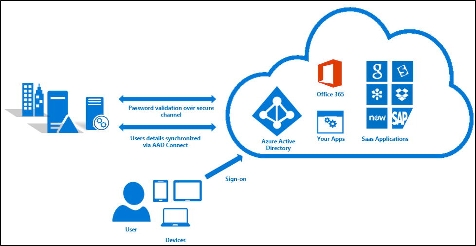
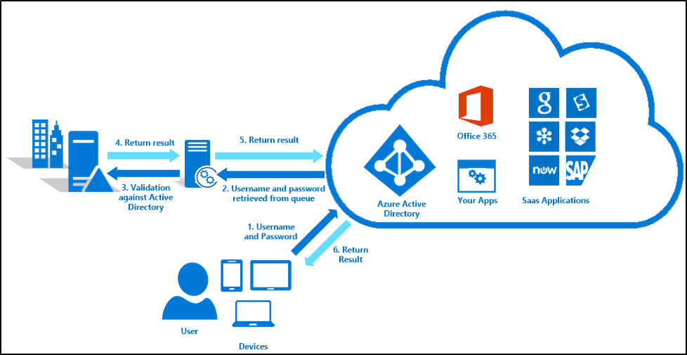
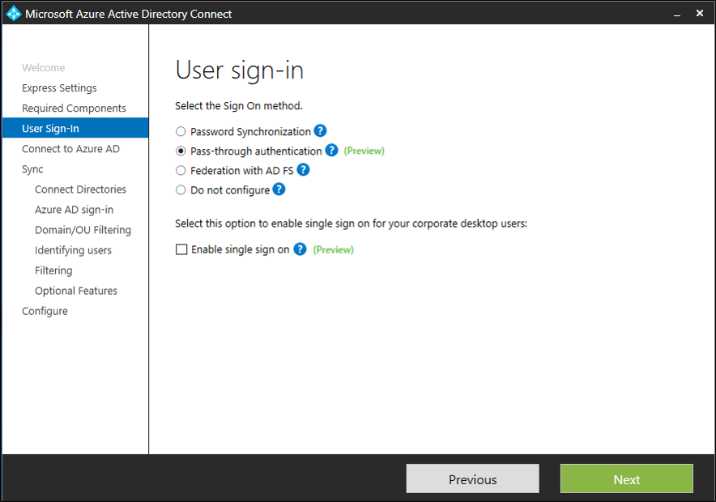

<properties
    pageTitle="Azure AD Connect：直通身份验证 | Azure"
    description="本主题提供了你需要了解的信息，说明 Azure AD 直通身份验证如何与本地 Active Directory (AD) 协同提供对 Azure Active Directory (Azure AD) 的访问权限和连接服务。"
    services="active-directory"
    keywords="什么是 Azure AD Connect, 安装 Active Directory, Azure AD 所需的组件, SSO, 单一登录"
    documentationcenter=""
    author="billmath"
    manager="femila"/> 

<tags
    ms.assetid="9f994aca-6088-40f5-b2cc-c753a4f41da7"
    ms.service="active-directory"
    ms.workload="identity"
    ms.tgt_pltfrm="na"
    ms.devlang="na"
    ms.topic="article"
    ms.date="02/08/2017"
    ms.author="billmath" 
    wacn.date="03/07/2017"/> 

# 什么是 Azure AD 直通身份验证
使用相同的凭据（用户名和密码）访问公司资源和基于云的服务可确保用户不需要记住不同的凭据。这样可以减少他们忘记如何登录的可能性，同时还可以减少需要技术支持人员重置密码的情况。

尽管许多组织愿意使用 Azure AD [密码同步](/documentation/articles/active-directory-aadconnectsync-implement-password-synchronization/)向用户提供可用于访问本地服务和云服务的单个凭据，仍有一些组织要求将密码（即使为哈希格式）保留在其内部。

Azure AD 直通身份验证为这些客户提供了一种简单的解决方案。它可以确保 Azure AD 服务的密码验证是针对本地 Active Directory 执行的。进行密码验证时，可以不需要复杂的网络基础结构，也不需要本地密码以任何形式存在于云中。

与[单一登录](/documentation/articles/active-directory-aadconnect-sso/)选项一起使用时，用户不需键入其密码即可登录到 Azure AD 或其他云服务。此功能为这些客户提供了在公司计算机上可以获得的真正集成体验。

  

直通身份验证可以通过 Azure AD Connect 进行配置，并利用一个简单的本地代理来侦听密码验证请求。可轻松地将此代理部署到多台计算机，以提供高可用性和负载均衡。由于所有通信均为出站，因此无需使用外围网络，或者在外围网络中安装连接器。计算机的连接器要求如下所示：

- Windows Server 2012 R2 或更高版本
- 加入在其中验证用户的林中的域

>[AZURE.NOTE]
如果林之间建立了信任并且正确配置了名称后缀路由，则可支持多林环境。

## 预览版中支持的客户端
支持[新式身份验证](https://aka.ms/modernauthga)的基于 Web 浏览器的客户端和 Office 客户端均支持直通身份验证。对于不支持的客户端，例如旧的 Office 客户端、Exchange ActiveSync（即移动设备上的本机电子邮件客户端），建议客户使用带新式身份验证的等效客户端。这些客户端不仅允许直通身份验证，还允许应用条件访问，如多重身份验证。

对于使用加入到 Azure AD 的 Windows 10 的客户，当前不支持直通身份验证。但是对于 Windows 10 和旧客户端，客户可使用密码同步作为自动回退。

>[AZURE.NOTE]
在预览期间，如果选择直通身份验证作为 Azure AD Connect 中的登录选项，则默认启用密码同步。可在 Azure AD Connect 的“选项”页上禁用此设置。

## Azure AD 直通身份验证的工作原理
当用户在 Azure AD 登录页输入其用户名和密码时，Azure AD 将用户名和密码放在相应的本地连接器队列中进行验证。随后，某个可用的本地连接器检索用户名和密码，并使用 Active Directory 对其进行验证。通过标准 Windows API 进行的验证类似于 Active Directory 联合身份验证服务验证密码的方式。

本地域控制器随后评估请求并向连接器返回响应，连接器继而将此响应返回给 Azure AD。然后，Azure AD 评估此响应，并视情况回应用户，例如颁发令牌或要求多重身份验证。下图显示了各个步骤：

  

## Azure AD 直通先决条件
在启用和使用 Azure AD 直通身份验证之前，需要：

- 具有 Azure AD Connect
- 具有 Azure AD 租户（你是该租户的全局管理员）。

>[AZURE.NOTE]
该帐户最好是仅使用云的管理员帐户，用于在本地服务出现故障或不可用时管理租户的配置。

- 具有运行 Windows Server 2012 R2 或更高版本的服务器，以便在此服务器上运行 Azure AD Connect。此计算机必须是要进行验证的用户所在林中的成员。
- 如果有多个林包含要通过 Azure AD 进行验证的用户，则这些林之间必须具有信任关系。
- 必须将本地 UserPrincipalName 用作 Azure AD 用户名。
- 具有运行 Windows Server 2012 R2 或更高版本的另一个服务器，在此服务器上运行另一个连接器以实现高可用性和负载均衡。有关如何部署此连接器，请参阅下面的说明。
- 如果连接器与 Azure AD 之间存在防火墙，请确保：
	- 如果启用了 URL 筛选，请确保连接器能够与以下 URL 通信：
		-  *.msappproxy.net
		-  *.servicebus.chinacloudapi.cn.
		-  连接器还建立到 [Azure 数据中心 IP 范围](https://www.microsoft.com/en-us/download/details.aspx?id=41653)的直接 IP 连接。
	- 确保当连接器使用客户端证书与 Azure AD 通信时，防火墙不执行 SSL 检查。
	- 确保连接器可在以下端口上向 Azure AD 发出 HTTPS (TCP) 请求。

|端口号|说明
| --- | ---
|80|启用出站 HTTP 流量进行安全验证，例如 SSL 证书吊销列表。
|443|	启用基于 Azure AD 的用户身份验证。
|8080/443|	启用连接器启动序列和连接器自动更新。
|9090|	启用连接器注册（仅在连接器注册过程中需要）
|9091|	启用连接器信任证书的自动续订。
|9352、5671|	为传入请求启用连接器与 Azure AD 服务之间的通信。
|9350|	[可选] 提高传入请求的性能。
|10100-10120|	启用连接器向 Azure AD 返回响应。

如果你的防火墙根据发起用户强制实施流量，请针对来自作为网络服务运行的 Windows 服务的流量打开这些端口。此外，请确保为 NT Authority\\System 启用端口 8080。

## 启用直通身份验证
通过 Azure AD Connect 启用 Azure AD 直通身份验证。启用直通身份验证可将第一个连接器部署在与 Azure AD Connect 相同的服务器上。安装 Azure AD Connect 时，请选择自定义安装，并在登录选项页中选择直通身份验证。有关详细信息，请参阅 [Azure AD Connect 的自定义安装](/documentation/articles/active-directory-aadconnect-get-started-custom/)。

  

默认情况下，在 Azure AD Connect 服务器上安装第一个直通身份验证连接器。应在另一台计算机上部署第二个连接器，以确保具有身份验证请求的高可用性和负载均衡。

若要部署第二个连接器，请按照下面的说明操作：

### 步骤 1：在未注册的情况下安装连接器

1.	下载最新的[连接器](https://go.microsoft.com/fwlink/?linkid=837580)。
2.	以管理员身份打开命令提示符。
3.	运行以下命令，其中 /q 表示静默安装 - 此安装不会提示你接受最终用户许可协议。

		AADApplicationProxyConnectorInstaller.exe REGISTERCONNECTOR="false" /q

### 步骤 2：向 Azure AD 注册连接器以进行直通身份验证

1.	以管理员身份打开 PowerShell 窗口
2.	导航到 **C:\\Program Files\\Microsoft AAD App Proxy Connector** 并运行脚本。
`.\RegisterConnector.ps1 -modulePath "C:\Program Files\Microsoft AAD App Proxy Connector\Modules" -moduleName "AppProxyPSModule" -Feature PassthroughAuthentication`
3.	出现提示时，请输入 Azure AD 租户管理员帐户的凭据。

## 直通身份验证故障排除
对直通身份验证进行故障排除时，可能存在一些不同类别的问题。根据问题的类型，可能需要在不同位置查找问题的原因。

对于与连接器相关的错误，可以检查位于“应用程序和服务日志\\Microsoft\\AadApplicationProxy\\Connector\\Admin”下面的连接器计算机的事件日志。如果需要，可以查看分析和调试日志并启用连接器会话日志来获取更详细的日志。默认情况下，不建议在运行时启用此日志，内容只会在禁用日志后可见。

此外，可在 **C:\\Programdata\\Microsoft\\Microsoft AAD Application Proxy Connector\\Trace** 中的连接器跟踪日志中查找其他信息。这些日志还包括单个用户的直通身份验证失败的原因，如下面的包括错误代码 1328 的条目：

	ApplicationProxyConnectorService.exe Error: 0 : Passthrough Authentication request failed. RequestId: 'df63f4a4-68b9-44ae-8d81-6ad2d844d84e'. Reason: '1328'.
	    ThreadId=5
	    DateTime=xxxx-xx-xxTxx:xx:xx.xxxxxxZ

可以通过启动命令提示符并运行以下命令来获取错误的详细信息：（将“1328”替换为请求中的错误号。）

	Net helpmsg 1328

结果如以下响应所示：

  

如果启用了审核日志记录，则还可以在域控制器的安全日志中找到更多信息。对连接器的身份验证请求的简单查询如下所示：

    <QueryList>
    <Query Id="0" Path="Security">
    <Select Path="Security">*[EventData[Data[@Name='ProcessName'] and (Data='C:\Program Files\Microsoft AAD App Proxy Connector\ApplicationProxyConnectorService.exe')]]</Select>
    </Query>
    </QueryList>

以下列表详细描述了在 Azure AD 登录屏幕上报告的其他错误以及相应的解决方法步骤。

|错误|说明|解决方法
| --- | --- | ---
|AADSTS80001|无法连接到 Active Directory|确保连接器计算机已加入域，并且能够连接到 Active Directory。  
|AADSTS8002|连接到 Active Directory 时超时|检查以确保 Active Directory 可用，并且可以响应连接器的请求。
|AADSTS80004|传递到连接器的用户名无效|确保用户尝试使用正确的用户名登录。
|AADSTS80005|验证遇到不可预知的 WebException|此错误是一个暂时性的问题。重试请求。如果持续失败，请与 Microsoft 支持部门联系。
|AADSTS80007|与 Active Directory 通信时出错|检查连接器日志以了解更多信息，并验证 Active Directory 是否按预期方式运行。

<!---HONumber=Mooncake_0227_2017-->
<!---Update_Description: wording update -->