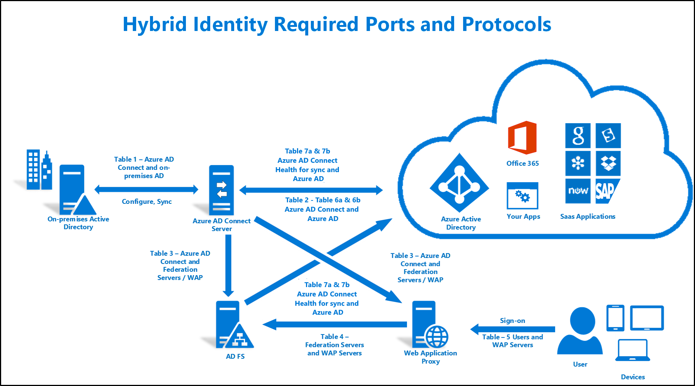

<properties
    pageTitle="混合标识所需的端口和协议 - Azure | Azure"
    description="此技术参考页面描述了需要为 Azure AD Connect 打开的端口"
    services="active-directory"
    documentationcenter=""
    author="billmath"
    manager="femila"
    editor="curtand" />
<tags
    ms.assetid="de97b225-ae06-4afc-b2ef-a72a3643255b"
    ms.service="active-directory"
    ms.workload="identity"
    ms.tgt_pltfrm="na"
    ms.devlang="na"
    ms.topic="article"
    ms.date="04/25/2017"
    ms.author="billmath"
    wacn.date="06/12/2017"
    ms.translationtype="Human Translation"
    ms.sourcegitcommit="08618ee31568db24eba7a7d9a5fc3b079cf34577"
    ms.openlocfilehash="6707ced20cad22488169f93abb77bddeb83e0416"
    ms.contentlocale="zh-cn"
    ms.lasthandoff="05/26/2017" />

# 混合标识所需的端口和协议
以下文档是用于实现混合标识解决方案所需的端口和协议的技术参考。 使用下图并参考相应的表格。

## 表 1 - Azure AD Connect 和本地 AD
此表描述了 Azure AD Connect 服务器与本地 AD 之间通信所需的端口和协议。

| 协议 | 端口 | 说明 |
| --- | --- | --- |
| DNS |53 (TCP/UDP) |在目标林中进行 DNS 查找。 |
| Kerberos |88 (TCP/UDP) |对 AD 林进行 Kerberos 身份验证。 |
| MS-RPC |135 (TCP/UDP) |该端口绑定到 AD 林后，将在初始配置 Azure AD Connect 向导期间及密码同步期间使用。 |
| LDAP |389 (TCP/UDP) |用于从 AD 导入数据。 数据将使用 Kerberos 签名和签章加密。 |
| LDAP/SSL |636 (TCP/UDP) |用于从 AD 导入数据。 数据传输经过签名和加密。 仅当你使用 SSL 时才使用该端口。 |
| RPC |49152-65535（随机高 RPC 端口）(TCP/UDP) |该端口绑定到 AD 林后，将在初始配置 Azure AD Connect 期间及密码同步期间使用。 有关详细信息，请参阅 [KB929851](https://support.microsoft.com/zh-cn/kb/929851)、[KB832017](https://support.microsoft.com/zh-cn/kb/832017) 和 [KB224196](https://support.microsoft.com/zh-cn/kb/224196)。 |

## 表 2 - Azure AD Connect 和 Azure AD
此表描述了 Azure AD Connect 服务器与 Azure AD 之间通信所需的端口和协议。

| 协议 | 端口 | 说明 |
| --- | --- | --- |
| HTTP |80 (TCP/UDP) |用于下载 CRL（证书吊销列表）以验证 SSL 证书。 |
| HTTPS |443 (TCP/UDP) |用来与 Azure AD 同步。 |

有关需要在防火墙中打开的 URL 和 IP 地址列表，请参阅 [Office 365 URLs and IP address ranges](https://support.office.com/article/Office-365-URLs-and-IP-address-ranges-8548a211-3fe7-47cb-abb1-355ea5aa88a2)（Office 365 URL 和 IP 地址范围）。

## 表 3 - Azure AD Connect 和 AD FS 联合身份验证服务器/WAP
此表描述了 Azure AD Connect 服务器与 AD FS 联合身份验证服务器/WAP 服务器之间通信所需的端口和协议。  

| 协议 | 端口 | 说明 |
| --- | --- | --- |
| HTTP |80 (TCP/UDP) |用于下载 CRL（证书吊销列表）以验证 SSL 证书。 |
| HTTPS |443 (TCP/UDP) |用来与 Azure AD 同步。 |
| WinRM |5985 |WinRM 侦听器 |

## 表 4 - WAP 和联合服务器
此表描述了联合服务器与 WAP 服务器之间通信所需的端口和协议。

| 协议 | 端口 | 说明 |
| --- | --- | --- |
| HTTPS |443 (TCP/UDP) |用于身份验证。 |

## 表 5 - WAP 和用户
此表描述了用户与 WAP 服务器之间通信所需的端口和协议。

| 协议 | 端口 | 说明 |
| --- | --- | --- |
| HTTPS |443 (TCP/UDP) |用于设备身份验证。 |
| TCP |49443 (TCP) |用于证书身份验证。 |

## 表 6a 和 6b - 单一登录 (SSO) 的直通身份验证和单一登录 (SSO) 的密码哈希同步
下面的表描述了 Azure AD Connect 与 Azure AD 之间通信所需的端口和协议。

### 表 6a - SSO 的直通身份验证
|协议|端口号|说明
| --- | --- | ---
|HTTP|80|启用出站 HTTP 流量以进行安全验证，例如 SSL。 连接器自动更新功能要正常工作也需要完成此操作。
|HTTPS|443|    为操作（例如启用和禁用功能、注册连接器、下载连接器更新和处理所有用户登录请求）启用出站 HTTPS 流量。

此外，Azure AD Connect 需要能够建立到 [Azure 数据中心 IP 范围](https://www.microsoft.com/en-us/download/details.aspx?id=42064)的直接 IP 连接。

### 表 6b - SSO 的密码哈希同步

|协议|端口号|说明
| --- | --- | ---
|HTTPS|443|    启用 SSO 注册（只有 SSO 注册过程才需要）。

此外，Azure AD Connect 需要能够建立到 [Azure 数据中心 IP 范围](https://www.microsoft.com/en-us/download/details.aspx?id=42064)的直接 IP 连接。 同样，这只是 SSO 注册过程所需的。
<!---Update_Description: wording update -->

