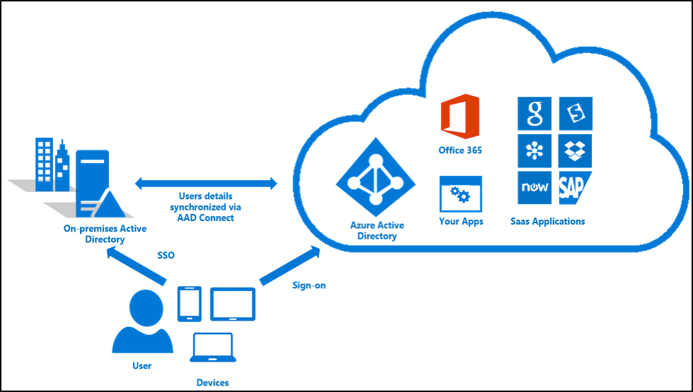
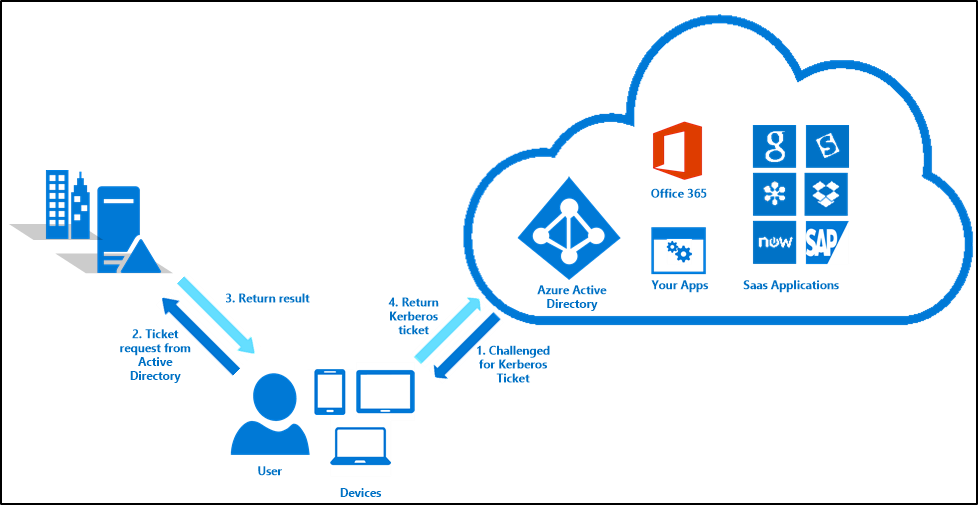
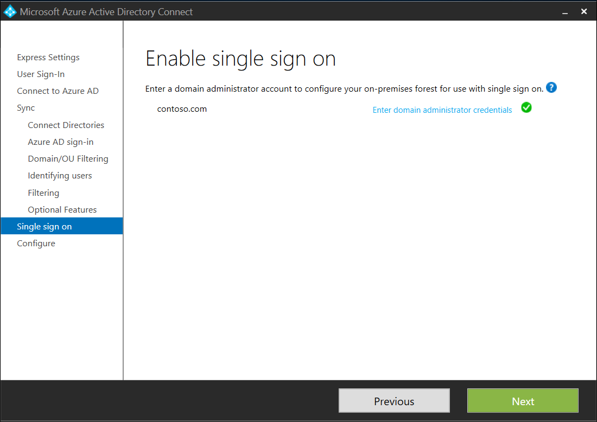
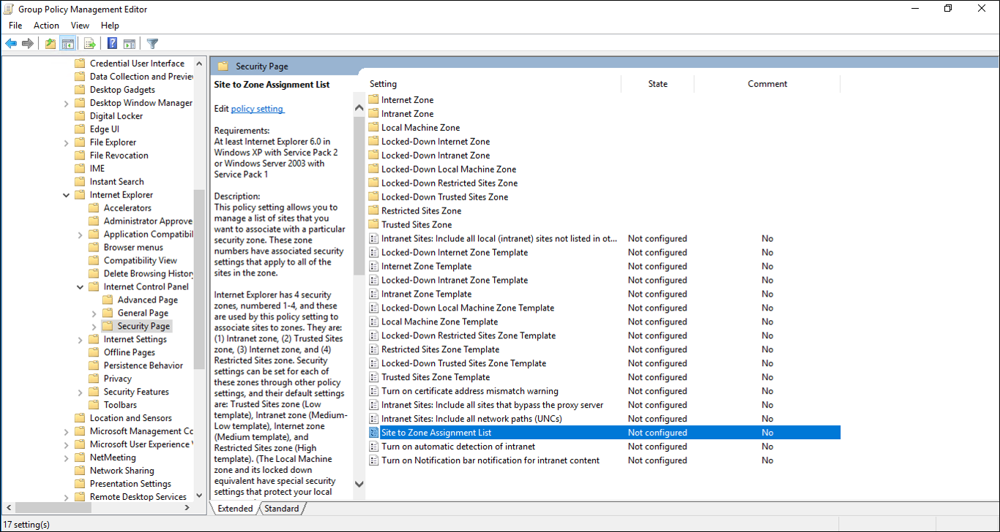
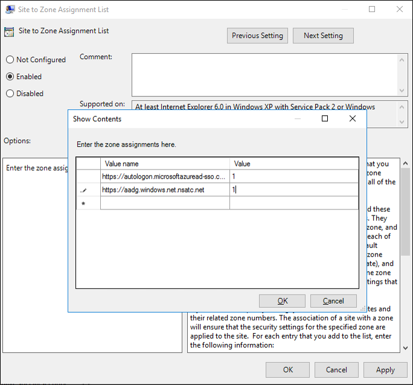

<properties
    pageTitle="Azure AD Connect：单一登录 | Azure"
    description="本主题介绍了你需要了解的如何从本地 Active Directory (AD) 单一登录到基于云的 Azure Active Directory (Azure AD) 和连接的服务的信息。"
    services="active-directory"
    keywords="什么是 Azure AD Connect, 安装 Active Directory, Azure AD 所需的组件, SSO, 单一登录"
    documentationcenter=""
    author="billmath"
    manager="femila"/>

<tag
    ms.assetid="9f994aca-6088-40f5-b2cc-c753a4f41da7"
    ms.service="active-directory"
    ms.workload="identity"
    ms.tgt_pltfrm="na"
    ms.devlang="na"
    ms.topic="article"
    ms.date="12/06/2016"
    ms.author="billmath"
    wacn.date="01/05/2017" />

# 什么是单一登录 (SSO)（预览）
单一登录是可以在 Azure Active Directory Connect 中启用的用于[密码哈希同步](/documentation/articles/active-directory-aadconnectsync-implement-password-synchronization/)或[直通身份验证](/documentation/articles/active-directory-aadconnect-pass-through-authentication/)的选项。如果启用了该选项，那么当用户使用其公司的计算机并连接到公司网络时不需要输入密码即可登录到 Azure Active Directory (Azure AD) 或其他云服务。

启用单一登录后，用户访问连接到 Azure Active Directory 服务（如 Office 365、Microsoft Intune、CRM Online 和 SaaS 服务）的资源时，用户无需键入其密码，而是使用从本地 Active Directory 自动获取的 Kerberos 票证。

  

向最终用户提供 SSO 功能后，对基于云的服务的访问更加熟悉，并向组织提供安全而简单的流程，无需其他任何本地的组件。

SSO 是通过 AAD Connect 启用的一项功能，该功能用于密码哈希同步或直通身份验证和本地 Active Directory。若要让最终用户在环境中使用单一登录，需要确保用户：

- 在已加入域的计算机上
- 具有与域控制器的直接连接，例如在公司的有线或无线网络上，或通过远程访问连接，如 VPN 连接。
- 定义云中的 Kerberos 终结点，并将其作为 Intranet 区域的一部分。

如果缺少上述任何一项，如计算机不在公司网络上，以及 Active Directory 不可用，那么只会提示用户输入其密码，就和没有单一登录时一样。

## 支持的客户端
在能够进行 Kerberos 身份验证的计算机上，如 Windows，支持新式身份验证的基于 Web 浏览器的客户端和 Office 客户端支持单一登录。下表详细描述了各个操作系统上基于浏览器的客户端。

| 操作系统\\浏览器 |Internet Explorer|Chrome|Firefox|Edge
| --- | --- |--- | --- |--- |
|Windows 10|是|是|是*|否
|Windows 8.1|是|是|是*|不适用
|Windows 8|是|是|是*|不适用
|Windows 7|是|是|是*|不适用
|Mac|不适用|不适用|不适用|不适用

- 需要单独的配置。

## 单一登录的使用方式

在 Azure AD Connect 中启用单一登录后，在本地 Active Directory 中创建了名为 AZUREADSSOACCT 的计算机帐户，并与 Azure AD 安全地共享 Kerberos 解密密钥。此外，创建了两个 Kerberos 服务主体名称 (SPN) 来表示云 URL，客户端与 Azure AD 之间的身份验证过程使用此 URL。

此设置完成后，身份验证过程与任何其他基于集成 Windows 身份验证 (IWA) 的应用程序相同。如果你熟悉 IWA 的使用过程，那么你就知道如何在 Azure AD 中使用单一登录。如果不熟悉，IWA 的过程如下：

  

首先，用户尝试访问资源。资源可以是一台计算机或一个 URL。就 Azure AD 而言，它是服务的 URL，如 SharePoint online，下面将其描述为“Azure AD 资源”。

1.	Azure AD 资源通过“401 未授权”响应质询客户端，以提供 Kerberos 票证。
2.	客户端为 Azure AD 资源从 Active Directory 请求票证。
3.	Active Directory 定位与 Azure AD 资源关联的计算机帐户，并将使用此计算机帐户的密码加密的 Kerberos 票证返回给客户端。此票证包括当前登录到此计算机的用户的标识。
4.	客户端将其从 Active Directory 获取的 Kerberos 票证发送到 Azure AD。
5.	Azure AD 使用以前共享的密钥解密 Kerberos 票证，然后向用户返回令牌或要求用户提供其他证明，例如资源所需的多重身份验证。

单一登录是机会性功能，这表示如果因为某些原因无法使用该功能，用户只需和平常一样在登录页输入密码。

## 为直通身份验证或密码哈希同步启用 SSO
Azure AD Connect 提供了简单的过程来为直通身份验证或密码哈希同步启用单一登录。需要确保具有同步的每个林中一个域的域管理员权限，以允许为计算机帐户配置 Kerberos 服务主体名称 (SPN)。用户名和密码未存储在 Azure AD Connect 或 Azure AD 中，并且仅用于此操作。

安装 Azure AD Connect 时选择自定义安装，以便能够在用户登录页面上配置单一登录。有关详细信息，请参阅 [Custom installation of Azure AD Connect](/documentation/articles/active-directory-aadconnect-get-started-custom/)（Azure AD Connect 的自定义安装）。

  

启用单一登录后，可以继续完成向导，直到到达单一登录页面。

  

对于列出的每个林，提供相应的帐户详细信息，并为 Azure 目录启用单一登录。

## 确保客户端自动登录
默认情况下，浏览器不会尝试将凭据发送到 Web 服务器，除非 URL 定义为在 Intranet 区域。通常情况下，浏览器可以通过查看 URL 来计算正确的区域。例如，如果 URL 为 http://intranet/，浏览器将自动发送凭据，因为它将此 URL 映射到 Intranet 区域。但是，如果 URL 包含句点，例如 http://intranet.contoso.com/，那么服务器不会自动发送凭据，并将该 URL 视为任何 Internet 站点。

由于用于 Azure AD 中的单一登录的 URL 包含句点，它们是全局可路由的主机名，因此需要将它们显式添加到计算机的 Intranet 区域，以便浏览器将当前已登录的用户的凭据以 Kerberos 票证的形式自动发送到 Azure AD。将所需的 URL 添加到 Intranet 区域的最简单方法是仅在 Active Directory 中创建组策略。

1.	打开组策略管理工具
2.	编辑将应用于所有用户的组策略。例如，默认域策略。
3.	导航到“用户配置\\管理模板\\Windows 组件\\Internet Explorer\\Internet 控制面板\\安全性”页面，并选择“区域分配列表的站点”。
 
4.	启用策略，并在对话框中输入以下值/数据。 
    	
		Value: https://autologon.microsoftazuread-sso.com
    	Data: 1
    	Value: https://aadg.chinacloudapi.cn.nsatc.net 
    	Data: 1'
5.	如下图所示：

	  

6.	请单击两次“确定”。

现在已为用户准备好单一登录。

>[AZURE.NOTE]
默认情况下，Chrome 使用和 Internet Explorer 相同的一组受信任的站点 URL。如果为 Chrome 配置了不同设置，则需要单独更新这些 URL。

## 单一登录故障排除
请务必确保客户端正确配置单一登录，其中包括：

1.	在 Intranet 区域内定义了 https://autologon.microsoftazuread-sso.com 和 https://aadg.chinacloudapi.cn.nsatc.net。
2.	确保工作站加入到域。
3.	确保用户使用域帐户登录。
4.	请确保计算机已连接到公司网络
5.	确保计算机的时间与 Active Directory 同步，并且域控制器时间与正确时间的误差在 5 分钟内。

如果能够确认上述要求，则可以查看浏览器的控制台日志以了解其他信息。可以在开发人员工具下找到控制台日志。该日志有助于确定潜在问题。

## 事件日志条目
如果启用了正确的审核功能，那么用户每次使用单一登录登录时，就会在域控制器的事件日志中记录一个条目。若要查找这些事件，可以查看与计算机帐户 AzureADSSOAcc$ 关联的安全性事件 4769 的事件日志。下面的筛选器查找与此计算机帐户关联的所有安全性事件：

	<QueryList>
	  <Query Id="0" Path="Security">
	<Select Path="Security">*[EventData[Data[@Name='ServiceName'] and (Data='AZUREADSSOACC$')]]</Select>
	  </Query>
	</QueryList>

<!---HONumber=Mooncake_1226_2016-->
