<properties
   pageTitle="Azure AD Connect：支持的拓扑 | Azure"
   description="本主题详细说明 Azure AD Connect 的受支持和不受支持的拓扑"
   services="active-directory"
   documentationCenter=""
   authors="AndKjell"
   manager="stevenpo"
   editor=""/>

<tags
    ms.service="active-directory"
    ms.devlang="na"
    ms.tgt_pltfrm="na"
    ms.workload="identity"
	ms.topic="article"
    ms.date="06/27/2016"
    wacn.date="08/08/2016"
    ms.author="billmath"/>

# Azure AD Connect 的拓扑

本主题的目标是使用 Azure AD Connect 同步作为关键集成方案，介绍不同的本地拓扑与 Azure AD 拓扑。其中描述了支持和不支持的配置。

文档中的图片图例：

说明 | 图标
-----|-----
本地 Active Directory 林| 
包含筛选导入的 Active Directory| 
Azure AD Connect 同步服务器| 
Azure AD Connect 同步服务器“暂存模式”| 
包含 FIM2010 或 MIM2016 的 GALSync| 
Azure AD Connect 同步服务器，详细说明| 
Azure AD 目录 |
不支持的方案 | 

## 单个林，单个 Azure AD 目录

最常见的拓朴是包含一个或多个域的单个本地林，以及单个 Azure AD 目录（也称为“租户”）。Azure AD 身份验证使用密码同步。Azure AD Connect 的快速安装仅支持此拓扑。

### 单个林，多个同步服务器连接到一个 Azure AD 目录
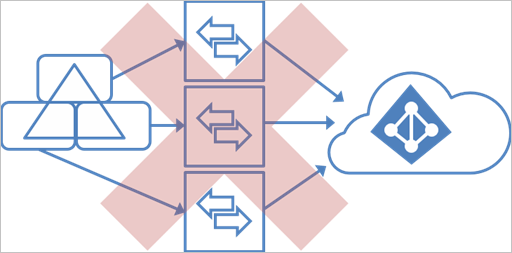

不支持多个 Azure AD Connect 同步服务器连接到同一个 Azure AD 目录（[暂存服务器](#staging-server)除外）。即使配置为同步一组互斥对象，也不支持。如果你无法从单个服务器连接到林中的所有域，或者将负载分散到多个服务器，你可能已经考虑过这种情形。

## 多个林，单个 Azure AD 目录
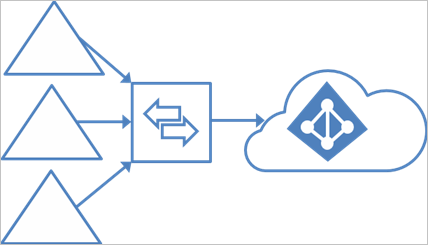

许多组织具有包含多个本地 Active Directory 林的环境。有多种原因导致出现多个本地 Active Directory 林。典型示例是具有帐户资源林的设计以及合并和收购之后采用的设计。

如果你拥有多个林，所有林必须可由单个 Azure AD Connect 同步服务器访问。不需要将服务器加入域。如果必须访问所有林，可将服务器放在外围网络中。

Azure AD Connect 安装向导提供多个选项用于合并多个林中显示的用户。目标是一个用户只在 Azure AD 中显示一次。可以在安装向导的自定义安装路径中配置某些常见拓扑。在“唯一标识你的用户”页上选择表示拓扑的相应选项。只对用户配置合并。复制的组不会与默认配置合并。

下一部分将讨论常见拓扑：[独立的拓扑](#multiple-forests-separate-topologies)、[完整网格](#multiple-forests-full-mesh-with-optional-galsync)和[帐户资源](#multiple-forests-account-resource-forest)。

Azure AD Connect 同步中的默认配置假设：

1. 用户只有一个已启用的帐户并且此帐户所在的林用于对用户进行身份验证。此假设适用于密码同步和联合。UserPrincipalName 和 sourceAnchor/immutableID 来自此林。
2. 用户只有一个邮箱。
3. 托管用户邮箱的林具有 Exchange 全局地址列表 (GAL) 中可见属性的最佳数据质量。如果用户没有邮箱，则任何林都可以用于提供这些属性值。
4. 如果你有链接的邮箱，则在不同的林中还有另一个帐户用于登录。

如果你的环境不符合这些假设，将发生以下情况：

- 如果你有多个活动帐户或多个邮箱，同步引擎将选择其中一个并忽略其他的帐户或邮箱。
- 没有其他活动帐户的链接邮箱不会导出到 Azure AD。用户帐户不会显示为任何组中的成员。DirSync 中的链接邮箱始终显示为普通邮箱，因此这项更改是有意的行为，目的是更好地支持多林方案。

可以在[了解默认配置](/documentation/articles/active-directory-aadconnectsync-understanding-default-configuration/)中找到更多详细信息。

### 多个林，多个同步服务器连接到单个 Azure AD 目录
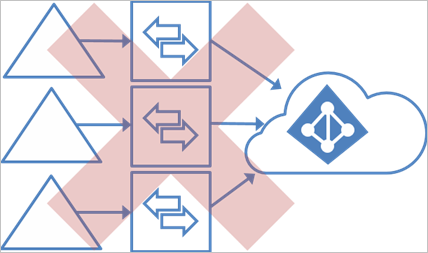

不支持多个 Azure AD Connect 同步服务器连接到单个 Azure AD 目录。使用[暂存服务器](#staging-server)时例外。

### 多个林 – 独立的拓扑
**用户在所有目录中只出现一次**

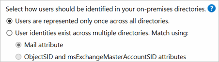

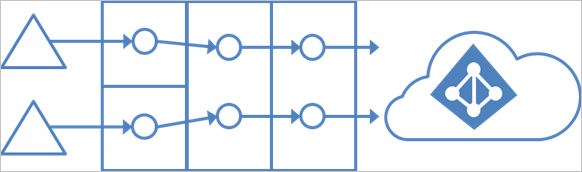

在此环境中，本地的所有林都被视为单独的实体，并且没有用户出现在任何其他林中。
每个林都有其自己的 Exchange 组织，并且林之间没有任何 GALSync。合并/收购之后或在其中每个业务单位在相互隔离的情况下运营的组织中，可能出现这种拓扑。在 Azure AD 中，这些林位于相同的组织中并与统一 GAL 一起出现。
在此图中，每个林中的每个对象会在 Metaverse 中出现一次，并在目标 Azure AD 目录中聚合。

### 多个林 – 匹配用户
**用户标识存在于多个目录中**

对于所有这些方案，一种常见情况是分发组和安全组可以包含用户、联系人和 FSP（外部安全主体）的混合形式。

FSP 可在 ADDS 中用来代表安全组中来自其他林的成员。在 Azure AD 中，所有 FSP 解析为实际对象。

### 多个林 – 包含可选 GALSync 的完整网格
**用户标识存在于多个目录中。匹配方法：mail 属性**

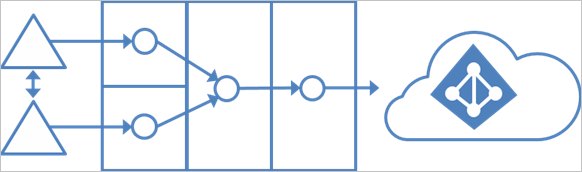

利用完全网格拓扑，用户和资源能够位于任何林中，并且通常林之间会有双向信任。

如果 Exchange 存在于多个林中，则可以根据需要提供本地 GALSync 解决方案。每个用户将表示为所有其他林中的联系人。GALSync 通常是使用 Forefront Identity Manager 2010 或 Microsoft Identity Manager 2016 实现的。Azure AD Connect 无法用于本地 GALSync。

在此方案中，标识对象使用 mail 属性进行联接。一个林中具有邮箱的用户与其他林中的联系人进行联接。

### 多个林 – 帐户资源林
**用户标识存在于多个目录中。匹配方法：ObjectSID 和 msExchMasterAccountSID 属性**

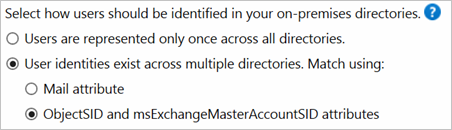

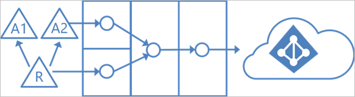

在帐户资源林拓扑中，你拥有带活动用户帐户的一个或多个帐户林。此外，还有一个或多个包含已禁用帐户的资源林。

在此方案中，一个（或多个）**资源林**信任所有**帐户林**。资源林通常具有带 Exchange 和 Lync 的扩展 AD 架构。所有 Exchange 和 Lync 服务以及其他共享的服务都位于此林中。用户在此林中具有一个禁用的用户帐户，并且邮箱被链接到帐户林。

## Office 365 和拓扑注意事项
某些 Office 365 工作负荷对支持的拓扑实施一些限制。如果你打算使用其中任何一项，请阅读工作负荷的受支持拓扑主题。

工作负载 |  
--------- | ---------
Exchange Online | 如果有多个本地 Exchange 组织（即 Exchange 已部署到多个林），则必须使用 Exchange 2013 SP1 或更高版本。可以在此找到详细信息：[包含多个 Active Directory 林的混合部署](https://technet.microsoft.com/library/jj873754.aspx)
Skype for Business | 使用多个本地林时，只支持帐户资源林拓扑。可以在此找到支持的拓扑的详细信息：[Skype for Business Server 2015 的环境要求](https://technet.microsoft.com/library/dn933910.aspx)

## 暂存服务器
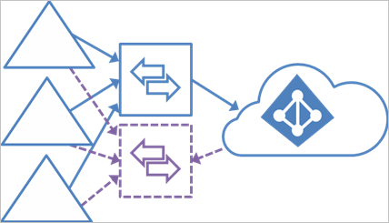

Azure AD Connect 支持以**暂存模式**安装第二个服务器。使用此模式的服务器从所有已连接的目录读取数据，但不写入任何数据。它使用普通的同步周期，因此具有标识数据的更新副本。在主服务器发生故障的灾难事件中，可以故障转移到暂存服务器。在 Azure AD Connect 向导中执行此操作。第二个服务器最好位于不同的数据中心，因为没有和主服务器共享基础结构。必须手动将主服务器上所做的任何配置更改复制到第二台服务器。

也可以使用暂存服务器来测试新的自定义配置及其对数据所造成的影响。你可以预览更改并调整配置。如果满意新的配置，可以让暂存服务器成为活动服务器，并将旧的活动服务器设置为暂存模式。

此方法还可用于替换活动的同步服务器。准备新的服务器，并将其设置为暂存模式。确保它处于良好状态、禁用暂存模式（使之成为活动服务器），然后关闭当前活动的服务器。

如果想要在不同的数据中心拥有多个备份，也可以配置多个暂存服务器。

## 多个 Azure AD 目录
Azure 建议组织在 Azure AD 中部署单个目录。
在打算使用多个 Azure AD 目录之前，请参阅以下主题，其中介绍了可让你使用单个目录的常见方案。

Azure AD Connect 同步服务器与 Azure AD 目录之间不存在一对一的关系。在每个 Azure AD 目录中，你需要一个 Azure AD Connect 同步服务器安装。Azure AD 目录实例在设计上是隔离的，其中一个目录中的用户看不到另一个目录中的用户。如果这种隔离是有意而为的，则它就是受支持的配置，否则应该使用单一 Azure AD 目录模型。

### 每个对象只在 Azure AD 目录中运行一次
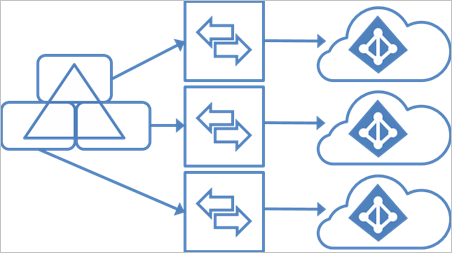

在此拓扑中，一个 Azure AD Connect 同步服务器连接到每个 Azure AD 目录。Azure AD Connect 同步服务器必须设置筛选，让它们都有一组对象的互斥集可运行。例如，将每个服务器的范围设置为特定域或 OU。DNS 域只能在单个 Azure AD 目录中注册。本地 AD 中的用户 UPN 也必须使用独立的命名空间。例如，在以上三个独立 UPN 的图片中，后缀都注册在本地 AD 中：contoso.com、fabrikam.com 和 wingtiptoys.com。每个本地 AD 域中的用户使用不同的命名空间。

Azure AD 目录实例之间没有任何 GALsync。Exchange Online 和 Skype for Business 中的通讯簿只在相同的目录中显示用户。

另外此拓扑对支持的方案具有以下限制：

- 只有一个 Azure AD 目录可以使用本地 Active Directory 启用 Exchange 混合部署。
- Windows 10 设备只能与一个 Azure AD 目录相关联。

对象互斥集的要求也适用于写回。此拓扑不支持某些写回功能，因为这些功能采用单个本地配置：

-	使用默认配置进行组写回
-	设备写回

### 每个对象在 Azure AD 目录中运行多次
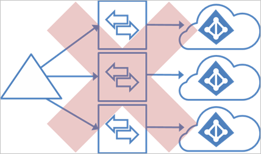 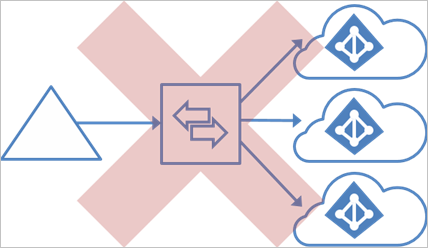

- 它不支持同步相同用户到多个 Azure AD 目录。
- 不支持进行配置更改，让一个 Azure AD 中的用户显示为另一个 Azure AD 目录中的联系人。
- 不支持将 Azure AD Connect 同步修改为连接到多个 Azure AD 目录。

### 使用写回的 GALsync
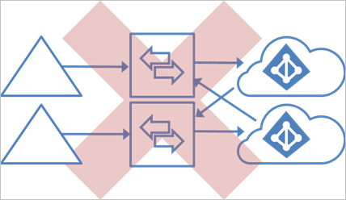 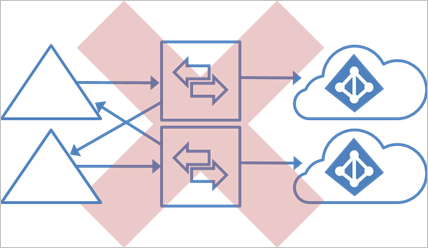

Azure AD 目录在设计上是隔离的。

- 它不支持将 Azure AD Connect 同步更改为从另一个 Azure AD 目录读取数据。
- 不支持使用 Azure AD Connect 同步将用户作为联系人导出到另一个本地 AD。

### 使用本地同步服务器的 GALsync
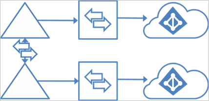

支持使用本地 FIM2010/MIM2016 在两个 Exchange 组织之间 GALsync 用户。一个组织中的用户将显示为另一组织中的外部用户/联系人。这些不同的本地 AD 可同步到它们自身的 Azure AD 目录。

## 后续步骤
若要了解如何为这些方案安装 Azure AD Connect，请参阅[Azure AD Connect 的自定义安装](/documentation/articles/active-directory-aadconnect-get-started-custom/)。

了解有关 [Azure AD Connect 同步](/documentation/articles/active-directory-aadconnectsync-whatis/)配置的详细信息。

了解有关[将本地标识与 Azure Active Directory 集成](/documentation/articles/active-directory-aadconnect/)的详细信息。

<!---HONumber=Mooncake_0711_2016-->