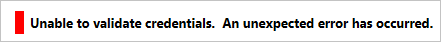
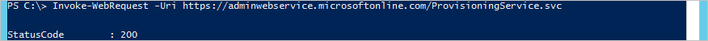

<properties
    pageTitle="Azure AD Connect：排查连接问题 | Azure"
    description="介绍如何使用 Azure AD Connect 排查连接问题。"
    services="active-directory"
    documentationcenter=""
    author="andkjell"
    manager="femila"
    editor="" />
<tags
    ms.assetid="3aa41bb5-6fcb-49da-9747-e7a3bd780e64"
    ms.service="active-directory"
    ms.workload="identity"
    ms.tgt_pltfrm="na"
    ms.devlang="na"
    ms.topic="article"
    ms.date="02/08/2017"
    wacn.date="03/07/2017"
    ms.author="billmath" />  

# 使用 Azure AD Connect 排查连接问题
本文说明 Azure AD Connect 与 Azure AD 之间的连接的工作方式，以及如何排查连接问题。这些问题很有可能出现在包含代理服务器的环境中。

## 在安装向导中排查连接问题 
Azure AD Connect 使用现代身份验证（使用 ADAL 库）来进行身份验证。安装向导和同步引擎要求正确配置 machine.config，因为这二者是 .NET 应用程序。

在本文中，我们说明了 Fabrikam 如何通过其代理连接到 Azure AD。代理服务器名为 fabrikamproxy，并使用端口 8080。

首先，我们需要确保正确配置 [**machine.config**](/documentation/articles/active-directory-aadconnect-prerequisites/#connectivity/)。

> [AZURE.NOTE]
某些非 Microsoft 博客提到，应该对 miiserver.exe.config 进行更改。但是，每次升级都会覆盖此文件，因此，尽管系统在初始安装期间可正常工作，但首次升级时会停止工作。出于此原因，建议改为更新 machine.config。
>
>

还必须在代理服务器上打开所需的 URL。[Office 365 URL 和 IP 地址范围](https://support.office.com/article/Office-365-URLs-and-IP-address-ranges-8548a211-3fe7-47cb-abb1-355ea5aa88a2)中提供了正式列表。

下表列出了连接到 Azure AD 时最起码需要的那部分 URL。此列表未包含任何可选功能，例如密码写回或 Azure AD Connect Health。本文中描述这些功能是为了帮助排查初始配置问题。

| URL | 端口 | 说明 |
| --- | --- | --- |
| mscrl.microsoft.com |HTTP/80 |用于下载 CRL 列表。 |
| *.verisign.com |HTTP/80 |用于下载 CRL 列表。 |
| *.entrust.com |HTTP/80 |用于为 MFA 下载 CRL 列表。 |
| *.chinacloudapi.cn |HTTPS/443 |用于登录 Azure AD。 |
| secure.aadcdn.microsoftonline p.com |HTTPS/443 |用于 MFA。 |
| *.microsoftonline.com |HTTPS/443 |用于配置 Azure AD 目录并导入/导出数据。 |

## 向导中的错误
安装向导使用两种不同的安全上下文。在“连接到 Azure AD”页上，使用的是当前登录的用户。在“配置”页上，改为[运行同步引擎服务的帐户](/documentation/articles/active-directory-aadconnect-accounts-permissions/#azure-ad-connect-sync-service-accounts/)。如果有问题，该问题最可能出现在向导的“连接到 Azure AD”页上，因为代理配置是全局性的。

以下问题是在安装向导中遇到的最常见错误。

### 未正确配置安装向导
当向导本身无法访问代理时，会出现此错误。

- 如果看到此错误，请验证是否已正确配置 [machine.config](/documentation/articles/active-directory-aadconnect-prerequisites/#connectivity/)。
- 如果配置看起来正确，请按照[验证代理连接](#verify-proxy-connectivity)中的步骤，查看问题是否也出现在向导外部的位置。

### 已使用 Microsoft 帐户
如果使用 **Microsoft 帐户**而不是**学校或组织**帐户，则会出现一般性错误。

### 无法访问 MFA 终结点
如果无法访问终结点 **https://secure.aadcdn.microsoftonline-p.com**，并且全局系统管理员启用了 MFA，则会出现此错误。

- 如果看到此错误，请验证是否已将 **secure.aadcdn.microsoftonline-p.com** 终结点添加到代理。

### 无法验证密码 
如果安装向导已成功连接到 Azure AD，但无法验证密码本身，则会看到此错误：

- 密码是否为临时密码并且必须更改？ 它是否确实为正确的密码？ 请尝试登录到 https://login.microsoftonline.com（在 Azure AD Connect 服务器以外的另一台计算机上），然后验证该帐户是否可用。

### 验证代理连接 
为了验证 Azure AD Connect 服务器是否确实与代理和 Internet 建立了连接，请使用某个 PowerShell 来查看代理是否允许 Web 请求。在 PowerShell 命令提示符下运行 `Invoke-WebRequest -Uri https://adminwebservice.microsoftonline.com/ProvisioningService.svc`。（从技术上讲，第一个调用是对 https://login.microsoftonline.com 发出的，并且此 URI 是可以使用的，但另一个 URI 的响应速度更快。）

PowerShell 使用 machine.config 中的配置来联系代理。winhttp/netsh 中的设置应该不会影响这些 cmdlet。

如果代理配置正确，你应会收到成功状态：

如果收到“无法连接到远程服务器”，则表示 PowerShell 正在尝试进行直接调用而未使用代理，或者 DNS 配置不正确。请确保正确配置了 **machine.config** 文件。

如果未正确配置代理，则会收到错误：
 

| 错误 | 错误文本 | 注释 |
| --- | --- | --- |
| 403 |禁止 |代理尚未对请求的 URL 打开。请重新访问代理配置，并确保已打开 [URL](https://support.office.com/article/Office-365-URLs-and-IP-address-ranges-8548a211-3fe7-47cb-abb1-355ea5aa88a2)。 |
| 407 |需要代理身份验证 |代理服务器要求登录，但未提供任何登录信息。如果代理服务器需要身份验证，请确保在 machine.config 中配置该设置。另外，请确保对运行向导的用户和服务帐户使用域帐户。 |

## Azure AD Connect 与 Azure AD 之间的通信模式
如果已按上述步骤操作但仍无法连接，现在可以开始查看网络日志。本部分说明正常且成功的连接模式。此外，还将列出用户在阅读网络日志时可能会忽略的常见辅助信息。

- 存在对 https://dc.services.visualstudio.com 的调用。不需要在代理中打开该 URL 即可成功安装，可以忽略这些调用。
- 可以看到 DNS 解析列出要处于 DNS 命名空间 nsatc.net 的实际主机，以及不在 microsoftonline.com 下的其他命名空间。但是，实际服务器名称中不会有任何 Web 服务请求，因此不需要将这些 URL 添加到代理。
- 终结点 adminwebservice 和 provisioningapi 是发现终结点，用于找出要使用的实际终结点，并且根据区域而有所不同。

### 引用代理日志
下面是实际代理日志中的转储以及从中获取此信息的安装向导页（已删除同一终结点的重复条目）。可以使用此部分作为自己的代理和网络日志的参考。环境中的实际终结点可能有所不同（尤其是以*斜体* 表示的那些 URL）。

**连接到 Azure AD**

| 时间 | URL |
| --- | --- |
| 1/11/2016 8:31 |connect://login.microsoftonline.com:443 |
| 1/11/2016 8:31 |connect://adminwebservice.microsoftonline.com:443 |
| 1/11/2016 8:32 |connect://*bba800-anchor*.microsoftonline.com:443 |
| 1/11/2016 8:32 |connect://login.microsoftonline.com:443 |
| 1/11/2016 8:33 |connect://provisioningapi.microsoftonline.com:443 |
| 1/11/2016 8:33 |connect://*bwsc02-relay*.microsoftonline.com:443 |

**配置**

| 时间 | URL |
| --- | --- |
| 1/11/2016 8:43 |connect://login.microsoftonline.com:443 |
| 1/11/2016 8:43 |connect://*bba800-anchor*.microsoftonline.com:443 |
| 1/11/2016 8:43 |connect://login.microsoftonline.com:443 |
| 1/11/2016 8:44 |connect://adminwebservice.microsoftonline.com:443 |
| 1/11/2016 8:44 |connect://*bba900-anchor*.microsoftonline.com:443 |
| 1/11/2016 8:44 |connect://login.microsoftonline.com:443 |
| 1/11/2016 8:44 |connect://adminwebservice.microsoftonline.com:443 |
| 1/11/2016 8:44 |connect://*bba800-anchor*.microsoftonline.com:443 |
| 1/11/2016 8:44 |connect://login.microsoftonline.com:443 |
| 1/11/2016 8:46 |connect://provisioningapi.microsoftonline.com:443 |
| 1/11/2016 8:46 |connect://*bwsc02-relay*.microsoftonline.com:443 |

**初始同步**

| 时间 | URL |
| --- | --- |
| 1/11/2016 8:48 |connect://login.chinacloudapi.cn:443 |
| 1/11/2016 8:49 |connect://adminwebservice.microsoftonline.com:443 |
| 1/11/2016 8:49 |connect://*bba900-anchor*.microsoftonline.com:443 |
| 1/11/2016 8:49 |connect://*bba800-anchor*.microsoftonline.com:443 |

## 身份验证错误
本部分说明可能从 ADAL（Azure AD Connect 使用的身份验证库）和 PowerShell 返回的错误。其中说明的错误可帮助你了解后续步骤。

### 无效授权
无效的用户名或密码。有关详细信息，请参阅[无法验证密码](#the-password-cannot-be-verified)。

### 未知用户类型
找不到或无法解析你的 Azure AD 目录。也许你在尝试使用未验证域中的用户名登录？

### 用户领域发现失败
网络或代理配置问题。无法访问网络。请参阅[在安装向导中排查连接问题](#troubleshoot-connectivity-issues-in-the-installation-wizard)。

### 用户密码已过期
你的凭据已过期。请更改密码。

### AuthorizationFailure
未知问题。

### 身份验证已取消
多重身份验证 (MFA) 质询已取消。

### ConnectToMSOnline
身份验证成功，但 Azure AD PowerShell 出现身份验证问题。

### AzureRoleMissing
身份验证成功。你不是全局管理员。

### CompanyInfoUnavailable
身份验证成功。无法从 Azure AD 检索公司信息。

### RetrieveDomains
身份验证成功。无法从 Azure AD 检索域信息。

### 意外的异常
在安装向导中显示为“意外错误”。可能会在用户尝试使用 **Microsoft 帐户**而不是**学校或组织帐户**的情况下发生。

## 针对旧版本的疑难解答步骤
从内部版本号 1.1.105.0（于 2016 年 2 月发行）开始，已停用登录助理。你不再需要用到本部分所述的配置，这些内容仅供参考。

要使单一登录助理正常工作，必须配置 winhttp。此配置可通过 [**netsh**](/documentation/articles/active-directory-aadconnect-prerequisites/#connectivity/) 完成。

### 未正确配置登录助理
当登录助理无法访问代理或代理不允许该请求时，将出现此错误。

- 如果看到此错误，请在 [netsh](/documentation/articles/active-directory-aadconnect-prerequisites/#connectivity/) 中查看代理配置并验证配置是否正确。
- 如果配置看起来正确，请按照[验证代理连接](#verify-proxy-connectivity)中的步骤，查看问题是否也出现在向导外部的位置。

## 后续步骤
了解有关[将本地标识与 Azure Active Directory 集成](/documentation/articles/active-directory-aadconnect/)的详细信息。

<!---HONumber=Mooncake_0227_2017-->
<!---Update_Description: wording update -->