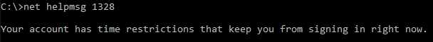

<properties
    pageTitle="Azure AD Connect：对直通身份验证进行故障排除 | Azure"
    description="本文介绍如何对 Azure Active Directory (Azure AD) 直通身份验证进行故障排除。"
    services="active-directory"
    keywords="对 Azure AD Connect 直通身份验证进行故障排除, 安装 Active Directory, Azure AD 所需的组件, SSO, 单一登录"
    documentationcenter=""
    author="swkrish"
    manager="femila" />
<tags
    ms.assetid="9f994aca-6088-40f5-b2cc-c753a4f41da7"
    ms.service="active-directory"
    ms.workload="identity"
    ms.tgt_pltfrm="na"
    ms.devlang="na"
    ms.topic="article"
    ms.date="05/09/2017"
    ms.author="billmath"
    wacn.date="06/12/2017"
    ms.translationtype="Human Translation"
    ms.sourcegitcommit="08618ee31568db24eba7a7d9a5fc3b079cf34577"
    ms.openlocfilehash="a1dadafcaca3defbbffb737eb63c297750608bec"
    ms.contentlocale="zh-cn"
    ms.lasthandoff="05/26/2017" />

# 如何对 Azure Active Directory 直通身份验证进行故障排除？

本文将帮助查找有关排查安装、注册或卸载直通身份验证连接器（通过 Azure AD Connect 或独立的连接器）期间， 以及在租户中启用和操作 Azure Active Directory (Azure AD) 直通身份验证功能期间遇到的常见问题的信息。

## 安装连接器（通过 Azure AD Connect 或独立的连接器）期间遇到的问题

### 发生了意外的错误

从服务器[收集连接器日志](#collecting-pass-through-authentication-connector-logs)，然后联系 Microsoft 支持人员反映问题。

## 注册连接器期间遇到的问题

### 由于端口被阻止，连接器注册失败

确保安装连接器的服务器能够与我们的服务 URL 和[此处](/documentation/articles/active-directory-aadconnect-pass-through-authentication/#prerequisites/)列出的端口通信。

### 由于令牌或帐户授权错误，连接器注册失败

确保对所有 Azure AD Connect 或独立连接器安装和注册操作使用仅限云的全局管理员帐户。 已启用 MFA 的全局管理员帐户存在一个已知问题；作为解决方法，请暂时关闭 MFA（只是为了完成操作）。

### 发生了意外的错误

从服务器[收集连接器日志](#collecting-pass-through-authentication-connector-logs)，然后联系 Microsoft 支持人员反映问题。

## 卸载连接器期间遇到的问题

### 卸载 Azure AD Connect 时出现警告消息

如果在租户中启用了直通身份验证，则当尝试卸载 Azure AD Connect 时，会显示以下警告消息：“除非已在其他服务器上安装其他直通身份验证代理，否则用户无法登录到 Azure AD。”

在卸载 Azure AD Connect 之前，需要事先设置[高可用性](/documentation/articles/active-directory-aadconnect-pass-through-authentication/)，以免影响用户登录。

## 启用直通身份验证功能期间遇到的问题

### 由于没有可用的连接器，启用该功能失败

必须至少有一个活动的连接器才能在租户中启用直通身份验证。 可通过安装 Azure AD Connect 或独立连接器来安装连接器。

### 由于端口被阻止，启用该功能失败

确保安装 Azure AD Connect 的服务器能够与我们的服务 URL 和[此处](/documentation/articles/active-directory-aadconnect-pass-through-authentication/#prerequisites/)列出的端口通信。

### 由于令牌或帐户授权错误，启用该功能失败

启用该功能时，确保使用仅限云的全局管理员帐户。 已启用多重身份验证 (MFA) 的全局管理员帐户存在一个已知问题；作为解决方法，请暂时关闭 MFA（只是为了完成操作）。

## 操作直通身份验证功能期间遇到的问题

### 面向用户的登录错误

该功能在 Azure AD 在登录屏幕中报告了以下面向用户的错误。 下面详细描述了这些错误及其相应的解决步骤。

|错误|说明|解决方法
| --- | --- | ---
|AADSTS80001|无法连接到 Active Directory|确保连接器服务器是需要验证其密码的用户所在的 AD 林的成员，并且能够连接到 Active Directory。  
|AADSTS8002|连接到 Active Directory 时超时|检查以确保 Active Directory 可用，并且可以响应连接器的请求。
|AADSTS80004|传递到连接器的用户名无效|确保用户尝试使用正确的用户名登录。
|AADSTS80005|验证遇到不可预知的 WebException|这可能是一个暂时性的错误。 重试请求。 如果持续失败，请与 Microsoft 支持人员联系。
|AADSTS80007|与 Active Directory 通信时出错|检查连接器日志以了解更多信息，并验证 Active Directory 是否按预期方式运行。

## 收集直通身份验证连接器日志

根据遇到的问题类型，需要在不同的位置查看直通身份验证连接器日志。

### 连接器事件日志

对于与连接器相关的错误，请在服务器上打开事件查看器应用程序，然后检查 **Application and Service Logs\Microsoft\AadApplicationProxy\Connector\Admin** 中的日志。

若要获取详细的分析和调试日志，可以启用“会话”日志。 在正常操作期间，请不要在启用此日志的情况下运行连接器；只将此日志用于故障排除。 请注意，日志内容只会在再次禁用日志后才可见。

### 详细跟踪日志

若要排查用户登录失败，请查看 **C:\Programdata\Microsoft\Microsoft AAD Application Proxy Connector\Trace** 中的跟踪日志。 这些日志包含特定用户使用直通身份验证功能登录失败的原因。 下面提供了示例日志条目：

    ApplicationProxyConnectorService.exe Error: 0 : Passthrough Authentication request failed. RequestId: 'df63f4a4-68b9-44ae-8d81-6ad2d844d84e'. Reason: '1328'.
        ThreadId=5
        DateTime=xxxx-xx-xxTxx:xx:xx.xxxxxxZ

可以通过打开命令提示符并运行以下命令来获取错误（在上述示例中为错误“1328”）的描述性详细信息。 注意：需要将“1328”替换为日志中显示的实际错误编号。

`Net helpmsg 1328`

结果应如下所示：

### 域控制器日志

如果已启用审核日志记录，可以在域控制器的安全日志中找到更多信息。 下面演示了一种查询直通身份验证连接器发送的登录请求的简单方法：

    <QueryList>
    <Query Id="0" Path="Security">
    <Select Path="Security">*[EventData[Data[@Name='ProcessName'] and (Data='C:\Program Files\Microsoft AAD App Proxy Connector\ApplicationProxyConnectorService.exe')]]</Select>
    </Query>
    </QueryList>

