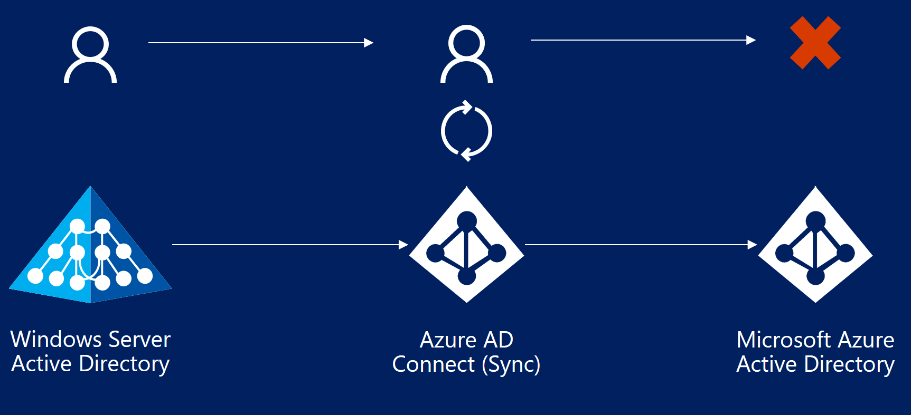

<properties
    pageTitle="Azure AD Connect：排查同步过程中发生的错误 | Azure"
    description="介绍如何使用 Azure AD Connect 排查同步过程中遇到的错误。"
    services="active-directory"
    documentationcenter=""
    author="karavar"
    manager="samueld"
    editor="curtand" />
<tags
    ms.assetid="2209d5ce-0a64-447b-be3a-6f06d47995f8"
    ms.service="active-directory"
    ms.workload="identity"
    ms.tgt_pltfrm="na"
    ms.devlang="na"
    ms.topic="article"
    ms.date="1/31/2017"
    wacn.date="03/07/2017"
    ms.author="vakarand" />  

# 排查同步过程中发生的错误
将标识数据从 Windows Server Active Directory (AD DS) 同步到 Azure Active Directory (Azure AD) 时可能会发生错误。本文概述不同类型的同步错误、导致这些错误的某些可能情况，以及这些错误的可能解决方法。本文介绍常见错误类型，不一定涵盖所有可能的错误。

 本文假设读者熟悉 [ Azure AD 和 Azure AD Connect 的基础设计概念](/documentation/articles/active-directory-aadconnect-design-concepts/)。

在最新版本的 Azure AD Connect（2016 年 8 月版或更高版本）中，[Azure 门户预览](https://aka.ms/aadconnecthealth)会针对用于同步的 Azure AD Connect Health 提供同步错误报告。

从 2016 年 9 月 1 日开始，默认将为所有*新的* Azure Active Directory 租户启用 [Azure Active Directory 重复属性复原](/documentation/articles/active-directory-aadconnectsyncservice-duplicate-attribute-resiliency/)功能。在接下来的几个月，将自动为现有租户启用此功能。

Azure AD Connect 通过它所同步的目录执行 3 种类型的操作：导入、同步和导出。在执行所有这些操作时都可能发生错误。本文重点介绍在导出到 Azure AD 期间发生的错误。

## 导出到 Azure AD 期间发生的错误
以下部分介绍在使用 Azure AD 连接器导出到 Azure AD 期间可能发生的不同类型的同步错误。可以使用“contoso.*partner.onmschina.cn*”格式的名称来标识此连接器。导出到 Azure AD 期间发生错误表示 Azure AD Connect（同步引擎）尝试针对 Azure Active Directory 执行的操作（添加、更新、删除等）失败。

  

## 数据不匹配错误
### InvalidSoftMatch
#### 说明
- 当 Azure AD Connect（同步引擎）指示 Azure Active Directory 添加或更新对象时，Azure AD 会使用 **sourceAnchor** 属性将传入对象与 Azure AD 中对象的 **immutableId** 属性进行匹配。这种匹配称为**硬匹配**。
- 如果 Azure AD **找不到**有任何对象的 **immutableId** 属性与传入对象的 **sourceAnchor** 属性匹配，则在预配新对象之前，它会回退为使用 ProxyAddresses 和 UserPrincipalName 属性来查找匹配项。这种匹配称为**软匹配**。软匹配旨在将 Azure AD 中已存在的对象（源自 Azure AD 的对象）与同步期间添加/更新的、代表相同实体（用户或组）的新对象进行匹配。
- 如果硬匹配找不到任何匹配的对象，**并且**软匹配虽然找到了匹配的对象，但该对象的 *immutableId* 值不同于传入对象的 *SourceAnchor*（这意味着匹配的对象与本地 Active Directory 中的另一个对象同步），则会发生 **InvalidSoftMatch** 错误。

换而言之，若要使软匹配正常工作，要进行软匹配的对象不应使用 *immutableId* 的任何值。如果设置了 *immutableId* 值的任何对象不符合硬匹配条件但符合软匹配条件，相应的操作将导致 InvalidSoftMatch 同步错误。

Azure Active Directory 架构不允许两个或更多个对象的以下属性使用相同值。（此列表并不详尽。）

- ProxyAddresses
- UserPrincipalName
- onPremisesSecurityIdentifier
- ObjectId

> [AZURE.NOTE]
> [Azure AD Attribute Duplicate Attribute Resiliency](/documentation/articles/active-directory-aadconnectsyncservice-duplicate-attribute-resiliency/) 功能同时将作为 Azure Active Directory 的默认行为推出。该功能可使 Azure AD 更灵活地处理本地 AD 环境中的重复 ProxyAddresses 和 UserPrincipalName 属性，减少 Azure AD Connect（以及其他同步客户端）遇到的同步错误。此功能无法解决重复错误。因此，仍然需要修复数据。但是，使用此功能可以预配新对象，否则，会由于 Azure AD 中存在重复值而无法预配。此外，这还减少了返回到同步客户端的同步错误。如果为租户启用此功能，则预配新对象期间不会出现 InvalidSoftMatch 同步错误。
>
>

#### 发生 InvalidSoftMatch 的示例情景
1. 本地 Active Directory 中有两个或更多个对象的 ProxyAddresses 属性值相同。在 Azure AD 中只会预配其中一个对象。
2. 本地 Active Directory 中有两个或更多个对象的 userPrincipalName 值相同。在 Azure AD 中只会预配其中一个对象。
3. 在本地 Active Directory 中添加了一个对象，该对象的 ProxyAddresses 属性值与 Azure Active Directory 中现有对象的该属性值相同。在本地添加的对象将不会在 Azure Active Directory 中预配。
4. 在本地 Active Directory 中添加了一个对象，该对象的 userPrincipalName 属性值与 Azure Active Directory 中某个帐户的该属性值相同。该对象将不会在 Azure Active Directory 中预配。
5. 将某个已同步的帐户从林 A 移到了林 B。Azure AD Connect（同步引擎）已使用 ObjectGUID 属性计算 SourceAnchor。移动林后，SourceAnchor 值将会不同。林 B 中的新对象无法与 Azure AD 中的现有对象同步。
6. 从本地 Active Directory 中意外删除了一个已同步的对象，同时，在 Active Directory 中为同一实体（例如用户）创建了新对象，但未删除 Azure Active Directory 中的帐户。新帐户将无法与现有的 Azure AD 对象同步。
7. 卸载后重新安装 Azure AD Connect。重新安装期间，将一个不同的属性选作 SourceAnchor。以前同步的所有对象将不再同步，并出现 InvalidSoftMatch 错误。

#### 案例：
1. **Bob Smith** 是 Azure Active Directory 中的一个用户，该用户已从 *contoso.com* 本地 Active Directory 同步
2. Bob Smith 的 **UserPrincipalName** 设置为 **bobs@contoso.com**。
3. **"abcdefghijklmnopqrstuv=="** 是 Azure AD Connect 使用 Bob Smith 在本地 Active Directory 中的 **objectGUID**（在 Azure Active Directory 中，Bob Smith 的该属性为 **immutableId**）计算得出的 **SourceAnchor**。
4. Bob 还具有以下 **proxyAddresses** 属性值：
   - smtp:bobs@contoso.com
   - smtp:bob.smith@contoso.com
   - **smtp:bob@contoso.com**
5. 已将新用户 **Bob Taylor** 添加到本地 Active Directory。
6. Bob Taylor 的 **UserPrincipalName** 设置为 **bobt@contoso.com**。
7. **"abcdefghijkl0123456789==""** 是 Azure AD Connect 使用 Bob Taylor 在本地 Active Directory 中的 **objectGUID** 计算得出的 **sourceAnchor**。Bob Taylor 的对象尚未同步到 Azure Active Directory。
8. Bob Taylor 还具有以下 proxyAddresses 属性值
   - smtp:bobt@contoso.com
   - smtp:bob.taylor@contoso.com
   - **smtp:bob@contoso.com**
9. 在同步期间，Azure AD Connect 将会识别到在本地 Active Directory 中添加了 Bob Taylor，并要求 Azure AD 做出相同的更改。
10. Azure AD 首先会执行硬匹配。也就是说，它会搜索 immutableId 等于 "abcdefghijkl0123456789==" 的任何对象。如果 Azure AD 中没有任何其他对象具有该 immutableId，硬匹配将会失败。
11. 然后，Azure AD 将尝试对 Bob Taylor 进行软匹配。也就是说，它将搜索 proxyAddresses 等于上述三个值（包括 smtp:bob@contoso.com）的任何对象
12. Azure AD 将会根据软匹配条件查找 Bob Smith 的对象。但此对象 immutableId 值为 "abcdefghijklmnopqrstuv =="，这表示此对象已从本地 Active Directory 中的另一个对象同步。因此，Azure AD 无法软匹配这些对象，从而导致 **InvalidSoftMatch** 同步错误。

#### 如何解决 InvalidSoftMatch 错误
发生 InvalidSoftMatch 错误的最常见原因是两个对象的 SourceAnchor (immutableId) 不同，但 ProxyAddresses 和/或 UserPrincipalName 属性（在 Azure AD 中执行软匹配过程中会使用这些属性）相同。解决软匹配无效错误

1. 识别导致错误的重复 proxyAddresses、userPrincipalName 或其他属性值。另外，识别冲突中涉及到哪两个（或更多个）对象。[用于同步的 Azure AD Connect Health](https://aka.ms/aadchsyncerrors) 生成的报告可帮助识别这两个对象。
2. 识别哪个对象会以及哪个对象不会继续使用重复值。
3. 从不会继续使用该值的对象中删除重复值。请注意，应该在对象的来源目录中进行更改。在某些情况下，可能需要删除其中一个有冲突的对象。
4. 如果在本地 AD 中进行更改，请让 Azure AD Connect 同步更改。

请注意，用于同步的 Azure AD Connect Health 中的同步错误报告每隔 30 分钟更新一次，其中包含最近一次同步尝试出现的错误。

> [AZURE.NOTE]
根据定义，ImmutableId 在对象的生存期内不应更改。如果在配置 Azure AD Connect 时未考虑到上述列表中的某些情景，Azure AD Connect 为代表相同实体（同一个用户/组/联系人等）的、存在你想要继续使用的 Azure AD 对象的 AD 对象计算的 SourceAnchor 值不同。
>
>

#### 相关文章
- [Duplicate or invalid attributes prevent directory synchronization in Office 365（Office 365 中的重复或无效属性导致无法进行目录同步）](https://support.microsoft.com/zh-cn/kb/2647098)

### ObjectTypeMismatch
#### 说明
当 Azure AD 尝试对两个对象进行软匹配时，“对象类型”（如用户、组、联系人等）不同的两个对象可能对用于执行软匹配的属性使用了相同值。由于 Azure AD 中不允许这些属性重复，相应操作可能会导致“ObjectTypeMismatch”同步错误。

#### 发生 ObjectTypeMismatch 错误的示例情景
- 在 Office 365 中创建了一个支持邮件的安全组。管理员在本地 AD 中添加了一个新用户或联系人（尚未同步到 Azure AD），并且该对象的 ProxyAddresses 属性值与 Office 365 组的该属性值相同。

#### 案例
1. 管理员在 Office 365 中为税务部门创建一个支持邮件的新安全组，并提供了电子邮件地址 tax@contoso.com。这样，就会为此组分配值为 **smtp:tax@contoso.com** 的 ProxyAddresses 属性
2. 有一个新用户加入了 Contoso.com，管理员在本地为该用户创建了 proxyAddress 为 **smtp:tax@contoso.com** 的帐户
3. 当 Azure AD Connect 同步新用户帐户时，会出现“ObjectTypeMismatch”错误。

#### 如何解决 ObjectTypeMismatch 错误
发生 ObjectTypeMismatch 错误的最常见原因是两个对象的类型（用户、组、联系人等）不同，但 ProxyAddresses 属性值相同。解决 ObjectTypeMismatch：

1. 识别导致错误的重复 proxyAddresses（或其他属性）值。另外，识别冲突中涉及到哪两个（或更多个）对象。[用于同步的 Azure AD Connect Health](https://aka.ms/aadchsyncerrors) 生成的报告可帮助识别这两个对象。
2. 识别哪个对象会以及哪个对象不会继续使用重复值。
3. 从不会继续使用该值的对象中删除重复值。请注意，应该在对象的来源目录中进行更改。在某些情况下，可能需要删除其中一个有冲突的对象。
4. 如果在本地 AD 中进行更改，请让 Azure AD Connect 同步更改。用于同步的 Azure AD Connect Health 中的同步错误报告每隔 30 分钟更新一次，其中包含最近一次同步尝试出现的错误。

## 重复属性
### AttributeValueMustBeUnique
#### 说明
Azure Active Directory 架构不允许两个或更多个对象的以下属性使用相同值。也就是说，Azure AD 中的每个对象在给定的实例中都必须对这些属性使用唯一值。

- ProxyAddresses
- UserPrincipalName

如果 Azure AD Connect 尝试添加新对象或更新现有对象，但该对象的上述属性值已分配给 Azure Active Directory 中的另一个对象，则该操作会导致“AttributeValueMustBeUnique”同步错误。

#### 可能的情景：
1. 向已同步的对象分配了重复值，导致与另一个已同步的对象冲突。

#### 案例：
1. **Bob Smith** 是 Azure Active Directory 中的一个用户，该用户已从 contoso.com 本地 Active Directory 同步
2. Bob Smith 在本地的 **UserPrincipalName** 设置为 **bobs@contoso.com**。
3. Bob 还具有以下 **proxyAddresses** 属性值：
   - smtp:bobs@contoso.com
   - smtp:bob.smith@contoso.com
   - **smtp:bob@contoso.com**
4. 已将新用户 **Bob Taylor** 添加到本地 Active Directory。
5. Bob Taylor 的 **UserPrincipalName** 设置为 **bobt@contoso.com**。
6. **Bob Taylor** 还具有以下 **ProxyAddresses** 属性值：i. smtp:bobt@contoso.com，ii. smtp:bob.taylor@contoso.com
7. Bob Taylor 的对象已成功与 Azure AD 同步。
8. 管理员决定使用以下值更新 Bob Taylor 的 **ProxyAddresses** 属性：i. **smtp:bob@contoso.com**
9. Azure AD 将尝试使用上述值更新 Bob Taylor 在 Azure AD 中的对象，但该操作将会失败，因为 ProxyAddresses 值已分配给 Bob Smith，从而导致“AttributeValueMustBeUnique”错误。

#### 如何解决 AttributeValueMustBeUnique 错误
发生 AttributeValueMustBeUnique 错误的最常见原因是两个对象的 SourceAnchor (immutableId) 不同，但 ProxyAddresses 和/或 UserPrincipalName 属性相同。解决 AttributeValueMustBeUnique 错误

1. 识别导致错误的重复 proxyAddresses、userPrincipalName 或其他属性值。另外，识别冲突中涉及到哪两个（或更多个）对象。[用于同步的 Azure AD Connect Health](https://aka.ms/aadchsyncerrors) 生成的报告可帮助识别这两个对象。
2. 识别哪个对象会以及哪个对象不会继续使用重复值。
3. 从不会继续使用该值的对象中删除重复值。请注意，应该在对象的来源目录中进行更改。在某些情况下，可能需要删除其中一个有冲突的对象。
4. 如果在本地 AD 中进行更改，请让 Azure AD Connect 同步更改，使错误得到解决。

#### 相关文章
-[Duplicate or invalid attributes prevent directory synchronization in Office 365](https://support.microsoft.com/zh-cn/kb/2647098)（Office 365 中的重复或无效属性导致无法进行目录同步）

## 数据验证失败
### IdentityDataValidationFailed
#### 说明
在允许将数据写入目录之前，Azure Active Directory 会对数据本身强制实施各种限制。这是为了确保最终用户尽可能获得最佳体验，同时可以使用依赖于此数据的应用程序。

#### 方案
a.UserPrincipalName 属性值包含无效/不支持的字符。
b.UserPrincipalName 属性不符合所需的格式。

#### 如何解决 IdentityDataValidationFailed 错误
a.确保 userPrincipalName 属性包含支持的字符并使用所需的格式。

#### 相关文章
- [Prepare to provision users through directory synchronization to Office 365（准备在 Office 365 中通过目录同步来预配用户）](https://support.office.com/zh-cn/article/Prepare-to-provision-users-through-directory-synchronization-to-Office-365-01920974-9e6f-4331-a370-13aea4e82b3e)

### DataValidationFailed
#### 说明
这是导致**“DataValidationFailed”**同步错误的一个具体的案例：用户的 UserPrincipalName 后缀已从一个联合域更改为另一个联合域。

#### 方案
某个已同步用户的 UserPrincipalName 后缀已从一个联合域更改为本地的另一个联合域。例如，*UserPrincipalName = bob@contoso.com* 已更改为 *UserPrincipalName = bob@fabrikam.com*。

#### 示例
1. 在 Active Directory 中，已将 Contoso.com 的帐户 Bob Smith 添加为新用户，其 UserPrincipalName 为 bob@contoso.com
2. Bob 将移到 Contoso.com 中名为 Fabrikam.com 的另一个分支机构，其 UserPrincipalName 将更改为 bob@fabrikam.com
3. contoso.com 和 fabrikam.com 域是与 Azure Active Directory 联合的域。
4. Bob 的 userPrincipalName 不会更新，并且会导致“DataValidationFailed”同步错误。

#### 如何解决
如果用户的 UserPrincipalName 后缀已从 bob@**contoso.com** 更新为 bob@**fabrikam.com**，并且 **contoso.com** 和 **fabrikam.com** 都是**联合域**，则执行以下步骤可以解决同步错误

1. 在 Azure AD 中将用户的 UserPrincipalName 从 bob@contoso.com 更新为 bob@contoso.partner.onmschina.cn。可以在 Azure AD PowerShell 模块中使用以下 PowerShell 命令：
`Set-MsolUserPrincipalName -UserPrincipalName bob@contoso.com -NewUserPrincipalName bob@contoso.partner.onmschina.cn`
2. 允许下一个同步周期尝试同步。这一次，同步将会成功，并且会按预期将 Bob 的 UserPrincipalName 更新为 bob@fabrikam.com。

#### 相关文章
- [在将用户帐户的 UPN 更改为使用不同的联合域后，Azure Active Directory 同步工具未同步更改](https://support.microsoft.com/zh-cn/help/2669550/changes-aren-t-synced-by-the-azure-active-directory-sync-tool-after-you-change-the-upn-of-a-user-account-to-use-a-different-federated-domain)

## LargeObject
### 说明
当某个属性超过 Azure Active Directory 架构设置的允许大小限制、长度限制或计数限制时，同步操作会导致 **LargeObject** 或 **ExceededAllowedLength** 同步错误。通常，此错误发生在以下属性上

- userCertificate
- thumbnailPhoto
- proxyAddresses

### 可能的方案
1. Bob 的 userCertificate 属性存储了过多的分配给 Bob 的证书。其中可能包括旧的或过期的证书。硬性限制为 50 个证书，但建议让证书数目低于 25。
2. 在 Active Directory 中为 Bob 设置的 thumbnailPhoto 过大，无法在 Azure AD 中同步。
3. 在 Active Directory 中自动填充 ProxyAddresses 属性期间，为某个对象分配了 500 个以上的 ProxyAddresses。

### 如何解决
1. 确保导致错误的属性在允许的限制范围内。

## 相关链接
- [Locate Active Directory Objects in Active Directory Administrative Center（在 Active Directory 管理中心查找 Active Directory 对象）](https://technet.microsoft.com/zh-cn/library/dd560661.aspx)
- [How to query Azure Active Directory for an object using Azure Active Directory PowerShell（如何使用 Azure Active Directory PowerShell 在 Azure Active Directory 中查询对象）](https://msdn.microsoft.com/zh-cn/library/azure/jj151815.aspx)

<!---HONumber=Mooncake_0227_2017-->
<!---Update_Description: wording update -->