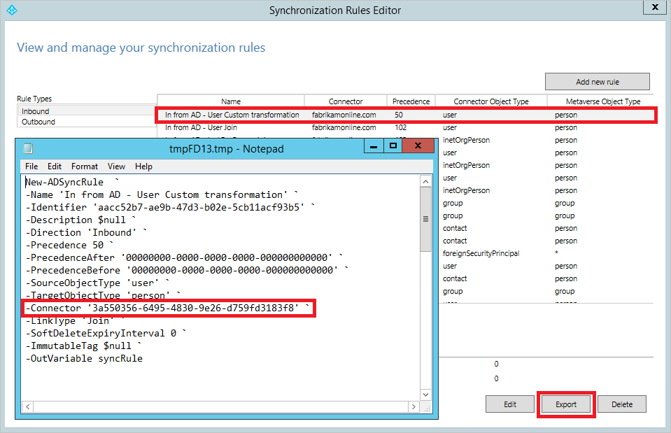

<properties
    pageTitle="Azure AD Connect：从旧版升级 | Azure"
    description="介绍升级到 Azure Active Directory Connect 最新版本的不同方法，包括就地升级和交叉迁移。"
    services="active-directory"
    documentationcenter=""
    author="AndKjell"
    manager="femila"
    editor="" />
<tags
    ms.assetid="31f084d8-2b89-478c-9079-76cf92e6618f"
    ms.service="active-directory"
    ms.devlang="na"
    ms.topic="article"
    ms.tgt_pltfrm="na"
    ms.workload="Identity"
    ms.date="02/08/2017"
    wacn.date="03/07/2017"
    ms.author="billmath" />  

# Azure AD Connect：从旧版升级到最新版本
本主题介绍可将 Azure AD Connect 安装升级到最新版本的不同方法。建议使用最新版本的 Azure AD Connect。进行重大配置更改时，也可以使用[交叉迁移](#swing-migration)中所述的步骤。

如果要从 DirSync 升级，请参阅[从 Azure AD 同步工具 (DirSync) 升级](/documentation/articles/active-directory-aadconnect-dirsync-upgrade-get-started/)。

可以采用几种不同的策略来升级 Azure AD Connect。

| 方法 | 说明 |
| --- | --- |
| [自动升级](/documentation/articles/active-directory-aadconnect-feature-automatic-upgrade/) |对于使用快速安装的客户，这是最简单的方法。 |
| [就地升级](#in-place-upgrade) |如果你只有一台服务器，请在该服务器上就地升级安装。 |
| [交叉迁移](#swing-migration) |如果有两台服务器，可将其中一台升级到最新版本或配置，然后在准备就绪时更改活动服务器。 |

有关所需的权限，请参阅[升级所需的权限](/documentation/articles/active-directory-aadconnect-accounts-permissions/#upgrade/)。

> [AZURE.NOTE]
启用新的 Azure AD Connect 服务器并开始将更改同步到 Azure AD 以后，不得通过回退来使用 DirSync 或 Azure AD Sync。不支持从 Azure AD Connect 降级到旧版客户端（包括 DirSync 和 Azure AD Sync），降级会导致 Azure AD 中的数据丢失等问题。
> 
> 

## 就地升级 
就地升级适用于从 Azure AD Sync 或 Azure AD Connect 迁移。它不适用于 DirSync 或使用 FIM + Azure AD 连接器的解决方案。

如果只有一台服务器且对象数少于约 100,000 个，则这是首选方法。升级后，如果对现成的同步规则进行任何更改，则会发生完全导入和完全同步。这可以确保将新配置应用到系统中的所有现有对象。这可能需要花费几小时的时间，具体取决于同步引擎范围内的对象数。正常增量同步计划程序（默认为每隔 30 分钟运行）将会暂停，但密码同步将会继续。你可以考虑在周末进行就地升级。如果未对新版 Azure AD Connect 中的现成配置进行更改，则启动一般的增量导入/同步。

如果你已更改现成的同步规则，这些规则将在系统升级完成之后重置为默认配置。为了确保配置在每次升级之后得到保留，请务必按照 [Best practices for changing the default configuration](/documentation/articles/active-directory-aadconnectsync-best-practices-changing-default-configuration/)（更改默认配置的最佳实践）中所述的步骤来更改配置。

## 交叉迁移 
如果服务器部署很复杂或者对象很多，在活动的系统上进行就地升级可能不切合实际。某些客户可能要花费好几天时间来升级系统，并且系统在升级期间无法处理任何增量更改。如果打算对配置进行重大更改，并且希望在将这些更改推送到云之前对其进行测试，则也可以使用此方法。

针对这些方案的建议方法是使用交叉迁移。至少需要两台服务器，一台是活动服务器，另一台是过渡服务器。活动服务器（在下图中以蓝色实线表示）负责处理活动的生产负载。过渡服务器（在下图中以紫色虚线表示）中准备好新版本或配置并完全做好准备时，此服务器将成为活动服务器。现在，将包含旧版本或配置的前一台活动服务器设为过渡服务器，然后进行升级。

两台服务器可以使用不同的版本。例如，打算解除的活动服务器可以使用 Azure AD Sync，新的过渡服务器可以使用 Azure AD Connect。如果使用交叉迁移来开发新配置，则建议在两台服务器上使用相同的版本。

备注：我们注意到，对于这种方案，有些客户喜欢使用三到四台服务器来进行交叉迁移。升级过渡服务器时，万一发生[灾难恢复](/documentation/articles/active-directory-aadconnectsync-operations/#disaster-recovery/)，就没有备份服务器可用。如果使用三到四台服务器，就可以准备一组装有新版本的主/备用服务器，确保始终都有过渡服务器来接管任务。

以下步骤也适用于从 Azure AD Sync 或者使用 FIM + Azure AD 连接器的解决方案迁移。这些步骤不适用于 DirSync，但是，可以在 [Upgrade Azure Active Directory sync (DirSync)](/documentation/articles/active-directory-aadconnect-dirsync-upgrade-get-started/)（升级 Azure Active Directory 同步 (DirSync)）一文中找到适用于 DirSync 的相同交叉迁移（也称为并行部署）方法的步骤。

### 交叉迁移步骤
1. 如果在两台服务器上使用 Azure AD Connect 并且只打算执行配置更改，请确保活动服务器和过渡服务器使用相同的版本。这将有助于稍后比较差异。如果要从 Azure AD Sync 升级，这些服务器将使用不同的版本。如果要从旧版 Azure AD Connect 升级，建议使用相同的版本在两台服务器上开始升级，但不一定要这样做。
2. 如果创建了一些自定义配置，但过渡服务器没有这些配置，请遵循[将自定义配置从活动服务器移到过渡服务器](#move-custom-configuration-from-active-to-staging-server)部分中的步骤。
3. 如果要从旧版 Azure AD Connect 升级，请将过渡服务器升级到最新版本。如果要从 Azure AD Sync 迁移，请在过渡服务器上安装 Azure AD Connect。
4. 让同步引擎在过渡服务器上运行完全导入和完全同步。
5. 使用[验证服务器的配置](/documentation/articles/active-directory-aadconnectsync-operations/#verify-the-configuration-of-a-server/)部分中**验证**下面列出的步骤，验证新配置是否不会造成任何意外的更改。如果发现意外的更改，请予以纠正、运行导入和同步，然后再次验证，直到数据看起来正常为止。可以在链接的主题中找到这些步骤。
6. 将过渡服务器切换为活动服务器。这是[验证服务器的配置](/documentation/articles/active-directory-aadconnectsync-operations/#verify-the-configuration-of-a-server/)中的最后一个步骤，即**切换活动服务器**。
7. 如果要升级 Azure AD Connect，现在请在过渡模式下将服务器升级到最新版本。按照与前面相同的步骤来升级数据和配置。如果已从 Azure AD Sync 升级，现在可以关闭并解除旧服务器。

### 将自定义配置从活动服务器移到过渡服务器 
如果对活动服务器做了配置更改，需确保将相同的更改应用到过渡服务器。

可以使用 PowerShell 来移动已创建的自定义同步规则。其他更改必须以相同的方式应用到这两个系统且不能迁移。

必须在两台服务器上以相同方式配置的项目：

- 与相同林的连接。
- 任何域和 OU 筛选。
- 相同的可选功能，例如密码同步和密码写回。

**移动同步规则**
若要移动自定义同步规则，请执行以下操作：

1. 在活动服务器上打开“同步规则编辑器”。
2. 选择你的自定义规则。单击“导出”。此时将打开一个记事本窗口。使用 PS1 扩展名保存临时文件。这样就可以将它转换为 PowerShell 脚本。将此 ps1 文件复制到过渡服务器。

3. 过渡服务器上的连接器 GUID 不同，因此必须更改。若要获取 GUID，请启动“同步规则编辑器”、选择表示同一个已连接系统的现成规则之一，然后单击“导出”。将 PS1 文件中的 GUID 替换为过渡服务器中的 GUID。
4. 在 PowerShell 命令提示符下运行 PS1 文件。这将在过渡服务器上创建自定义同步规则。
5. 如果你有多个自定义规则，请针对所有自定义规则重复上述步骤。

## 后续步骤
了解有关[将本地标识与 Azure Active Directory 集成](/documentation/articles/active-directory-aadconnect/)的详细信息。

<!---HONumber=Mooncake_0227_2017-->
<!---Update_Description: wording update -->