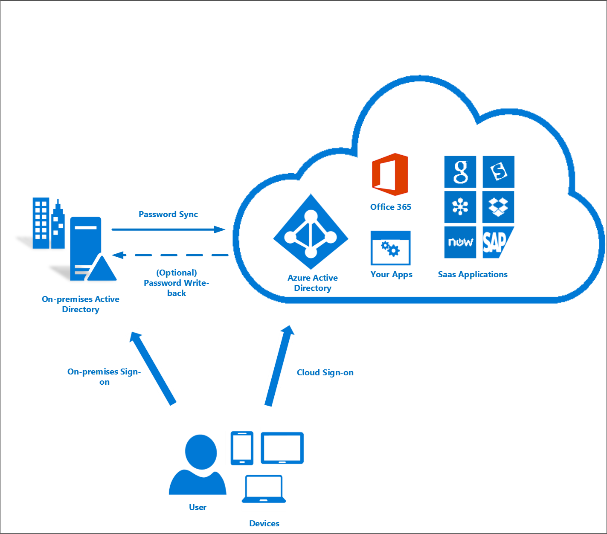
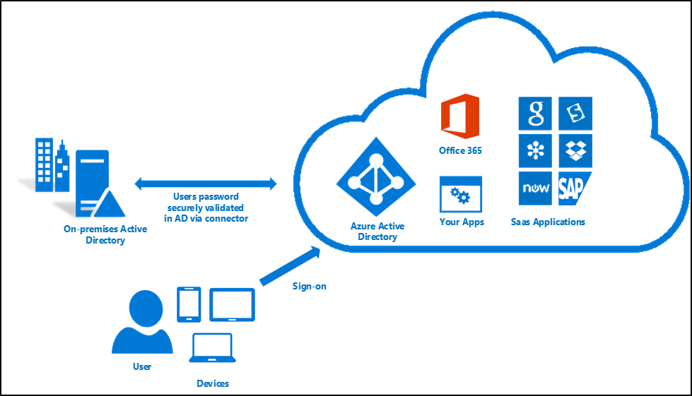
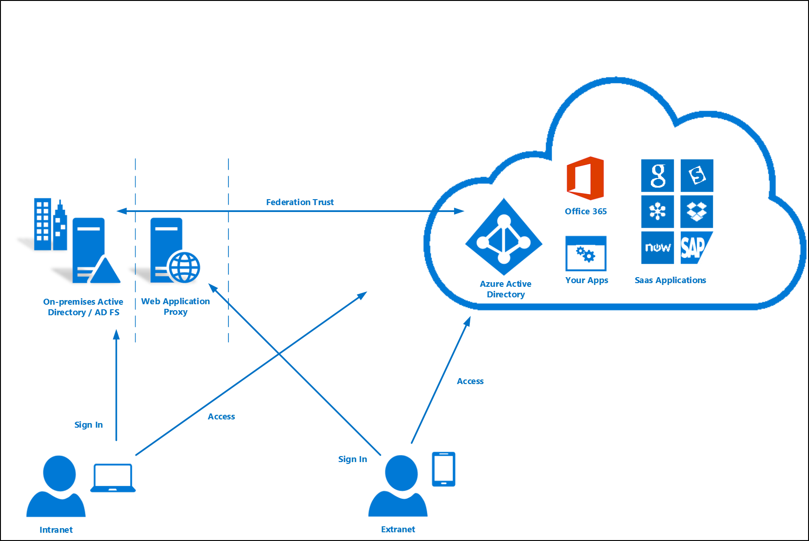
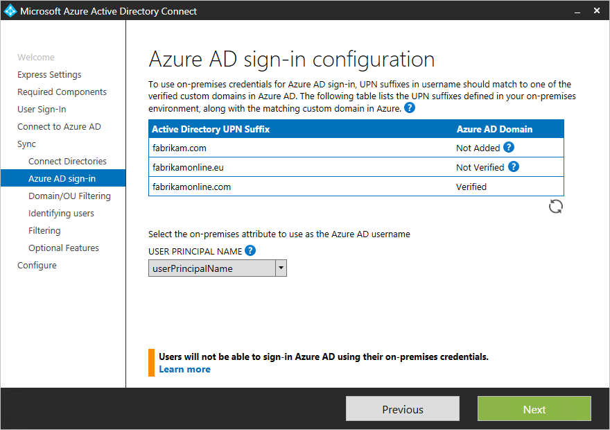
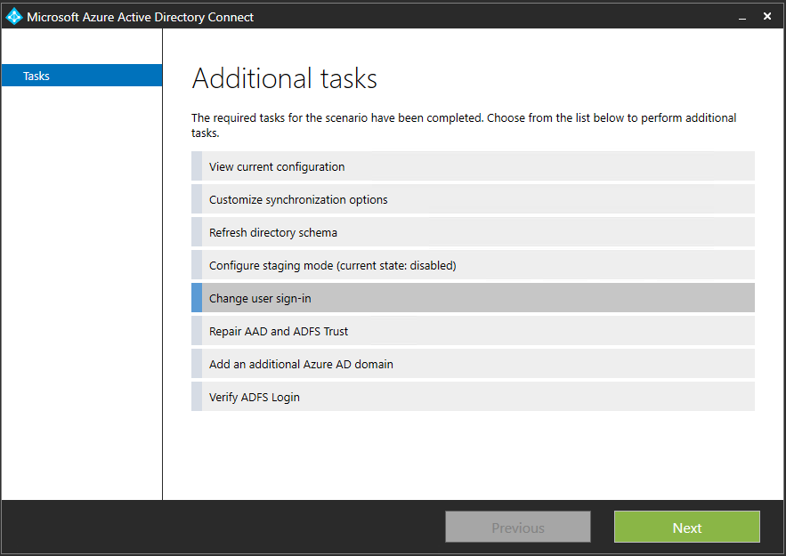
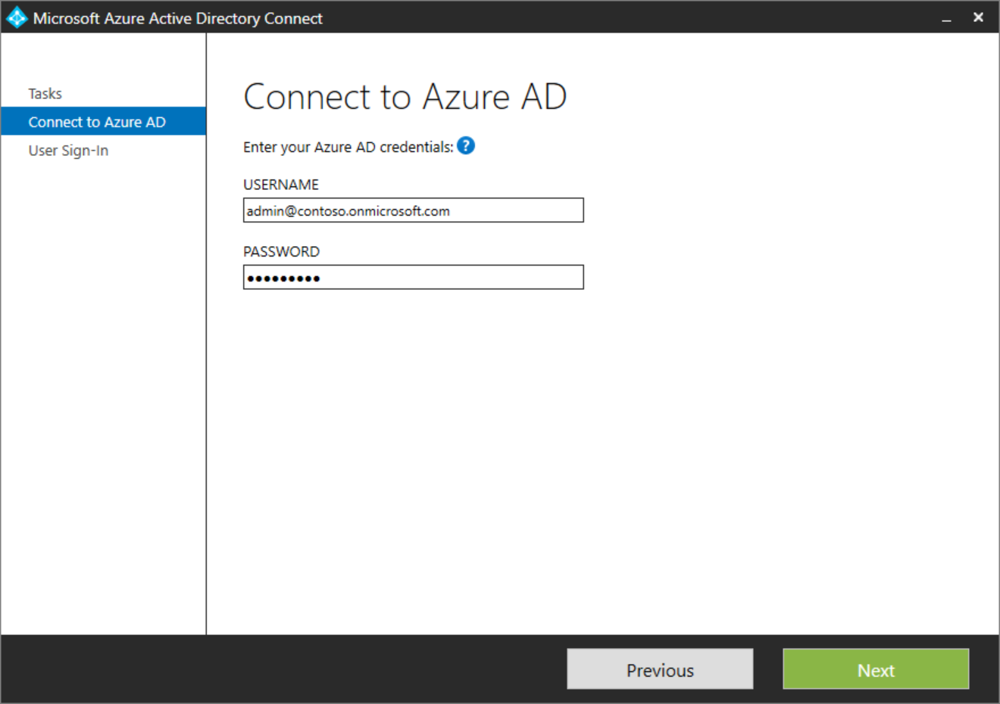
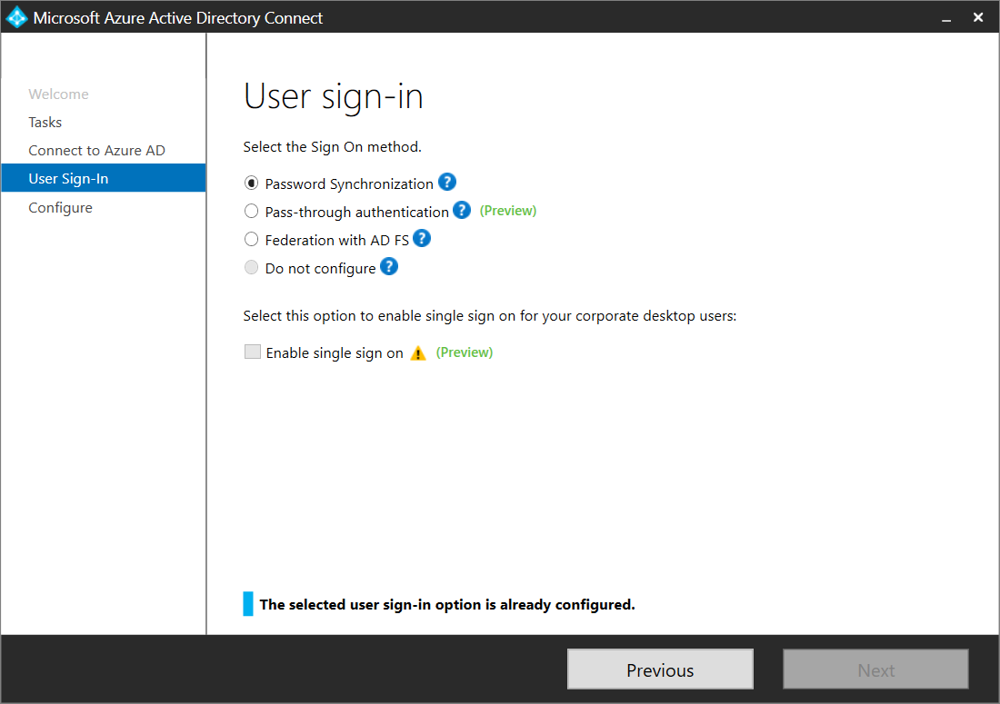

<properties
    pageTitle="Azure AD Connect：用户登录 | Azure"
    description="Azure AD Connect 用户登录的自定义设置。"
    services="active-directory"
    documentationcenter=""
    author="billmath"
    manager="femila"
    editor="curtand" />

<tags
    ms.assetid="547b118e-7282-4c7f-be87-c035561001df"
    ms.service="active-directory"
    ms.workload="identity"
    ms.tgt_pltfrm="na"
    ms.devlang="na"
    ms.topic="article"
    ms.date="05/09/2017"
    wacn.date="06/12/2017"
    ms.author="billmath"
    ms.translationtype="Human Translation"
    ms.sourcegitcommit="08618ee31568db24eba7a7d9a5fc3b079cf34577"
    ms.openlocfilehash="687c8ab308db989ffc34f673e7b275f4e9b5d7a1"
    ms.contentlocale="zh-cn"
    ms.lasthandoff="05/26/2017" />

# Azure AD Connect 用户登录选项
Azure Active Directory (Azure AD) Connect 可让用户使用同一组密码登录云和本地资源。 本文介绍每个标识模型的重要概念，以帮助你选择登录到 Azure AD 时想要使用的标识。

如果已熟悉了 Azure AD 标识模型，并且想详细了解某个特定的方法，则请参阅相应的链接：

- 使用[单一登录 (SSO)](/documentation/articles/active-directory-aadconnect-sso/) 的[密码同步](#password-synchronization)
- [直通身份验证](/documentation/articles/active-directory-aadconnect-pass-through-authentication/)
- [(使用 Active Directory 联合身份验证服务 (AD FS))联合的 SSO](#federation-that-uses-a-new-or-existing-farm-with-ad-fs-in-windows-server-2012-r2)

## 为你的组织选择用户登录方法
由于大多数组织只想让用户登录 Office 365、SaaS 应用程序和其他基于 Azure AD 的资源，因此我们建议使用默认的密码同步选项。 然而，由于特别的原因，某些组织不能使用此选项。 他们则可以选择联合登录选项（如 AD FS）或直通身份验证。 可以使用下表来帮助做出正确的选择。

我需要 | 使用 SSO 的 PS| 使用 SSO 的 PA| AD FS |
 --- | --- | --- | --- |
将本地 Active Directory 中的新用户、联系人和组帐户自动同步到云。|x|x|x|
为 Office 365 混合方案设置我的租户。|x|x|x|
使用户能够使用其本地密码登录并访问云服务。|x|x|x|
使用公司凭据实现单一登录。|x|x|x|
确保未在云中存储任何密码。||x*|x|
启用本地多重身份验证解决方案。|||x|

- 通过轻型连接器。

>[AZURE.NOTE]
> 目前直通身份验证对于富客户端具有某些限制。 有关详细信息，请参阅[直通身份验证](/documentation/articles/active-directory-aadconnect-pass-through-authentication/)。

### 密码同步
凭借密码同步，可将用户密码的哈希从本地 Active Directory 同步到 Azure AD。 当密码在本地更改或重置时，新密码将立即同步到 Azure AD，以便用户用于访问云资源的密码与访问本地资源的密码始终为同一密码。 密码绝不会被发送到 Azure AD，也不会以明文的形式存储在 Azure AD 中。 可将密码同步与密码写回一起使用，以在 Azure AD 中启用自助密码重置。

此外，还可以对公司网络中已加入域的计算机上的用户启用 [SSO](/documentation/articles/active-directory-aadconnect-sso/)。 通过单一登录，受支持的用户只需输入用户名即可安全访问云资源。

有关详细信息，请参阅[密码同步](/documentation/articles/active-directory-aadconnectsync-implement-password-synchronization/)一文。

### 直通身份验证
凭借直通身份验证，将针对本地 Active Directory 控制器验证用户的密码。 密码无需以任何形式存在于 Azure AD 中。 此身份验证允许在对云服务进行身份验证的过程中评估本地策略（例如登录时间限制）。

直通身份验证使用本地环境中已加入域的 Windows Server 2012 R2 计算机上的简单代理。 此代理侦听密码验证请求。 它不需要对 Internet 开放的任何入站端口。

此外，还可以对公司网络中已加入域的计算机上的用户启用单一登录。 通过单一登录，受支持的用户只需输入用户名即可安全访问云资源。

有关详细信息，请参阅：
- [直通身份验证](/documentation/articles/active-directory-aadconnect-pass-through-authentication/)
- [单一登录](/documentation/articles/active-directory-aadconnect-sso/)

### 在 Windows Server 2012 R2 中使用新的或现有 AD FS 场进行联合身份验证
凭借联合登录，用户可以使用其本地密码登录到 Azure 基于 AD 的服务。 当用户处于企业网络上时，他们甚至无需输入其密码。 使用 AD FS 的联合身份验证选项，可在 Windows Server 2012 R2 中部署新的或现有的 AD FS 场。 如果选择指定现有场，Azure AD Connect 将在场与 Azure AD 之间配置信任，使你的用户能够登录。

#### 在 Windows Server 2012 R2 中部署使用 AD FS 的联合身份验证

如果要部署新场，则需要：

- 用于联合服务器的 Windows Server 2012 R2 服务器。
- 用于 Web 应用程序代理的 Windows Server 2012 R2 服务器。
- 一个 .pfx 文件，其中包含目标联合服务名称的 SSL 证书。 例如：fs.contoso.com。

如果要部署新场或使用现有场，则需要：

- 联合服务器上的本地管理员凭据。
- 要将 Web 应用程序代理角色部署在上面的任何工作组服务器（未加入域）上的本地管理员凭据。
- 在其中运行向导的计算机能够通过 Windows 远程管理连接到要安装 AD FS 的任何其他计算机。

有关详细信息，请参阅[使用 AD FS 配置 SSO](/documentation/articles/active-directory-aadconnect-get-started-custom/#configuring-federation-with-ad-fs/)。

#### 使用早期版本的 AD FS 或第三方解决方案登录
如果已使用早期版本的 AD FS（例如 AD FS 2.0）或第三方联合身份验证提供程序配置了云登录，则可以通过 Azure AD Connect 选择跳过用户登录配置。 这样，便可以获取最新的同步和 Azure AD Connect 的其他功能，同时仍可使用现有的解决方案进行登录。

有关详细信息，请参阅 [Azure AD 第三方联合身份验证兼容性列表](/documentation/articles/active-directory-aadconnect-federation-compatibility/)。

## 用户登录名和用户主体名
### 了解用户主体名
在 Active Directory 中，默认的用户主体名 (UPN) 后缀是在其中创建用户帐户的域的 DNS 名称。 在大多数情况下，这是在 Internet 上注册为企业域的域名。 但是，可以使用 Active Directory 域和信任来添加更多的 UPN 后缀。

用户的 UPN 的格式为 username@domain。 例如，对于名为“contoso.com”的 Active Directory 域，名为 John 的用户的 UPN 可能是“john@contoso.com”。 用户的 UPN 基于 RFC 822。 尽管 UPN 和电子邮件共享相同的格式，但用户的 UPN 值与用户的电子邮件地址可能相同，也可能不相同。

### Azure AD 中的用户主体名
Azure AD Connect 向导使用 userPrincipalName 属性，或让你从本地指定要用作 Azure AD 中的用户主体名的属性（在自定义安装中）。 这是用于登录 Azure AD 的值。 如果 userPrincipalName 属性的值不对应于 Azure AD 中已验证的域，则 Azure AD 会将该值替换为默认的 .partner.onmschina.cn 值。

Azure Active Directory 中的每个目录随附内置域名，格式为 contoso.partner.onmschina.cn，可让你开始使用 Azure 或其他 Microsoft 服务。 可以使用自定义域来改善和简化登录体验。 有关 Azure AD 中的自定义域名以及如何验证域的信息，请阅读[将自定义域名添加到 Azure Active Directory](/documentation/articles/active-directory-add-domain/#add-a-custom-domain-name-to-your-directory/)。

## Azure AD 登录配置
### 使用 Azure AD Connect 配置 Azure AD 登录
Azure AD 登录体验取决于 Azure AD是否能够匹配要同步到某个自定义域（在 Azure AD 目录中已验证）的用户的用户主体名后缀。 在配置 Azure AD 登录设置时 Azure AD Connect 将提供帮助，使用户在云中能获得类似于本地登录的登录体验。

Azure AD Connect 列出了为域定义的 UPN 后缀，并尝试在 Azure AD 中将其与自定义域进行匹配。 然后它会帮助你执行需要执行的相应操作。
Azure AD 登录页列出了为本地 Active directory 定义的 UPN 后缀，并根据每个后缀显示相应的状态。 状态值可以是下列其中一项：

| 状态 | 说明 | 所需操作 |
|:--- |:--- |:--- |
| 已验证 |Azure AD Connect 在 Azure AD 中找到匹配的已验证域。 此域的所有用户均可使用其本地凭据登录。 |无需采取任何措施。 |
| 未验证 |Azure AD Connect 在 Azure AD 中找到了匹配的但未验证的自定义域。 如果域未验证，则在同步后此域的用户的 UPN 后缀将更改为默认的 .partner.onmschina.cn 后缀。 | [在 Azure AD 中验证自定义域。](/documentation/articles/active-directory-add-domain/#verify-the-domain-name-with-azure-ad/) |
| 未添加 |Azure AD Connect 未找到对应于 UPN 后缀的自定义域。 如果未在 Azure 中添加域且域未进行验证，则此域的用户的 UPN 后缀将更改为默认的 .partner.onmschina.cn 后缀。 | [添加和验证与 UPN 后缀相对应的自定义域。](/documentation/articles/active-directory-add-domain/) |

Azure AD 登录页列出了针对本地 Active Directory 定义的 UPN 后缀，以及 Azure AD 中对应的自定义域与当前验证状态。 在自定义安装中，现在可以在“Azure AD 登录”页上选择用户主体名的属性。

可以单击“刷新”按钮，从 Azure AD 中重新提取自定义域最新的状态。

### 选择 Azure AD 中的用户主体名的属性
属性 userPrincipalName 是用户登录 Azure AD 和 Office 365 时使用的属性。 应在同步处理用户之前对在 Azure AD 中使用的域（也称为 UPN 后缀）进行验证。

强烈建议保留默认属性 userPrincipalName。 如果此属性不可路由且无法验证，则可以选择另一个属性（例如 email）作为保存登录 ID 的属性。 这就是所谓的备用 ID。 “备用 ID”属性值必须遵循 RFC 822 标准。 可以将备用 ID 与密码 SSO 和联合 SSO 配合使用作为登录解决方案。

> [AZURE.NOTE]
> 所有 Office 365 工作负荷都不允许使用替代 ID。 有关详细信息，请参阅[配置备用登录 ID](https://technet.microsoft.com/zh-cn/library/dn659436.aspx)。
>
>

#### 不同的自定义域状态及其对 Azure 登录体验的影响
请务必要了解 Azure AD 目录中的自定义域状态与本地定义的 UPN 后缀之间的关系。 让我们逐步了解当使用 Azure AD Connnect 设置同步时可能遇到的不同 Azure 登录体验。

对于下面的信息，假设我们所关注的是 UPN 后缀 contoso.com，它在本地目录中用作 UPN 的一部分，例如 user@contoso.com。

###### 快速设置/密码同步
| 状态 | 对 Azure 用户登录体验的影响 |
|:---:|:--- |
| 未添加 |在这种情况下，并未在 Azure AD 目录中针对 contoso.com 添加任何自定义域。 在本地具有后缀 @contoso.com 的 UPN 的用户将无法使用其本地 UPN 来登录 Azure。 他们需要为默认的 Azure AD 目录添加后缀，以改用 Azure AD 向他们提供的新 UPN。 例如，如果要将用户同步到 Azure AD 目录 azurecontoso.partner.onmschina.cn，则为本地用户 user@contoso.com 指定 UPN user@azurecontoso.partner.onmschina.cn。 |
| 未验证 |在这种情况下，我们拥有已添加在 Azure AD 目录中的自定义域 contoso.com。 但是，该域尚未验证。 如果在没有验证域的情况下继续同步用户，则 Azure AD 将为用户分配新 UPN，如同“未添加”方案中所做的一样。 |
| 已验证 |在这种情况下，我们拥有已在 Azure AD 中为 UPN 后缀添加并验证了的自定义域 contoso.com。 在用户被同步到 Azure AD 后，用户可以使用其本地用户主体名（例如 user@contoso.com）登录到 Azure。 |

###### AD FS 联合
无法使用 Azure AD 中的默认 .partner.onmschina.cn 域或 Azure AD 中未验证的自定义域创建联合。 在运行 Azure AD Connect 向导时，如果选择使用未验证的域创建联合，则 Azure AD Connect 将发出提示，并指出要为域创建的将托管 DNS 的必需记录。 有关详细信息，请参阅[验证选择用于联合的 Azure AD 域](/documentation/articles/active-directory-aadconnect-get-started-custom/#verify-the-azure-ad-domain-selected-for-federation/)。

如果选择的用户登录选项为“与 AD FS 联合”，则必须有一个自定义域才能继续在 Azure AD 中创建联合。 针对我们的讨论，这意味着我们应在 Azure AD 目录中添加自定义域 contoso.com。

| 状态 | 对 Azure 用户登录体验的影响 |
|:---:|:--- |
| 未添加 |在这种情况下，Azure AD Connect 没有在 Azure AD 目录中找到 UPN 后缀 contoso.com 的匹配自定义域。 如果需要让用户在 AD FS 中使用其本地 UPN（例如 user@contoso.com）登录，则需要添加自定义域 contoso.com。 |
| 未验证 |在这种情况下，Azure AD Connect 将发出提示，并提供有关如何在后面的阶段验证域的相应详细信息。 |
| 已验证 |在这种情况下，可以继续进行配置，而不需要采取任何进一步的操作。 |

## 更改用户登录方法
可以在使用向导完成 Azure AD Connect 的初始配置后，使用 Azure AD Connect 中的可用任务在“联合”、“密码同步”或“直通身份验证”之间更改用户的登录方法。 再次运行 Azure AD Connect 向导，随后将看到可执行的任务列表。 在任务列表中选择“更改用户登录”。

在下一页上，系统将要求你提供 Azure AD 的凭据。

在“用户登录”  页上，选择所需的用户登录选项。

> [AZURE.NOTE]
> 如果只是要暂时切换到密码同步，请选中“请勿切换用户帐户”复选框。 不选中该选项会将每个用户转换为联合用户，并且该操作可能需要花费几小时。
>
>

## 后续步骤
- 了解有关[将本地标识与 Azure Active Directory 集成](/documentation/articles/active-directory-aadconnect/)的详细信息。
- 了解有关 [Azure AD Connect 设计概念](/documentation/articles/active-directory-aadconnect-design-concepts/)的详细信息。

<!---Update_Description: wording update -->