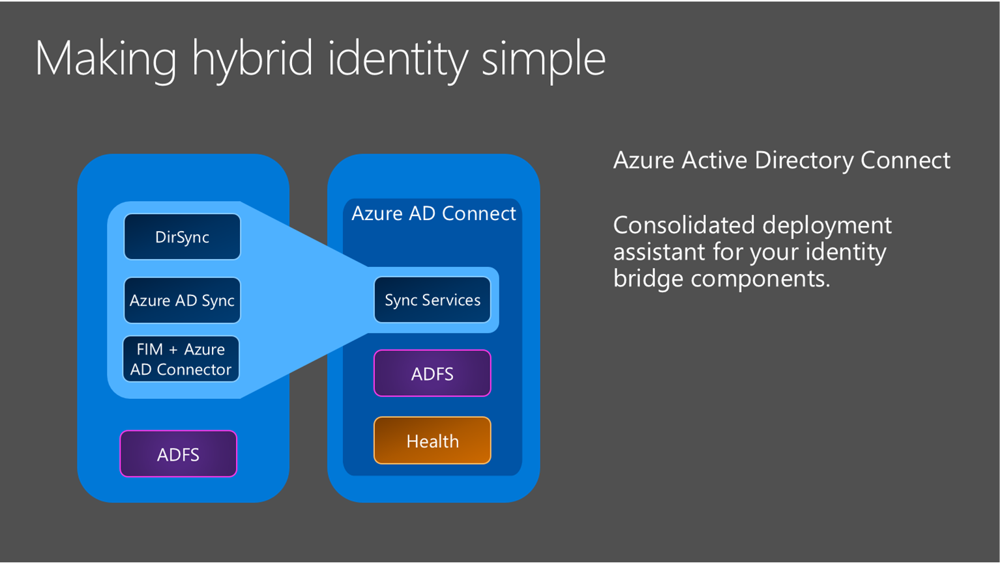

<properties
    pageTitle="将 Active Directory 与 Azure Active Directory 连接 | Azure"
    description="Azure AD Connect 会将本地目录与 Azure Active Directory 集成。这样便可以为集成到 Azure AD 的 Office 365、Azure 和 SaaS 应用程序提供一个通用标识。"
    keywords="Azure AD Connect 介绍, Azure AD Connect 概述, 什么是 Azure AD Connect, 安装 active directory"
    services="active-directory"
    documentationcenter=""
    author="billmath"
    manager="femila"
    editor="" />
    
<tags
    ms.assetid="59bd209e-30d7-4a89-ae7a-e415969825ea"
    ms.service="active-directory"
    ms.workload="identity"
    ms.tgt_pltfrm="na"
    ms.devlang="na"
    ms.topic="get-started-article"
    ms.date="02/07/2017"
    wacn.date="03/07/2017"
    ms.author="billmath" />  

# 将 Active Directory 与 Azure Active Directory 连接。
Azure AD Connect 会将本地目录与 Azure Active Directory 集成。这样便可以为集成到 Azure AD 的 Office 365、Azure 和 SaaS 应用程序的用户提供一个通用标识。本主题将指导用户完成规划、部署和操作步骤。其中统合了与这些操作相关的主题的链接。

> [AZURE.IMPORTANT]
> [Azure AD Connect 是连接本地目录与 Azure AD 和 Office 365 的最佳方式。现在是从 Azure Active Directory Sync (DirSync) 或 Azure AD Sync 升级到 Azure AD Connect 的绝佳时机，因为这些工具现已弃用，将于 2017 年 4 月 13 日终止提供支持。](/documentation/articles/active-directory-aadconnect-dirsync-deprecated/)
> 
> 

  

## 为何使用 Azure AD Connect
将本地目录与 Azure AD 集成可提供通用标识用于访问云和本地资源，从而提高用户的生产率。用户和组织可以享受到以下好处：

- 用户可以使用单个标识来访问本地应用程序和云服务，例如 Office 365。
- 单个工具即可提供轻松同步和登录的部署体验。

### Azure AD Connect 工作原理
Azure Active Directory Connect 由三个主要组件构成：同步服务、可选的 Active Directory 联合身份验证服务组件。

 

- 同步 - 此组件负责创建用户、组和其他对象。它还负责确保本地用户和组的标识信息与云匹配。
- AD FS - 联合身份验证是 Azure AD Connect 的可选部件，可用于使用本地 AD FS 基础结构配置混合环境。组织可以使用此部件来解决复杂的部署，例如域加入 SSO、实施 AD 登录策略以及智能卡或第三方 MFA。

## 安装 Azure AD Connect 
可以在 [Microsoft 下载中心](http://go.microsoft.com/fwlink/?LinkId=615771)找到 Azure AD Connect 的下载文件。

| 解决方案 | 方案 |
| --- | --- |
| 准备工作 - [硬件和先决条件](/documentation/articles/active-directory-aadconnect-prerequisites/) |<li>开始安装 Azure AD Connect 之前所要完成的步骤。</li> |
| [快速设置](/documentation/articles/active-directory-aadconnect-get-started-express/) |<li>如果只有一个林 AD，则建议使用此选项。</li> <li>使用密码同步以同一密码进行用户登录。</li> |
| [自定义设置](/documentation/articles/active-directory-aadconnect-get-started-custom/) |<li>有多个林时使用。支持许多[本地拓扑](/documentation/articles/active-directory-aadconnect-topologies/)。</li> <li>自定义登录选项，例如用于联合身份验证的 ADFS，或使用第三方标识提供者。</li> <li>自定义同步功能，例如筛选和写回。</li> |
| [从 DirSync 升级](/documentation/articles/active-directory-aadconnect-dirsync-upgrade-get-started/) |<li>在已有 DirSync 服务器运行的情况下使用。</li> |
| [从 Azure AD Sync 或 Azure AD Connect 升级](/documentation/articles/active-directory-aadconnect-upgrade-previous-version/) |<li>可以根据偏好选择多种不同的方法。</li> |

[安装后](/documentation/articles/active-directory-aadconnect-whats-next/)，你应该验证程序是否按预期工作，并将许可证分配给用户。

### Azure AD Connect 安装后续步骤
|主题 |链接|  
| --- | --- |
|下载 Azure AD Connect | [下载 Azure AD Connect](http://go.microsoft.com/fwlink/?LinkId=615771)|
|使用快速设置安装 | [Azure AD Connect 的快速安装](/documentation/articles/active-directory-aadconnect-get-started-express/)|
|使用自定义设置安装 | [Azure AD Connect 的自定义安装](/documentation/articles/active-directory-aadconnect-get-started-custom/)|
|从 DirSync 升级 | [从 Azure AD 同步工具 (DirSync) 升级](/documentation/articles/active-directory-aadconnect-dirsync-upgrade-get-started/)|
|安装后 | [验证安装并分配许可证](/documentation/articles/active-directory-aadconnect-whats-next/)|

### 了解有关安装 Azure AD Connect 的详细信息
还要预先了解[操作](/documentation/articles/active-directory-aadconnectsync-operations/)注意事项。建议部署一台待机服务器，在发生[灾难](/documentation/articles/active-directory-aadconnectsync-operations/#disaster-recovery/)时便可轻松地进行故障转移。若要频繁地配置更改，应计划部署一台[暂存模式](/documentation/articles/active-directory-aadconnectsync-operations/#staging-mode/)服务器。

|主题 |链接|  
| --- | --- |
|支持的拓扑 | [Azure AD Connect 的拓扑](/documentation/articles/active-directory-aadconnect-topologies/)|
|设计概念 | [Azure AD Connect 设计概念](/documentation/articles/active-directory-aadconnect-design-concepts/)|
|用于安装的帐户 | [有关 Azure AD Connect 凭据和权限的更多信息](/documentation/articles/active-directory-aadconnect-accounts-permissions/)|
|操作规划 | [Azure AD Connect 同步：操作任务和注意事项](/documentation/articles/active-directory-aadconnectsync-operations/)|
|用户登录选项 | [Azure AD Connect 用户登录选项](/documentation/articles/active-directory-aadconnect-user-signin/)|

## 配置同步功能
Azure AD Connect 随附了多个可以选择启用或已按默认启用的功能。在某些方案和拓扑中，有些功能可能需要进行其他配置。

如果你要限制可将哪些对象同步到 Azure AD，可以使用[筛选](/documentation/articles/active-directory-aadconnectsync-configure-filtering/)。默认同步所有用户、联系人、组和 Windows 10 计算机。可以根据域、OU 或属性更改筛选设置。

[密码同步](/documentation/articles/active-directory-aadconnectsync-implement-password-synchronization/)可将 Active Directory 中的密码哈希同步到 Azure AD。最终用户可以在本地与云中使用相同的密码，但只需在一个位置管理此密码。由于它使用本地 Active Directory，因此用户还可以使用自己的密码策略。

[密码写回](/documentation/articles/active-directory-passwords-getting-started/)可让用户在云中更改和重置其密码，及应用本地密码策略。

[防止意外删除](/documentation/articles/active-directory-aadconnectsync-feature-prevent-accidental-deletes/)功能默认为打开，它可以保护云目录，避免同时进行多次删除。默认情况下，每运行一次可以进行 500 次删除。可以根据组织大小更改此设置。

使用快速设置安装时，将默认启用[自动升级](/documentation/articles/active-directory-aadconnect-feature-automatic-upgrade/)，确保 Azure AD Connect 始终保持最新版本。

### 同步功能配置后续步骤
|主题 |链接|  
| --- | --- |
|配置筛选 | [Azure AD Connect 同步：配置筛选](/documentation/articles/active-directory-aadconnectsync-configure-filtering/)|
|密码同步 | [Azure AD Connect 同步：实现密码同步](/documentation/articles/active-directory-aadconnectsync-implement-password-synchronization/)|
|密码写回 | [密码管理入门](/documentation/articles/active-directory-passwords-getting-started/)|
|防止意外删除 | [Azure AD Connect 同步：防止意外删除](/documentation/articles/active-directory-aadconnectsync-feature-prevent-accidental-deletes/)|
|自动升级 | [Azure AD Connect：自动升级](/documentation/articles/active-directory-aadconnect-feature-automatic-upgrade/)|

## 自定义 Azure AD Connect 同步
Azure AD Connect 同步随附一个适用于大部分客户和拓扑的默认配置。但总存在默认配置不适用的情况，因此必须进行调整。可以根据本部分和链接主题中所述进行更改。

如果你以前没有用过同步拓扑，请先了解[技术概念](/documentation/articles/active-directory-aadconnectsync-technical-concepts/)中所述的基本概念和术语。Azure AD Connect 是在 MIIS2003、ILM2007 和 FIM2010 基础上演进而来的。即使有些功能相同，但改变的部分也有很多。

[默认配置](/documentation/articles/active-directory-aadconnectsync-understanding-default-configuration/)假设配置中可能存在多个林。在这些拓扑中，用户对象可能表示为另一个林中的联系人。用户还可能具有另一个资源林中的链接邮箱。[用户和联系人](/documentation/articles/active-directory-aadconnectsync-understanding-users-and-contacts/)中介绍了默认配置的行为。

同步的配置模型称为[声明性预配](/documentation/articles/active-directory-aadconnectsync-understanding-declarative-provisioning-expressions/)。高级属性流程使用[函数](/documentation/articles/active-directory-aadconnectsync-functions-reference/)来表示属性转换。可以使用 Azure AD Connect 随附的工具来检查整个配置。如果需要进行配置更改，请确保遵循[最佳实践](/documentation/articles/active-directory-aadconnectsync-best-practices-changing-default-configuration/)，以便更轻松地采用新版本。

### 自定义 Azure AD Connect 同步的后续步骤
|主题 |链接|  
| --- | --- |
|所有 Azure AD Connect 同步文章 | [Azure AD Connect 同步](/documentation/articles/active-directory-aadconnectsync-whatis/)|
|技术概念 | [Azure AD Connect 同步：技术概念](/documentation/articles/active-directory-aadconnectsync-technical-concepts/)|
|了解默认配置 | [Azure AD Connect 同步：了解默认配置](/documentation/articles/active-directory-aadconnectsync-understanding-default-configuration/)|
|了解用户和联系人 | [Azure AD Connect 同步：了解用户和联系人](/documentation/articles/active-directory-aadconnectsync-understanding-users-and-contacts/)|
|声明性预配 | [Azure AD Connect Sync：了解声明性设置表达式](/documentation/articles/active-directory-aadconnectsync-understanding-declarative-provisioning-expressions/)|
|更改默认配置 | [更改默认配置的最佳做法](/documentation/articles/active-directory-aadconnectsync-best-practices-changing-default-configuration/)|

## 配置联合身份验证功能
如果 ADFS 服务器未配置为自动更新 Azure AD 中的证书，或者使用的是非 ADFS 解决方案，系统会在需要[更新证书](/documentation/articles/active-directory-aadconnect-o365-certs/)时通知用户。

### 配置联合身份验证功能的后续步骤
|主题 |链接|  
| --- | --- |
|所有 AD FS 文章 | [Azure AD Connect 和联合身份验证](/documentation/articles/active-directory-aadconnectfed-whatis/)|
|配置带有子域的 ADFS | 与 Azure AD 联合的多域支持 |
|管理 AD FS 场 | [使用 Azure AD Connect 管理和自定义 AD FS](/documentation/articles/active-directory-aadconnect-federation-management/)|
|手动更新联合身份验证证书 | [续订 Office 365 和 Azure AD 的联合身份验证证书](/documentation/articles/active-directory-aadconnect-o365-certs/)|

## 详细信息和参考
|主题 |链接|  
| --- | --- |
|版本历史记录 | [版本历史记录](/documentation/articles/active-directory-aadconnect-version-history/)|
|Azure AD 的非 ADFS 兼容性列表 | [Azure AD 联合身份验证兼容性列表](/documentation/articles/active-directory-aadconnect-federation-compatibility/)|
|同步的属性 | [同步的属性](/documentation/articles/active-directory-aadconnectsync-attributes-synchronized/)|
|常见问题解答 | [Azure AD Connect 常见问题解答](/documentation/articles/active-directory-aadconnect-faq/)|

**其他资源**

有关将本地目录扩展到云的 Ignite 2015 演示文稿。

<!---HONumber=Mooncake_0227_2017-->
<!---Update_Description: wording update -->