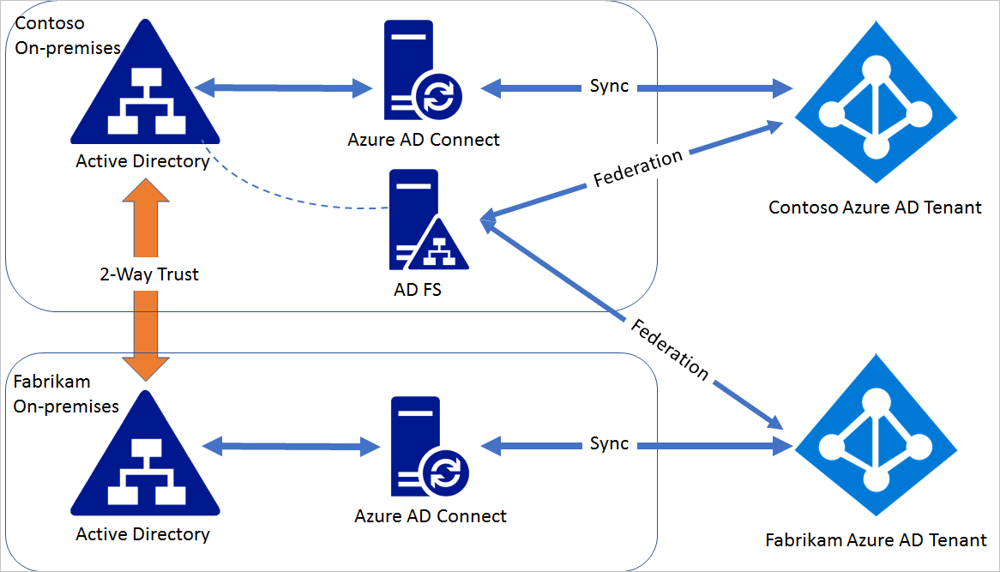

<properties
    pageTitle="联合多个 Azure AD 与单个 AD FS | Azure"
    description="本文档介绍如何联合多个 Azure AD 与单个 AD FS。"
    keywords="联合, ADFS, AD FS, 多个租户, 单个 AD FS, 一个 ADFS, 多租户联合身份验证, 多林 adfs, aad connect, 联合身份验证, 跨租户联合身份验证"
    services="active-directory"
    documentationcenter=""
    author="anandyadavmsft"
    manager="femila"
    editor=""
    translationtype="Human Translation" />
<tags
    ms.assetid=""
    ms.service="active-directory"
    ms.workload="identity"
    ms.tgt_pltfrm="na"
    ms.devlang="na"
    ms.topic="get-started-article"
    ms.date="04/09/2017"
    wacn.date="05/02/2017"
    ms.author="anandy; billmath"
    ms.sourcegitcommit="78da854d58905bc82228bcbff1de0fcfbc12d5ac"
    ms.openlocfilehash="d9b613e0bd2af07b0f735e5cb382b763f4856090"
    ms.lasthandoff="04/22/2017" />

#将 Azure AD 的多个实例与 AD FS 的单个实例联合

单个高度可用的 AD FS 场可以联合多个林，前提是这些林之间存在双向信任。 上面提到的多个林可以对应于同一 Azure Active Directory，也可以不进行对应。 本文说明了如何在单个 AD FS 部署和多个同步到不同 Azure AD 的林之间配置联合身份验证。

 
> [AZURE.NOTE]
> 本方案不支持设备写回和自动设备联接。

> [AZURE.NOTE]
> Azure AD Connect 不能在此方案中用于配置联合身份验证，因为 Azure AD Connect 可以为单个 Azure AD 中的域配置联合身份验证。

##将 AD FS 与多个 Azure AD 进行联合的步骤

请考虑一下这样一种情形：Azure Active Directory contoso.partner.onmschina.cn 中的域 contoso.com 已与 AD FS 联合，后者通过本地方式安装在 contoso.com 本地 Active Directory 环境中。 Fabrikam.com 是 fabrikam.partner.onmschina.cn Azure Active Directory 中的域。

##步骤 1：建立双向信任
 
若要让 contoso.com 中的 AD FS 能够对 fabrikam.com 中的用户进行身份验证，需在 contoso.com 和 fabrikam.com 之间建立双向信任。 请按照[此文](https://technet.microsoft.com/zh-cn/library/cc816590.aspx)中的准则创建双向信任。
 
##步骤 2：修改 contoso.com 联合身份验证设置 
 
为联合到 AD FS 的单个域设置的默认颁发者为“http://ADFSServiceFQDN/adfs/services/trust”，例如“http://fs.contoso.com/adfs/services/trust”。 Azure Active Directory 要求每个联合域都有唯一颁发者。 由于同一 AD FS 将联合两个域，因此颁发者值需进行修改，使之对于每个与 Azure Active Directory 联合的域 AD FS 都是唯一的。 
 
在 AD FS 服务器上，打开 Azure AD PowerShell 并执行以下步骤：
 
连接到 Azure Active Directory，其中包含域 contoso.com Connect-MsolService 更新 contoso.com 的联合身份验证设置 Update-MsolFederatedDomain -DomainName contoso.com -SupportMultipleDomain
 
会将域联合身份验证设置中的颁发者更改为“http://contoso.com/adfs/services/trust”，并且会为 Azure AD 信赖方信任添加颁发声明规则，以便根据 UPN 后缀颁发正确的 issuerId 值。
 
##步骤 3：通过 AD FS 联合 fabrikam.com
 
在 Azure AD PowerShell 会话中，执行以下步骤：连接到 Azure Active Directory，其中包含域 fabrikam.com

    Connect-MsolService
将 fabrikam.com 托管域转换为联合身份验证域：

    Convert-MsolDomainToFederated -DomainName anandmsft.com -Verbose -SupportMultipleDomain
 
上述操作会将域 fabrikam.com 与同一 AD FS 联合。 可以对两个域使用 Get-MsolDomainFederationSettings，以便验证域设置。

## 后续步骤
[将 Active Directory 连接到 Azure Active Directory](/documentation/articles/active-directory-aadconnect/)

