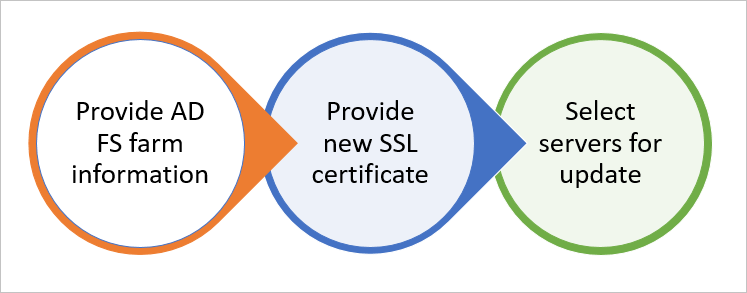
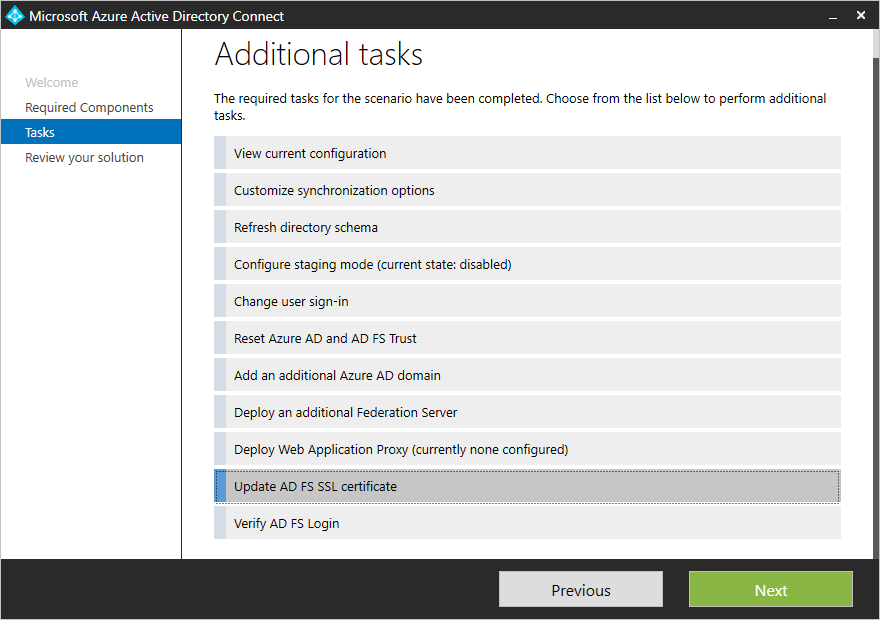
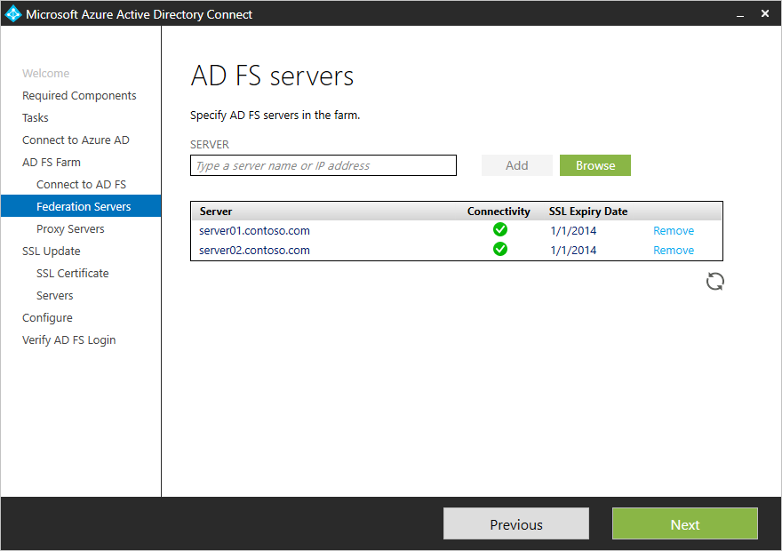
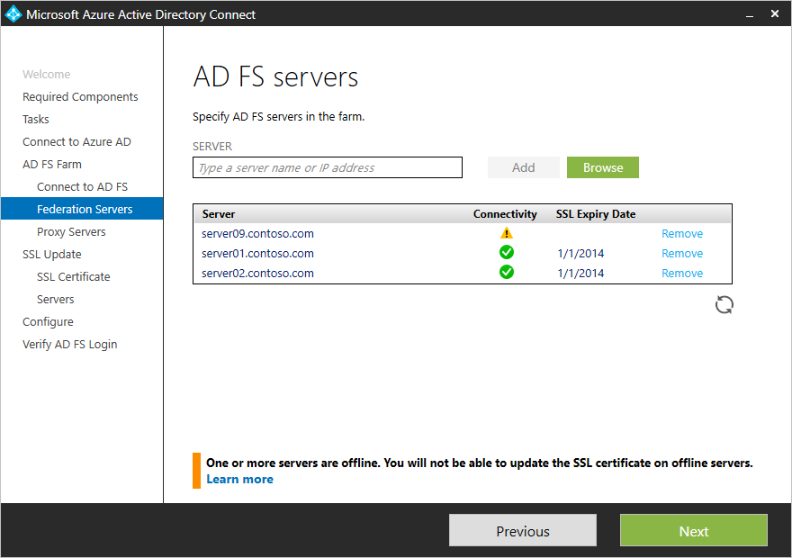
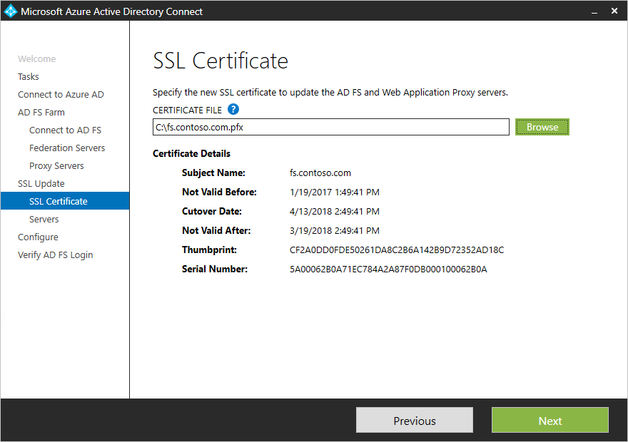
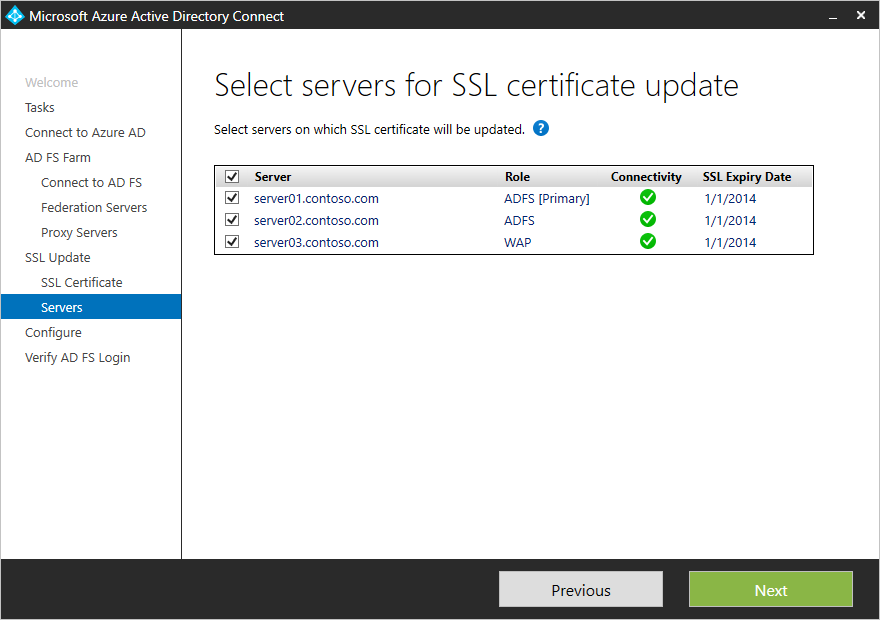
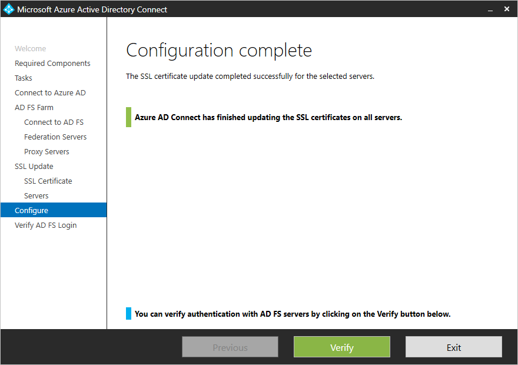

<properties
    pageTitle="Azure AD Connect：更新 Active Directory 联合身份验证服务 (AD FS) 场的 SSL 证书 | Azure"
    description="本文档详述使用 Azure AD Connect 更新 AD FS 场的 SSL 证书的步骤。"
    services="active-directory"
    keywords="azure ad connect, adfs ssl 更新, adfs 证书更新, 更改 adfs 证书, 新建 adfs 证书, adfs 证书, 更新 adfs ssl 证书, 更新 ssl 证书 adfs, 配置 adfs ssl 证书, adfs, ssl, 证书, adfs 服务通信证书, 更新联合身份验证, 配置联合身份验证, aad connect"
    authors="anandyadavmsft"
    manager="femila"
    editor="billmath" />
<tags
    ms.assetid="7c781f61-848a-48ad-9863-eb29da78f53c"
    ms.service="active-directory"
    ms.workload="identity"
    ms.tgt_pltfrm="na"
    ms.devlang="na"
    ms.topic="article"
    ms.date="02/07/2016"
    wacn.date="04/05/2017"
    ms.author="anandy" />  

# 更新 Active Directory 联合身份验证服务 (AD FS) 场的 SSL 证书

## 概述
本文介绍如何使用 Azure AD Connect 更新 Active Directory 联合身份验证服务 (AD FS) 场的 SSL 证书。如果将 Azure AD Connect 中的登录方法设置为 AD FS，可以使用 Azure AD Connect 工具轻松更新 AD FS 场的 SSL 证书。可跨所有联合身份验证和 Web 应用程序代理 (WAP) 服务器，通过 3 个简单的步骤来实现此目的：

  

>[AZURE.NOTE]
若要详细了解 AD FS 使用的证书，请参阅[了解 AD FS 使用的证书](https://technet.microsoft.com/zh-cn/library/cc730660.aspx)。

## 先决条件

- **AD FS 场**：确保 AD FS 场基于 Windows Server 2012 R2 或更高版本。
- **Azure AD Connect**：确保 Azure AD Connect 的版本为 1.1.443.0 或更高版本。将使用任务“更新 AD FS SSL 证书”。

  

## 步骤 1：提供 AD FS 场信息

Azure AD Connect 尝试通过以下方式自动获取有关 AD FS 场的信息：
1. 从 AD FS（Windows Server 2016 或更高版本）查询场信息。
2. 引用之前运行的信息（通过 Azure AD Connect 存储在本地）。

可以根据 AD FS 场的当前配置添加或删除服务器，以修改显示的服务器列表。只要提供了服务器信息，Azure AD Connect 就会显示连接情况和当前的 SSL 证书状态。

  

如果列表中包含的服务器不再属于 AD FS 场，可单击“删除”将该服务器从 AD FS 场的服务器列表中删除。

  

>[AZURE.NOTE]
从 Azure AD Connect 的 AD FS 场的服务器列表中删除服务器属于本地操作，更新的是 Azure AD Connect 保留在本地的 AD FS 场的信息。Azure AD Connect 不会根据所做的更改修改 AD FS 的配置。

## 步骤 2：提供新的 SSL 证书

确认有关 AD FS 场服务器的信息后，Azure AD Connect 会要求提供新的 SSL 证书。请提供受密码保护的 PFX 证书以继续安装。

  

提供证书后，Azure AD Connect 将执行一系列先决条件检查。验证证书，确保 AD FS 场的证书正确：

-	证书的使用者名称/备用使用者名称与联合身份验证服务名称相同，或者证书是通配符证书。
-	证书的有效期超过 30 天。
-	证书信任链有效。
-	证书受密码保护。

## 步骤 3：选择要更新的服务器

在下一步中，选择需要更新 SSL 证书的服务器。不能选择脱机的服务器进行更新。

  

完成配置后，Azure AD Connect 将显示一条指示更新状态的消息，并提供一个用于验证 AD FS 登录的选项。

  

## 常见问题

- **对于新的 AD FS SSL 证书，证书的使用者名称应该是什么？**

    Azure AD Connect 会检查证书的使用者名称/备用使用者名称是否包含联合身份验证服务名称。例如，如果联合身份验证服务名称为 fs.contoso.com，则使用者名称/备用使用者名称必须为 fs.contoso.com。也接受通配符证书。

- **为什么在 WAP 服务器页上又要求我提供凭据？**

    如果连接到 AD FS 服务器时提供的凭据也没有管理 WAP 服务器的特权，则 Azure AD Connect 会要求用户提供在 WAP 服务器上具有管理特权的凭据。

- **服务器显示为脱机。我该怎样做？**

    如果服务器处于脱机状态，Azure AD Connect 将无法执行任何操作。如果该服务器属于 AD FS 场，则检查与该服务器的连接。解决该问题后，请按“刷新”图标更新向导中的状态。如果该服务器此前属于场，但现在不再存在，请单击“删除”，将其从 Azure AD Connect 保留的服务器列表中删除。从 Azure AD Connect 的列表中删除服务器不会更改 AD FS 本身的配置。如果使用的是 Windows Server 2016 或更高版本中的 AD FS，该服务器将保留在配置设置中，并将在下次运行此任务时再次显示该服务器。

- **能否使用新的 SSL 证书更新一部分场服务器？**

    是的。始终可以再次运行“更新 SSL 证书”任务来更新剩余的服务器。在“选择要更新 SSL 证书的服务器”页上，可以根据“SSL 过期日期”对服务器列表进行排序，轻松访问尚未更新的服务器。

- **我在上次运行时删除了服务器，但该服务器仍显示为脱机并且在“AD FS 服务器”页中列出。为什么删除该脱机服务器后它仍会显示？**

    从 Azure AD Connect 的列表中删除服务器并不会将其从 AD FS 配置中删除。Azure AD Connect 引用 AD FS（Windows Server 2016 或更高版本）中有关场的任何信息。如果服务器仍在 AD FS 配置中，它将列回到列表中。

## 后续步骤

- [Azure AD Connect 和联合身份验证](/documentation/articles/active-directory-aadconnectfed-whatis/)
- [使用 Azure AD Connect 进行 Active Directory 联合身份验证服务的管理和自定义](/documentation/articles/active-directory-aadconnect-federation-management/)

<!---HONumber=Mooncake_0327_2017-->
