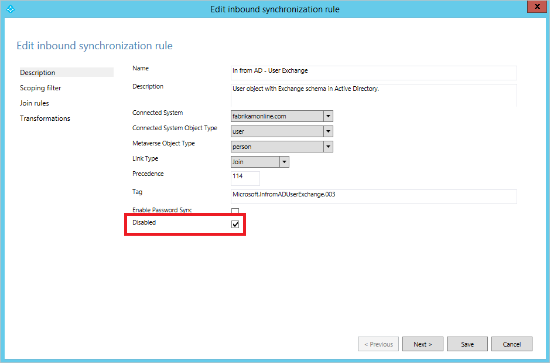
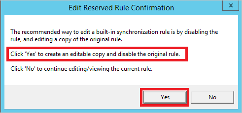
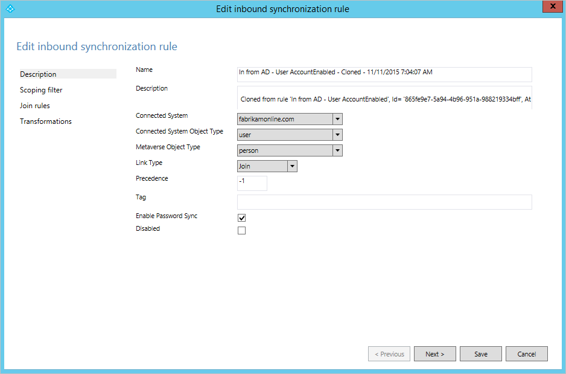

<properties
    pageTitle="Azure AD Connect 同步：更改默认配置 | Azure"
    description="提供有关更改 Azure AD Connect 同步的默认配置的最佳实践。"
    services="active-directory"
    documentationcenter=""
    author="andkjell"
    manager="femila"
    editor=""/>

<tags
    ms.assetid="7638a031-1635-4942-94c3-fce8f09eed5e"
    ms.service="active-directory"
    ms.workload="identity"
    ms.tgt_pltfrm="na"
    ms.devlang="na"
    ms.topic="article"
    ms.date="02/08/2017"
    ms.author="billmath" 
    wacn.date="03/07/2017"/>
# Azure AD Connect 同步：有关更改默认配置的最佳实践
本主题旨在说明支持和不支持的 Azure AD Connect 同步更改。

通过 Azure AD Connect 创建的配置无需更改即可适用于同步本地 Active Directory 与 Azure AD 的大多数环境。但是，在某些情况下，必须对配置应用某些更改，以满足特殊需求或要求。

## 对服务帐户的更改
Azure AD Connect 同步在安装向导创建的服务帐户下运行。此服务帐户保存了同步使用的数据库加密密钥。它是使用 127 个字符长的密码创建的，密码设置为永不过期。

- **不支持**更改或重置服务帐户的密码。这样做会破坏加密密钥，服务将无法访问数据库且无法启动。

## 对计划程序的更改
从内部版本 1.1（2016 年 2 月）开始，你可以将[计划程序](/documentation/articles/active-directory-aadconnectsync-feature-scheduler/)配置为使用非默认的同步周期（默认周期为 30 分钟）。

## 对同步规则的更改
安装向导提供的配置应该适用于最常见的方案。如果需要对配置进行更改，必须遵循这些规则，以便仍保留支持的配置。

- 如果默认的直接属性流不适用于组织，可以[更改属性流](/documentation/articles/active-directory-aadconnectsync-change-the-configuration/#other-common-attribute-flow-changes/)。
- 如果希望[属性不流动](/documentation/articles/active-directory-aadconnectsync-change-the-configuration/#do-not-flow-an-attribute/)并要删除 Azure AD 中的任何现有属性值，需要为此方案创建规则。
- [禁用不需要的同步规则](#disable-an-unwanted-sync-rule)而不是删除它。升级期间将重新创建已删除的规则。
- 若要[更改现成的规则](#change-an-out-of-box-rule)，应复制原始规则并禁用现成的规则。同步规则编辑器将显示提示并提供帮助。
- 使用同步规则编辑器导出自定义同步规则。编辑器会提供一个 PowerShell 脚本，可以在灾难恢复方案中使用它轻松重新创建同步规则。

> [AZURE.WARNING]
现成的同步规则具有指纹。如果更改这些规则，指纹将不再匹配。将来尝试应用 Azure AD Connect 的新版本时可能会遇到问题。只能根据本文所述的方式进行更改。

### 禁用不需要的同步规则 
不要删除现成的同步规则。下一次升级期间会重新创建该规则。

在某些情况下，安装向导生成的配置不适用于拓扑。例如，如果使用帐户资源林拓扑，但已在具有 Exchange 架构的帐户林中扩展该架构，则系统将针对帐户林和资源林创建适用于 Exchange 的规则。在此情况下，需要禁用适用于 Exchange 的同步规则。

在上图中，安装向导已在帐户林中找到旧的 Exchange 2003 架构。此架构扩展是在 Fabrikam 环境中引入资源林之前添加的。若要确保不同步任何来自旧 Exchange 实现的属性，应该按所述方式禁用同步规则。

### 更改现成的规则 
仅当需要更改联接规则时，才应更改现成的规则。若需更改属性流，则应在创建同步规则时，让其优先级高于现成的规则。实际上，需克隆的唯一规则是规则 **In from AD - User Join**。可以使用优先级更高的规则重写所有其他规则。

如果需要对现成的规则进行更改，应该复制该现成的规则，然后禁用原始规则。然后对克隆的规则进行更改。同步规则编辑器会帮助完成这些步骤。打开现成的规则时，将显示此对话框：

选择“是”创建规则的副本。随后会打开克隆的规则。

在这个克隆的规则中，对范围、联接和转换进行任何必要的更改。

## 后续步骤
**概述主题**

- [Azure AD Connect 同步：理解和自定义同步](/documentation/articles/active-directory-aadconnectsync-whatis/)
- [将本地标识与 Azure Active Directory 集成](/documentation/articles/active-directory-aadconnect/)

<!---HONumber=Mooncake_0227_2017-->
<!---Update_Description: wording update -->