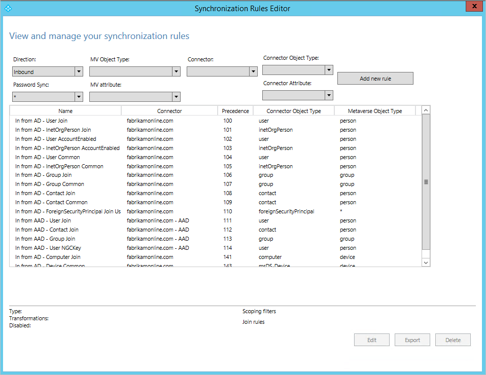
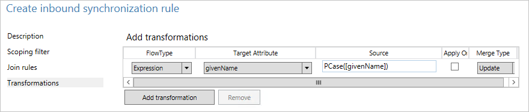
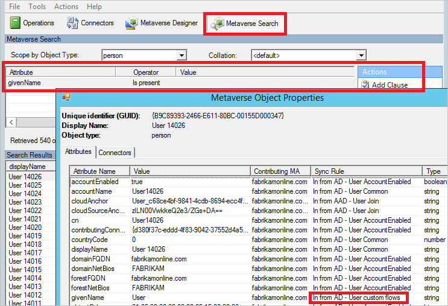
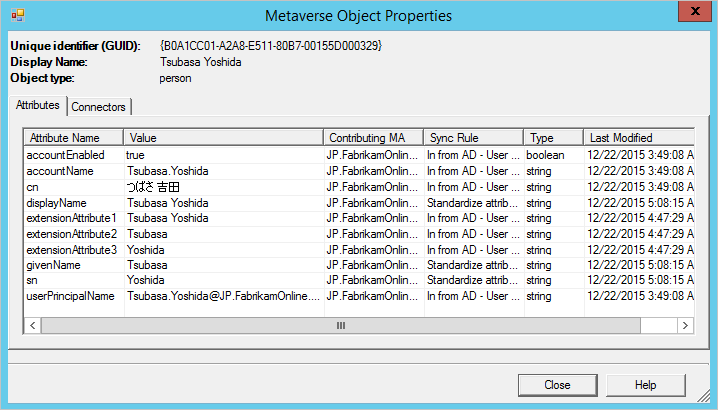

<properties
	pageTitle="Azure AD Connect 同步：如何更改默认配置 | Azure"
	description="介绍如何对 Azure AD Connect 同步中的配置进行更改。"
	services="active-directory"
	documentationCenter=""
	authors="andkjell"
	manager="femila"
	editor=""/>

<tags
	ms.service="active-directory"
	ms.workload="identity"
	ms.tgt_pltfrm="na"
	ms.devlang="na"
	ms.topic="article"
	ms.date="08/31/2016"
	wacn.date="01/24/2017"
	ms.author="billmath"/>  

# Azure AD Connect 同步：如何更改默认配置
本主题旨在介绍如何对 Azure AD Connect 同步中的默认配置进行更改。其中提供了一些常见方案的步骤。了解这些知识后，用户应该能够根据自己的业务规则对自己的配置进行一些简单的更改。

## 同步规则编辑器
同步规则编辑器用于查看和更改默认配置。可以在 **Azure AD Connect** 组下的开始菜单中找到它。

打开时，将看到现成可用的默认规则。

  

### 在编辑器中导航
通过编辑器顶部的下拉列表可以快速查找特定规则。例如，如果想要查看包含属性 proxyAddresses 的规则，可将下拉列表更改为：
 
若要重置筛选并加载新配置，请按键盘上的 **F5**。

右上角上有一个“添加新规则”按钮。此按钮用于创建自定义规则。

顶部有用于执行所选同步规则的按钮。“编辑”和“删除”按钮可执行其应有的操作。“导出”按钮可生成用于创建同步规则的 PowerShell 脚本。在此过程中，用户可以将同步规则从一台服务器移到另一台。

## 创建第一个自定义规则
最常见的更改是对属性流的更改。源目录中的数据可能与 Azure AD 中的不同。在本部分的示例中，需要确保用户的给定名称始终为**首字母大写**。

### 禁用计划程序
默认情况下，[计划程序](/documentation/articles/active-directory-aadconnectsync-feature-scheduler/)每 30 分钟运行一次。进行更改以及排查新规则错误时，需要确保其未启动。若要临时禁用计划程序，请启动 PowerShell，然后运行 `Set-ADSyncScheduler -SyncCycleEnabled $false`

  

### 创建规则

1. 单击“添加新规则”。
2. 在“说明”页上输入以下内容：

	- 名称：为规则提供说明性名称。
	- 说明：提供一些说明以便他人可以理解规则的用途。
	- 连接的系统：可从中找到对象的系统。这种情况下，选择 Active Directory 连接器。
	- 连接的系统/Metaverse 对象类型：分别选择“用户”和“人员”。
	- 链接类型：将该值更改为“联接”。
	- 优先级：提供系统中唯一的值。较低的数值表示较高的优先级。
	- 标记：留空。只有 Microsoft 中现成可用的规则应该会要求在此框中填入值。
3. 在“范围筛选器”页上，输入“givenName ISNOTNULL”。
 
此部分用于定义规则应该应用到哪些对象。如果留空，该规则会应用到所有用户对象。但也可包括会议室、服务帐户和其他非个人用户对象。
4. 在“联接规则”上，将其留空。
5. 在“转换”页上，将 FlowType 更改为 **Expression**。选择目标属性 **givenName**，在“源”中输入 `PCase([givenName])`。
 
函数名称和属性名称上的同步引擎要区分大小写。如果键入出错，则添加规则时会看到警告。编辑器允许保存并继续，因此必须重新打开规则并进行更正。
6. 单击“添加”保存规则。

新的自定义规则应该与系统中的其他同步规则一起显示。

### 验证更改
采用此新更改后，需要确保其按预期方式工作并且不会引发任何错误。根据拥有的对象数量，有两种不同的方法执行此步骤。

1. 在所有对象上运行完全同步
2. 在单个对象上运行预览和完全同步

从“开始”菜单启动“同步服务”。本部分中的步骤全部在此工具中。

1. **完全同步所有对象**请选择顶部的“连接器”。标识在前面部分中进行过更改的连接器（在本例中为 Active Directory 域服务），然后选中它。从“操作”中选择“运行”，然后选择“完全同步”和“确定”。

现已更新了 metaverse 中的对象。用户想要查看 metaverse 中的对象。

2. **预览并完全同步单个对象**在顶部选择“连接器”。标识在前面部分中进行过更改的连接器（在本例中为 Active Directory 域服务），然后选中它。选择“搜索连接器空间”。使用作用域来查找想要用于测试更改的对象。选择该对象，然后单击“预览”。在新的屏幕中，选择“提交预览”。
 
现已将更改提交到 metaverse。

**查看 metaverse 中的对象**用户要挑选几个示例对象，以确保值符合预期并且已应用规则。从顶部选择“Metaverse 搜索”。添加查找相关对象所需的筛选器。从搜索结果中，打开对象。查看属性值，同时还要在按预期方式应用规则的**同步规则**列中进行验证。

### 启用计划程序
如果一切按预期方式进行，可以再次启用计划程序。从 PowerShell 中运行 `Set-ADSyncScheduler -SyncCycleEnabled $true`。

## 其他常见的属性流更改 
前面部分介绍了如何更改属性流。本部分提供了另外一些示例。虽然创建同步规则的步骤已缩简，但可以在前面部分中找到完整步骤。

### 使用其他属性而不是默认属性
Fabrikam 中有对名字、姓氏和显示名称使用本地字母的林。以拉丁字母表示的这些属性可在扩展属性中找到。在 Azure AD 和 Office 365 中创建全局地址列表时，组织反而想要使用这些属性。

使用默认配置时，本地林中的对象如下所示：

若要使用其他属性流创建规则，请执行以下操作：

- 从开始菜单启动“同步规则编辑器”。
- 在左侧依然选定了“入站”的情况下，单击“添加新规则”按钮。
- 为规则指定名称和说明。选择本地 Active Directory 和相关的对象类型。在“链接类型”中选择“联接”。为优先级选择一个未被其他规则使用的数字。现成的规则从 100 开始，因此该示例可以使用值 50。

- 将范围留空（即应该应用到林中的所有用户对象）。
- 将联接规则留空（即让现成的规则处理所有联接）。
- 在“转换”中创建以下流：

- 单击“添加”保存规则。
- 转到“同步服务管理器”。在“连接器”上，选择我们已在其中添加了规则的“连接器”。选择“运行”和“完全同步”。完全同步将使用当前规则重新计算所有对象。

这是使用此自定义规则的同一对象的结果：

### 属性的长度
字符串属性在默认情况下设置为可编制索引，并且最大长度为 448 个字符。如果正在使用其中可能包含更多字符的字符串属性，请确保属性流中包括以下内容：
`attributeName` <- `Left([attributeName],448)`

### 更改 userPrincipalSuffix
Active Directory 中的 userPrincipalName 属性并非始终被用户知晓，并且可能不适合作为登录 ID。Azure AD Connect 同步安装向导允许选择不同的属性，例如 mail。但在某些情况下，必须计算该属性。例如：公司 Contoso 具有两个 Azure AD 目录，一个用于生产，另一个用于测试。他们希望测试租户中的用户使用登录 ID 中的另一后缀。
`userPrincipalName` <- `Word([userPrincipalName],1,"@") & "@contosotest.com"`

在此表达式中，使用第一个 @-sign (Word) 的左侧所有内容，并与固定字符串连接。

### 将多值转换为单值
Active Directory 中的某些属性在架构中是多值，不过它们在 Active Directory 用户和计算机中看上去是单值。例如，说明属性。
`description` <- `IIF(IsNullOrEmpty([description]),NULL,Left(Trim(Item([description],1)),448))`

在此表达式中，如果属性具有值，我们会使用属性中的第一项 (Item)，删除前导空格和尾随空格 (Trim)，然后保留字符串中的前 448 个字符（左）。

### 不要流送属性 
有关本部分方案的背景信息，请参阅[控制属性流过程](/documentation/articles/active-directory-aadconnectsync-understanding-declarative-provisioning/)。

有两种方法可防止流送属性。第一种方法可在安装向导中使用，可让你[删除选定的属性](/documentation/articles/active-directory-aadconnect-get-started-custom/)。如果你以前未曾同步该属性，则可以使用这个选项。但是，如果已开始同步此属性，后来使用此功能将它删除，则同步引擎将停止管理属性，现有值将保留在 Azure AD 中。

如果想要删除某个属性的值并确保将来不会流送该属性，则需要改为创建自定义规则。

在 Fabrikam 上，我们在同步到云的属性中发现了一些不应该存在的属性。我们希望确保从 Azure AD 中删除这些属性。

- 创建新的入站同步规则并填充说明 

- 创建类型为 **Expression** 且源为 **AuthoritativeNull** 的属性流。即使优先顺序较低的同步规则尝试填充值，文本值“AuthoritativeNull”也会指出 MV 中的值应该为空。

- 保存同步规则。启动“同步服务”，查找“连接器”，然后依次选择“运行”和“完全同步”。此步骤将重新计算所有属性流。
- 通过搜索连接器空间来验证是否即将导出所需的更改。

## 后续步骤

- 在 [Understanding Declarative Provisioning](/documentation/articles/active-directory-aadconnectsync-understanding-declarative-provisioning/)（了解声明性预配）中了解有关配置模型的详细信息。
- 在 [Understanding Declarative Provisioning Expressions](/documentation/articles/active-directory-aadconnectsync-understanding-declarative-provisioning-expressions/)（了解声明性预配表达式）中了解有关表达式语言的详细信息。

**概述主题**

- [Azure AD Connect 同步：理解和自定义同步](/documentation/articles/active-directory-aadconnectsync-whatis/)
- [将本地标识与 Azure Active Directory 集成](/documentation/articles/active-directory-aadconnect/)

<!---HONumber=Mooncake_1017_2016-->
