<properties
    pageTitle="通用 SQL 连接器分步指南 | Azure"
    description="本文将指导你完成一个使用通用 SQL 连接器的简单 HR 系统分步示例。"
    services="active-directory"
    documentationcenter=""
    author="AndKjell"
    manager="femila"
    editor="" />
<tags
    ms.assetid="28c1cc60-24fd-4d0d-a36d-b4aba6de86e7"
    ms.service="active-directory"
    ms.workload="identity"
    ms.tgt_pltfrm="na"
    ms.devlang="na"
    ms.topic="article"
    ms.date="02/08/2017"
    wacn.date="03/13/2017"
    ms.author="billmath" />

# 通用 SQL 连接器分步说明
本主题是一份循序渐进的指南。其中将会创建一个简单的示例 HR 数据库，然后使用它导入一些用户及其组成员身份。

## 准备示例数据库
在运行 SQL Server 的服务器上，运行[附录 A](#appendix-a) 中的 SQL 脚本。此脚本创建名为 GSQLDEMO 的示例数据库。创建的数据库的对象模型如下图所示：

还会创建要用于连接到数据库的用户。在本演练中，用户名为 FABRIKAM\\SQLUser 并位于域中。

## 创建 ODBC 连接文件
通用 SQL 连接器使用 ODBC 连接到远程服务器。首先，需要创建一个包含 ODBC 连接信息的文件。

1. 在服务器上启动 ODBC 管理实用工具：

	

2. 选择“文件 DSN”选项卡。单击“添加...”。

	

3. 现成的驱动程序将正常工作，因此，请选择它并单击“下一步>”。

	

4. 为该文件指定名称，如 **GenericSQL**。

	

5. 单击“完成”。

	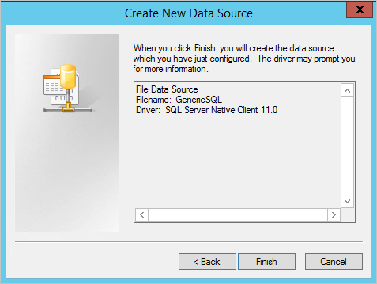

6. 配置连接的时间。为数据源提供适当的说明，提供运行 SQL Server 的服务器的名称。

	

7. 选择使用 SQL 进行身份验证的方式。本示例使用 Windows 身份验证。

	

8. 提供示例数据库的名称 **GSQLDEMO**。

	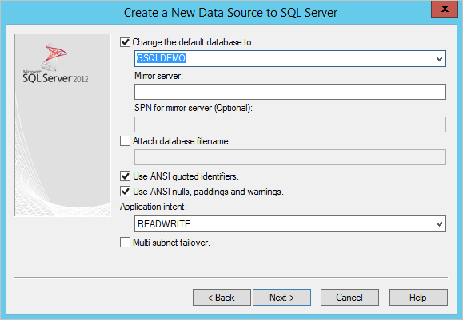

9. 保留此屏幕上默认设置的所有内容。单击“完成”。

	

10. 若要验证所有设置是否正常工作，请单击“测试数据源”。

	

11. 请确保测试成功。

	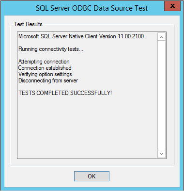

12. ODBC 配置文件现在应在“文件 DSN”中可见。

	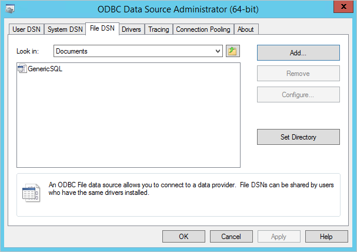

现在，我们已有了所需的文件，可以开始创建连接器了。

## 创建通用 SQL 连接器
1. 在同步服务管理器 UI 中，依次选择“连接器”和“创建”。选择“通用 SQL (Microsoft)”，并为它指定描述性的名称。

	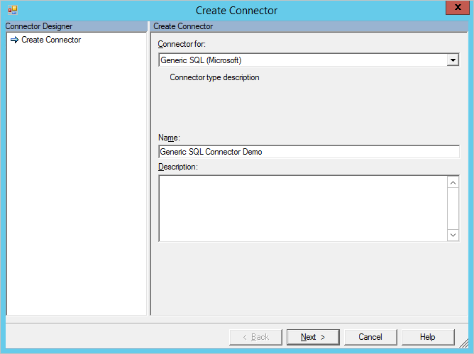

2. 找到在上一节中创建的 DSN 文件并将其上载到服务器。提供用于连接到数据库的凭据。

	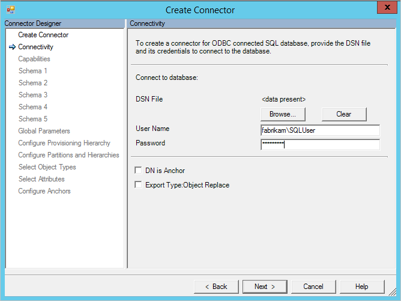

3. 在本演练中，可以简单地说有两种对象类型：“用户”和“组”。

	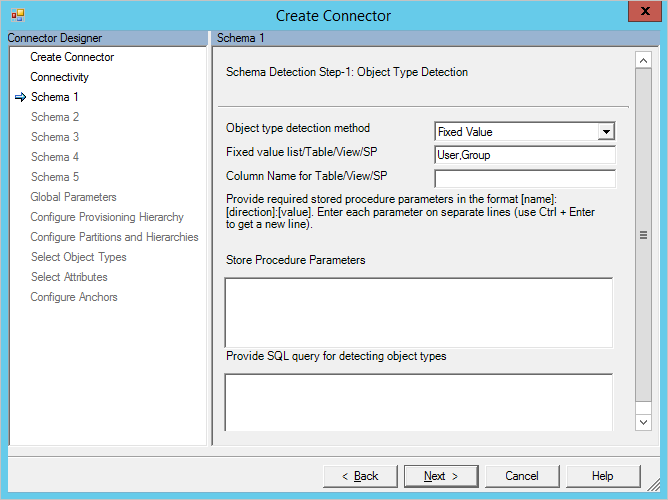

4. 为了查找属性，我们希望连接器通过查看表本身来检测这些属性。由于 **Users** 是 SQL 中的保留字，需要在方括号 [ ] 中指定它。

	

5. 定义定位点属性和 DN 属性的时间。对于**用户**，我们使用两个属性（即 username 和 EmployeeID）的组合。对于**组**，我们使用 GroupName（在实际工作中不太现实，但在本演练中，它可正常工作）。

	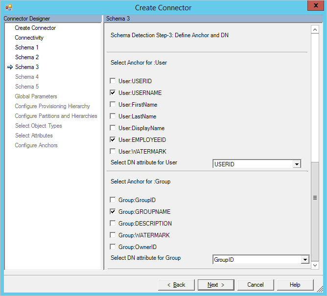

6. 并非所有属性类型都可以在 SQL 数据库中检测到。特别是无法检测到引用属性类型。对于组对象类型，我们需要更改要引用的 OwnerID 和 MemberID。

	

7. 在上一步骤中选为引用属性的属性需要是这些值引用的对象类型。在本例中，为用户对象类型。

	

8. 在“全局参数”页中，选择“水印”作为增量策略。另外，以日期/时间格式 **yyyy-MM-dd HH:mm:ss** 键入。

	

9. 在“配置分区和层次结构”页上，选择这两种对象类型。

	

10. 在“选择对象类型”和“选择属性”中，选择这两种对象类型和所有属性。在“配置定位点”页上，单击“完成”。

## 创建运行配置文件
1. 在同步服务管理器 UI 中，依次选择“连接器”和“配置运行配置文件”。单击“新建配置文件”。从“完全导入”开始。

	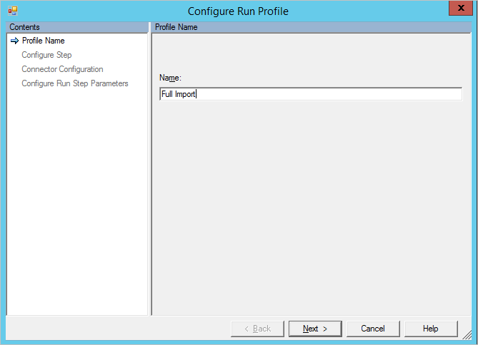

2. 选择类型“完全导入(仅暂存)”。

	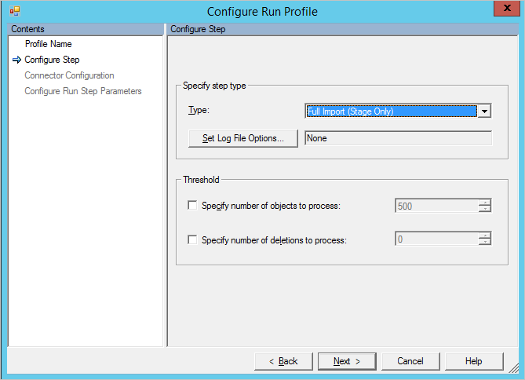

3. 选择分区 **OBJECT=User**。

	

4. 选择“表”并键入 **[USERS]**。向下滚动到多值对象类型部分，并按下图所示输入数据。选择“完成”保存步骤。

	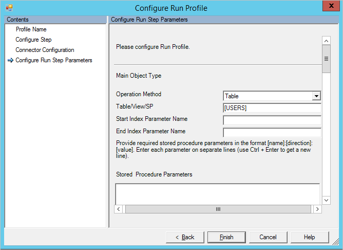 

	

5. 选择“新建步骤”。这一次，请选择 **OBJECT=Group**。在最后一页上，使用下图所示的配置。单击“完成”。

	
 
	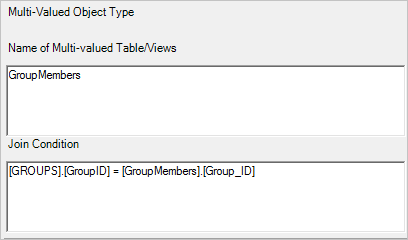

6. 可选：如果需要，可以配置更多运行配置文件。本演练只使用“完全导入”。
7. 单击“确定”完成运行配置文件的更改。

## 添加一些测试数据，并测试导入
在示例数据库中填写一些测试数据。准备就绪后，请依次选择“运行”和“完全导入”。

以下是拥有两个电话号码的用户和一个包含一些成员的组。

 

## 附录 A 
**用于创建示例数据库的 SQL 脚本**

SQL
	
	---Creating the Database---------
	Create Database GSQLDEMO
	Go
	-------Using the Database-----------
	Use [GSQLDEMO]
	Go
	-------------------------------------
	USE [GSQLDEMO]
	GO
	/****** Object:  Table [dbo].[GroupMembers]   ******/
	SET ANSI_NULLS ON
	GO
	SET QUOTED_IDENTIFIER ON
	GO
	CREATE TABLE [dbo].[GroupMembers](
		[MemberID] [int] NOT NULL,
		[Group_ID] [int] NOT NULL
	) ON [PRIMARY]
	
	GO
	/****** Object:  Table [dbo].[GROUPS]   ******/
	SET ANSI_NULLS ON
	GO
	SET QUOTED_IDENTIFIER ON
	GO
	CREATE TABLE [dbo].[GROUPS](
		[GroupID] [int] NOT NULL,
		[GROUPNAME] [nvarchar](200) NOT NULL,
		[DESCRIPTION] [nvarchar](200) NULL,
		[WATERMARK] [datetime] NULL,
		[OwnerID] [int] NULL,
	PRIMARY KEY CLUSTERED
	(
		[GroupID] ASC
	)WITH (PAD_INDEX = OFF, STATISTICS_NORECOMPUTE = OFF, IGNORE_DUP_KEY = OFF, ALLOW_ROW_LOCKS = ON, ALLOW_PAGE_LOCKS = ON) ON [PRIMARY]
	) ON [PRIMARY]
	
	GO
	/****** Object:  Table [dbo].[USERPHONE]   ******/
	SET ANSI_NULLS ON
	GO
	SET QUOTED_IDENTIFIER ON
	GO
	SET ANSI_PADDING ON
	GO
	CREATE TABLE [dbo].[USERPHONE](
		[USER_ID] [int] NULL,
		[Phone] [varchar](20) NULL
	) ON [PRIMARY]
	
	GO
	SET ANSI_PADDING OFF
	GO
	/****** Object:  Table [dbo].[USERS]   ******/
	SET ANSI_NULLS ON
	GO
	SET QUOTED_IDENTIFIER ON
	GO
	CREATE TABLE [dbo].[USERS](
		[USERID] [int] NOT NULL,
		[USERNAME] [nvarchar](200) NOT NULL,
		[FirstName] [nvarchar](100) NULL,
		[LastName] [nvarchar](100) NULL,
		[DisplayName] [nvarchar](100) NULL,
		[ACCOUNTDISABLED] [bit] NULL,
		[EMPLOYEEID] [int] NOT NULL,
		[WATERMARK] [datetime] NULL,
	PRIMARY KEY CLUSTERED
	(
		[USERID] ASC
	)WITH (PAD_INDEX = OFF, STATISTICS_NORECOMPUTE = OFF, IGNORE_DUP_KEY = OFF, ALLOW_ROW_LOCKS = ON, ALLOW_PAGE_LOCKS = ON) ON [PRIMARY]
	) ON [PRIMARY]
	
	GO
	ALTER TABLE [dbo].[GroupMembers]  WITH CHECK ADD  CONSTRAINT [FK_GroupMembers_GROUPS] FOREIGN KEY([Group_ID])
	REFERENCES [dbo].[GROUPS] ([GroupID])
	GO
	ALTER TABLE [dbo].[GroupMembers] CHECK CONSTRAINT [FK_GroupMembers_GROUPS]
	GO
	ALTER TABLE [dbo].[GroupMembers]  WITH CHECK ADD  CONSTRAINT [FK_GroupMembers_USERS] FOREIGN KEY([MemberID])
	REFERENCES [dbo].[USERS] ([USERID])
	GO
	ALTER TABLE [dbo].[GroupMembers] CHECK CONSTRAINT [FK_GroupMembers_USERS]
	GO
	ALTER TABLE [dbo].[GROUPS]  WITH CHECK ADD  CONSTRAINT [FK_GROUPS_USERS] FOREIGN KEY([OwnerID])
	REFERENCES [dbo].[USERS] ([USERID])
	GO
	ALTER TABLE [dbo].[GROUPS] CHECK CONSTRAINT [FK_GROUPS_USERS]
	GO
	ALTER TABLE [dbo].[USERPHONE]  WITH CHECK ADD  CONSTRAINT [FK_USERPHONE_USER] FOREIGN KEY([USER_ID])
	REFERENCES [dbo].[USERS] ([USERID])
	GO
	ALTER TABLE [dbo].[USERPHONE] CHECK CONSTRAINT [FK_USERPHONE_USER]
	GO

<!---HONumber=Mooncake_0306_2017-->
<!---Update_Description: wording update -->